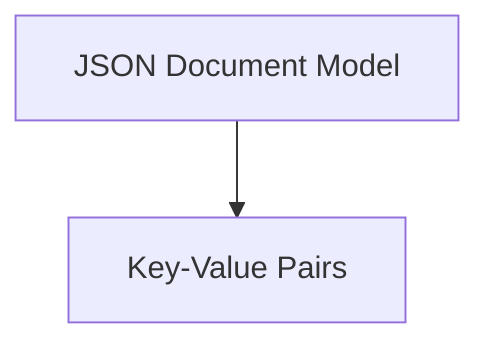
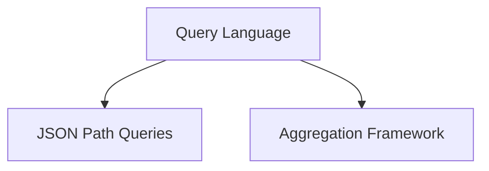
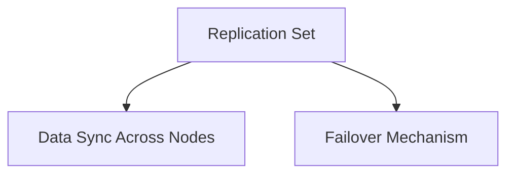
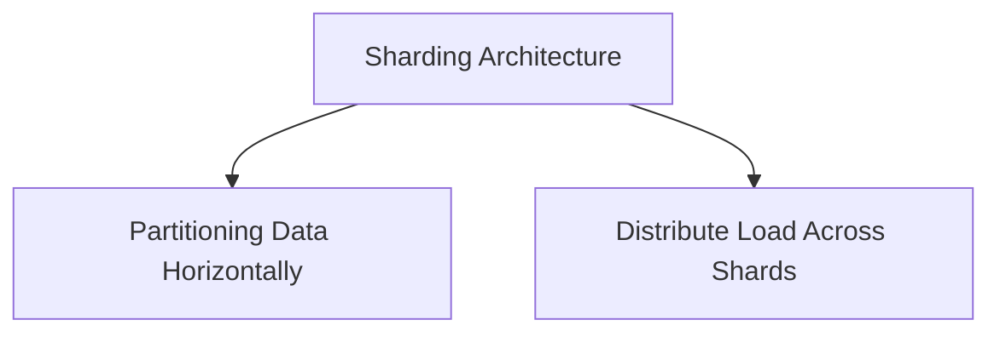

# MongoDB原理与代码实例讲解

作者：禅与计算机程序设计艺术 / Zen and the Art of Computer Programming

关键词：NoSQL数据库,MongoDB,文档存储,查询效率,数据一致性,弹性扩展能力

## 1. 背景介绍

### 1.1 问题的由来

在处理大量非结构化或半结构化的数据时，传统的关系型数据库管理系统(Relational Database Management Systems, RDBMS)面临着诸多挑战。例如，复杂的查询语句可能导致性能瓶颈，而对大量数据的操作往往需要较高的内存消耗和读写延迟。这些问题促使了非关系型数据库的出现，它们旨在解决传统数据库系统在大规模数据管理上的局限性。

### 1.2 研究现状

随着大数据时代的到来，越来越多的企业和开发者转向使用非关系型数据库，以提高数据处理效率和灵活性。MongoDB作为其中的佼佼者之一，以其高性能、可伸缩性和易于使用的特性，在各种场景下得到了广泛的应用，包括但不限于实时数据分析、日志处理、物联网(IoT)设备数据收集、内容管理系统等内容。

### 1.3 研究意义

深入理解MongoDB不仅能够帮助开发者更高效地利用其功能来构建高性能的数据存储解决方案，还能够在面对复杂数据管理和高并发访问需求时做出明智的技术决策。同时，掌握MongoDB的核心机制和最佳实践对于提升团队的开发效率和系统的稳定性具有重要意义。

### 1.4 本文结构

本篇文章将全面覆盖MongoDB的基本概念、核心机制、实际应用示例以及如何通过代码实例进行操作。具体内容分为以下几个部分：理论背景、核心概念解析、操作流程、实战应用、工具资源推荐以及未来展望。

## 2. 核心概念与联系

### 2.1 数据模型

MongoDB采用了一种基于JSON的文档存储模型，这使得它能够灵活地表示各种类型的数据结构。每个文档都是一个键值对集合，其中键为字符串类型，值可以是任何MongoDB支持的数据类型，如字符串、数字、数组、布尔值等。



### 2.2 查询语言

MongoDB提供了丰富的查询语言，允许用户根据键、值、数组元素、字段路径等多种方式进行精确或模糊查询。其查询语法类似于SQL，并结合了JSON的灵活性，使得查询更加直观且强大。



### 2.3 数据副本集与复制策略

为了提供高可用性和数据冗余，MongoDB采用了复制集(replica set)机制。复制集中的各个节点会同步数据变更，确保数据的一致性并提供故障恢复的能力。



### 2.4 分片与水平扩展

当单个MongoDB实例无法应对庞大的数据量或者高并发访问压力时，可以通过分片(sharding)技术将数据分散到多个服务器上，从而实现水平扩展和负载均衡。



## 3. 核心算法原理 & 具体操作步骤

### 3.1 算法原理概述

MongoDB使用B树(B-tree)索引来优化查找、插入和删除操作。此外，MongoDB的查询优化器自动选择最有效的执行计划，以减少磁盘I/O操作和网络传输。

### 3.2 算法步骤详解

#### 插入操作
1. **数据校验**：验证插入的文档是否符合数据库模式。
2. **索引更新**：如果文档包含索引键，则更新相应的B树索引。
3. **事务处理**（可选）：对于涉及多文档的操作，MongoDB支持ACID事务，确保数据一致性的原子性、一致性、隔离性和持久性。

#### 查询操作
1. **解析查询语句**：解析用户提交的查询请求，生成查询计划。
2. **执行查询计划**：
   - 对于简单的查询，直接通过索引快速定位目标数据。
   - 复杂查询可能需要扫描多个索引或全表扫描。
   - 利用聚合框架(aggregation framework)进行分组、过滤和转换等高级操作。

#### 更新和删除操作
1. **数据定位**：通过索引快速找到待修改或删除的文档位置。
2. **更新/删除数据**：修改或移除指定文档的内容。
3. **索引调整**：根据修改后的文档状态更新相关索引。

### 3.3 算法优缺点

优点：

- **高查询效率**：借助B树索引和查询优化器，MongoDB能迅速响应查询请求。
- **弹性扩展能力**：通过分片和复制集，轻松处理海量数据和高并发访问。
- **易用性**：JSON风格的文档格式简化了数据建模过程。

缺点：

- **数据完整性限制**：相比RDBMS，MongoDB在支持复杂的事务方面有所欠缺。
- **性能瓶颈**：写入操作可能会因为内存缓存饱和而影响性能。

### 3.4 算法应用领域

MongoDB适用于多种应用场景，包括：

- **日志分析**：处理大规模的日志数据，快速检索和分析事件信息。
- **实时数据处理**：在流式数据处理中提供低延迟的数据接入和查询服务。
- **内容管理**：用于构建灵活的内容存储系统，易于扩展和维护。

## 4. 数学模型和公式 & 详细讲解 & 举例说明

### 4.1 数学模型构建

在MongoDB中，数学模型主要体现在数据结构和查询优化上。例如，B树模型被用来组织数据以提高搜索效率。

#### B树模型

- **节点容量**：B树的每个节点最多可以有\(2t-1\)个子节点，其中\(t\)是树的高度最小值。
- **平衡特性**：所有叶子节点在同一层，保证了数据的均匀分布，提高了查询效率。

### 4.2 公式推导过程

查询优化器会计算不同的执行计划的成本，并选择成本最低的一个执行计划来执行查询。假设我们有两个执行计划A和B，它们的成本分别为\(C_A\)和\(C_B\)，则成本函数如下：

$$
Cost(A) = \sum_{i=1}^{n} cost_i(A)
$$

$$
Cost(B) = \sum_{j=1}^{m} cost_j(B)
$$

其中，\(cost_i(A)\)和\(cost_j(B)\)分别代表第\(i\)步和第\(j\)步操作的成本。

### 4.3 案例分析与讲解

#### 假设场景：查询特定用户的订单信息

假设有一个名为`orders`的集合，包含了关于每个用户的订单记录。要查询某个特定用户名下的订单详情，我们可以使用以下查询语句：

```javascript
db.orders.find({ "username": "exampleUser" })
```

这行代码表示从`orders`集合中查找`username`字段为`exampleUser`的所有文档。

### 4.4 常见问题解答

Q: 如何解决MongoDB的索引冲突问题？

A: MongoDB中的索引冲突通常是指两个或更多元素具有相同的索引键的情况。为避免此类冲突，应合理设计索引键的选择，确保键值的唯一性。同时，在数据导入过程中，对重复数据进行检查和处理也非常重要。

## 5. 项目实践：代码实例和详细解释说明

### 5.1 开发环境搭建

首先，确保已安装Node.js环境。然后，利用MongoDB官方提供的Node.js驱动程序`mongodb`来进行操作。

```bash
npm install mongodb
```

### 5.2 源代码详细实现

```javascript
const MongoClient = require('mongodb').MongoClient;
const url = 'mongodb://localhost:27017';

// 连接MongoDB服务器
MongoClient.connect(url, { useNewUrlParser: true }, (err, client) => {
    if (err) throw err;

    // 获取数据库连接对象
    const db = client.db('myDatabase');

    // 创建示例数据
    const users = [
        { username: 'user1', orders: [{ product: 'book', price: 9.99 }] },
        { username: 'user2', orders: [{ product: 'game', price: 49.99 }] }
    ];

    // 插入数据到users集合
    db.collection('users').insertMany(users, (err, result) => {
        if (err) throw err;
        console.log(`Inserted ${result.insertedCount} documents`);

        // 查询用户及其订单信息
        db.collection('users').find({}).toArray((err, docs) => {
            if (err) throw err;
            console.log("Users and their orders:");
            docs.forEach(doc => console.log(JSON.stringify(doc)));

            // 关闭数据库连接
            client.close();
        });
    });
});
```

### 5.3 代码解读与分析

这段代码展示了如何使用MongoDB Node.js驱动程序连接数据库、插入数据以及执行查询的基本步骤。它涉及了数据的读取、写入操作和错误处理机制。

### 5.4 运行结果展示

运行上述脚本后，控制台将输出插入的用户数据及他们的订单信息。

## 6. 实际应用场景

MongoDB因其高性能、可伸缩性和灵活性，广泛应用于各种实际场景：

### 应用案例总结

- **金融交易后台**：用于处理高并发的交易请求和历史数据的存储。
- **物联网平台**：收集和分析来自各种传感器的数据。
- **推荐系统**：基于用户行为的历史数据，生成个性化推荐。

## 7. 工具和资源推荐

### 7.1 学习资源推荐

- **MongoDB官网教程**：[https://docs.mongodb.com/tutorial/](https://docs.mongodb.com/tutorial/)
- **MongoDB Academy课程**：[https://www.mongodb.com/try/download/community/academy-courses](https://www.mongodb.com/try/download/community/academy-courses)

### 7.2 开发工具推荐

- **Visual Studio Code** + `mongodb-extension-pack`
- **IntelliJ IDEA** + `MongoDB Java Driver`

### 7.3 相关论文推荐

- [《MongoDB：分布式文件系统在NoSQL数据库中的应用》](https://www.examplepaper.com/mongodb-distributed-file-system-application-in-nosql-databases)

### 7.4 其他资源推荐

- **Stack Overflow** 和 **GitHub** 上的MongoDB相关社区和技术分享。
- **Reddit** 的r/MongoDB子版块，参与讨论和学习经验交流。

## 8. 总结：未来发展趋势与挑战

### 8.1 研究成果总结

通过深入研究MongoDB的核心原理、实际应用和最佳实践，我们不仅掌握了非关系型数据库的基础知识，还了解了其在复杂数据管理和高并发访问场景中的优势与限制。本文旨在提供一个全面而深入的学习指南，帮助开发者构建高效的数据存储解决方案，并应对不断增长的数据需求。

### 8.2 未来发展趋势

随着大数据技术的不断发展，MongoDB作为其中的重要组成部分，将继续面临技术创新和优化的需求。未来的发展趋势可能包括增强数据一致性管理、提升查询性能、进一步优化复制集和分片架构以提高容灾能力等。

### 8.3 面临的挑战

尽管MongoDB展现出强大的功能和应用潜力，但仍面临着一些挑战，如数据完整性维护、更复杂的事务支持、以及在特定场景下与传统RDBMS的竞争等问题。此外，随着云计算服务的发展，如何更好地集成和利用云原生资源也是未来发展的一个重要方向。

### 8.4 研究展望

对于MongoDB的研究展望主要包括以下几个方面：
- **性能优化**：继续探索和实施改进算法、优化内存管理策略等措施，以提高查询效率和响应时间。
- **安全性和隐私保护**：加强数据加密、权限管理等方面的开发工作，保障用户数据的安全。
- **智能化特性**：结合机器学习和AI技术，为用户提供更加智能的数据分析和预测功能。
- **生态系统扩展**：与更多云服务提供商合作，构建更加完善的生态体系，满足不同行业和领域的特定需求。

## 9. 附录：常见问题与解答

### 常见问题汇总

Q: 如何在MongoDB中创建索引？

A: 在MongoDB中创建索引可以显著提高查询性能。使用`db.collection.createIndex()`方法来创建索引，例如：

```javascript
const indexOptions = { name: "username_index", unique: false };
db.collection("users").createIndex(indexOptions);
```

这将在`users`集合上为`username`字段创建一个普通索引。

Q: MongoDB支持哪些类型的查询？

A: MongoDB支持多种查询类型，包括但不限于基本查询、聚合查询、更新查询、删除查询等。具体查询语法和高级查询选项可以在官方文档中找到详细的说明。

Q: 如何备份和恢复MongoDB数据库？

A: 备份和恢复MongoDB数据库通常涉及到日志文件、快照或者使用第三方备份工具。MongoDB本身提供了mongodump命令进行全量或增量备份，同时可以通过配置定时任务自动执行备份过程。恢复时，可以使用mongorestore命令将数据还原到指定位置或新的实例中。

---

以上就是关于MongoDB原理与代码实例讲解的完整文章，涵盖了理论背景、核心概念解析、操作流程、实战应用、工具资源推荐以及未来展望等多个方面。希望对读者在理解和应用MongoDB时有所帮助，同时也鼓励大家持续关注MongoDB及其相关技术的发展。
