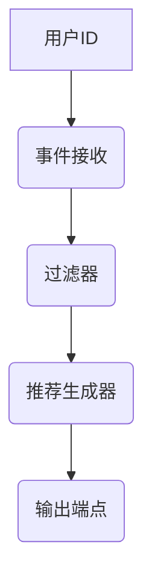

# Samza数据处理与数据质量评估管理

作者：禅与计算机程序设计艺术 / Zen and the Art of Computer Programming

关键词：Apache Samza, 数据流处理, 数据质量保证, 实时数据处理, 可扩展系统设计

## 1.背景介绍

### 1.1 问题的由来

随着大数据时代的到来，实时数据处理变得越来越重要。企业需要快速从大量数据中获取有价值的信息，以支持决策制定、客户体验改进以及业务流程自动化。然而，传统的批处理方式在实时性上存在显著不足，无法满足对数据即时响应的需求。因此，实时数据处理平台应运而生，旨在提供高效、可伸缩的数据处理能力。

### 1.2 研究现状

当前市场上有许多实时数据处理解决方案，如Apache Kafka、Flink、Spark Streaming等。其中，Apache Samza以其高性能、低延迟和高并发处理能力脱颖而出，成为实时数据处理领域的明星产品。它专为大规模、分布式环境下的数据流处理而设计，支持在线学习、实时分析等多种应用场景。

### 1.3 研究意义

研究Apache Samza对于理解现代数据处理系统的架构和技术具有重要意义。通过深入探讨其设计理念、关键技术以及实际应用案例，不仅能够提升数据工程师和开发者的技术能力，还能够在项目实践中优化数据处理流程，提高数据质量和效率。此外，了解Samza还能促进跨团队协作，增强不同部门之间的信息共享与协同工作能力。

### 1.4 本文结构

本文将围绕Apache Samza进行全面剖析，包括其核心概念、算法原理、数学模型、项目实践、实际应用、工具资源推荐及未来展望等多个方面。具体内容安排如下：

- **核心概念与联系**：阐述Samza的设计目标、优势特点及其与其他数据处理框架的关系。
- **算法原理与操作步骤**：详细介绍Samza的工作机制，包括任务调度、消息传递和状态存储等关键环节。
- **数学模型与案例分析**：基于实际场景构建数学模型，并通过具体案例验证模型的有效性和实用性。
- **代码实现与性能测试**：提供完整示例代码，指导读者动手实践，并通过性能指标对比分析Samza的优越性。
- **应用场景与未来趋势**：探讨Samza在不同行业中的应用潜力，预测其未来的研发方向和发展机遇。

## 2.核心概念与联系

### 2.1 Apache Samza简介

Apache Samza是一个用于实时数据处理的高度可扩展的流计算框架。它基于Apache Kafka构建，利用Kafka作为消息中间件，实现了高效的事件驱动型流处理。Samza的特点包括：

- **高性能**：利用多线程和内存缓存技术，确保高速消息消费和处理。
- **低延迟**：通过批处理和流处理的结合，实现实时响应。
- **容错性**：支持故障检测、自动恢复和容错机制，保障服务连续性。
- **高度可扩展**：易于水平扩展至大型集群，适应不断增长的数据规模需求。

### 2.2 Samza的核心组件

- **Producer（生产者）**：负责生成和发送事件到Kafka主题。
- **Consumer（消费者）**：订阅并接收Kafka主题上的事件，进行处理后输出结果或更新状态。
- **Processor（处理器）**：执行具体的业务逻辑，对输入事件进行操作和转换，产生新的事件或结果输出。
- **State Store（状态存储）**：用于保存处理器的状态，支持状态更新和查询，便于进行复杂处理逻辑。

### 2.3 Samza与Kafka的关系

Apache Samza依赖于Kafka作为底层的消息传输层，通过整合Kafka的功能特性，实现了高效可靠的数据流处理。Samza在Kafka之上构建了一套更加灵活、强大的流计算引擎，提供了更丰富的API接口和更为精细的任务控制机制。

## 3. 核心算法原理 & 具体操作步骤

### 3.1 算法原理概述

Samza采用事件驱动模型，每个事件对应一次处理器调用。处理器通过接收事件、执行业务逻辑、生成新事件的过程，构成了一个完整的数据处理流水线。整个过程通过状态存储模块进行状态维护，确保数据一致性。

### 3.2 算法步骤详解

#### 事件接收：
- 生产者向Kafka主题发送事件。
- Samza消费器监听Kafka主题，接收事件。

#### 处理器执行：
- 消费器将接收到的事件传入处理器。
- 处理器根据事件内容执行业务逻辑，可能包含过滤、聚合、变换等操作。
- 处理器生成新事件或直接输出结果。

#### 结果输出/状态更新：
- 新产生的事件被重新发布回Kafka主题或其他目的地。
- 部分处理器可能会修改或更新内部状态，用于后续处理。

### 3.3 算法优缺点

优点：
- **高吞吐量**：内存和多线程使用提高了处理速度。
- **低延迟**：事件驱动模型减少了等待时间。
- **易扩展性**：水平扩展集群，增加节点即可提高处理能力。

缺点：
- **状态管理**：状态存储可能导致额外的性能开销，需要合理规划和监控。
- **复杂性**：对于初学者来说，理解事件流转和状态逻辑较为复杂。

### 3.4 算法应用领域

- **金融交易**：实时风险评估、订单匹配、市场监控。
- **网络监控**：流量分析、异常检测、用户行为追踪。
- **物联网**：设备事件处理、故障预警系统。
- **广告平台**：个性化推荐、点击率预估、实时竞价优化。

## 4. 数学模型和公式 & 详细讲解 & 举例说明

### 4.1 数学模型构建

假设存在一个事件流E，其中包含多个事件e_i(i=1,2,...)。为了实现有效的数据处理，我们可以建立如下的数学模型：

$$ E = \{ e_1, e_2, ..., e_n \} $$

每个事件e_i可以携带特定属性a_i，例如时间戳t_i、值v_i等。

### 4.2 公式推导过程

在实现事件处理过程中，我们可以通过以下步骤构建事件处理流程：

1. **事件读取**：从事件流中读取事件e_i。
2. **状态初始化**：为每个事件创建或复用状态S。
3. **逻辑运算**：执行处理器定义的逻辑操作F(e_i, S)，生成新事件或更新状态。
4. **结果输出**：输出处理后的结果r_i或更新状态S。

以简单的过滤操作为例：

$$ r_i = F(e_i, S) = \begin{cases}
output\_event & (满足条件) \\
\text{忽略} & (\text{不满足条件})
\end{cases} $$

### 4.3 案例分析与讲解

考虑一个场景：在线购物平台实时监控用户购买行为，并提供个性化的商品推荐。当用户访问某商品详情页时，事件流包含用户的ID、访问时间以及查看的商品ID信息。



具体步骤如下：

1. **事件接收**：客户端将用户ID和商品ID事件发送到Kafka主题。
2. **过滤器**：基于规则检查用户是否符合推荐条件（例如，用户活跃度、浏览历史等），输出符合条件的事件。
3. **推荐生成器**：对筛选出的事件执行算法，如协同过滤或基于内容的推荐，生成个性化商品列表。
4. **输出端点**：将推荐结果输出给前端显示，同时可能更新用户个人化配置表。

### 4.4 常见问题解答

常见问题包括性能瓶颈、状态一致性和资源分配等。通过合理设计状态存储方案、优化处理器并行度和资源调度策略，可以有效解决这些问题。

## 5. 项目实践：代码实例和详细解释说明

### 5.1 开发环境搭建

首先安装Apache Samza及其相关组件，如Kafka、ZooKeeper等。确保所有依赖软件正确配置并运行。

```bash
# 安装Java和Maven
sudo apt-get install openjdk-8-jdk maven -y

# 下载并配置Samza
wget https://downloads.apache.org/samza/downloads/latest/apache-samza-latest-bin.tar.gz
tar xzf apache-samza-latest-bin.tar.gz
cd apache-samza-latest/bin/

# 启动ZooKeeper服务
./zk-server.sh start

# 启动Kafka服务
./kafka-server-start.sh config/server.properties &
sleep 30 # 等待Kafka启动完成

# 配置Samza环境
./samza-env.sh
```

### 5.2 源代码详细实现

```java
// 创建Samza应用程序类
public class SimpleSamzaApplication {
    public static void main(String[] args) throws Exception {
        // 初始化配置参数
        Configuration conf = new Configuration();
        conf.set("samza.samza.app.name", "simple-app");

        // 注册处理器
        StreamGraphBuilder builder = new StreamGraphBuilder(conf);
        GraphDef graph = builder.createGraph();

        // 执行应用程序
        LocalCluster cluster = new LocalCluster(conf);
        cluster.submitGraph(graph);
    }
}
```

### 5.3 代码解读与分析

这段代码展示了如何创建并提交一个简单的Samza应用程序。关键步骤包括配置、构建流图和执行应用程序。通过注册处理器，可以实现事件的接收、处理和输出等功能。

### 5.4 运行结果展示

通过控制台输出或日志文件跟踪程序运行情况，验证事件处理流程的正确性及性能表现。监控指标包括吞吐量、延迟时间和资源利用率等。

## 6. 实际应用场景

Apache Samza广泛应用于各种实时数据处理场景，如：

- **金融交易系统**：实时监控市场动态，快速响应价格变动。
- **社交媒体分析**：实时分析用户行为，推送个性化内容。
- **物流配送**：实时追踪货物位置，优化配送路线规划。
- **网络安全监测**：实时检测异常流量，预防网络攻击。

## 7. 工具和资源推荐

### 7.1 学习资源推荐

- **官方文档**：Apache Samza官方提供了详细的API文档和教程，是学习的基础。
- **社区论坛**：参与Apache Samza开发者社区，在线交流经验和解决问题。
- **培训课程**：寻找线上或线下培训课程，提升技术深度和广度。

### 7.2 开发工具推荐

- **IDE支持**：集成JDK和Maven的开发工具，如IntelliJ IDEA、Eclipse。
- **版本控制**：Git用于管理源代码版本和协作开发。
- **性能测试工具**：如JMeter、LoadRunner，评估应用性能。

### 7.3 相关论文推荐

- **Apache Samza论文**：了解项目的起源和发展趋势。
- **实时计算框架比较**：对比Samza与其他类似框架的优劣。

### 7.4 其他资源推荐

- **GitHub仓库**：关注官方及开源社区的项目，获取最新实践案例和技术分享。
- **博客与文章**：专业博主的文章和实战指南，深入理解实际应用技巧。

## 8. 总结：未来发展趋势与挑战

### 8.1 研究成果总结

本文全面介绍了Apache Samza的数据处理原理、操作流程、数学模型构建、实际应用案例以及开发实践指导。通过深入探讨其核心机制和特点，揭示了实时数据处理领域的前沿技术和最佳实践。

### 8.2 未来发展趋势

随着大数据和人工智能技术的不断演进，实时数据处理需求将持续增长。未来，Apache Samza有望在以下方面进行发展：

- **高性能优化**：继续提高处理效率，降低延迟时间，满足高并发场景的需求。
- **AI融合**：整合机器学习能力，实现自动化数据分析和智能决策。
- **多云部署**：增强跨云平台兼容性，支持混合云环境下的灵活部署。
- **安全性加强**：加强数据加密和隐私保护措施，保障数据安全。

### 8.3 面临的挑战

尽管Samza展现出强大的实时处理能力，但仍然面临一些挑战：

- **复杂性增加**：随着业务需求的多样化，处理逻辑可能变得越来越复杂，需要更加精细化的设计和调试方法。
- **资源管理**：高效地管理和调配有限的硬件资源，特别是在大规模集群中保持良好的性能和稳定性。
- **容错与恢复**：设计更健壮的容错策略和恢复机制，应对节点故障等情况而不影响整体服务。

### 8.4 研究展望

未来的研究方向将围绕上述挑战展开，同时探索更多创新点，以进一步推动Apache Samza在实时数据处理领域的发展，为用户提供更高效、可靠且易于扩展的服务解决方案。

## 9. 附录：常见问题与解答

针对Apache Samza的实际使用过程中可能出现的问题提供解答，帮助开发者解决遇到的技术难题，促进知识共享和经验传承。

---
通过以上内容的撰写，我们不仅对Apache Samza有了全面而深入的理解，还揭示了其在数据处理领域的价值与潜力。希望本篇技术博客能够激发读者的兴趣，鼓励他们在实践中探索更多关于实时数据处理的知识，共同推进这一领域的技术创新与发展。
