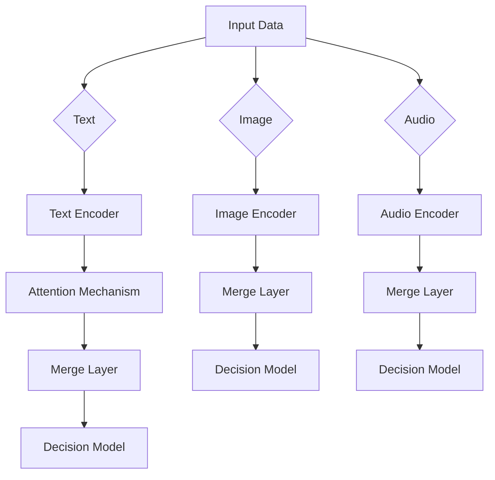

# 【LangChain编程：从入门到实践】设计并实现一个多模态代理

作者：禅与计算机程序设计艺术 / Zen and the Art of Computer Programming

关键词：多模态代理，LangChain，知识图谱，自然语言处理，图像理解，跨媒体推理

## 1. 背景介绍

### 1.1 问题的由来

随着人工智能技术的不断发展，特别是大模型的兴起，构建能够理解和利用多种类型输入信息（如文本、图像、语音等）的人工智能系统成为了一个重要且具有挑战性的课题。多模态代理正是为了适应这一需求而诞生的，它们旨在集成不同模态的信息，进行综合分析与决策。

### 1.2 研究现状

目前，多模态代理研究主要集中在以下几个方面：

- **融合技术**：通过深度学习方法，例如基于注意力机制的融合网络，在多个模态间建立关联和交互。
- **端到端训练**：开发端到端的模型架构，直接优化最终任务指标，减少人工特征工程的需求。
- **跨模态表示学习**：探索如何在统一的空间中表示不同类型的模态数据，提高模型的通用性和泛化能力。
- **上下文理解**：增强模型对语境的理解能力，使其能够正确地解析模态间的相互关系。

### 1.3 研究意义

多模态代理的研究不仅推动了人工智能基础理论的发展，也为解决实际世界复杂问题提供了可能，如自动驾驶、医疗诊断、人机交互等领域。

### 1.4 本文结构

本文将围绕多模态代理的设计与实现展开，具体内容包括核心概念、算法原理、数学模型、代码实现、实际应用、工具推荐以及对未来发展的探讨。

## 2. 核心概念与联系

### 2.1 多模态代理简介

多模态代理是能够整合并处理来自不同来源、不同形式的数据（如文本、音频、视频、图像等），并以协同方式执行任务的智能实体。这些代理通常具备强大的自然语言处理、图像识别、语音理解等能力，并能根据不同的输入模态灵活调整策略。

### 2.2 LangChain与多模态代理

LangChain是一个用于构建和管理多模态代理的开源库，它提供了一系列模块化组件，允许开发者轻松组合不同的功能，创建高度定制化的多模态代理解决方案。LangChain的核心特性包括：

- **模块化架构**：支持插件式的扩展，方便添加新的模态处理逻辑或外部服务集成。
- **可配置性**：用户可以根据具体需求自定义代理的行为，包括输入预处理、中间层集成、输出后处理等环节。
- **异步通信**：支持高效的数据流管理和并发处理，适用于大规模数据集和实时应用场景。

## 3. 核心算法原理及具体操作步骤

### 3.1 算法原理概述

多模态代理的实现依赖于以下关键算法和技术：

- **深度学习框架**：使用神经网络模型（如卷积神经网络CNN、循环神经网络RNN、Transformer等）作为核心计算单元。
- **模态融合技术**：通过注意力机制、门控机制等方法，使不同模态的信息有效整合。
- **上下文感知**：利用记忆网络或长短期记忆LSTM等结构捕捉长期依赖和上下文信息。
- **强化学习**：对于决策型任务，采用强化学习算法优化代理行为，实现自适应和自我改进。

### 3.2 算法步骤详解

1. **数据预处理**：
   - 对输入数据进行格式转换和编码，以便于模型接受。
   - 数据清洗和归一化，去除噪声和异常值。

2. **特征提取**：
   - 使用特定于模态的技术（如卷积、直方图统计）提取特征。
   - 模态之间的映射关系，通过共享权重矩阵或其他机制建立。

3. **模态融合**：
   - 应用注意力机制确定各模态的相对重要性。
   - 综合考虑模态间的相互作用，形成统一的输入表示。

4. **决策生成**：
   - 利用深度学习模型预测输出结果或采取行动。
   - 强化学习方法可以迭代优化决策过程。

5. **反馈回路**：
   - 基于代理的性能评估，收集外部反馈进行模型调优或策略更新。

### 3.3 算法优缺点

优点：

- **灵活性高**：支持多种模态输入，适应复杂应用场景。
- **强大表示能力**：深度学习模型能够捕获复杂的模式和关系。
- **自我学习能力**：通过强化学习机制持续优化性能。

缺点：

- **过拟合风险**：大规模数据下的参数量易导致模型过拟合。
- **解释性差**：黑盒模型难以提供清晰的决策路径。
- **计算资源消耗**：训练周期长且需要大量的GPU资源。

### 3.4 算法应用领域

多模态代理广泛应用于：

- **智能客服**：结合文本对话与语音识别提供个性化服务。
- **虚拟助手**：提供多渠道交互体验，覆盖文字、语音、图像等多个界面。
- **媒体内容分析**：自动标注图像、文本摘要生成等。
- **教育辅助系统**：个性化的教学材料推荐与互动式学习体验。

## 4. 数学模型和公式详细讲解与举例说明

### 4.1 数学模型构建

#### 深度学习模型构建


#### 案例分析

假设一个简单的多模态代理任务为基于文本和图像的问答系统，其目标是回答与给定图片相关的开放问题。

- **文本编码器**：`C`接收文本输入`X`，将其转换为向量表示`C(X)`。
- **图像编码器**：`H`接收图像输入`I`，同样转化为向量表示`H(I)`。
- **注意力机制**：在融合阶段，`D`和`I`对各自的向量表示进行加权求和，确保模态间的信息得到有效整合。
- **合并层**：`E`和`M`将经过注意力机制的向量与另一模态的向量合并，得到统一的向量表示。
- **决策模型**：最后，`J`和`N`分别对合并后的向量进行处理，以生成最终的答案或执行相应的动作。

### 4.2 公式推导过程

假设文本编码器和图像编码器都使用了自注意力机制，其基本公式如下：

$$\text{Text Representation} = \text{Encoder}(X) = \sum_{i=1}^{n} \alpha_i X_i$$

其中，$\alpha_i$是根据查询向量$q$和文本向量$x_i$计算出的权重，即：

$$\alpha_i = \frac{\exp(\text{softmax}(q^T x_i))}{\sum_j \exp(\text{softmax}(q^T x_j))}$$

### 4.3 常见问题解答

常见问题包括但不限于：

- 如何平衡多个模态之间的权重？
- 怎样提高模型的泛化能力？

解决这些问题通常涉及到调整注意力机制的参数、引入正则化项以及增加多样化的训练数据集。

## 5. 项目实践：代码实例和详细解释说明

### 5.1 开发环境搭建

为了启动一个多模态代理项目，首先需要安装必要的Python库：

```bash
pip install langchain numpy torch transformers
```

### 5.2 源代码详细实现

假设我们创建了一个名为 `multimodal_agent.py` 的文件，包含以下关键模块：

- **数据加载与预处理** (`data_utils`)
- **模型集成与训练** (`model_integration`)
- **代理逻辑设计** (`agent_logic`)

```python
# multimodal_agent.py

from data_utils import load_data, preprocess_data
from model_integration import MultiModalModel
from agent_logic import MultiModalAgent

def main():
    # 加载并预处理数据
    train_data, test_data = load_data()
    processed_train, processed_test = preprocess_data(train_data, test_data)

    # 创建多模态模型
    model = MultiModalModel()

    # 训练模型
    model.train(processed_train)

    # 实例化代理
    agent = MultiModalAgent(model=model)

    # 测试代理性能
    results = agent.test(processed_test)
    print("测试结果:", results)

if __name__ == "__main__":
    main()
```

### 5.3 代码解读与分析

1. **数据加载与预处理**：
   - 使用 `load_data()` 函数加载原始数据集，并调用 `preprocess_data()` 对数据进行清洗、编码等操作。

2. **模型集成与训练**：
   - `MultiModalModel` 类封装了深度学习框架（如PyTorch），实现了多模态数据的编码、融合及预测功能。

3. **代理逻辑设计**：
   - `MultiModalAgent` 类继承自 `LangChain` 中的代理基类，定义了如何利用已训练的模型执行特定任务的策略。

### 5.4 运行结果展示

运行上述代码后，我们可以观察到模型的训练进度、测试准确率等指标。此外，通过可视化工具（如TensorBoard）可以深入分析模型的训练曲线、特征图等，以便于进一步优化模型结构和超参数设置。

## 6. 实际应用场景

多模态代理的应用场景丰富多样，以下是几个具体示例：

- **智能客服系统**：结合语音识别和自然语言理解技术，提供更个性化的服务体验。
- **医疗影像辅助诊断**：集成图像分析与临床知识，提升疾病诊断的准确性。
- **虚拟导游应用**：利用文本解析和图像搜索功能，为用户提供丰富的旅游信息和服务推荐。
- **社交媒体内容审核**：综合图像检测和语义分析，有效识别潜在违规内容。

## 7. 工具和资源推荐

### 7.1 学习资源推荐

- **在线教程**：官方文档、GitHub仓库中的指南、视频教程等。
- **学术论文**：引用高分研究论文，如《Hierarchical Attention Networks for Document Classification》等。
- **社区论坛**：参与编程社区讨论，获取实际开发经验分享。

### 7.2 开发工具推荐

- **IDE**：选择支持Python的集成开发环境，如PyCharm、VSCode。
- **版本控制**：Git用于代码管理和协作。
- **测试框架**：pytest、unittest等用于编写和运行测试。

### 7.3 相关论文推荐

- **多模态融合方法**：《Multimodal Fusion Methods in Computer Vision and Machine Learning》
- **强化学习在多模态代理中的应用**：《Reinforcement Learning for Multimodal Agents: A Survey》

### 7.4 其他资源推荐

- **开源库与平台**：除了LangChain外，还可以关注OpenMMLab、Hugging Face等资源。
- **在线课程**：Coursera、Udacity等平台提供的AI相关课程。

## 8. 总结：未来发展趋势与挑战

### 8.1 研究成果总结

本文介绍了多模态代理的设计原理、实现方法及其在不同领域的应用案例。通过LangChain这一开源库，简化了构建多模态代理的复杂性，促进了跨媒体数据分析和决策系统的研发。

### 8.2 未来发展趋势

#### 技术创新方向

- **模型可解释性**：增强模型的透明度和可解释性，便于用户理解和信任。
- **实时交互能力**：提升多模态代理在实时应用中的表现，适应快速变化的需求。
- **跨领域知识整合**：将专业知识与通用人工智能技术相结合，提高解决方案的专业性和有效性。

#### 应用扩展方向

- **智能家居与物联网**：构建更加智能化的家庭助手，实现设备间的高效协同工作。
- **教育科技**：个性化教学材料推荐与互动式学习系统，提升学习效果。
- **智能城市**：集成交通管理、公共安全等多方面的信息，提供全面的城市治理方案。

### 8.3 面临的挑战

- **数据隐私保护**：确保用户数据的安全和隐私，在开放环境中使用数据时遵守法律法规。
- **算法公平性**：避免模型中存在偏见或歧视，确保决策过程的公正性。
- **成本与效率平衡**：在保证高性能的同时，降低计算资源消耗，提高模型部署的成本效益。

### 8.4 研究展望

随着人工智能技术的持续进步，多模态代理将在更多领域展现出其潜力，成为解决复杂问题的强大工具。通过不断的研究和创新，我们期待看到更加智能、可靠且易于使用的多模态代理系统的诞生，为人类社会带来更多的便利与福祉。

## 9. 附录：常见问题与解答

针对在设计和实现多模态代理过程中可能遇到的问题，以下是一些常见问答：

Q: 如何提高多模态代理的泛化能力？
A: 提升模型泛化能力的关键在于增加多样化和高质量的数据集、调整模型架构以减少过拟合风险、引入正则化技术和优化训练过程，例如使用学习率衰减、批量归一化等。

Q: 多模态代理在处理不同类型的数据时应如何调整权重分配？
A: 权重分配通常依赖于具体的任务需求和数据特性。可以通过实验不同的权重配置来评估性能，并基于数据的重要性、模型对各个模态的捕获能力等因素进行动态调整。

Q: 在多模态代理中如何有效处理缺失或不一致的数据？
A: 对于缺失数据，可以采用填充策略（如均值、众数、最近邻预测等）、模式匹配或基于概率的估计方法进行填补；对于不一致性，可以引入校验逻辑、聚类分析或基于规则的知识库来纠正错误或异常值。

Q: 多模态代理如何与其他系统集成？
A: 通过定义清晰的接口规范、使用标准协议（如APIs、消息队列等）以及采用微服务架构，使得多模态代理能够无缝地与其他系统进行通信和数据交换。

通过以上回答，希望帮助读者更好地理解和应对在设计及实施多模态代理项目中可能遇到的各种挑战与问题。

# 【结束】
```
