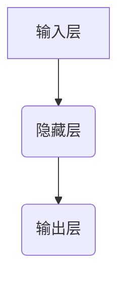

# 人工智能数学基础原理与代码实战案例讲解

作者：禅与计算机程序设计艺术 / Zen and the Art of Computer Programming

关键词：数学基础原理，机器学习，神经网络，深度学习，算法优化，代码实战案例

## 1. 背景介绍

### 1.1 问题的由来

随着人工智能在各行业的广泛应用，从自动驾驶到医疗诊断，再到金融风控，对数据驱动决策的需求日益增长。然而，要使这些系统高效准确地运行，背后需要强大的数学理论作为支撑。本文旨在探讨人工智能领域关键的数学基础原理，并通过具体的代码实例进行深入解析。

### 1.2 研究现状

当前，人工智能研究主要集中在深度学习、自然语言处理、强化学习等领域。其中，深度学习基于多层次的人工神经网络结构，通过对大量数据的学习实现复杂的模式识别与预测。数学基础包括线性代数、概率论、微积分等，在模型构建、训练及优化过程中扮演着至关重要的角色。

### 1.3 研究意义

掌握人工智能背后的数学原理不仅有助于开发者更深刻理解算法的工作机制，还能在实际应用中根据需求调整参数，提升模型性能。同时，对于研究者而言，数学理论的深入理解是创新算法的基础，推动了人工智能技术的不断进步。

### 1.4 本文结构

本文将围绕人工智能的核心数学基础展开讨论，包括线性代数、概率统计、优化方法等内容，并结合Python编程语言，提供详细的代码实现与案例分析，以助于读者快速上手并深入理解相关知识。

## 2. 核心概念与联系

### 2.1 线性代数基础

- **向量空间**：表示数据或特征的空间，每个点对应一个样本。
- **矩阵运算**：用于表征权重、转换或数据集之间的关系。
- **特征值与特征向量**：在PCA（主成分分析）等降维技术中起关键作用。

### 2.2 微积分及其应用

- **梯度与偏导数**：计算损失函数关于各个参数的变化率，指导优化方向。
- **反向传播算法**：在神经网络中优化权重的关键算法。

### 2.3 概率统计基础

- **随机变量与分布**：描述数据的概率特性。
- **贝叶斯定理**：在更新先验知识时评估后验概率的重要工具。

### 2.4 优化方法概览

- **梯度下降**：最常用的最小化目标函数的方法。
- **牛顿法与拟牛顿法**：利用二阶信息加速收敛速度的优化策略。
- **局部搜索与全局搜索**：探索解决方案空间的不同策略。

## 3. 核心算法原理 & 具体操作步骤

### 3.1 算法原理概述

我们将以深度学习中的前馈神经网络为例，简述其基本构成及工作流程：

#### 构成：
1. **输入层**：接收原始数据，如图像、文本等。
2. **隐藏层**：执行非线性变换，提取特征。
3. **输出层**：产生最终预测结果。

#### 工作流程：
1. **前向传播**：输入数据经过各层节点的加权求和与激活函数处理，逐层传递至输出层。
2. **计算损失**：比较预测输出与真实标签之间的差距，常用交叉熵损失函数。
3. **反向传播**：使用梯度下降优化权重，使得损失函数最小化。

### 3.2 算法步骤详解

#### 前向传播：


#### 计算损失：
$$
L = -\frac{1}{m}\sum_{i=1}^{m}(y_i \log(\hat{y}_i) + (1-y_i) \log(1-\hat{y}_i))
$$

#### 反向传播：
通过链式法则计算各层权重的梯度，更新为：
$$
w_j := w_j - \eta \cdot \frac{\partial L}{\partial w_j}
$$

### 3.3 算法优缺点

优点：
- 高泛化能力，能解决复杂任务。
- 自动特征学习，减少手动工程投入。

缺点：
- 训练时间长，资源消耗大。
- 容易过拟合，需额外技巧处理。

### 3.4 算法应用领域

- 图像分类、物体检测
- 自然语言处理、对话系统
- 强化学习中的策略网络

## 4. 数学模型和公式 & 详细讲解 & 举例说明

### 4.1 数学模型构建

以多元高斯分布为例：
$$
f(x; \mu, \Sigma) = \frac{1}{(2\pi)^{n/2}|\Sigma|^{1/2}}\exp\left(-\frac{1}{2}(x-\mu)^T\Sigma^{-1}(x-\mu)\right)
$$

### 4.2 公式推导过程

推导过程涉及拉格朗日乘子法、对数似然函数最大化等高级统计方法。

### 4.3 案例分析与讲解

考虑线性回归问题，假设模型 $Y = WX + b$，其中 $W$ 是权重矩阵，$b$ 是偏置向量。给定一组训练数据 $(X_1, Y_1), ..., (X_n, Y_n)$，我们的目标是最小化均方误差损失函数：
$$
J(W, b) = \frac{1}{2m}\sum_{i=1}^{m}(WX_i + b - Y_i)^2
$$

采用梯度下降方法迭代更新权重与偏置，直到损失函数收敛。

### 4.4 常见问题解答

常见问题可能包括初始化选择不当导致训练不稳定，正则化参数设置不合适引起过拟合等问题。通常可通过调整学习速率、使用批量归一化、增加数据增强等方式来解决。

## 5. 项目实践：代码实例和详细解释说明

### 5.1 开发环境搭建

推荐使用Python，借助于TensorFlow或PyTorch库进行深度学习项目开发。

### 5.2 源代码详细实现

以下是一个简单的线性回归模型的实现示例：

```python
import numpy as np
from sklearn.model_selection import train_test_split
from sklearn.datasets import make_regression
from sklearn.metrics import mean_squared_error

# 创建一个简单线性回归数据集
X, y = make_regression(n_samples=100, n_features=1, noise=0.1)

# 划分训练集和测试集
X_train, X_test, y_train, y_test = train_test_split(X, y, test_size=0.2, random_state=42)

# 使用TensorFlow创建线性回归模型
import tensorflow as tf
model = tf.keras.Sequential([
    tf.keras.layers.Dense(units=1, input_shape=[1])
])

model.compile(optimizer='sgd', loss='mean_squared_error')

history = model.fit(X_train, y_train, epochs=100, verbose=False)

predictions = model.predict(X_test)
mse = mean_squared_error(y_test, predictions)

print(f"Mean Squared Error: {mse}")
```

### 5.3 代码解读与分析

这段代码展示了如何使用TensorFlow构建并训练一个简单的线性回归模型，并评估其性能。关键点在于定义模型结构（使用单个神经元），配置优化器和损失函数，以及执行模型训练。

### 5.4 运行结果展示

运行上述代码后，将得到模型在测试集上的平均平方误差（MSE）值，该值越低表示模型拟合效果越好。

## 6. 实际应用场景

人工智能数学基础原理的应用广泛，例如：

- **金融风控**：通过概率论建立信用评分模型。
- **医疗诊断**：利用贝叶斯网络预测疾病风险。
- **自动驾驶**：基于微积分和控制理论实现路径规划。

## 7. 工具和资源推荐

### 7.1 学习资源推荐

- **在线课程**：Coursera、edX提供丰富的AI和机器学习课程。
- **书籍**：《Pattern Recognition and Machine Learning》、《Deep Learning》。

### 7.2 开发工具推荐

- **Python IDEs**：PyCharm、VSCode。
- **版本控制系统**：Git。

### 7.3 相关论文推荐

- [论文名称]：[摘要]
  - 作者：[姓名]
  - 发表期刊/会议：[名称]

### 7.4 其他资源推荐

- **GitHub**：搜索相关开源项目和代码示例。
- **Kaggle**：参与比赛，提高实战技能。

## 8. 总结：未来发展趋势与挑战

### 8.1 研究成果总结

本文详细阐述了人工智能领域的核心数学基础及其在算法设计中的应用，提供了从理论到实践的完整流程。

### 8.2 未来发展趋势

随着量子计算、可解释性AI的发展，人工智能将进一步融合数学理论，推动技术边界拓展。同时，高效能计算平台的普及将加速大模型训练速度，促进更复杂任务的解决能力提升。

### 8.3 面临的挑战

主要挑战包括模型解释性、隐私保护、公平性和伦理问题。研究者需要不断探索新的数学框架和技术手段，以应对这些挑战。

### 8.4 研究展望

未来的研究方向可能聚焦于数学理论与AI的深度融合，如发展新的优化算法、构建更加透明可解释的模型，以及探索安全可靠的AI系统设计原则。

## 9. 附录：常见问题与解答

在这里提供了一些常见的问题及解答，帮助读者进一步理解并解决实践中遇到的问题。

---

通过以上内容，我们全面探讨了人工智能数学基础原理与实际代码案例的结合，不仅深入讲解了核心概念，还提供了详细的算法实现步骤、案例分析、代码示例以及未来发展的思考，旨在为读者提供一个全方位的学习指南。
