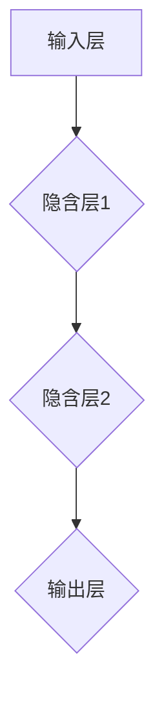

# 神经网络在人工智能中的应用

作者：禅与计算机程序设计艺术 / Zen and the Art of Computer Programming

关键词：神经网络，深度学习，人工智能，机器学习，算法原理，应用案例，未来趋势

## 1. 背景介绍

### 1.1 问题的由来

随着大数据时代的到来，数据的爆炸性增长催生了对自动化处理能力的需求，特别是在模式识别、自然语言理解、图像分析等领域。传统编程方法在面对这些复杂任务时往往显得力不从心，而神经网络作为一种模仿人脑神经元连接方式的计算模型，在处理这类问题上展现出独特的优势。

### 1.2 研究现状

近年来，神经网络尤其是深度学习取得了显著进展。它们被应用于各种高级任务，如图像分类、语音识别、自动驾驶汽车、游戏智能体等，并在许多领域达到了或超过了人类水平。深度学习的核心是多层次的非线性变换，通过大量的参数调整，使模型具有强大的表示学习能力。

### 1.3 研究意义

神经网络的研究不仅推动了人工智能的发展，还促进了其他相关学科的进步，例如计算机视觉、自然语言处理、机器人技术等。同时，它也引发了对于可解释性和透明度的讨论，以及如何确保算法决策的公平性等问题的关注。

### 1.4 本文结构

本文将深入探讨神经网络的基本原理及其在不同场景下的应用，包括算法原理、数学模型、实际项目实践、未来趋势和挑战等内容。我们将从理论出发，逐步引入神经网络的关键概念，并通过具体的例子加以说明。

## 2. 核心概念与联系

神经网络是一种广泛用于模拟生物神经系统功能的人工系统，旨在通过训练解决复杂的模式识别和预测任务。其核心在于“神经元”之间的相互作用和信息传递，以及通过反向传播算法进行权重优化的过程。

### 人工神经网络架构

一个典型的神经网络可以分为输入层、隐藏层（可能有多个）和输出层。每层包含多个节点（称为神经元），每个神经元接收来自前一层的信号，经过加权求和并应用激活函数后，将其传至下一层。权重是关键的学习参数，通过训练逐渐调整以优化网络性能。



### 训练流程

神经网络通过训练集中的样本进行迭代学习。在每次迭代中，网络预测输出与真实值比较，计算损失函数（衡量误差大小）。接着，通过反向传播算法更新各层神经元之间的权重，目标是最小化整体损失。

## 3. 核心算法原理与具体操作步骤

### 3.1 算法原理概述

神经网络的核心算法主要涉及两个方面：前向传播和反向传播。前向传播用于计算网络输出，而后向传播则根据损失函数的变化对权重进行微调。

- **前向传播**：从输入层到输出层依次计算各节点的输出。
- **反向传播**：从输出层向输入层逆向传播梯度，利用链式法则更新权重。

### 3.2 算法步骤详解

1. **初始化**：设定网络的初始权重和偏置值。
2. **前向传播**：
   - 输入特征通过权重加权和激活函数处理。
   - 输出层产生预测结果。
3. **计算损失**：使用损失函数评估预测与实际值间的差异。
4. **反向传播**：
   - 计算梯度，即损失相对于每个权重的导数。
   - 更新权重，减少损失。
5. **重复循环**：迭代上述过程直至满足停止条件（如达到最大迭代次数或损失收敛）。

### 3.3 算法优缺点

优点包括：
- 自动学习特征表示，适用于高维数据。
- 强大的泛化能力和适应能力。
- 可处理非线性关系和复杂模式。

缺点包括：
- 训练时间长，资源消耗大。
- 对于某些特定问题难以实现良好的解释性。
- 容易过拟合，需要正则化等技巧控制。

### 3.4 算法应用领域

神经网络广泛应用于以下领域：
- 图像识别与生成
- 自然语言处理
- 语音识别与合成
- 推荐系统
- 游戏AI
- 医疗诊断与治疗规划

## 4. 数学模型和公式详细讲解与举例说明

### 4.1 数学模型构建

神经网络的数学模型通常基于概率论和统计学习理论。一个简单的多层感知器（MLP）可以描述为：

$$ \hat{y} = f_{\theta}(x) $$

其中，
- $\hat{y}$ 是网络预测的输出；
- $f_{\theta}(x)$ 表示带有参数$\theta$的网络函数；
- $x$ 是输入特征。

网络的前向传播可以通过下面的形式递归地表达：

$$ z^{(l)} = W^{(l)}a^{(l-1)} + b^{(l)} $$
$$ a^{(l)} = g(z^{(l)}) $$

其中，
- $z^{(l)}$ 和 $a^{(l)}$ 分别是$l$层的加权输入和激活后的输出；
- $W^{(l)}$ 和 $b^{(l)}$ 分别是第$l$层的权重矩阵和偏置向量；
- $g(\cdot)$ 是激活函数，例如ReLU或sigmoid。

### 4.2 公式推导过程

假设我们使用均方误差作为损失函数$L$：

$$ L(y, \hat{y}) = \frac{1}{n}\sum_{i=1}^n (y_i - \hat{y}_i)^2 $$

为了最小化这个损失函数，我们需要计算损失关于权重和偏置的梯度，并进行更新。对于任一权重$W^{(l)}_{ij}$，其关于损失的梯度可以通过链式法则得到：

$$ \frac{\partial L}{\partial W^{(l)}_{ij}} = \frac{\partial L}{\partial a^{(l)}} \frac{\partial a^{(l)}}{\partial z^{(l)}} \frac{\partial z^{(l)}}{\partial W^{(l)}} $$

在这个过程中，涉及到的导数包括：

- 第$l$层的梯度（delta）：$\Delta^{(l)}$
- 下一层的梯度：$\Delta^{(l+1)}$

通过反向传播，我们可以逐步计算出所有权重的梯度，进而进行更新。

### 4.3 案例分析与讲解

以图像分类为例，假设我们正在训练一个卷积神经网络（CNN）来识别MNIST手写数字。

1. **数据预处理**：将图像标准化至0-1区间，分割成训练集、验证集和测试集。
2. **模型结构设计**：设计包含卷积层、池化层、全连接层的网络架构。
3. **优化策略选择**：使用随机梯度下降（SGD）、Adam等优化器调整学习率。
4. **训练与验证**：在训练集上迭代优化权重，使用验证集监控性能并防止过拟合。
5. **测试与评估**：在测试集上评估最终模型的准确性和泛化能力。

### 4.4 常见问题解答

常见问题包括但不限于超参数的选择、过拟合与欠拟合的解决方法、如何选择合适的激活函数和损失函数等。解答这些问题通常需要结合具体任务的数据特性以及对算法深入理解。

## 5. 项目实践：代码实例和详细解释说明

### 5.1 开发环境搭建

推荐使用Python及其相关库，如TensorFlow、PyTorch、Keras等。确保安装了必要的软件包，并配置好GPU支持（如果可用）。

```bash
pip install tensorflow
```

### 5.2 源代码详细实现

以深度学习框架TensorFlow为例，实现一个简单的二分类问题：

```python
import tensorflow as tf
from tensorflow.keras.models import Sequential
from tensorflow.keras.layers import Dense, Conv2D, Flatten, MaxPooling2D

# 加载数据集
(x_train, y_train), (x_test, y_test) = tf.keras.datasets.mnist.load_data()

# 数据预处理
x_train = x_train / 255.0
x_test = x_test / 255.0

model = Sequential([
    Conv2D(32, kernel_size=(3, 3), activation='relu', input_shape=(28, 28, 1)),
    MaxPooling2D(pool_size=(2, 2)),
    Flatten(),
    Dense(128, activation='relu'),
    Dense(1, activation='sigmoid')
])

model.compile(optimizer='adam',
              loss='binary_crossentropy',
              metrics=['accuracy'])

model.fit(x_train.reshape(-1, 28, 28, 1), y_train,
          epochs=10,
          validation_split=0.2)

loss, accuracy = model.evaluate(x_test.reshape(-1, 28, 28, 1), y_test)
print("Test Accuracy:", accuracy)
```

这段代码展示了如何构建、编译、训练并评估一个基于CNN的二分类模型。

### 5.3 代码解读与分析

- **数据加载与预处理**：使用TensorFlow内置的mnist数据集进行加载和预处理。
- **模型定义**：创建序列模型，并添加卷积层、最大池化层、全连接层等。
- **模型编译**：指定优化器、损失函数和评估指标。
- **模型训练**：通过`fit`函数进行训练，设置验证划分比例。
- **模型评估**：使用`evaluate`函数计算测试集上的性能。

### 5.4 运行结果展示

运行上述代码后，可以观察到模型在测试集上的准确率，以此评估模型的有效性及泛化能力。

## 6. 实际应用场景

神经网络在多个领域展现出强大的应用潜力：

### 6.4 未来应用展望

随着硬件技术的进步和算法优化的持续发展，神经网络的应用场景将进一步拓展。未来可能涉及更复杂的决策系统、智能交互界面、个性化医疗方案等领域。同时，研究者也将更加关注神经网络的可解释性、公平性以及跨模态融合等方面，以促进其在实际应用中的广泛应用。

## 7. 工具和资源推荐

### 7.1 学习资源推荐

- **在线课程**：
  - TensorFlow官方文档
  - Coursera“Deep Learning Specialization”
  - Udacity“Deep Learning Nanodegree”

- **书籍**：
  - “Deep Learning” by Ian Goodfellow, Yoshua Bengio, and Aaron Courville
  - “Neural Networks and Deep Learning” by Michael Nielsen

### 7.2 开发工具推荐

- **框架**：
  - TensorFlow
  - PyTorch
  - Keras

- **IDEs**：
  - Jupyter Notebook
  - Google Colab

### 7.3 相关论文推荐

- "Improving Neural Network Interpretability" by Hadi Daneshvar et al.
- "Attention is All You Need" by Ashish Vaswani et al.

### 7.4 其他资源推荐

- **GitHub**：查找开源项目和代码示例
- **Stack Overflow**：获取实时帮助和技术讨论
- **Reddit**：参与社区讨论和分享经验

## 8. 总结：未来发展趋势与挑战

### 8.1 研究成果总结

神经网络作为人工智能的核心组成部分，在过去几十年中取得了显著进步，从图像识别到自然语言处理，再到复杂决策系统的设计，都展现了强大的应用价值。

### 8.2 未来发展趋势

- **自动化与自适应**：开发能够自我调整和改进的神经网络，减少人工干预。
- **知识蒸馏**：将大型预训练模型的知识传递给小型模型，提高部署效率和成本效益。
- **可解释性增强**：提升神经网络的透明度，使模型决策过程更容易被理解和审计。
- **跨模态学习**：整合不同类型的输入信息，实现更为综合和灵活的学习方式。

### 8.3 面临的挑战

- **隐私保护**：确保在收集和使用数据时遵守隐私法规，保护个人数据安全。
- **伦理考量**：在AI系统的决策过程中融入道德准则，避免偏见和歧视。
- **可持续性**：优化能源消耗和计算资源利用，推动绿色AI的发展。

### 8.4 研究展望

未来的神经网络研究将致力于解决上述挑战，同时也探索新的应用领域，例如环境监测、社会服务、科学研究等。通过多学科交叉合作，神经网络有望在更多方面发挥关键作用，为人类带来前所未有的便利和创新。

## 9. 附录：常见问题与解答

常见问题包括但不限于如何选择合适的网络架构、如何处理过拟合、如何优化模型性能等。解答这些问题需要结合具体任务需求、数据特性以及对深度学习理论的深入理解。通常建议采用正则化技巧（如Dropout）、增加数据多样性、使用迁移学习方法来提高模型的泛化能力和效率。

---
以上内容详细阐述了神经网络的基本原理及其在人工智能领域的应用，覆盖了从理论概述到实践案例，再到未来趋势的全面视角。希望这篇博客文章能为您提供深入了解神经网络在AI领域作用的关键见解。
