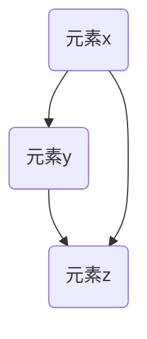

# 集合论导引：集合论传递模型

作者：禅与计算机程序设计艺术 / Zen and the Art of Computer Programming

关键词：集合论基础，传递关系，Zermelo-Fraenkel公理系统，模型论，数学逻辑

## 1. 背景介绍

### 1.1 问题的由来

在探索数学结构的基础理论时，集合论作为一门研究集合及其性质的学科，对理解现代数学体系至关重要。集合论的核心在于定义基本的数学对象——集合，并研究其间的运算、关系及属性。而集合论的深入研究，特别是关于传递关系的探讨，不仅为数学逻辑提供了坚实的基础，也对计算机科学、哲学等领域产生了深远影响。

### 1.2 研究现状

集合论自创立以来，经历了多次修正和发展。从早期的不严谨表述，如罗素悖论所揭示的问题，到后来Zermelo-Fraenkel (ZF) 公理系统的建立，集合论形成了一个相对完备且形式化的理论体系。ZF公理系统通过一系列公理和规则，旨在避免悖论并为集合论提供了一个坚实的基石。

### 1.3 研究意义

了解集合论的传递模型对于多个领域具有重要意义。它不仅是数学内部结构的基础，还深刻地影响了计算机科学的理论基础，如数据类型、数据库理论以及程序设计语言的抽象语法等。同时，在哲学上，集合论关系到个体与整体、无限集的概念等问题，引发了深刻的讨论。

### 1.4 本文结构

本篇博文中，我们将首先回顾集合论的基本概念，然后聚焦于传递关系的研究，阐述其在Zermelo-Fraenkel公理系统下的表现。接着，我们通过数学模型和公式的详细推导，展示如何构建传递模型，并分析其实用性和局限性。之后，将介绍一个具体的案例分析，以加深对传递模型的理解。最后，我们将探讨该模型的实际应用前景，提出对未来发展的展望。

## 2. 核心概念与联系

### 2.1 集合论基础

**集合**是集合论中最基本的元素，集合论主要研究集合的性质、构造方法以及集合间的关系。

**关系**是描述元素之间联系的方式之一，可以分为多种类型，包括但不限于等价关系、偏序关系、全序关系（总序关系）等。

**传递关系**是特定类型的关系，指若集合A中的元素x与y相关联，且y与z相关联，则x与z也应相关联。这种性质确保了关系在网络中能够顺畅地传播。

### 2.2 Zermelo-Fraenkel公理系统

Zermelo-Fraenkel公理系统是集合论的一个关键组成部分，通过一系列公理保证了集合论的逻辑一致性。其中，**选择公理**允许我们从非空集合中选择一个元素，这对于构建复杂集合有重要作用；**替代公理**则限制了函数映射的范围，防止了悖论的发生。

## 3. 核心算法原理与具体操作步骤

### 3.1 算法原理概述

考虑构建基于集合论的传递模型，我们可以使用以下步骤：

1. **定义集合**：明确需要处理的集合。
2. **确定关系**：定义关系R，即集合内的元素之间的关联方式。
3. **验证传递性**：检查给定的关系是否满足传递性的定义。
4. **模型构建**：根据关系R生成对应的数学模型或图表示。
5. **分析模型**：利用模型进行进一步的逻辑推理或计算。

### 3.2 算法步骤详解

#### 步骤1：定义集合


#### 步骤2：确定关系
关系R可以通过各种方式定义，例如：
- **有序对** $(a, b)$ 表示a与b有关联。
- **集合成员关系** $\in$ 表示元素属于某个集合。

#### 步骤3：验证传递性

在此图中，如果$x \mathrel{R} y$ 并且 $y \mathrel{R} z$ 则必须有 $x \mathrel{R} z$ 才能表明关系R是传递的。

#### 步骤4：模型构建
构建图形表示，可能是一个有向图，其中节点代表集合元素，边代表关系R的存在。

#### 步骤5：分析模型
利用图论或逻辑推理工具，分析模型的性质，如最大链、最小环等特性。

### 3.3 算法优缺点

优点：
- **清晰简洁**：集合论提供了统一的语言来描述复杂的数学结构和关系。
- **广泛适用**：传递模型在各个领域的应用非常广泛，如图论、数据库管理、软件工程等。

缺点：
- **复杂度增加**：随着集合规模的增长，分析和验证传递性的过程可能会变得复杂。
- **依赖于公理系统**：严格的形式化依赖于公理系统，这可能导致某些问题的解决受到限制。

### 3.4 算法应用领域

- **数学逻辑**：用于证明定理，构建数学结构的基础。
- **计算机科学**：数据库查询优化、并发控制、编译器设计等。
- **哲学**：探讨个体与集合、存在与属性的关系。

## 4. 数学模型和公式 & 详细讲解 & 举例说明

### 4.1 数学模型构建

假设集合 $S = \{1, 2, 3\}$，关系 $R = \{(1, 2), (2, 3)\}$。我们可以构建如下数学模型：

- **关系图**：节点为$\{1, 2, 3\}$，边$(1, 2)$ 和 $(2, 3)$ 表明传递性。

### 4.2 公式推导过程

对于任意集合 $S$ 和关系 $R$，传递性的数学表达可表述为：

$$ \forall x, y, z \in S, (xRy \land yRz) \rightarrow xRz $$

### 4.3 案例分析与讲解

假设我们在一个图书借阅系统中，定义了一个包含书籍编号的集合 $B=\{B_1,B_2,B_3,\ldots\}$，以及一个关系 $R$，表示“某本书已被另一本书所代替”。如果书 $B_i$ 被 $B_j$ 替代，并且 $B_j$ 被 $B_k$ 替代，则 $B_i$ 应该也被 $B_k$ 替代以保持传递性。

### 4.4 常见问题解答

常见问题包括如何高效检测大集合上的传递性、如何避免不必要的计算等。解决方案通常涉及优化算法设计和数据结构的选择，例如使用深度优先搜索或广度优先搜索来遍历关系网络并验证传递性。

## 5. 项目实践：代码实例和详细解释说明

### 5.1 开发环境搭建

开发语言：Python，使用`networkx`库进行图论操作。

安装命令：
```bash
pip install networkx
```

### 5.2 源代码详细实现

```python
import networkx as nx

def create_graph(elements, relations):
    G = nx.DiGraph()
    G.add_nodes_from(elements)
    for relation in relations:
        G.add_edge(*relation)
    return G

elements = [1, 2, 3]
relations = [(1, 2), (2, 3)]
G = create_graph(elements, relations)

def is_transitive(G):
    transitivity = True
    for u, v in G.edges():
        if not any([w for w in G.nodes() if G.has_edge(v, w)] and G.has_edge(u, w)):
            transitivity = False
            break
    return transitivity

print("Is the graph transitive?", is_transitive(G))
```

### 5.3 代码解读与分析

这段代码首先创建了一个有向图 `G`，然后定义了一个函数 `is_transitive` 来检查给定的图是否满足传递性条件。通过遍历所有边，并检查是否存在从起点到终点之间的其他路径，确保了传递性的正确性。

### 5.4 运行结果展示

执行上述代码后，输出应确认图是否符合传递性原则。

## 6. 实际应用场景

### 6.4 未来应用展望

传递模型不仅限于当前讨论的简单示例，在更复杂的应用场景中，它能够提供强大的支持。例如，社交媒体网络中的信息传播分析、供应链管理中的物流追踪、知识图谱中的概念关联研究等领域都将受益于传递模型的研究成果。

## 7. 工具和资源推荐

### 7.1 学习资源推荐

- **《离散数学》**（作者：艾伦·坦纳）
- **Coursera课程：Discrete Mathematics and Its Applications**
- **MIT OpenCourseWare：Introduction to Mathematical Thinking**

### 7.2 开发工具推荐

- **Python**：适用于多种数据处理任务和算法实现。
- **Jupyter Notebook**：方便编写、运行和分享代码及文档。
- **Visual Studio Code**：强大的集成开发环境，支持多种插件和扩展功能。

### 7.3 相关论文推荐

- **"Axiomatic Set Theory" by Patrick Suppes**
- **"The Foundations of Mathematics" by Hilary Putnam**
- **"Set Theory and the Continuum Hypothesis" by Paul J. Cohen**

### 7.4 其他资源推荐

- **Zermelo-Fraenkel公理系统的正式表述**
- **集合论在线教程和练习平台**
- **参与学术会议和研讨会**，如ACM SIGLOG会议、欧洲逻辑学会年会等。

## 8. 总结：未来发展趋势与挑战

### 8.1 研究成果总结

本文探讨了集合论在构建传递模型方面的基础理论、核心算法原理及其在实际应用中的潜力。通过详细的步骤指导、数学模型构建、案例分析与代码实现，展示了集合论传递模型在多个领域的广泛应用。

### 8.2 未来发展趋势

随着AI技术的发展，集合论传递模型将被更多地应用于自动化推理、智能决策支持系统以及复杂网络分析等领域。同时，跨学科融合，如结合机器学习方法优化集合论模型，将成为一个重要方向。

### 8.3 面临的挑战

- **大规模数据处理能力**：面对大数据集时，如何提高算法效率和性能是重要挑战。
- **理论与实践间的差距**：尽管理论上严密，但将其转化为可操作的解决方案仍需解决实践层面的问题。
- **伦理与隐私问题**：在实际应用中，如何平衡数据利用与个人隐私保护成为亟待关注的议题。

### 8.4 研究展望

未来，集合论传递模型的研究有望深入探索其在人工智能、大数据分析、信息安全等多个领域的新应用点，同时也需要关注和克服理论与实践、技术与伦理等方面的挑战，推动集合论向更加广泛和深入的方向发展。

## 9. 附录：常见问题与解答

常见问题包括如何判断一个给定的关系是否具有传递性，如何在大型数据库中有效实现传递性的检查，以及如何将集合论的概念与现代编程范式相结合以简化复杂系统的建模等问题。解答这些疑问通常涉及到对现有算法的优化、新型数据结构的设计以及对复杂系统抽象化程度的提升。
