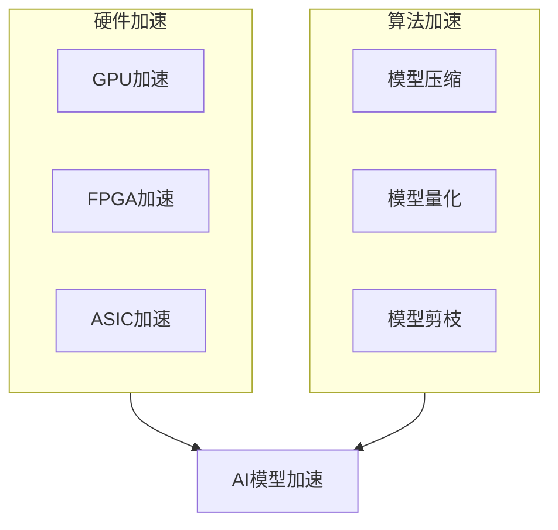

# AI模型加速原理与代码实战案例讲解

## 1. 背景介绍

### 1.1 问题的由来

随着人工智能(AI)技术的不断发展和应用场景的日益广泛,AI模型的计算性能和推理效率成为了制约其发展的关键瓶颈。传统的CPU架构由于其串行计算方式,很难满足AI模型对大规模并行计算的需求。因此,如何加速AI模型的计算过程,提高模型的推理性能,成为了当前AI领域亟待解决的重要问题。

### 1.2 研究现状

为了解决AI模型计算性能瓶颈,研究人员提出了多种加速方法,包括利用GPU、FPGA、ASIC等专用硬件加速器,以及通过模型压缩、量化、剪枝等算法优化模型结构。其中,GPU加速由于其强大的并行计算能力,成为了当前最为广泛采用的AI加速方案。

### 1.3 研究意义

AI模型加速技术的研究和应用,对于推动AI技术的发展具有重要意义。高效的AI加速方案可以显著提升模型的计算性能,缩短推理时间,降低能耗,从而使AI模型能够在资源受限的嵌入式设备和边缘计算场景中得到更好的应用。同时,AI加速技术也为AI模型的工业级部署奠定了基础,促进了AI技术在各行各业的广泛应用。

### 1.4 本文结构

本文将全面介绍AI模型加速的原理和实践。首先阐述核心概念和加速方法,包括硬件加速器和模型优化算法;然后详细讲解核心算法原理和数学模型,并给出代码实例;接着探讨实际应用场景,介绍相关工具和资源;最后总结发展趋势并指出面临的挑战。

## 2. 核心概念与联系

AI模型加速技术主要包括两个层面:硬件加速和算法加速。

硬件加速利用专用的加速器硬件(如GPU、FPGA、ASIC等)来加速AI模型的计算过程。这些硬件加速器具有强大的并行计算能力,可以显著提升AI模型的计算性能。

算法加速则是通过优化AI模型的结构和参数,减少计算量和存储需求,从而提高模型的推理效率。常见的算法加速方法包括模型压缩、量化、剪枝等。

硬件加速和算法加速相辅相成,共同推动了AI模型加速技术的发展。硬件加速为AI模型提供了高性能的计算平台,而算法加速则使模型结构更加精简高效,从而充分发挥硬件加速器的性能优势。



## 3. 核心算法原理与具体操作步骤

### 3.1 算法原理概述

AI模型加速算法主要包括以下几种方法:

1. **模型压缩**:通过降低模型参数的冗余度,减小模型的存储空间和计算量,从而提高推理效率。常见的模型压缩方法包括pruning(剪枝)、低秩分解、知识蒸馏等。

2. **模型量化**:将原本使用高精度浮点数(FP32)表示的模型参数和激活值,量化为低精度的定点数(INT8)或更低,从而减小模型大小和计算量。

3. **模型剪枝**:移除模型中对最终结果影响较小的参数和连接,从而得到一个精简的模型结构,降低计算和存储开销。

4. **模型并行化**:将大型模型拆分为多个子模型,利用多个计算单元(如GPU)并行执行推理,提高整体吞吐量。

5. **计算图优化**:分析模型的计算图结构,合并冗余操作、优化内存访问模式、利用指令级并行等手段,从而加速计算过程。

这些算法通过不同的方式优化模型结构和计算过程,降低计算量和存储需求,从而实现AI模型的加速。

### 3.2 算法步骤详解

以**模型剪枝**算法为例,其主要步骤如下:

1. **计算参数重要性得分**:通过一定的评估标准(如参数绝对值、梯度等),为模型中的每个参数计算一个重要性得分。

2. **按重要性排序并设置阈值**:将所有参数按重要性得分从高到低排序,设置一个阈值,低于该阈值的参数将被剪枝。

3. **剪枝低重要性参数**:遍历模型参数,将重要性得分低于阈值的参数设置为0,相应的连接也被移除。

4. **微调剪枝后模型**:在训练数据集上微调剪枝后的模型,以恢复模型性能。

5. **评估并调整剪枝比例**:在验证数据集上评估剪枝后模型的性能,根据性能损失程度适当调整剪枝比例,重复上述步骤。

通过这种方式,模型剪枝算法可以有效地移除对模型性能影响较小的参数和连接,从而降低计算量和存储需求,实现模型加速。

### 3.3 算法优缺点

模型剪枝算法的主要优点是:

- 可以显著降低模型的计算量和存储需求,提高推理效率。
- 保留了模型的主要结构和参数,性能损失相对较小。
- 算法思路简单,易于实现和部署。

但同时也存在一些缺点:

- 需要在训练数据集上微调剪枝后模型,增加了额外的计算开销。
- 剪枝比例过高会导致模型性能明显下降。
- 无法彻底解决模型冗余的根本问题,只是权宜之计。

### 3.4 算法应用领域

模型剪枝算法广泛应用于各种AI模型的加速,包括:

- **计算机视觉**:加速目标检测、图像分类等视觉任务模型。
- **自然语言处理**:加速语言模型、机器翻译等NLP任务模型。
- **推荐系统**:加速推荐模型,提高在线推理效率。
- **移动端和边缘设备**:将剪枝后的小型高效模型部署到资源受限设备。

总的来说,模型剪枝算法为AI模型加速提供了一种行之有效的通用方法,在多个领域得到了广泛应用。

## 4. 数学模型和公式详细讲解与举例说明

### 4.1 数学模型构建

在模型剪枝算法中,我们需要定义一个评估参数重要性的数学模型。常见的重要性评估方法包括:

1. **参数绝对值**:

$$s_i = |w_i|$$

其中$s_i$表示第$i$个参数的重要性得分,$w_i$为参数值。这种方法简单直观,认为参数值绝对值越大,越重要。

2. **梯度范数**:

$$s_i = \left\|\frac{\partial L}{\partial w_i}\right\|$$

其中$L$为损失函数,$\frac{\partial L}{\partial w_i}$为参数$w_i$的梯度。梯度范数越大,说明该参数对损失函数的影响越大,越重要。

3. **Second-order Taylor Expansion**:

$$s_i = \left\|\frac{1}{2}\frac{\partial^2 L}{\partial w_i^2}\right\|$$

利用二阶导数近似参数对损失函数的影响程度,从而评估重要性。

不同的重要性评估方法会导致剪枝效果的差异,需要根据具体任务选择合适的方法。

### 4.2 公式推导过程

以梯度范数作为重要性评估标准为例,我们推导其数学表达式。

给定损失函数$L$和模型参数$w$,根据链式法则:

$$\frac{\partial L}{\partial w_i} = \frac{\partial L}{\partial y}\frac{\partial y}{\partial w_i}$$

其中$y$为模型输出。将$\frac{\partial L}{\partial y}$视为常数,我们有:

$$\left\|\frac{\partial L}{\partial w_i}\right\| = \left\|\frac{\partial L}{\partial y}\right\| \left\|\frac{\partial y}{\partial w_i}\right\|$$

$\left\|\frac{\partial y}{\partial w_i}\right\|$反映了参数$w_i$对模型输出$y$的影响程度,可以作为评估参数重要性的标准。

取范数的目的是将梯度向量的每个分量合并为一个标量,从而方便对参数重要性进行排序和比较。

### 4.3 案例分析与讲解

我们以VGG-16模型为例,分析模型剪枝算法的效果。VGG-16是一种流行的卷积神经网络模型,广泛应用于图像分类任务。

首先,我们计算VGG-16模型中每个参数的梯度范数,作为重要性评估标准。然后按重要性得分从高到低排序,设置一个阈值(例如移除权重绝对值最小的20%参数),剪枝低于该阈值的参数及其连接。

在ImageNet数据集上,剪枝前VGG-16模型的Top-5错误率为7.3%,参数量为1.38亿。经过20%剪枝后,Top-5错误率上升到7.5%,参数量减少到1.1亿,模型大小压缩了20%,计算量也相应降低。

如果将剪枝比例提高到50%,Top-5错误率将进一步上升到8.1%,参数量减少到0.69亿,但是性能损失也较为明显。

因此,在实际应用中需要权衡剪枝比例和模型精度之间的平衡,选择合适的剪枝策略。同时,剪枝后的模型还需要进行微调,以恢复一部分性能损失。

### 4.4 常见问题解答

**Q: 剪枝算法是否适用于所有类型的神经网络?**

A: 剪枝算法理论上可以应用于大多数类型的神经网络,包括卷积神经网络(CNN)、递归神经网络(RNN)、transformer等。但由于不同类型网络的结构和参数分布存在差异,剪枝效果可能有所不同,需要针对具体网络类型调整剪枝策略。

**Q: 剪枝算法是否可以和其他加速算法(如量化、知识蒸馏等)结合使用?**

A: 是的,剪枝算法可以和其他加速算法相结合,发挥协同加速效果。例如,可以先对模型进行剪枝,减小计算量,然后再对剪枝后的模型进行量化,进一步降低精度要求,最终获得更高的加速比。

**Q: 剪枝算法是否适用于大型模型?**

A: 对于大型模型(如BERT、GPT等),单纯采用剪枝算法效果可能不太理想。这是因为大型模型通常具有极高的冗余度,剪枝一小部分参数无法显著降低计算量。对于这类模型,需要结合其他加速方法(如模型并行、层级剪枝等)才能获得显著的加速效果。

## 5. 项目实践:代码实例和详细解释说明

### 5.1 开发环境搭建

本节将使用PyTorch框架,在CIFAR-10数据集上训练并剪枝VGG-16模型,演示模型剪枝算法的实现过程。

首先,我们需要安装PyTorch及相关依赖库:

```bash
pip install torch torchvision
```

然后下载CIFAR-10数据集:

```python
import torchvision.datasets as datasets

# 下载CIFAR-10训练和测试数据集
datasets.CIFAR10('data', train=True, download=True)
datasets.CIFAR10('data', train=False, download=True)
```

### 5.2 源代码详细实现

```python
import torch
import torch.nn as nn
from torchvision.models import vgg16

# 定义VGG-16模型
model = vgg16(pretrained=False, num_classes=10)

# 计算参数重要性得分(梯度范数)
for name, param in model.named_parameters():
    param.requires_grad = True

dummy_input = torch.randn(1