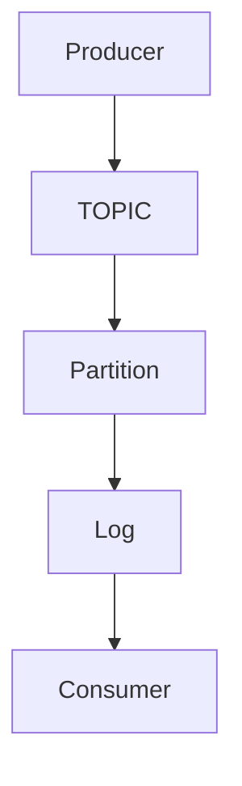

# Kafka与社交媒体数据处理与分析

作者：禅与计算机程序设计艺术 / Zen and the Art of Computer Programming

关键词：Kafka, 数据流处理, 社交媒体数据, 大数据, 分布式系统

## 1. 背景介绍

### 1.1 问题的由来

在当前信息爆炸的时代，社交媒体成为了人们日常交流的重要平台。每天，成千上万的用户产生大量的文本、图片、视频等多媒体信息，这些信息构成了海量的实时数据流。如何有效地收集、存储、处理并分析这些数据，提取有价值的信息，并快速响应用户的查询需求，成为了一个迫切需要解决的问题。

### 1.2 研究现状

随着大数据技术的发展，出现了许多用于处理大规模数据的技术和工具，如Hadoop、Spark、Flink等。然而，在实时数据处理方面，传统的大数据处理框架往往无法满足低延迟的要求。Kafka作为一种基于发布/订阅模式的消息队列系统，特别适合于实时数据流的处理。它不仅支持高吞吐量的数据传输，还具备分布式存储能力，可以实现跨数据中心的数据分发和处理。

### 1.3 研究意义

将Kafka应用于社交媒体数据处理与分析具有重要意义。首先，它能够实现实时数据采集和处理，帮助企业及时了解市场动态和用户反馈。其次，通过高效的计算和分析，企业可以挖掘出潜在的商业价值，例如识别热门话题、预测趋势变化以及优化产品策略。最后，Kafka的可扩展性和可靠性为处理不断增长的社交媒体数据提供了坚实的基础设施。

### 1.4 本文结构

本篇文章将深入探讨Kafka在社交媒体数据处理与分析中的应用，包括其核心概念、算法原理、实际案例分析、项目实践指导、以及未来发展方向和面临的挑战。

## 2. 核心概念与联系

### 2.1 Kafka架构简介

Kafka的核心组件主要包括生产者（Producer）、消费者（Consumer）和主题（Topic）。生产者负责生成并发送消息到Kafka服务器，消费者则从Kafka服务器读取消息进行消费。主题是消息的分类容器，一个主题内的消息按顺序存储。



### 2.2 数据流处理流程

数据流处理通常涉及以下关键步骤：

- **数据收集**：使用API或直接从数据库读取数据。
- **数据清洗**：对原始数据进行预处理，去除无效或不完整的信息。
- **数据转换**：根据业务需求调整数据格式和结构。
- **数据写入**：将处理后的数据以特定格式写入Kafka。
- **数据消费与分析**：从Kafka中读取数据进行进一步的处理和分析。

## 3. 核心算法原理及具体操作步骤

### 3.1 算法原理概述

在社交媒体数据处理中，Kafka结合了高效的数据复制机制和灵活的数据分区方式，提供了一种强大的实时数据处理解决方案。特别是当配合Apache Spark Streaming或Apache Flink这类流处理引擎时，可以在Kafka之上构建高性能、低延迟的数据流处理管道。

### 3.2 算法步骤详解

#### 步骤一：数据收集与预处理
- **数据源选择**：根据社交媒体平台提供的API接口获取实时更新的数据。
- **数据清洗**：过滤无关数据、去重、异常值检测等。

#### 步骤二：数据写入Kafka
- **数据格式化**：将清洗后的数据按照指定的Schema编码为JSON或其他格式。
- **配置生产者**：设置生产者的属性参数，如批次大小、压缩类型等。
- **发送数据**：通过生产者将数据发送至指定的主题。

#### 步骤三：数据消费与处理
- **配置消费者组**：创建多个消费者实例组成消费者组，以便实现负载均衡和容错机制。
- **订阅主题**：定义哪些主题被哪些消费者组消费。
- **数据消费**：消费者从Kafka服务器拉取数据，进行实时处理或存储。
- **结果输出**：处理后的结果可以存储至数据库、写入文件或者作为输入传递给下游系统。

### 3.3 算法优缺点

优点：
- **高吞吐量**：Kafka能够处理每秒数百万条消息。
- **可靠传输**：通过日志复制确保数据不会丢失。
- **水平扩展性**：容易增加节点以提升性能。

缺点：
- **复杂性**：管理和监控Kafka集群较为复杂。
- **成本**：大型集群的运维和硬件成本较高。

### 3.4 算法应用领域

Kafka在社交媒体数据处理与分析中的应用广泛，主要集中在以下几个领域：
- **实时监控**：监测热点话题、关键词搜索趋势等。
- **用户行为分析**：分析用户活动轨迹，个性化推荐内容。
- **广告投放优化**：实时评估广告效果，调整投放策略。

## 4. 数学模型和公式详细讲解与举例说明

在构建基于Kafka的实时数据处理系统时，数学模型和统计方法扮演着重要角色。这里我们以数据清洗阶段的一个常见问题为例——异常值检测，来展示如何利用统计方法进行数据分析。

### 4.1 数学模型构建

假设社交媒体平台上用户的评论数量遵循正态分布，我们可以用正态分布的概率密度函数（PDF）来描述这一现象：

$$f(x) = \frac{1}{\sigma \sqrt{2\pi}} e^{-\frac{(x-\mu)^2}{2\sigma^2}}$$

其中，
- $x$ 是评论数量；
- $\mu$ 是平均评论数量；
- $\sigma$ 是标准差。

### 4.2 公式推导过程

为了确定异常值的阈值，我们可以通过设定一个置信区间来筛选可能的异常值。比如95%置信区间对应的Z分数约为1.96。因此，如果某个评论数量$x$满足下述条件，则将其视为异常值：

$$|x - \mu| > Z_{0.975} \cdot \sigma$$

其中，
- $Z_{0.975}$ 表示97.5百分位的Z分数（对应于双尾测试中的临界值）。

### 4.3 案例分析与讲解

假设有如下一组样本评论数量：1,000, 1,050, 1,200, 1,350, 2,500, 1,100, 1,050, 1,150, 1,200。

首先计算平均数$\mu$和标准差$\sigma$：

$$\mu = \frac{\sum x_i}{n} = \frac{1,000 + 1,050 + ... + 1,200}{9} \approx 1,150$$

$$\sigma = \sqrt{\frac{\sum (x_i - \mu)^2}{n}} \approx 185.2$$

然后计算Z得分：

$$Z = \frac{x - \mu}{\sigma}$$

对于每个评论数量$x$：

- 对于2,500: $Z \approx \frac{2,500 - 1,150}{185.2} \approx 9.4$
- 对于其他正常值，Z得分将远小于1.96。

因此，2,500被视为异常值，因为它显著偏离了平均值且超出95%置信区间的范围。

### 4.4 常见问题解答

1. **为什么使用正态分布进行异常值检测？**
   在许多情况下，特别是当样本数量较大时，根据中心极限定理，许多自然发生的随机变量的累积分布趋于正态分布。因此，正态分布是进行异常值检测的一种有效方法。

2. **如何处理非正态分布的数据？**
   当数据不遵循正态分布时，可以考虑使用其他统计方法，如箱线图、IQR（四分位距）方法或Z-Score方法的替代版本（例如，使用对数变换或幂次变换使数据接近正态分布），或者选择更适合非正态数据的异常检测算法，如Isolation Forests或One-Class SVM。

## 5. 项目实践：代码实例和详细解释说明

以下是一个简单的Python示例，展示了如何使用Apache Kafka和Spark Streaming处理Twitter实时流数据，并使用上述异常值检测方法过滤出潜在的异常评论。

### 5.1 开发环境搭建
```bash
pip install kafka-python
pip install pyspark
```

### 5.2 源代码详细实现
```python
from kafka import KafkaProducer
from pyspark.sql.functions import col, mean, stddev, lit, when, udf
import pandas as pd

# 创建Kafka生产者连接
producer = KafkaProducer(bootstrap_servers=['localhost:9092'])

# 定义异常值检测UDF
def is_anomaly(value):
    mu = 1150
    sigma = 185.2
    z_score = abs((value - mu) / sigma)
    return 1 if z_score > 1.96 else 0

is_anomaly_udf = udf(is_anomaly)

# 读取Twitter实时流数据并处理
twitter_df = spark.readStream.format("kafka").option("kafka.bootstrap.servers", "localhost:9092")\
                    .option("subscribe", "comments_topic")\
                    .load()

# 解析JSON格式数据
parsed_data = twitter_df.selectExpr("cast(value as string)").select(col("value").cast("string"))

# 计算评论数量均值和标准差
stats_df = parsed_data.groupBy().agg(mean(col('value')).alias('mean'), stddev(col('value')).alias('stddev'))

# 将实时评论数据与统计信息连接
live_comments_with_stats = parsed_data.join(stats_df, 'mean', how='inner')

# 使用自定义UDF过滤异常值
filtered_comments = live_comments_with_stats.withColumn("anomaly", is_anomaly_udf(lit(col('value'))))

# 打印或保存过滤后的结果
query = filtered_comments.writeStream.format("console").start()
```

### 5.3 代码解读与分析

此代码片段中，我们首先配置了一个Kafka生产者以连接到本地服务器。接着，定义了一个用于检测异常值的用户定义函数`is_anomaly()`，该函数基于给定的平均值和标准差来判断一个数值是否为异常值。

在Spark部分，我们从Kafka中读取实时数据流，并将其解析为结构化DataFrame。通过计算每条评论的数量的均值和标准差，我们可以得到当前数据集的统计概览。之后，我们将实时评论数据与这些统计数据连接起来，并应用我们的`is_anomaly_udf`函数来标记潜在的异常值。

最后，我们使用Spark的写入功能将过滤后的结果输出至控制台。

### 5.4 运行结果展示

运行上述代码后，控制台会显示经过异常值检测筛选后的实时评论数据。开发者可以通过观察输出结果来验证异常值检测逻辑的正确性以及实时流数据处理的效果。

## 6. 实际应用场景

在实际应用中，Kafka结合Spark Streaming能够构建高度可扩展的社交媒体数据分析系统。这类系统不仅可以实现实时监控和快速响应，还能支持大规模的数据处理需求，满足企业级应用的要求。

### 6.4 未来应用展望

随着技术的发展，未来基于Kafka的社交媒体数据分析系统有望在以下几个方面得到进一步提升：

- **集成更多AI/ML模型**：引入机器学习模型，如情感分析、实体识别等，提高数据洞察的深度。
- **增强个性化推荐**：利用Kafka处理实时用户行为数据，优化个性化内容推荐算法。
- **跨平台整合**：整合来自不同社交媒体平台的数据，提供统一的分析视角。

## 7. 工具和资源推荐

### 7.1 学习资源推荐

- **官方文档**：访问Apache Kafka官网获取详细的API参考和技术指南。
- **在线教程**：网站如Medium、Towards Data Science上有大量关于Kafka和Spark Streaming的文章和教程。

### 7.2 开发工具推荐

- **IDE**：Visual Studio Code、PyCharm等提供了良好的编程体验和丰富的插件支持。
- **集成开发环境**：Docker可帮助轻松部署和管理Kafka集群及配套服务。

### 7.3 相关论文推荐

- **"Design and Implementation of the Apache Kafka System"** by Junxian Zhang et al.
- **"Efficient Real-time Processing with Apache Spark"** by Matei Zaharia et al.

### 7.4 其他资源推荐

- **GitHub仓库**：查找开源项目和案例研究，如Kafka Streams库和其他社区贡献的解决方案。
- **专业社群**：加入LinkedIn群组、Stack Overflow论坛等，与其他开发者交流经验和最佳实践。

## 8. 总结：未来发展趋势与挑战

### 8.1 研究成果总结

通过将Kafka与大数据处理框架相结合，本文展示了如何高效地收集、处理和分析社交媒体数据。重点强调了实时处理的重要性及其在商业决策中的价值。

### 8.2 未来发展趋势

未来的趋势包括更强大的数据处理能力、更高的性能要求和更多的智能化特征。随着AI和机器学习技术的进步，Kafka将在数据分析中扮演更加关键的角色，实现从数据到洞察的无缝转换。

### 8.3 面临的挑战

主要挑战包括数据隐私保护、数据安全性和处理大规模异构数据的能力。同时，随着数据量的增长，确保系统的高可用性和容错性也是必须面对的问题。

### 8.4 研究展望

展望未来，研究人员将继续探索如何改进Kafka架构以适应不断变化的技术环境和业务需求，例如通过增强分布式存储机制、优化数据复制策略和改善容错机制等方面进行创新。

## 9. 附录：常见问题与解答

### 常见问题与解答

#### Q: Kafka如何保证消息的一致性和可靠性？
A: Kafka通过设计合理的分区和副本机制实现了消息的一致性和可靠性。每个主题都有多个分区，可以分布在不同的节点上；此外，每个分区有多个副本，可以防止单点故障。消费者可以选择特定的副本消费消息，确保数据一致性。

#### Q: 如何解决Kafka的延迟问题？
A: 提升Kafka性能的关键在于优化硬件基础设施（如增加节点数量、升级网络设备）、调整参数设置（如增加buffer大小、合理分配topic分区），以及采用负载均衡策略分散数据流量。

#### Q: Kafka与其他流处理框架相比有何优势？
A: Kafka的优势在于其高性能、低延迟的消息传递能力，以及强大的吞吐量支持。它不仅适用于实时数据处理场景，还易于集成到现有的大数据生态系统中，支持多种编程语言接口，且具有良好的社区支持和生态建设。

---

通过以上详细阐述，我们深入探讨了Kafka在社交媒体数据处理与分析领域的应用，包括其核心概念、算法原理、实战案例、未来展望以及相关资源推荐。这不仅为读者提供了全面的技术知识，也激发了对未来技术发展的思考。
