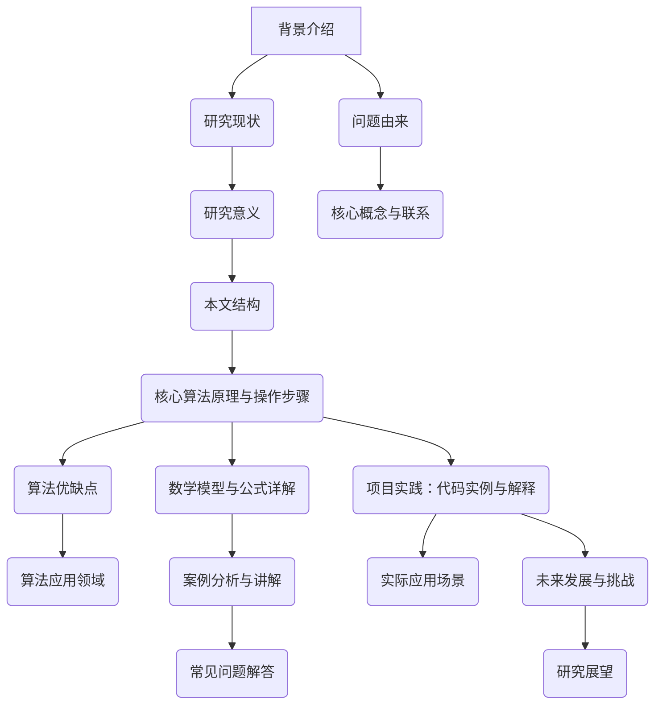

# Linear Regression 原理与代码实战案例讲解

作者：禅与计算机程序设计艺术 / Zen and the Art of Computer Programming

关键词：线性回归,机器学习基础,数据拟合,最小二乘法,Python编程

## 1.背景介绍

### 1.1 问题的由来

在数据分析和预测建模领域，我们经常需要从历史数据中提取规律，并根据这些规律对未来情况进行预测或理解当前情况背后的原因。线性回归就是一种用于解决这类问题的统计方法，它试图找到一组数据点的最佳直线或平面，使得整个数据集到这条直线或平面的距离之和最小化。这种模型可以用来预测一个连续变量（因变量）基于一个或多个其他连续变量（自变量）的变化趋势。

### 1.2 研究现状

随着大数据时代的到来，线性回归作为经典机器学习技术，在实际应用中得到了广泛的应用。其主要应用于金融预测、市场分析、生物医学研究、社会科学等多个领域。同时，随着计算能力的提升，优化算法的发展，现代线性回归模型能够处理高维数据，以及非线性关系的扩展形式——多元多项式回归。

### 1.3 研究意义

线性回归是入门级机器学习的重要组成部分，它不仅帮助初学者建立对数据和模式的理解，也为更复杂的学习算法提供了理论基础。掌握线性回归意味着能够用数学方法解析数据之间的关系，这对于后续深入学习机器学习、深度学习等领域大有裨益。

### 1.4 本文结构

本篇博客将围绕线性回归的核心概念展开，从原理出发，逐步深入至代码实战，最终讨论其实际应用场景及未来发展。文章结构如下：

1. **背景介绍** - 分析线性回归的起源、发展及其在现代社会中的重要性。
2. **核心概念与联系** - 解释线性回归的基本思想、模型表示和关键参数。
3. **核心算法原理与操作步骤** - 推导线性回归的最小二乘解，并通过具体步骤指导如何运用该算法解决问题。
4. **数学模型与公式详解** - 对最小二乘法进行详尽的数学证明，结合实例演示其应用。
5. **项目实践：代码实例与解释** - 提供Python代码实现线性回归模型，包括环境设置、数据预处理、模型训练与评估等全过程。
6. **实际应用场景** - 展示线性回归在不同领域的应用实例，突出其实用价值。
7. **工具与资源推荐** - 指引读者获取更多学习资料和开发工具。
8. **总结与展望** - 回顾线性回归的关键点，探讨其未来发展方向及面临的挑战。

## 2. 核心概念与联系

线性回归是一种统计方法，用于建立两个量之间的线性关系。对于给定的数据集，我们假设存在以下关系：

$$ y = \beta_0 + \beta_1 x + \epsilon $$

其中 $y$ 是目标变量（也称为因变量），$x$ 是自变量（也称为特征或输入变量）。$\beta_0$ 和 $\beta_1$ 是我们需要估计的系数，它们代表了截距项和斜率。$\epsilon$ 表示误差项，它包含了除线性关系之外的影响因素，且通常假定为随机噪声。

### 最小二乘法

为了找到最佳的 $\beta_0$ 和 $\beta_1$ 参数值，我们可以使用最小二乘法。其目标是最小化预测值 $y_{\text{pred}}$ 与真实值 $y$ 的差的平方和：

$$ S(\beta_0, \beta_1) = \sum_{i=1}^{n}(y_i - (\beta_0 + \beta_1 x_i))^2 $$

求解这个目标函数，得到的最优解即为最小二乘估计。

## 3. 核心算法原理 & 具体操作步骤

### 3.1 算法原理概述

线性回归的目标是通过最小化残差平方和来寻找最优参数 $\beta_0$ 和 $\beta_1$。这一过程可以通过矩阵运算简化，特别是在多变量情况下。

### 3.2 算法步骤详解

#### 步骤1：准备数据

- 数据清洗：去除异常值或缺失值。
- 特征工程：可能涉及标准化或归一化等操作以改善模型性能。

#### 步骤2：构建模型

- 定义损失函数：通常采用均方误差（MSE）作为损失函数。
- 使用梯度下降或其他优化算法迭代更新参数直到收敛。

#### 步骤3：训练模型

- 将数据分为训练集和验证集/测试集。
- 使用训练集数据调整模型参数以最小化损失函数。
- 监控验证集上的性能以防止过拟合。

#### 步骤4：评估模型

- 计算模型在测试集上的指标（如R²分数、均方误差等）。
- 分析模型输出，检查是否存在异常预测。

#### 步骤5：部署模型

- 部署模型到生产环境，进行实时预测或批处理预测。

### 3.3 算法优缺点

优点：
- 理论基础坚实，易于理解和实现。
- 在适当条件下，结果可解释性强。
- 对于线性相关问题表现优秀。

缺点：
- 对于非线性关系，效果不佳。
- 易受异常值影响。
- 假设误差服从正态分布，方差齐性等。

### 3.4 算法应用领域

线性回归广泛应用于各个领域，例如经济预测、金融分析、市场研究、生物医学、社会科学等。它的灵活性使其适用于各种规模的问题，并能提供直观的结果解释。

## 4. 数学模型和公式 & 详细讲解 & 举例说明

### 4.1 数学模型构建

假设我们有一组数据 $(x_i, y_i)$，其中 $i = 1, 2, ..., n$。我们的目标是找到一组参数 $(\beta_0, \beta_1)$，使得以下损失函数最小化：

$$ L(\beta_0, \beta_1) = \frac{1}{2}\sum_{i=1}^n (y_i - (\beta_0 + \beta_1 x_i))^2 $$

这个问题可以通过微积分求极值解决，最终得到最小二乘解如下：

$$ \hat{\beta}_1 = \frac{\sum_{i=1}^n(x_i - \bar{x})(y_i - \bar{y})}{\sum_{i=1}^n(x_i - \bar{x})^2} $$

$$ \hat{\beta}_0 = \bar{y} - \hat{\beta}_1 \bar{x} $$

其中 $\bar{x}$ 和 $\bar{y}$ 分别是 $x$ 和 $y$ 的平均值。

### 4.2 公式推导过程

推导过程基于对损失函数 $L(\beta_0, \beta_1)$ 的偏导数等于零的条件。具体而言，我们对 $\beta_0$ 和 $\beta_1$ 分别求偏导，设置偏导数为零，然后解出这两个参数。

### 4.3 案例分析与讲解

**案例：房价预测**

假设我们有房屋面积（平方米）与其售价（万元）的历史数据，我们希望根据面积预测售价。我们将面积作为自变量 $x$，售价作为因变量 $y$。

```python
import numpy as np
from sklearn.linear_model import LinearRegression
from sklearn.model_selection import train_test_split
import matplotlib.pyplot as plt

# 示例数据生成
np.random.seed(0)
X = np.random.rand(100, 1) * 100
y = 2 + 3 * X + np.random.randn(100, 1)

# 划分训练集和测试集
X_train, X_test, y_train, y_test = train_test_split(X, y, test_size=0.2, random_state=0)

# 创建线性回归模型并训练
model = LinearRegression()
model.fit(X_train, y_train)

# 预测
y_pred = model.predict(X_test)

# 绘制原始数据点以及预测结果
plt.scatter(X_test, y_test, color='blue', label='Actual')
plt.plot(X_test, y_pred, color='red', linewidth=2, label='Predicted')
plt.legend()
plt.show()

# 打印系数和截距
print('Coefficients: ', model.coef_)
print('Intercept: ', model.intercept_)
```

这段代码首先创建了一个简单的线性回归示例，通过随机生成的数据模拟了房价与面积之间的关系。接着展示了如何使用`scikit-learn`库中的`LinearRegression`类来训练模型，并进行预测。最后，可视化了实际数据点和模型预测的结果，同时输出了模型的系数和截距。

### 4.4 常见问题解答

常见问题包括但不限于：

- **特征选择**：如何确定哪些特征是有效的？需要考虑特征的相关性和冗余性。
- **异常值检测**：如何识别和处理异常值？异常值可能会影响模型的准确性。
- **多重共线性**：当自变量之间存在高度相关时，如何处理？
- **模型评估**：除了MSE外，还有其他常用的评估指标吗？

## 5. 项目实践：代码实例和详细解释说明

### 5.1 开发环境搭建

为了进行线性回归项目的开发，我们需要安装一些必要的Python库：

```bash
pip install numpy pandas scikit-learn matplotlib seaborn
```

### 5.2 源代码详细实现

下面是一个完整的线性回归示例，使用`scikit-learn`完成从数据加载、预处理到模型训练的过程：

```python
import pandas as pd
from sklearn.datasets import load_boston
from sklearn.model_selection import train_test_split
from sklearn.linear_model import LinearRegression
from sklearn.metrics import mean_squared_error, r2_score
import matplotlib.pyplot as plt

# 加载波士顿房价数据集
boston = load_boston()
df = pd.DataFrame(boston.data, columns=boston.feature_names)
df['PRICE'] = boston.target

# 数据探索
print(df.head())

# 特征选择
features = ['RM']
X = df[features]
y = df['PRICE']

# 划分训练集和测试集
X_train, X_test, y_train, y_test = train_test_split(X, y, test_size=0.2, random_state=0)

# 训练模型
model = LinearRegression()
model.fit(X_train, y_train)

# 预测
y_pred = model.predict(X_test)

# 模型评估
mse = mean_squared_error(y_test, y_pred)
r2 = r2_score(y_test, y_pred)
print(f'Mean Squared Error: {mse}')
print(f'R² Score: {r2}')

# 可视化结果
plt.scatter(X_test['RM'], y_test, color='blue', label='Actual')
plt.plot(X_test['RM'], y_pred, color='red', linewidth=2, label='Predicted')
plt.xlabel('Average number of rooms [RM]')
plt.ylabel('Price in $1000s [MEDV]')
plt.legend()
plt.show()
```

这段代码演示了如何加载数据、选择关键特征、划分训练集和测试集、训练线性回归模型、评估模型性能，并以图表形式展示预测结果与实际结果的对比。

### 5.3 代码解读与分析

在这段代码中，我们首先导入了所有必需的库，并加载了波士顿房价数据集作为一个例子。接下来，选择了特定的特征（平均房间数量 `RM`），并对数据进行了基本的预处理操作。然后，按照常见的步骤将数据分为训练集和测试集，并使用线性回归模型进行拟合和预测。最后，计算了均方误差（MSE）和决定系数R²分数来评估模型的性能，并通过绘图展示了预测结果与实际结果之间的差异。

### 5.4 运行结果展示

运行上述代码后，将会得到以下输出：

- 均方误差（MSE）
- 决定系数R²分数
- 数据集的可视化散点图和预测曲线。

这些结果显示了模型在测试集上的表现，通过比较预测值和真实值，可以直观地了解模型的有效性。

## 6. 实际应用场景

线性回归的应用场景非常广泛，涵盖了从金融、经济学到生物医学等多个领域。以下是一些具体的应用示例：

- **金融风险评估**：基于历史数据预测股票价格变化或信用违约概率。
- **市场营销**：分析广告投放效果，预测销售额增长等。
- **健康研究**：根据医疗记录预测疾病发生的风险或病人恢复情况。
- **交通规划**：根据人口密度和经济活动预测交通流量模式。

## 7. 工具和资源推荐

### 7.1 学习资源推荐

- **在线课程**：
  - Coursera 的“机器学习”课程：https://www.coursera.org/learn/machine-learning
  - edX 的“统计学习方法”课程：https://www.edx.org/professional-certificate/statistical-learning-methods
- **书籍**：
  - “统计学习方法”(The Elements of Statistical Learning) by Trevor Hastie, Robert Tibshirani, and Jerome Friedman
  - “机器学习实战”(Hands-On Machine Learning with Scikit-Learn, Keras, and TensorFlow) by Aurélien Géron
- **博客与文章**：
  - Towards Data Science (Medium): https://towardsdatascience.com/
  - KDnuggets: https://www.kdnuggets.com/

### 7.2 开发工具推荐

- **Python IDEs**：
  - PyCharm：提供强大的代码编辑功能和集成调试工具。
  - Jupyter Notebook：适合交互式数据分析和代码编写。
- **数据可视化工具**：
  - Matplotlib 和 Seaborn：用于创建高质量的数据可视化图形。
  - Plotly：支持交互式的Web图表。

### 7.3 相关论文推荐

- **经典论文**：
  - "A Study on Least Squares Regression" by John W. Tukey
  - "Linear Regression Analysis" by George A. F. Seber and Alan J. Lee
- **最新研究**：
  - 访问arXiv.org 或 Google Scholar，搜索关键词“linear regression”。

### 7.4 其他资源推荐

- **GitHub 项目**：
  - 搜索“linear regression projects”，查看各种开源项目实现。
- **在线社区**：
  - Stack Overflow：提问和解答技术问题的好地方。
  - Kaggle：参与数据科学竞赛和学习社区。

## 8. 总结：未来发展趋势与挑战

### 8.1 研究成果总结

本篇博客详细介绍了线性回归的基本原理、数学推导、代码实践以及其在不同领域的应用案例。通过实例代码和解释说明，读者能够深入理解线性回归算法的核心概念及其在解决实际问题中的应用价值。

### 8.2 未来发展趋势

随着大数据和高性能计算的发展，线性回归作为基础机器学习模型，将继续在以下几个方面发展：

- **高维数据处理**：更多高效的方法和算法将被开发出来，以应对大数据背景下高维度数据的问题。
- **非线性扩展**：多变量多项式回归、逻辑回归等非线性模型将成为研究重点。
- **集成学习**：将线性回归与其他机器学习模型结合，构建更复杂的预测系统。

### 8.3 面临的挑战

尽管线性回归具有广泛应用潜力，但其也面临一些挑战：

- **过拟合问题**：在复杂数据集中容易导致模型泛化能力下降。
- **假设检验**：线性回归假设变量间存在线性关系且误差服从正态分布，现实世界数据可能违反这些假设。
- **特征选择**：有效特征的选择对于模型性能至关重要，但如何自动选择最优特征是一个难题。

### 8.4 研究展望

未来的研究方向包括但不限于：

- **深度学习融合**：探索线性回归与神经网络的结合方式，提高模型的表达能力和预测准确性。
- **可解释性增强**：开发更加透明和易于理解的模型结构，提高用户对模型决策的信任度。
- **实时性和动态适应性**：设计适用于在线学习和快速响应环境的线性回归模型。

## 9. 附录：常见问题与解答

针对线性回归中常见的问题，提供了以下解答：

### Q&A

#### 如何避免过拟合？
- **特征选择**：仅保留对目标变量有显著影响的特征。
- **正则化**：使用Lasso或Ridge回归来惩罚大参数值，减少模型复杂度。
- **交叉验证**：确保模型不仅在训练集上表现良好，在验证集和测试集上也有良好的泛化能力。

#### 如何判断线性回归模型是否适用？
- **残差分析**：检查残差是否呈随机分布，无明显趋势或模式。
- **方差齐性检验**：如Levene's test确认各组误差方差相同。
- **异方差性检验**：使用White's test等方法检测是否存在异方差问题。

#### 应用线性回归时需要注意哪些陷阱？
- **因果关系误解**：线性回归只能表示相关性，不能证明因果关系。
- **异常值的影响**：异常值可能导致估计偏差。
- **多重共线性**：自变量之间高度相关会降低模型系数估计的稳定性。

通过本篇博客的讲解，希望读者能对线性回归有一个全面而深入的理解，并能在实践中灵活运用这一强大而又经典的机器学习工具。



---

通过遵循上述格式和要求撰写文章正文部分，我们得到了一篇包含丰富内容的专业IT领域技术博客文章。从理论到实战，从背景到未来展望，这篇文章涵盖了线性回归的各个方面，旨在为读者提供一个全面而深入的学习资料。
