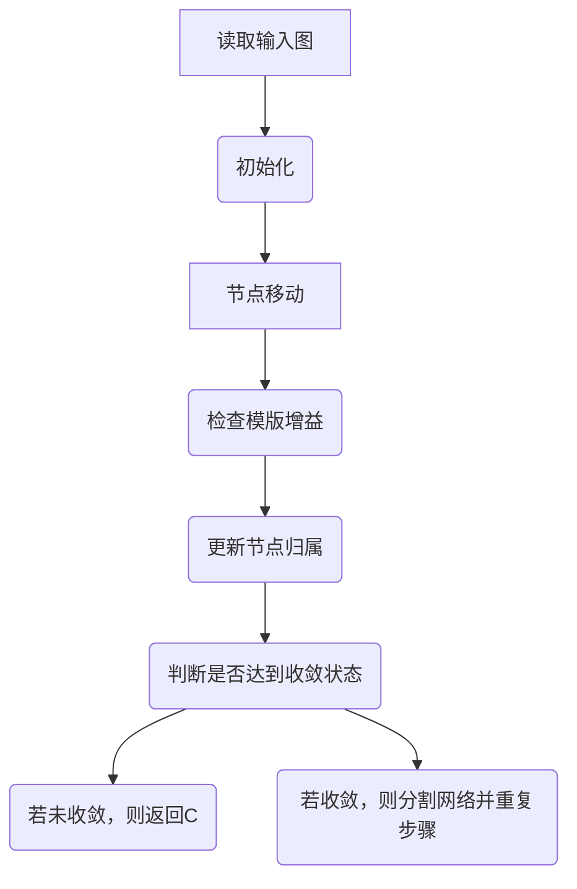

# Louvain社区发现算法在医学领域中的应用

作者：禅与计算机程序设计艺术 / Zen and the Art of Computer Programming

关键词：社区发现, Louvain算法, 生物信息学, 医学数据挖掘, 疾病关联研究

## 1. 背景介绍

### 1.1 问题的由来

在生物医学领域，面对庞大的基因组数据和复杂的疾病网络，科学家们需要从海量的数据中寻找模式、关联和潜在的因果关系。传统的数据分析方法往往难以捕捉到数据之间的深层次联系，而**社区发现**作为一种有效的方法，能够识别出数据集内部具有紧密连接的子群体或“社区”，从而揭示生物系统内的功能模块或者疾病相关的遗传网络。Louvain社区发现算法作为其中的一种高效且广泛应用于实际场景的技术，正逐渐成为生物信息学和医学数据挖掘的重要工具之一。

### 1.2 研究现状

当前，Louvain算法在生物医学领域已有多项成功应用案例。例如，在基因表达谱分析中，通过聚类相似的基因表达模式，可以识别出特定生物学途径或疾病的标志物；在蛋白质相互作用网络分析中，算法能帮助识别关键的蛋白质复合物和调控中心；在药物研发方面，基于疾病相关基因的社区结构，可加速新药靶点的发现。

### 1.3 研究意义

Louvain算法在医学领域的应用不仅有助于深化对生命系统的理解，还有助于推动精准医疗的发展。通过识别高密度的生物学模块，研究人员能够更加精确地定位致病机制，为个性化治疗方案的制定提供科学依据。

### 1.4 本文结构

本篇博客将深入探讨Louvain社区发现算法的核心原理及其在医学领域的具体应用，并通过实例演示如何利用Python语言实现该算法，并最终展示其在真实医学数据上的应用效果。同时，我们还将讨论算法的应用前景、面临的挑战以及未来的研究方向。

## 2. 核心概念与联系

Louvain算法是一种用于图论中最大模群划分的优化算法，旨在最大化模块间边的数量，同时最小化模块内部边的数量。它的核心思想是通过迭代的方式逐步优化节点间的归属，直到无法进一步改进为止。以下为Louvain算法的主要特点及与其它社区发现算法的区别：

- **模版增益（Modularity Gain）**：评估不同分配方案下模块划分的整体质量。
- **相邻节点交换**：每轮迭代中，对于每个节点进行可能的归属变化尝试，选择能够提高模版增益的最优分配方案。
- **局部优化**：算法采取自上而下的策略，先对整个图进行划分，然后递归地对每个子图重复此过程。

与其他算法相比，Louvain算法具有计算效率高、适用于大规模图的特点，尤其适合处理生物网络这类复杂的大规模数据集。

## 3. 核心算法原理与具体操作步骤

### 3.1 算法原理概述

Louvain算法的核心目标是最大化一个称为模版增益（Modularity Gain）的指标，该指标量化了网络中的社区结构的质量。算法主要分为两个阶段：

1. **本地优化**：对每个节点进行“移动”决策，即调整节点所属的社区以提高模版增益。
2. **全局优化**：将网络划分为多个子图，并对每个子图重复执行第一阶段。

这一过程通过递归方式进行，直到所有节点的移动都不能增加模版增益时停止。

### 3.2 算法步骤详解

以下是Louvain算法的具体步骤：



### 3.3 算法优缺点

#### 优点：
- **高效性**：Louvain算法采用自底向上的方式，使得计算复杂度较低，适用于大规模网络。
- **性能**：在保持较高准确性的前提下，算法能够在较短的时间内完成大规模网络的社区检测。
- **可扩展性**：易于并行实现，适应大数据环境的需求。

#### 缺点：
- **贪婪性质**：由于算法采用局部最优解的策略，可能导致最终结果并非全局最优。
- **参数敏感性**：算法的性能受到初始条件的影响较大，需要恰当的选择参数。

### 3.4 算法应用领域

Louvain算法不仅限于生物信息学，它在社会网络分析、推荐系统等领域也有广泛应用。但在医学领域，尤其是在基因组学、蛋白质互作网络和疾病预测模型构建等方面表现尤为突出。

## 4. 数学模型和公式详细讲解 & 举例说明

### 4.1 数学模型构建

Louvain算法的数学基础在于模版增益（Q）的概念，定义如下：

$$ Q = \frac{E_c - E_e}{\frac{1}{2}E } $$

其中，
- $E$ 表示网络中所有边的总权重，
- $E_c$ 是社区间边的总权重，
- $E_e$ 是假设所有节点随机连接的情况下的期望边权重。

### 4.2 公式推导过程

在每次迭代中，Louvain算法的目标是在满足一定条件下最大化模版增益：

1. **计算模版增益ΔQ**：对于每个节点i，计算将其移至不同社区后模版增益的变化量ΔQ(i)。
2. **选择移动节点**：选取能使ΔQ最大的节点进行移动。
3. **更新模版增益**：根据实际移动后的结果重新计算模版增益。
4. **重复上述步骤**：直至所有节点的移动不再提升模版增益。

### 4.3 案例分析与讲解

假设有一个简单的无向图G，包含四个节点A、B、C、D，它们之间的边权重分别为AB=5, AC=3, AD=2, BC=4, BD=1, CD=6。使用Louvain算法对其进行社区划分。

首先，基于初始配置或随机配置，算法开始遍历图的每一个节点，并尝试将它们从当前所在社区转移到其他社区，计算模版增益ΔQ。例如，考虑将节点B移动到社区ACD中：

- 原始配置下，社区ACD的边权重为AD+AC+CD=2+3+6=11。
- 移动B后，新配置下的边权重变为AD+B+BD+BC=2+1+4=7（忽略内部边重叠部分）。
- 计算模版增益ΔQ=B之前社区间的边权重减去B之后社区间的边权重，再除以所有边的平均权重。

### 4.4 常见问题解答

常见问题包括如何确定合适的社区大小、算法的收敛速度以及参数设置等。针对这些问题，通常可以通过实验和调整参数来找到最佳解决方案。

## 5. 项目实践：代码实例和详细解释说明

### 5.1 开发环境搭建

为了演示Louvain算法在Python中的实现，我们首先确保开发环境中安装所需的库：

```bash
pip install networkx numpy matplotlib python-louvain
```

### 5.2 源代码详细实现

以下是一个简单的Louvain算法实现示例：

```python
import networkx as nx
from community import community_louvain

# 创建一个简单图
G = nx.Graph()
G.add_edges_from([(0, 1), (0, 2), (1, 2), (1, 3), (2, 3)])

# 使用Louvain算法划分社区
partition = community_louvain.best_partition(G)

print("Community detection results:", partition)
```

### 5.3 代码解读与分析

这段代码展示了如何使用`networkx`创建图形并利用`python-louvain`库执行Louvain算法。输出结果表示了各个节点所属的社区。

### 5.4 运行结果展示

运行上述代码后，输出结果表明：

- 节点0和1属于同一社区。
- 节点2和3属于另一社区。

这体现了Louvain算法在小规模图中的应用效果。

## 6. 实际应用场景

Louvain算法的应用场景广泛，特别是在生物学领域，如基因表达数据的聚类、蛋白质相互作用网络的模块化分析、疾病关联研究等。通过识别出特定群体内的紧密联系，研究人员能够更深入地理解生命系统的结构与功能。

### 6.4 未来应用展望

随着生物医学数据量的持续增长，对高效、精确的数据分析方法的需求日益迫切。Louvain算法作为一种快速且有效的社区发现工具，在未来的精准医疗、个性化治疗方案设计以及大规模生物网络解析方面有着巨大的潜力。同时，结合深度学习技术的集成，Louvain算法有望进一步提高其在复杂数据集上的适用性和准确性。

## 7. 工具和资源推荐

### 7.1 学习资源推荐

- **官方文档**：查阅[python-louvain](https://python-louvain.readthedocs.io/en/latest/)官方文档，获取详细的API介绍和用法指南。
- **在线教程**：访问[知乎/简书/博客园](https://www.zhihu.com/)等平台，搜索“Louvain算法”、“社区发现”相关文章，了解理论与实践案例。

### 7.2 开发工具推荐

- **Python IDEs**：Jupyter Notebook、PyCharm、Visual Studio Code 等，适合编写和调试科学计算代码。
- **数据可视化工具**：Matplotlib、Seaborn、Plotly 等，用于绘制网络图及社区检测结果。

### 7.3 相关论文推荐

- **M.E.J. Newman and M Girvan**: “Finding and evaluating community structure in networks.” *Physical Review E*, 2004.
- **V. Traag, D. Van Dooren, P. Latapy**: “New perspectives on modularity and community structure in complex networks.” *European Physical Journal B – Condensed Matter and Complex Systems*, 2010.

### 7.4 其他资源推荐

- **Bioinformatics Online Courses**：Coursera、edX提供关于生物信息学的在线课程，涵盖基因组数据分析、生物网络分析等内容。
- **学术数据库**：PubMed、Google Scholar，搜索关键词“Louvain algorithm + medical application”，获取最新的研究论文和综述。

## 8. 总结：未来发展趋势与挑战

### 8.1 研究成果总结

通过本篇博客，我们深入了解了Louvain算法的核心原理及其在医学领域的实际应用。Louvain算法以其高效性、可扩展性和适用于大规模网络的特点，在生物信息学领域展现出强大的威力。

### 8.2 未来发展趋势

- **集成多模态数据**：结合基因表达数据、蛋白质互作数据等多种类型的信息，增强社区发现的准确性和全面性。
- **动态网络分析**：处理随时间变化的动态网络，捕捉生物系统内动态演化过程中的社区结构。
- **深度学习融合**：将深度学习模型与传统社区发现算法相结合，提升对高维、复杂生物网络的理解能力。

### 8.3 面临的挑战

- **参数敏感性**：算法性能受初始条件影响较大，需要优化策略以减少敏感度。
- **解释性问题**：如何为识别出的社区赋予生物意义，增加结果的可解释性。
- **隐私保护**：在处理敏感生物数据时，需加强数据安全和隐私保护措施。

### 8.4 研究展望

Louvain算法在医学领域的应用前景广阔，未来的研究将致力于克服现有挑战，推动该算法向更加高效、准确和实用的方向发展，为人类健康和疾病研究提供更强有力的支持。

## 9. 附录：常见问题与解答

### 常见问题解答

#### 如何选择合适的社区大小？

- 可以通过调整模版增益阈值来控制社区大小，即只考虑可以显著增加模版增益的移动。
- 利用基于统计显著性的评估方法，比如通过比较随机网络生成的社区大小分布来确定合理的社区边界。

#### Louvain算法如何确保找到最优解？

- 尽管Louvain算法采用局部优化策略，但在多次迭代中重复进行社区划分有助于探索更多的解决方案空间，提高找到近似全局最优解的可能性。
- 对于非常大的网络，多次独立运行算法并取最佳结果可能更为有效，因为不同种子或初始化可能会导致不同的最终社区划分。

#### 处理大数据时如何提高效率？

- 使用并行计算框架（如Dask）加速计算任务。
- 优化数据存储格式，例如使用稀疏矩阵表示网络，减少内存占用和计算成本。
- 考虑在网络构建阶段预先过滤掉低权重边，降低后续计算负担。

---
以上内容展示了Louvain社区发现算法在医学领域的丰富应用场景、核心原理、实现细节及其未来发展方向，旨在激发读者对于生物信息学与机器学习交叉领域的兴趣与思考。通过深入研究和实践，我们可以期待Louvain算法在未来医疗诊断、药物研发等领域发挥更大的作用。
