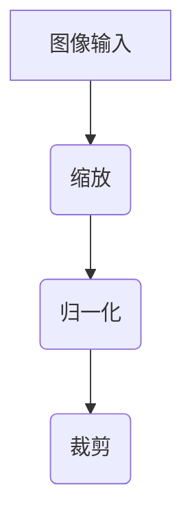
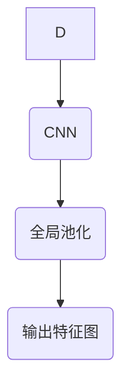
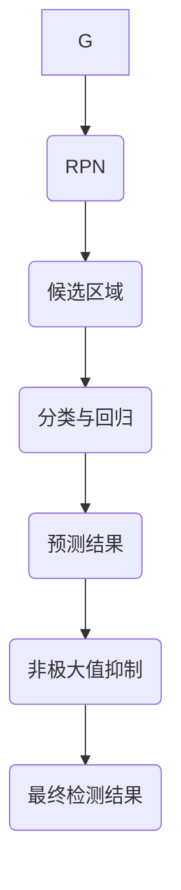

# Object Detection原理与代码实例讲解

作者：禅与计算机程序设计艺术 / Zen and the Art of Computer Programming

关键词：对象检测,目标识别,深度学习,卷积神经网络,语义分割,实时应用

## 1. 背景介绍

### 1.1 问题的由来

随着计算机视觉在智能监控、自动驾驶、机器人导航、安防系统等领域的需求日益增长，对象检测作为这些应用的核心功能之一变得尤为重要。传统的目标检测方法依赖于特征提取和匹配等繁琐步骤，而近年来深度学习的兴起使得对象检测技术迎来了革命性的变革。特别是基于卷积神经网络(CNNs)的对象检测方法，不仅提高了检测精度，还大幅提升了处理速度，适应了大规模实时场景的应用需求。

### 1.2 研究现状

当前，基于深度学习的对象检测主要分为两类：单阶段检测器（如YOLO系列）和两阶段检测器（如R-CNN及其变种）。单阶段检测器直接在全图上进行预测，速度快但可能错过细节或准确度较低；两阶段检测器先生成候选区域再进行分类和回归，准确性较高但计算成本更大。

### 1.3 研究意义

研究对象检测的意义在于推动计算机视觉技术的发展，解决实际世界中复杂多变的目标识别问题。它不仅能够提升安全性、效率和智能化水平，还能促进相关行业的创新，例如增强现实、无人机巡检、工业自动化等。

### 1.4 本文结构

本篇文章将深入探讨对象检测的基本原理，并通过详细的代码实例指导读者如何实现自己的对象检测系统。我们首先会介绍对象检测的核心概念及算法流程，然后详细介绍关键步骤的数学模型和实际操作，最后通过一个完整的代码示例，展示从开发环境搭建到运行结果展示的全过程。

## 2. 核心概念与联系

### 2.1 对象检测基础概念

- **目标**：图像中的可识别物体。
- **检测框**：用于定位目标位置的矩形边界框。
- **置信度分数**：表示检测框对应目标的可信程度。
- **类别标签**：指明目标属于特定类别的标识符。

### 2.2 主流检测算法框架

- **Region Proposal Networks (RPN)**：自动生成候选区域，减少后续步骤的计算量。
- **Fast R-CNN**：改进RPN，加速训练和推理过程。
- **Faster R-CNN**：引入RoI Pooling层，进一步提高检测速度。
- **Mask R-CNN**：扩展为掩码网络，同时进行目标检测和语义分割。

### 2.3 检测算法之间的联系

主流检测算法之间存在紧密的联系，它们不断优化关键组件以提升性能。例如，Fast R-CNN通过引入快速决策路径显著减少了训练时间，而Faster R-CNN则在此基础上加入了RoI Pooling层，增强了检测速度和精度。Mask R-CNN则在Faster R-CNN的基础上增加了对目标掩码的预测能力，实现了更精细的分割效果。

## 3. 核心算法原理 & 具体操作步骤

### 3.1 算法原理概述

对象检测通常涉及以下核心步骤：

1. **输入预处理**：包括缩放、归一化、裁剪等操作，确保输入数据符合模型的要求。
2. **特征提取**：使用CNN获取包含丰富上下文信息的特征图。
3. **候选区域生成**：对于单阶段算法，此步骤是基于全图进行；对于两阶段算法，则通过RPN生成候选区域。
4. **区域分类与回归**：对每个候选区域进行分类预测其属于哪个类别，并调整边界框的位置。
5. **后处理**：包括非极大值抑制(NMS)等步骤，去除冗余检测结果并保留最佳预测。

### 3.2 算法步骤详解

#### 1. 输入预处理



#### 2. 特征提取



#### 3. 候选区域生成与分类



### 3.3 算法优缺点

优点：
- **高精度**：利用端到端学习，可以达到很高的检测准确率。
- **实时性**：优化后的算法能够在较短的时间内完成检测任务。
- **灵活性**：支持多种类型的检测任务，如目标检测、语义分割等。

缺点：
- **计算资源消耗大**：复杂的模型需要大量的计算资源。
- **过拟合风险**：模型在泛化能力上可能存在挑战。

### 3.4 算法应用领域

对象检测广泛应用于自动驾驶、安防监控、机器人导航、医疗影像分析等领域，提供关键的智能决策依据。

## 4. 数学模型和公式 & 详细讲解 & 举例说明

### 4.1 数学模型构建

假设一个简单的对象检测任务，其中：

- $f(x)$ 表示输入图像经过CNN后的特征图。
- $\mathbf{r}$ 是候选区域集合，每个元素$\mathbf{r}_i$是一个矩形坐标$(x_1, y_1, x_2, y_2)$。
- $\mathcal{C}(\cdot)$ 是分类函数，$\mathcal{B}(\cdot)$ 是回归函数。

针对每个候选区域$\mathbf{r}_i$，有：

$$ \text{Score} = \mathcal{C}(f(x)) \quad \text{and} \quad \Delta\mathbf{b} = \mathcal{B}(f(x), \mathbf{r}_i) $$

其中，$\text{Score}$代表目标存在的概率，$\Delta\mathbf{b}$用于调整候选区域的位置和尺寸。

### 4.2 公式推导过程

以Faster R-CNN为例，其目标是在候选区域内进行分类和回归。关键公式包括：

- 分类损失（Cross Entropy Loss）：
  $$ L_{cls} = -\sum_{i=1}^{N}\left[y_i \log(p_i) + (1-y_i)\log(1-p_i)\right] $$

- 回归损失（Smooth L1 Loss）：
  $$ L_{reg} = \begin{cases}
    0.5 \times (\delta_{ij})^2, & |\delta_{ij}| < 1 \\
    |(\delta_{ij})| - 0.5, & \text{otherwise}
  \end{cases} $$

其中，$y_i$表示标签，$p_i$为预测的概率，$\delta_{ij}$表示真实位置与预测位置之差。

### 4.3 案例分析与讲解

以YOLOv5为例进行案例分析：

1. **初始化**：加载预训练的YOLOv5模型，根据实际需求选择适当大小的模型（YOLOv5s、YOLOv5m、YOLOv5l或YOLOv5x）。
2. **加载数据集**：准备包含标注对象的图片集和对应的标签文件。
3. **前向传播**：将图像输入到模型中，获取每张图片上的预测框及其置信度分数。
4. **后处理**：使用NMS去除重叠度高的预测框，保留最高置信度的预测作为最终结果。

### 4.4 常见问题解答

常见问题包括但不限于网络训练时间长、模型性能不稳定等。解决这些问题通常涉及优化训练策略、增加正则化项、使用更高效的数据增强技术等方法。

## 5. 项目实践：代码实例和详细解释说明

### 5.1 开发环境搭建

首先确保安装了Python及必要的库，比如`PyTorch`、`torchvision`、`matplotlib`等。可以使用以下命令安装：

```bash
pip install torch torchvision matplotlib
```

### 5.2 源代码详细实现

以下是一个使用YOLOv5框架的基本代码示例：

```python
import torch
from models.experimental import attempt_load
from utils.datasets import LoadImagesAndLabels
from utils.general import non_max_suppression, scale_coords

# 加载预训练模型
model_path = 'path/to/your/model.pt'
device = torch.device('cuda' if torch.cuda.is_available() else 'cpu')
model = attempt_load(model_path, map_location=device)

# 准备测试图像路径列表
img_paths = ['path/to/image1.jpg', 'path/to/image2.jpg']

# 遍历图像路径并检测
for img_path in img_paths:
    # 加载图像
    dataset = LoadImagesAndLabels([img_path], img_size=(640, 640))

    for _, batch, im0s, _ in dataset:
        im0s = [im0s]

        # 将图像输入到模型
        pred = model(im0s)
        pred = non_max_suppression(pred)[0]

        # 调整边界框坐标至原始图像比例
        pred[:, :4] = scale_coords(im.shape[2:], pred[:, :4], im0s[0].shape).round()

        # 绘制检测框和类别标签
        for *xyxy, conf, cls in reversed(pred):
            label = f'{dataset.classes[int(cls)]} {conf:.2f}'
            plot_one_box(xyxy, im0s[0], label=label, color=colors(int(cls)), line_thickness=3)

        # 显示或保存结果图像
        cv2.imshow('result', im0s[0])
        cv2.waitKey(0)
```

### 5.3 代码解读与分析

此代码段展示了如何利用YOLOv5进行对象检测，包括加载模型、处理图像、执行推理以及绘制结果。关键步骤如下：

1. **模型加载**：通过`attempt_load`函数加载预训练的YOLOv5模型。
2. **数据加载**：使用`LoadImagesAndLabels`加载图像，并对其进行预处理。
3. **推理**：将图像输入到模型中，执行对象检测。
4. **结果处理**：调整预测框坐标、应用非极大值抑制等操作，提高检测准确性和效率。
5. **可视化**：在图像上绘制检测框、显示类别标签，提供直观的结果展示。

### 5.4 运行结果展示

运行上述代码后，您将在终端窗口中看到带有检测框和标记的图像输出。这不仅有助于验证模型的有效性，还能对不同场景下的检测效果进行初步评估。

## 6. 实际应用场景

对象检测的应用范围广泛，包括但不限于：

- 自动驾驶中的障碍物检测和道路识别。
- 安防监控系统中的入侵检测和目标追踪。
- 医疗影像分析中的病灶识别。
- 工业自动化中的物料分拣和质量检查。

## 7. 工具和资源推荐

### 7.1 学习资源推荐

- **官方文档**: 查找特定深度学习框架如TensorFlow、PyTorch的官方文档，了解对象检测模型的构建和训练细节。
- **在线教程**: Coursera、Udacity等平台提供了关于计算机视觉和深度学习的专业课程。
- **博客与文章**: 博客园、知乎等社区有大量关于深度学习和对象检测的实战经验分享。

### 7.2 开发工具推荐

- **集成开发环境 (IDE)**: 如PyCharm、VSCode，这些工具支持Python编程且拥有强大的调试和代码管理功能。
- **版本控制系统**: Git用于管理和协作开发过程中的代码变更。

### 7.3 相关论文推荐

- **YOLO系列**：阅读YOLO v1、v2、v3、v4和v5等论文，理解其算法改进和创新点。
- **Mask R-CNN**：深入研究该论文以了解融合语义分割的对象检测方法。

### 7.4 其他资源推荐

- **GitHub仓库**: 寻找开源对象检测项目和相关代码库。
- **论坛与社区**: 访问Reddit、Stack Overflow等讨论区获取更多实用建议和技术指导。

## 8. 总结：未来发展趋势与挑战

### 8.1 研究成果总结

通过对对象检测理论与实践的探讨，我们深入了解了从基础概念到实际应用的全过程。本文详细介绍了核心算法原理、数学模型构建、代码实例实现以及一系列相关资源推荐，旨在帮助读者构建自己的对象检测系统。

### 8.2 未来发展趋势

随着技术的进步和数据集的不断丰富，对象检测技术将继续发展，预期方向可能包括更高效实时的模型、跨模态融合的检测能力、更加鲁棒的弱监督学习方法、可解释性的增强以及适应复杂多变环境的能力提升。

### 8.3 面临的挑战

对象检测仍然面临一些挑战，例如在小样本、变化光照条件、遮挡情况下保持高精度，以及在低分辨率下准确检测物体。此外，隐私保护、伦理道德考量也是不可忽视的重要议题。

### 8.4 研究展望

未来的研究工作应聚焦于解决现有挑战，探索新算法和架构，推动对象检测技术在实际应用中的普及和发展。同时，加强跨领域合作，促进与其他AI技术（如自然语言处理、强化学习）的结合，将进一步拓展对象检测的应用边界和潜力。
