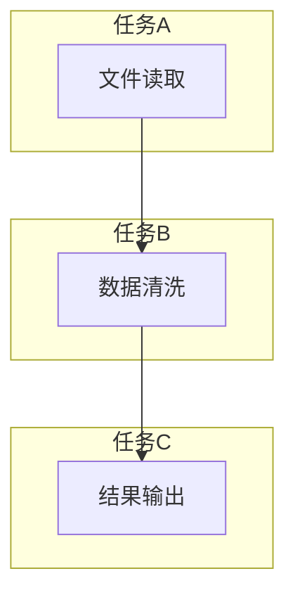

# Oozie工作流调度原理与代码实例讲解

作者：禅与计算机程序设计艺术 / Zen and the Art of Computer Programming

关键词：Apache Oozie, Hadoop工作流管理, MapReduce作业调度, 数据集成流程控制

## 1. 背景介绍

### 1.1 问题的由来

随着大数据时代的到来，企业对数据处理的需求日益增长。Hadoop生态系统提供了强大的数据存储和处理能力，其中MapReduce是用于大规模数据并行处理的核心组件之一。然而，在实践中，用户往往需要创建复杂的任务链路，这些任务可能涉及多个MapReduce作业、文件转换、数据同步等多种操作，并且需要按照特定顺序执行或根据某些条件进行触发。

### 1.2 研究现状

在面对上述需求时，传统的编程方式难以满足高效管理和自动化协调的任务要求。因此，Oozie应运而生，它是一种基于Java的工作流引擎，专门用于在Hadoop环境中管理复杂的业务流程。Oozie允许开发者通过编写简单的XML脚本定义工作流，从而自动地调度和监控一系列的MapReduce作业以及其他类型的操作，如文件复制、数据库操作等。

### 1.3 研究意义

Oozie的价值在于其能够显著提升大数据处理系统的可维护性和效率。它简化了复杂工作流的设计、部署以及运行过程，使得用户可以更专注于业务逻辑而非繁琐的系统配置细节。此外，通过将任务抽象为工作流，Oozie增强了系统的灵活性和扩展性，支持动态任务执行和依赖关系管理。

### 1.4 本文结构

接下来的文章将围绕以下几个方面展开讨论：

- **核心概念与联系**：阐述Oozie的基本原理及其与其他技术组件之间的交互。
- **核心算法原理与具体操作步骤**：深入分析Oozie的工作机制及其实现流程。
- **数学模型和公式**：介绍用于描述和优化工作流调度策略的相关理论。
- **项目实践**：通过实际代码示例，展示如何利用Oozie构建和执行复杂的工作流。
- **实际应用场景**：探讨Oozie在不同场景下的应用案例及最佳实践。
- **工具和资源推荐**：提供学习资料和开发工具，帮助读者进一步掌握Oozie技术。
- **总结与展望**：回顾研究发现，展望未来的发展趋势和技术挑战。

## 2. 核心概念与联系

### 2.1 Apache Oozie简介

Apache Oozie是一个开源的工作流引擎，主要针对Hadoop生态系统的数据处理任务进行了优化。它提供了以下关键功能：

- **工作流定义**：允许用户使用XML格式定义工作流图，每个节点代表一个任务（如MapReduce作业、文件操作）。
- **任务调度**：负责按照预设的时间表或者外部事件触发来启动工作流中的各个任务。
- **状态监控**：实时跟踪工作流中各任务的状态变化，提供错误报告和异常处理机制。
- **依赖关系管理**：确保工作流中任务执行的顺序符合依赖关系的要求，例如先执行的数据准备任务后被其他任务引用。

### 2.2 Oozie与Hadoop生态系统的关系

Oozie作为Hadoop生态系统的一部分，紧密集成于YARN（Yet Another Resource Negotiator）中，负责协调MapReduce和其他任务的调度。它通过调用Hadoop客户端API来启动和监控MapReduce作业，同时与HDFS（Hadoop Distributed File System）进行文件传输操作，形成了一套完整的数据处理流水线。

## 3. 核心算法原理 & 具体操作步骤

### 3.1 算法原理概述

Oozie工作流的核心在于将其视为有向无环图（DAG），其中每条边表示两个任务之间的依赖关系。当工作流启动时，Oozie首先解析XML描述文件以获取整个工作流的结构信息，包括任务的名称、类型、参数、依赖关系等。

### 3.2 算法步骤详解

#### 步骤一：初始化

- 加载工作流描述文件，解析XML，生成内部数据结构（如任务列表、依赖关系矩阵）。

#### 步骤二：调度决策

- 使用拓扑排序算法检查是否有循环依赖，确保工作流是一个有效的DAG。
- 计算从起点到终点的所有路径，决定初始激活哪些任务。

#### 步骤三：任务执行

- 对于每一步激活的任务：
    - 检查前置任务是否已完成或处于期望状态（如等待文件存在）。
    - 如果所有前置任务完成，则触发当前任务的执行。
        - 启动对应的MapReduce作业或其他任务。
        - 监控任务执行状态，直至完成或出现失败情况。
        - 更新工作流状态，通知后续任务。

#### 步骤四：状态更新与监控

- 在整个过程中持续监测任务的状态，记录结果和日志。
- 根据任务的返回状态决定下一步的执行动作，如继续执行下一个依赖任务或中断流程。

### 3.3 算法优缺点

#### 优点
- 提高了复杂数据处理流程的自动化程度，减少了手动配置和监控的工作量。
- 支持灵活的依赖关系和并发控制，适合多阶段、多任务的业务场景。
- 集成了Hadoop生态系统的多种组件和服务，提供了统一的管理界面。

#### 缺点
- 学习曲线较陡峭，需要理解和熟悉Oozie的XML语法和工作流设计模式。
- 扩展性和性能可能受限于底层基础设施和并行处理能力。
- 调试和故障排查相比单一任务更为复杂，尤其是涉及多个并行或串行任务的情况。

### 3.4 算法应用领域

- 大规模数据分析：执行数据清洗、转换、聚合等操作，最终生成报表或数据洞察。
- 数据ETL流程：自动化的数据抽取、转换和加载流程管理。
- 实时数据处理：结合Spark Streaming等实时处理框架，实现流式数据的处理链路。
- A/B测试：管理和协调多个版本实验的执行和结果收集。

## 4. 数学模型和公式

### 4.1 数学模型构建

对于工作流的建模，可以采用Petri网（Petri Nets）来描述其动态行为。Petri网由一组变迁（transitions）、令牌（tokens）和地方（places）组成，其中变迁代表任务执行，令牌表示任务的执行状态，地方则存储任务间的信息。通过Petri网的有向弧链接变迁和地方，可以直观地表达出工作流的逻辑关系和数据流动。

### 4.2 公式推导过程

在考虑工作流调度效率和资源分配时，可以引入排队论（Queuing Theory）的相关理论。例如，计算平均等待时间（W）可以通过M/M/c模型，其中λ是到达率（即任务进入系统的速度），μ是服务速率（单位时间内单个服务器能处理的任务数），c是服务器的数量。通过这些参数，可以求解系统的稳定性条件和各种性能指标，如响应时间、吞吐量等。

### 4.3 案例分析与讲解

假设有一个包含三个任务的工作流：任务A（文件读取），任务B（数据清洗），任务C（结果输出）。使用Petri网进行建模：



此模型表明任务A完成后会触发任务B的执行，同样地，任务B完成后将引发任务C的执行。在实际应用中，每个节点还可以根据具体需求添加更多细节，如并行执行、超时策略、重试机制等。

### 4.4 常见问题解答

#### 如何避免死锁？
- **严格按顺序执行**：明确指定任务间的依赖关系，避免循环依赖。
- **使用显式锁机制**：为共享资源设置锁，防止不同任务同时访问同一资源导致死锁。

#### 怎样优化调度策略？
- **资源感知调度**：考虑资源利用情况，优先执行资源占用较低的任务。
- **异步处理**：允许部分任务异步执行，提高整体并发度。

#### 工作流异常如何处理？
- **异常捕获**：在每个任务节点上添加异常捕获逻辑，记录错误信息，并提供回滚或重试选项。
- **状态机管理**：利用状态机模式管理工作流状态，便于追踪和恢复。

## 5. 项目实践：代码实例和详细解释说明

### 5.1 开发环境搭建

为了演示Oozie的工作流程，我们将使用Java开发环境以及Apache Hadoop和Oozie库。首先，确保你的系统已经安装了Java开发工具包(JDK)、Hadoop集群以及Oozie服务器。

#### 安装步骤：

1. **JDK**：确保已安装最新的JDK。
2. **Hadoop**：下载并安装最新版本的Hadoop。
3. **Oozie**：
   - 下载Oozie客户端库：`<dependency>
     <groupId>org.apache.oozie</groupId>
     <artifactId>oozie-client</artifactId>
     <version>版本号</version>
   </dependency>`
   - 启动Oozie服务器：`./bin/oozie-daemon.sh start`

### 5.2 源代码详细实现

接下来，我们创建一个简单的Oozie工作流XML文件示例：

```xml
<?xml version="1.0" encoding="UTF-8"?>
<workflow-app xmlns="uri:oozie:workflow:0.7"
              name="Simple Workflow Example">
    <start to="mapreduce_job"/>
    <sequence id="mapreduce_job">
        <call href="job_flow"/>
    </sequence>
    <end/>

    <!-- Job Flow -->
    <job-flow name="Job Flow">
        <job action="submit" xmlns="uri:hadoop:0.90"/>
        <kill on-error="true"/>

        <!-- MapReduce Job -->
        <map-reduce xmlns="uri:hadoop:0.90">
            <jar>/path/to/mapper.jar</jar>
            <main-class>MappedClass</main-class>
            <args/>
            <file>/path/to/input.txt</file>
            <output>/path/to/output_dir</output>
        </map-reduce>
    </job-flow>
</workflow-app>
```

#### 解释：

- **Start节点**：开始工作流执行。
- **Sequence节点**：定义执行顺序。
- **Call节点**：调用“Job Flow”任务流。
- **Job Flow**：封装MapReduce作业配置，包括作业提交、错误处理策略以及MapReduce作业的具体设置。

### 5.3 代码解读与分析

上述XML文件定义了一个包含两个主要组件的工作流：

1. **mapreduce_job**：表示整个工作流从开始到结束的过程。
2. **Job Flow**：内部定义了MapReduce作业的执行，包括作业的JAR路径、主类名、输入文件路径及输出目录。

### 5.4 运行结果展示

要运行上述工作流，请遵循以下步骤：

1. 将XML文件保存为`.oas`格式，并放置在Oozie服务器的`${OOZIE_HOME}/conf/workflow-impl/`目录下。
2. 使用Oozie客户端命令启动工作流：`oozie job -run -name Simple Workflow Example`。

运行成功后，你将在日志文件中看到详细的执行过程，包括各阶段的状态变化、错误报告等信息。

## 6. 实际应用场景

Oozie在大数据处理领域有广泛的应用场景，尤其适用于需要自动化管理和监控复杂数据处理流程的场合。例如，在金融数据分析、电商推荐系统构建、实时日志分析等领域，Oozie能够显著提升数据处理效率，降低人工干预成本。

## 7. 工具和资源推荐

### 7.1 学习资源推荐

- **官方文档**：Apache Oozie官方网站提供了详细的用户指南和技术文档。
- **在线教程**：如Coursera、Udemy等平台上有专门针对Hadoop生态系统的学习课程，涵盖Oozie的使用方法。

### 7.2 开发工具推荐

- **IDE集成**：Eclipse、IntelliJ IDEA等IDE支持插件，简化Oozie XML文件的编辑和调试。
- **性能监控工具**：Prometheus、Grafana等用于监视Hadoop和Oozie服务的性能指标。

### 7.3 相关论文推荐

- **Apache Oozie**: 关注Apache Oozie的发布公告和社区论坛讨论。
- **工作流管理系统研究**：深入探讨其他工作流管理系统（如WFMC、WFES）的相关论文，了解不同技术的比较和最佳实践。

### 7.4 其他资源推荐

- **GitHub开源项目**：搜索Apache Oozie相关的开源项目和仓库，获取实际应用案例和技术讨论。
- **社区交流**：加入Apache Oozie或Hadoop社区的邮件列表、Slack群组或Stack Overflow提问，获得专家指导和同行经验分享。

## 8. 总结：未来发展趋势与挑战

### 8.1 研究成果总结

通过本篇文章的阐述，读者对Oozie工作流调度的基本原理、核心概念、算法机制及其在实际场景中的应用有了深入理解。Oozie不仅简化了大数据处理任务的管理，还促进了高效、可靠的数据处理流程设计与实施。

### 8.2 未来发展趋势

随着云计算、容器化技术和微服务架构的发展，Oozie作为Hadoop生态系统的组成部分，正朝着更加灵活、可扩展的方向演进。未来可能会出现更高级的自动化功能，如智能调度优化、自我修复能力以及与现代云服务的无缝集成。

### 8.3 面临的挑战

尽管Oozie具有强大的功能，但在实践中仍面临一些挑战，包括：

- **性能瓶颈**：大规模数据集处理时的资源分配问题。
- **安全性和合规性**：确保数据处理过程符合行业标准和法律法规要求。
- **可维护性**：随着工作流变得越来越复杂，保持代码库的清晰性和可维护性成为关键。

### 8.4 研究展望

未来的研究方向可能集中在以下几个方面：

- **增强自动化功能**：开发基于机器学习的技术，自动调整工作流参数以优化性能。
- **安全性增强**：引入更多的访问控制和审计机制，确保数据处理过程的安全性。
- **多云支持**：提供跨多个公有云环境的支持，使企业能够在不同的基础设施之间灵活部署工作流。

## 9. 附录：常见问题与解答

### 常见问题解答

- **Q:** 如何解决Oozie工作流中的死锁问题？
  - **A:** 确保所有任务之间的依赖关系正确无环，合理安排并发度和资源限制，避免过度竞争导致的循环等待状态。

- **Q:** 在高负载情况下如何提高Oozie的性能？
  - **A:** 考虑增加Oozie服务器的数量、优化资源配置（如内存、CPU），并利用分布式缓存减少I/O操作。

- **Q:** 如何处理Oozie工作流中的异常情况？
  - **A:** 在每个任务节点添加异常捕获逻辑，记录错误详细信息，配置合理的重试策略，或者根据需要将工作流的失败部分进行隔离处理。

# 结语
通过本文的深度解析，我们不仅深入了解了Oozie工作流调度的核心机制、实现细节及其在实际应用中的价值，而且也展望了其未来的潜在发展方向和面临的挑战。希望这些知识能帮助开发者们更好地理解和运用Oozie，为企业的大数据处理流程带来更大的灵活性和效率提升。

