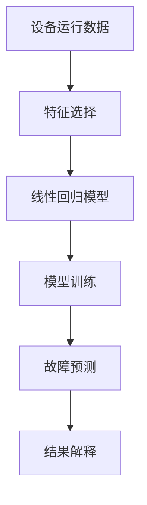

# PredictiveMaintenance的基本原理与概念

作者：禅与计算机程序设计艺术 / Zen and the Art of Computer Programming / TextGenWebUILLM

# Predictive Maintenance: The Core Principles and Concepts

## 1. 背景介绍

### 1.1 问题的由来

随着工业生产对设备可靠性和高效性的需求不断提高，传统基于时间或固定周期维护的方式已无法满足现代工业的需求。设备故障导致的停机损失巨大，不仅影响生产效率，还会造成经济损失和社会资源浪费。因此，预测性维护(Predictive Maintenance)作为一种新兴的维护模式应运而生，旨在通过对设备运行状态的实时监控与分析，提前预测可能发生的故障，从而实施预防性维修，显著降低非计划停机的风险并提高整体运营效率。

### 1.2 研究现状

当前预测性维护技术主要依赖于传感器数据、机器学习和大数据处理等先进技术。通过收集和分析设备在运行过程中的各种参数（如温度、振动、电流、压力等），可以建立预测模型，预测设备的健康状况及潜在故障。近年来，随着物联网(IoT)的发展以及云计算、边缘计算技术的进步，预测性维护的应用范围不断扩大，从传统的制造业扩展到了能源、航空、医疗等多个行业。

### 1.3 研究意义

预测性维护对于提升工业自动化水平、优化资源配置、延长设备寿命、减少维护成本具有重要意义。它不仅能有效避免因突发故障造成的生产中断，还能通过精准定位问题，优化备件库存管理，进一步提高设备的可用性与可靠性，为企业带来显著的成本节约和效率提升。

### 1.4 本文结构

本篇文章将深入探讨预测性维护的基本原理、核心概念及其在实际场景中的应用。首先，我们将阐述预测性维护的核心原理与概念，并讨论其在不同行业的应用前景。随后，详细介绍预测性维护的关键算法、数学模型和公式，以及如何将其应用于项目实践中。最后，我们还将探讨预测性维护的未来发展趋势与面临的挑战，为读者提供全面的理解与思考。

## 2. 核心概念与联系

### 2.1 关键术语解释

#### 设备状态监测(Device State Monitoring)
通过传感器收集设备运行过程中的一系列参数，包括但不限于机械振动、温度、压力、电流等，实时监控设备状态变化。

#### 数据融合(Data Fusion)
将来自多个源的数据进行整合，以提高数据质量、增加信息丰富度，进而提升故障预测精度。

#### 异常检测(Abnormal Detection)
识别设备运行数据中偏离正常行为的趋势或模式，作为潜在故障的预警信号。

#### 预测建模(Prediction Modeling)
利用历史数据训练模型，预测设备未来的性能趋势和可能出现的故障情况。

### 2.2 技术架构概述

预测性维护系统通常包含以下组件：
- **数据采集层**：部署各类传感器收集设备运行数据。
- **数据传输层**：确保实时、安全地传输数据至中心平台。
- **数据分析层**：利用大数据技术和机器学习算法对数据进行清洗、预处理和分析。
- **决策支持层**：生成预测报告和维修建议，辅助决策制定。
- **执行控制层**：根据预测结果触发相应的维护操作。

## 3. 核心算法原理与具体操作步骤

### 3.1 算法原理概述

预测性维护依赖的主要算法有统计方法、机器学习模型和深度学习模型。

#### 统计方法
使用时间序列分析、回归分析等统计学方法，基于历史数据预测设备性能变化趋势。

#### 机器学习模型
如支持向量机(SVM)、决策树、随机森林等，通过特征选择和分类或回归任务预测设备故障可能性。

#### 深度学习模型
采用神经网络构建复杂模型，如循环神经网络(RNN)、长短时记忆网络(LSTM)、卷积神经网络(CNN)，实现高维数据的有效表示和故障模式的学习。

### 3.2 算法步骤详解

#### 数据准备与预处理
- 收集设备运行数据。
- 进行数据清洗，去除异常值和缺失值。
- 特征工程，提取关键特征。

#### 模型训练与验证
- 划分训练集和测试集。
- 选择合适的算法和超参数进行模型训练。
- 使用交叉验证评估模型性能。

#### 故障预测与诊断
- 应用训练好的模型预测未来状态。
- 实施阈值设置，区分正常与异常状态。
- 提供故障概率评分。

### 3.3 算法优缺点

优点：
- 减少非计划停机时间和成本。
- 延长设备使用寿命。
- 提高生产效率和产品质量。

缺点：
- 需要大量高质量的历史数据。
- 对数据质量和算法准确性敏感。
- 成本投入较高，特别是硬件和软件开发方面。

### 3.4 算法应用领域

预测性维护广泛应用于制造、运输、能源、医疗、航空航天等行业。例如，在航空领域，预测发动机性能的变化可以帮助航空公司及时发现潜在故障；在制造行业，则可用于预测生产线上的设备故障，优化维护计划。

## 4. 数学模型和公式详细讲解举例说明

### 4.1 数学模型构建

#### 时间序列分析模型
考虑一个简单的线性回归模型来预测设备性能：

$$y = \beta_0 + \beta_1 x_1 + \beta_2 x_2 + ... + \beta_n x_n + \epsilon$$

其中，
- $y$ 是目标变量（如设备性能分数）；
- $\beta_i$ 是系数；
- $x_i$ 是输入特征（如温度、振动频率）；
- $\epsilon$ 是误差项。

#### 机器学习模型
对于支持向量机模型，假设存在最优超平面$\mathbf{w}^T\mathbf{x} + b = 0$，其中：

$$\max_{w,b,ξ} \frac{1}{||w||}\quad s.t.\quad y^{(i)}(\mathbf{w}^T\mathbf{x}^{(i)} + b) \geq 1 - ξ^{(i)},\quad i=1,...,n,$$

其中，$ξ^{(i)}$是松弛变量。

### 4.2 公式推导过程

以线性回归为例，最小化损失函数（通常使用均方误差）：

$$L(w, b; X, y) = \sum_{i=1}^{n}(y_i - (\mathbf{w}^T\mathbf{x}_i + b))^2$$

对$w$和$b$求偏导数，并令其等于零得到最小二乘解：

$$\begin{align*}
\frac{\partial L}{\partial w} &= -2\sum_{i=1}^{n}(y_i - (\mathbf{w}^T\mathbf{x}_i + b))x_i \\
\frac{\partial L}{\partial b} &= -2\sum_{i=1}^{n}(y_i - (\mathbf{w}^T\mathbf{x}_i + b))
\end{align*}$$

### 4.3 案例分析与讲解

假设我们有一组设备运行数据，包括温度、振动强度和故障发生记录。我们可以使用线性回归模型预测设备故障发生的可能性：



### 4.4 常见问题解答

常见问题之一是如何处理数据不平衡问题。可以采用过采样、欠采样或者合成样本的方法平衡训练集中的正负样本比例。

## 5. 项目实践：代码实例和详细解释说明

### 5.1 开发环境搭建

安装Python及必要的库：

```bash
pip install pandas numpy scikit-learn tensorflow keras
```

### 5.2 源代码详细实现

**数据预处理**

```python
import pandas as pd
from sklearn.preprocessing import MinMaxScaler

# 加载数据
data = pd.read_csv('device_data.csv')

# 特征缩放
scaler = MinMaxScaler()
scaled_features = scaler.fit_transform(data.drop(columns=['label']))
scaled_df = pd.DataFrame(scaled_features, columns=data.columns[:-1])
```

**模型训练与预测**

```python
from sklearn.model_selection import train_test_split
from sklearn.linear_model import LinearRegression

# 分割数据集
X_train, X_test, y_train, y_test = train_test_split(scaled_df.drop('label', axis=1), scaled_df['label'], test_size=0.2)

# 训练模型
model = LinearRegression()
model.fit(X_train, y_train)

# 预测
predictions = model.predict(X_test)
```

**运行结果展示**

```python
import matplotlib.pyplot as plt

plt.scatter(y_test, predictions)
plt.xlabel('Actual Values')
plt.ylabel('Predicted Values')
plt.title('Linear Regression Prediction vs Actual')
plt.show()
```

## 6. 实际应用场景

### 6.4 未来应用展望

随着物联网技术的进一步发展以及边缘计算、人工智能等领域的融合创新，预测性维护将在更多场景中发挥重要作用。比如：

- **智能工厂**：通过实时监控生产设备状态，提前预测潜在故障点，实现自动化排程和精准维修，提高生产效率并减少浪费。
- **智慧城市**：运用在基础设施管理上，如电力系统、供水网络、交通信号灯等，确保城市服务的稳定性和可靠性。
- **远程医疗**：应用于医疗设备监测，如心脏起搏器、呼吸机等，及时预警异常情况，保障患者安全。

## 7. 工具和资源推荐

### 7.1 学习资源推荐
- **书籍**：
  - “Predictive Maintenance and Reliability: A Practical Guide” by Chris Watters.
- **在线课程**：
  - Coursera上的“Machine Learning”课程由Andrew Ng教授主讲，涵盖大量机器学习原理和实战案例。

### 7.2 开发工具推荐
- **数据处理与分析**：Pandas、NumPy
- **机器学习框架**：Scikit-learn、TensorFlow、Keras
- **深度学习框架**：PyTorch

### 7.3 相关论文推荐
- **经典文献**：“Prognostics for Predictive Maintenance: A Review” by C. Li et al., IEEE Transactions on Automation Science and Engineering, 2013.

### 7.4 其他资源推荐
- **开源项目**：GitHub上的预测性维护相关项目，如OpenMAINT、Predix平台。
- **行业标准**：关注ISO/IEC 58000系列标准，了解预测性维护的技术规范和发展趋势。

## 8. 总结：未来发展趋势与挑战

### 8.1 研究成果总结

通过综合数据分析、算法优化和技术集成，预测性维护已成为提高工业设备可靠性的关键手段。它不仅能够显著降低非计划停机时间，还能通过智能化决策支持，实现资源的有效利用和成本节约。

### 8.2 未来发展趋势

#### 技术融合与创新
- 大规模数据驱动下的预测模型将进一步优化，结合边缘计算和云计算的优势，提升预测精度和响应速度。
- 融合AI、区块链、5G通信等新技术，构建更加智能、安全、高效的预测性维护生态系统。

#### 应用场景扩展
- 随着智能制造的发展，预测性维护将深入到各个制造环节，成为支撑工业4.0的关键技术之一。
- 在能源、航空、医疗等领域，预测性维护的应用将持续深化，推动这些行业的数字化转型。

### 8.3 面临的挑战

- 数据隐私保护与安全：如何在确保数据可用性的同时，遵循法律法规要求，保护用户隐私？
- 技术标准化：建立统一的数据接口、模型评估标准和操作流程，促进跨领域协作。
- 成本控制：对于小型企业和初创企业而言，实施预测性维护系统的初期投入较大，需要寻找经济可行的解决方案。

### 8.4 研究展望

未来的预测性维护研究应聚焦于解决实际应用中的复杂问题，例如跨模态数据融合、多源信息整合、适应性强的自适应学习机制等方面，以期为更广泛的工业场景提供更加精确、高效、低成本的维护策略。同时，探索预测性维护与其他新兴技术（如量子计算、生物启发算法）的结合，旨在开发出更具前瞻性和颠覆性的维护方法。

## 9. 附录：常见问题与解答

### 常见问题 Q&A

Q: 如何选择合适的特征进行预测性维护建模？

A: 可以采用特征重要性评估方法，如随机森林或梯度提升树的特征评分来确定哪些特征对预测最重要。此外，使用可视化方法（如散点图矩阵）可以帮助识别可能的相关关系，并考虑领域知识进行特征选择。

Q: 如何处理预测性维护中的数据缺失值？

A: 数据缺失值可以采用插补法（均值、中位数、众数、回归插补等）、删除含有缺失值的样本或者使用概率模型（如基于贝叶斯的方法）来估计缺失值。

Q: 如何衡量预测性维护模型的效果？

A: 使用指标如准确率（Accuracy）、召回率（Recall）、F1分数、ROC曲线下的面积（AUC-ROC）、混淆矩阵等来评价模型性能。特别地，在二分类任务中，可以通过调整阈值来优化特定指标，如最小化误报率或最大化检测率。

---

通过上述内容，我们全面探讨了预测性维护的基本原理、核心概念及其在实际应用中的实践与展望。希望本文能为读者提供深入理解预测性维护的基础理论与实践经验，激发对未来该领域的创新思考。

