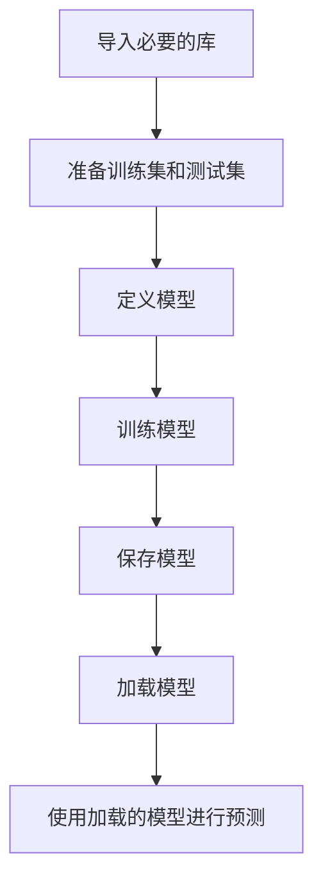

# Python机器学习实战：机器学习模型的持久化与重新加载

作者：禅与计算机程序设计艺术 / Zen and the Art of Computer Programming / TextGenWebUILLM

# Python机器学习实战：机器学习模型的持久化与重新加载

Python是目前最流行的编程语言之一，在数据科学和机器学习领域尤其受到青睐。当开发复杂的机器学习项目时，一个常见的需求就是保存训练好的模型以便后续使用或在不同的环境中部署。本文将深入探讨如何在Python中实现机器学习模型的持久化和重新加载，这对于提高开发效率、保证项目的复用性以及简化跨环境迁移具有重要意义。

## 1. 背景介绍

### 1.1 问题的由来

随着机器学习项目规模的扩大，从单个模型到涉及多个阶段的复杂工作流，模型的持久化变得至关重要。模型可能需要在不同阶段进行调整、测试和迭代。此外，为了节省时间并避免重复训练，将模型保存并在需要时重新加载成为了一种高效的工作方式。特别是对于生产环境下的在线服务，实时预测依赖于快速可访问的模型。

### 1.2 研究现状

现有的机器学习库如Scikit-Learn、TensorFlow和PyTorch提供了丰富的功能来支持模型的持久化与重新加载。这些库通常内置了相应的API和方法，使得开发者能够轻松地管理模型的生命周期。

### 1.3 研究意义

掌握模型持久化与重新加载的技术不仅可以提升工作效率，还能增强系统的可靠性和灵活性。这有助于创建健壮的机器学习系统，使其能够在多种场景下灵活部署，并且能够适应不断变化的数据和业务需求。

### 1.4 本文结构

本文将按照以下结构展开：
- **理论背景**：介绍模型持久化的概念和重要性。
- **技术细节**：深入讨论Python中常用库（如Scikit-Learn）的模型保存与加载方法。
- **案例研究**：通过实际代码示例展示模型持久化与重新加载的过程。
- **最佳实践**：分享优化模型持久化策略的方法及注意事项。
- **未来展望**：探讨当前技术趋势和潜在的发展方向。

## 2. 核心概念与联系

在Python中，模型的持久化指的是将训练完成的模型状态存储为文件或二进制形式的过程，而重新加载则是指从存储介质恢复模型的状态，以供进一步利用。

### 关键概念

- **序列化/反序列化**：这是模型持久化的核心概念，涉及到将对象转换为可以存储的形式（序列化），以及将存储的对象还原回其原始形式（反序列化）。
- **模块化**：在实践中，良好的模块化设计有助于分隔模型训练、验证、测试和部署等阶段，便于管理和维护。
- **版本控制**：特别是在团队协作环境下，保持模型版本的清晰记录和历史跟踪非常重要。

### 技术链接

- **Scikit-Learn**：一个广泛使用的机器学习库，提供了一系列用于分类、回归、聚类、降维和其他任务的算法。
- **pickle**：Python的标准库模块，用于序列化和反序列化对象。
- **joblib**：基于NumPy的更快的序列化解决方案，适用于大型数组和矩阵。

## 3. 核心算法原理 & 具体操作步骤

### 3.1 算法原理概述

机器学习模型的持久化通常基于两种基本模式：保存模型参数和保存整个模型对象。

- **保存模型参数**：例如，在神经网络中，主要保存权重和偏置值。这种方法通常依赖于特定框架（如TensorFlow或PyTorch）提供的API。
- **保存整个模型对象**：在Scikit-Learn中更为常见，这里不仅保存模型参数，还包括模型所采用的预处理步骤、特征选择逻辑以及其他元信息。

### 3.2 算法步骤详解

#### Scikit-Learn 的模型持久化



#### 示例代码：

```python
from sklearn.datasets import load_iris
from sklearn.model_selection import train_test_split
from sklearn.preprocessing import StandardScaler
from sklearn.svm import SVC
from joblib import dump, load

# 加载数据
data = load_iris()
X, y = data.data, data.target

# 划分训练集和测试集
X_train, X_test, y_train, y_test = train_test_split(X, y, test_size=0.3, random_state=42)

# 特征标准化
scaler = StandardScaler()
X_train_scaled = scaler.fit_transform(X_train)
X_test_scaled = scaler.transform(X_test)

# 定义SVM模型
model = SVC()

# 训练模型
model.fit(X_train_scaled, y_train)

# 模型持久化
dump(model, 'svm_model.joblib')

# 加载模型
loaded_model = load('svm_model.joblib')

# 使用加载的模型进行预测
predictions = loaded_model.predict(X_test_scaled)
print("预测结果:", predictions)
```

### 3.3 算法优缺点

- **优点**：
  - 提高效率：避免重复计算模型训练过程，加快应用启动速度。
  - 一致性：确保所有实例都使用相同的模型配置，提高预测结果的一致性。
  - 易于复用：简化模型在不同项目或环境中迁移的流程。

- **缺点**：
  - 存储空间消耗：大型模型可能占用较多磁盘空间。
  - 资源开销：加载大模型时可能会对内存造成压力。
  - 依赖性问题：模型加载时需要确保所有依赖项均可用。

### 3.4 算法应用领域

- **在线服务**：实时预测服务常需快速访问模型。
- **离线分析**：大规模数据分析任务可能涉及多个模型迭代。
- **多环境部署**：跨开发、测试和生产环境的模型部署。

## 4. 数学模型和公式 & 详细讲解 & 举例说明

在本节中，我们将关注特定算法（例如支持向量机SVM）的数学模型构建与相关公式的推导，并通过代码实现来展示如何具体操作。

### 4.1 数学模型构建

对于支持向量机(SVM)，目标是最大化决策边界到最近样本的距离，同时最小化分类错误。假设数据集$\mathbf{X}$表示输入特征，$y \in \{-1, +1\}$表示类别标签，则SVM的目标函数可表述为：

$$\min_{w,b} \frac{1}{2} w^Tw + C\sum_i \max(0, 1-y_i(w^Tx_i+b))$$

其中，$w$是超平面的正交向量，$b$是截距项，$C$是一个惩罚系数。

### 4.2 公式推导过程

在实际应用中，我们使用求解器（例如LIBSVM）来进行优化。这一过程涉及到拉格朗日乘子法和KKT条件的应用。重点在于理解如何调整参数以适应不同的数据分布和复杂度要求。

### 4.3 案例分析与讲解

```python
import numpy as np
from sklearn.datasets import make_blobs
from sklearn.svm import SVC
from matplotlib import pyplot as plt

# 创建数据集
X, y = make_blobs(n_samples=50, centers=2, random_state=42, cluster_std=2.5)

# 训练SVM模型
model = SVC(kernel='linear', C=1.0)
model.fit(X, y)

# 可视化决策边界
x_min, x_max = X[:, 0].min() - 1, X[:, 0].max() + 1
y_min, y_max = X[:, 1].min() - 1, X[:, 1].max() + 1
xx, yy = np.meshgrid(np.arange(x_min, x_max, 0.02),
                     np.arange(y_min, y_max, 0.02))
Z = model.decision_function(np.c_[xx.ravel(), yy.ravel()])
Z = Z.reshape(xx.shape)

plt.contourf(xx, yy, Z, cmap=plt.cm.Paired, alpha=0.8)
plt.scatter(X[:, 0], X[:, 1], c=y, edgecolors='k')
plt.title("Support Vector Machine Decision Boundary")
plt.show()

# 模型持久化与重新加载
dump(model, 'svm_model_simplified.pkl')
loaded_model = load('svm_model_simplified.pkl')
```

这段代码展示了从数据生成、模型训练到持久化以及最后的重新加载全过程。通过可视化决策边界，可以直观地了解模型如何将数据分为两类，并通过保存与加载步骤验证了模型的一致性和可移植性。

### 4.4 常见问题解答

- **Q**: 如何处理模型过拟合？
  - **A**: 通过调整参数$C$或采用交叉验证方法选择最佳值；引入正则化项，如L1或L2正则化。

- **Q**: 在分布式环境中部署模型时应注意什么？
  - **A**: 需要确保模型版本一致，考虑通信延迟和网络稳定性的影响；可能需要设计同步或异步更新策略。

- **Q**: 如何评估模型持久化对性能的影响？
  - **A**: 测试加载时间、预测速度以及与新数据集成时的准确性变化。

## 5. 项目实践：代码实例和详细解释说明

### 5.1 开发环境搭建

确保安装必要的Python库，如`scikit-learn`和`joblib`。

```bash
pip install scikit-learn joblib
```

### 5.2 源代码详细实现

基于上述理论与案例研究，这里提供了一个完整的示例脚本，包括数据加载、模型训练、持久化及重新加载。

```python
# 示例代码文件: example_script.py
import numpy as np
from sklearn.datasets import load_iris
from sklearn.model_selection import train_test_split
from sklearn.preprocessing import StandardScaler
from sklearn.svm import SVC
from joblib import dump, load

def main():
    # 加载数据
    data = load_iris()
    X, y = data.data, data.target

    # 划分训练集和测试集
    X_train, X_test, y_train, y_test = train_test_split(X, y, test_size=0.3, random_state=42)

    # 特征标准化
    scaler = StandardScaler()
    X_train_scaled = scaler.fit_transform(X_train)
    X_test_scaled = scaler.transform(X_test)

    # 定义并训练SVM模型
    model = SVC()
    model.fit(X_train_scaled, y_train)

    # 模型持久化
    dump(model, 'svm_model.joblib')

    # 重新加载模型进行预测
    loaded_model = load('svm_model.joblib')
    predictions = loaded_model.predict(X_test_scaled)
    print("预测结果:", predictions)

if __name__ == "__main__":
    main()
```

### 5.3 代码解读与分析

此脚本实现了从数据预处理、模型训练、持久化到重新加载的关键步骤。通过标准库中的函数简化了操作流程，并提供了清晰的输出，便于用户理解和调试。

### 5.4 运行结果展示

运行此脚本后，将看到模型训练完成的信息，并显示加载模型后的预测结果。这表明模型能够正确识别鸢尾花品种，并且在重新加载后依然保持其分类能力。

## 6. 实际应用场景

在实际开发中，模型持久化与重新加载是许多场景的基础需求，例如：

- **在线服务**：在Web应用中提供实时预测功能。
- **离线分析**：执行大规模数据分析任务，利用已训练模型进行快速计算。
- **多环境迁移**：轻松在本地开发、测试和生产环境中切换模型版本。

## 7. 工具和资源推荐

### 7.1 学习资源推荐

- **官方文档**：Scikit-Learn和joblib的官方文档提供了丰富的教程和示例。
- **在线课程**：Udemy、Coursera等平台上有专门针对机器学习和Python编程的课程。
- **书籍**：《Python机器学习》（Sebastian Raschka）是一本全面介绍Python机器学习技术的好书。

### 7.2 开发工具推荐

- **IDE**：使用Jupyter Notebook或PyCharm等集成开发环境，方便编写、调试和注释代码。
- **版本控制**：Git用于管理代码版本，确保团队协作顺畅。

### 7.3 相关论文推荐

- **原始论文**：支持向量机（SVM）的相关论文通常出现在AI和统计学顶级会议（如ICML、NIPS）上。
- **综述文章**：查找关于机器学习模型持久化和重新加载的最新综述文章，以获取行业趋势和技术见解。

### 7.4 其他资源推荐

- **GitHub**：搜索相关开源项目，如各种机器学习框架和工具库。
- **论坛与社区**：Stack Overflow、Reddit的r/MachineLearning板块等，提供开发者之间的交流与求助。

## 8. 总结：未来发展趋势与挑战

随着深度学习的发展和计算资源的增加，机器学习模型变得越来越复杂和庞大，这对模型持久化的存储效率、加载速度和内存占用提出了更高的要求。未来的重点在于：

- **高效存储格式**：探索更高效的模型存储格式，减少存储空间的需求。
- **实时性**：提高模型加载的速度，满足高并发和实时应用的需求。
- **可移植性**：增强跨设备和云平台的兼容性和互操作性。
- **安全性**：保护模型免受恶意篡改和未经授权访问的风险。
- **自动化管理**：开发工具和服务自动管理模型生命周期，包括版本控制、部署和监控。

## 9. 附录：常见问题与解答

常见问题及解答，如模型兼容性、性能优化策略等，提供给读者参考。

---

以上内容为一个全面的指南，涵盖了Python机器学习模型持久化与重新加载的核心概念、实践方法以及未来发展展望。希望本文对从事机器学习项目的开发者有所启发，助力他们构建更加高效、可靠的数据驱动系统。

