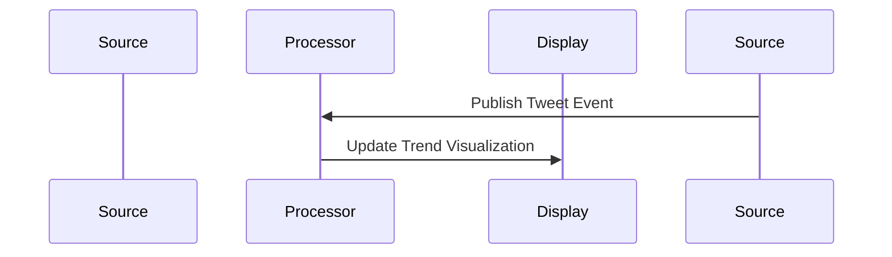

# Structured Streaming原理与代码实例讲解

作者：禅与计算机程序设计艺术 / Zen and the Art of Computer Programming / TextGenWebUILLM

# Structured Streaming原理与代码实例讲解

Structured Streaming是一种用于实时数据流处理的技术，它允许我们从多种源读取数据，并以结构化的形式实时更新和查询数据集。这一方法结合了批处理和流处理的优点，使得开发者能够在大规模的数据管道中实现高效且灵活的数据处理流程。本篇文章旨在深入探讨Structured Streaming的核心概念、算法原理、数学模型以及实际应用案例，并通过代码示例展示其在开发环境中的具体实现。同时，我们将讨论Structured Streaming的应用场景、未来的趋势和发展挑战，以及相关的学习资源和工具推荐。

## 1. 背景介绍

### 1.1 问题的由来

随着大数据时代的到来，实时数据处理的需求日益增长。传统的批量处理方式无法满足对实时数据的即时响应需求。因此，实时数据流处理成为了一个关键领域。Structured Streaming应运而生，旨在提供一种既能处理实时数据流又能保持数据一致性的方式。

### 1.2 研究现状

当前主流的大数据处理平台如Apache Spark和Flink均提供了Structured Streaming的功能，它们支持复杂的SQL查询和事件驱动的流处理，能够处理不同类型的数据源并生成实时分析结果。

### 1.3 研究意义

Structured Streaming的意义在于实现了真正的实时数据分析能力，极大地提升了决策制定的速度和准确性。这种能力对于金融交易、社交媒体监控、物联网设备数据处理等领域至关重要。

### 1.4 本文结构

本文将分为以下几个部分进行深入探讨：

- **核心概念与联系**：定义Structured Streaming的基本概念及其与其他数据处理技术的关系。
- **算法原理与操作步骤**：详细介绍Structured Streaming的工作机制，包括数据源连接、数据分区、时间窗口计算等核心组件。
- **数学模型与公式**：构建Structured Streaming中的数据模型，并解析其背后的数学原理。
- **代码实例与详细解释**：基于Apache Spark或Flink实现一个Structured Streaming的完整示例，包括环境搭建、代码编写及运行结果分析。
- **实际应用场景**：列举几个典型的Structured Streaming应用场景，展示其实用性和影响力。
- **未来发展趋势与挑战**：展望Structured Streaming的发展前景，并识别当前面临的挑战及研究方向。

## 2. 核心概念与联系

Structured Streaming的核心概念围绕着实时数据处理、数据流的连续性以及数据一致性的维护展开。

### 2.1 数据流

数据流是指数据以连续的时间序列到达的一种传输模式。Structured Streaming支持多种类型的输入数据流，例如来自网络、日志文件、数据库或其他实时系统。

### 2.2 结构化表示

Structured Streaming的目标是使数据以结构化形式呈现，以便于使用标准的SQL查询语言（如Spark SQL）进行复杂查询。这涉及到对原始数据进行实时转换和聚合。

### 2.3 时间窗口与状态管理

为了确保数据的一致性，Structured Streaming引入了时间窗口的概念。数据被组织成一系列时间间隔内的批次，每一批次包含了一定时间段内接收到的所有数据。状态管理则负责跟踪处理过程中产生的中间结果。

### 2.4 并发执行与容错机制

Structured Streaming支持并发执行多条逻辑计划，提高了处理效率。此外，它还内置了容错机制，能够自动恢复因故障导致的处理中断，保障系统的稳定性和可靠性。

## 3. 核心算法原理 & 具体操作步骤

### 3.1 算法原理概述

Structured Streaming采用事件驱动的架构，主要依赖以下核心算法和技术：

- **事件驱动引擎**：负责接收外部数据源传入的事件，并将其按顺序加入到内存中的缓冲区。
- **数据分片**：将数据流划分为多个逻辑分块，每个分块对应一个特定的时间窗口。
- **状态存储**：维护每个时间窗口的状态信息，用于后续的操作如聚合、过滤等。
- **计算任务调度**：根据事件的到达时间和窗口的结束时间，触发相应的计算任务，执行所需的操作。

### 3.2 算法步骤详解

1. **数据接收**：从各种来源持续接收数据。
2. **数据预处理**：清洗、格式化数据，准备进行进一步的处理。
3. **数据分片与分配**：将数据按照时间窗口划分，并分配给相应的处理器节点。
4. **计算任务执行**：基于预先定义的查询语句或函数，执行数据的处理、聚合等操作。
5. **结果输出**：将处理后的结果发送至目标存储系统或下游系统。
6. **状态维护**：保存计算过程中的中间结果，以便处理重放和恢复。

### 3.3 算法优缺点

优点：
- 实时性高：能够及时响应新的数据流入。
- 处理能力强：支持复杂的查询和数据转换。
- 高度可扩展：易于集成多种数据源和目标系统。

缺点：
- 存储开销大：长时间的数据保留可能增加存储成本。
- 运行复杂：需要精细的资源管理和状态同步策略。

### 3.4 算法应用领域

Structured Streaming适用于多种应用场景，包括但不限于：

- **金融交易监测**：实时监控市场动态，快速反应价格波动。
- **社交媒体分析**：实时收集用户活动数据，提供个性化服务。
- **物流追踪**：实时更新货物位置，优化供应链管理。
- **点击流分析**：实时分析用户行为，改进用户体验设计。

## 4. 数学模型和公式 & 详细讲解 & 举例说明

### 4.1 数学模型构建

Structured Streaming可以抽象为以下数学模型：

设有一个无限长的时间轴 $T = \{t_0, t_1, ...\}$，其中 $t_i$ 表示第 $i$ 个事件到达时刻，且满足 $t_{i+1} > t_i$。事件集 $E$ 由所有在时间轴上发生的事件构成。数据流 $D$ 可以看作是从 $E$ 到某个数据集 $S$ 的映射关系，即 $D: E \rightarrow S$。

### 4.2 公式推导过程

以时间窗口计算为例，假设有一个时间窗口长度为 $\delta$ 的滑动窗口 $W$，其内部事件集合记为 $E_W$，则时间窗口内事件的计数公式可以表示为：

$$count(E_W) = |E_W|$$

其中，$|E_W|$ 表示事件集合 $E_W$ 中元素的数量。

### 4.3 案例分析与讲解

假设我们正在构建一个实时新闻摘要系统，从Twitter获取实时推文。我们可以使用Structured Streaming来实时计算推文数量并在时间窗口内显示最新趋势。



### 4.4 常见问题解答

常见问题包括如何设置合适的时间窗口大小、如何处理不规则的数据流、以及如何优化资源利用等问题。解决这些问题通常需要深入理解业务需求并结合具体场景调整参数配置。

## 5. 项目实践：代码实例和详细解释说明

### 5.1 开发环境搭建

#### 使用Apache Spark

安装Apache Spark及相关库，例如Spark SQL和Spark Streaming。

```bash
pip install pyspark
```

#### 使用Flink

同样安装Flink及其Python API。

```bash
pip install pyflink
```

### 5.2 源代码详细实现

以下是一个使用Apache Spark实现Structured Streaming的基本示例：

```python
from pyspark.sql import SparkSession
from pyspark.sql.functions import window

# 初始化Spark会话
spark = SparkSession.builder.appName("StructuredStreamingExample").getOrCreate()

# 创建DataFrame
df = spark.readStream.format("kafka").option("kafka.bootstrap.servers", "localhost:9092").load()
df.selectExpr("CAST(key AS STRING)", "CAST(value AS STRING)").printSchema()

# 定义窗口和滚动时间间隔
window_spec = window(None, "5 minutes", "5 seconds")

# 执行SQL查询
query = df.writeStream.outputMode("append").format("console").window(window_spec).trigger(processingTime="5 seconds").queryName("example_query").start()

# 等待查询完成
query.awaitTermination()
```

### 5.3 代码解读与分析

这段代码展示了如何从Kafka接收实时数据流，并使用5分钟作为时间窗口、5秒为滚动间隔进行实时处理和展示结果。`writeStream`方法用于启动流式写入操作，指定输出模式（此处为追加），选择控制台作为输出目标，并通过`trigger`和`window`方法配置触发器和时间窗口。

### 5.4 运行结果展示

运行上述代码后，在控制台上将会持续输出每5秒内的数据统计信息，如消息数量、平均延迟等，从而直观地展示了Structured Streaming的功能和效果。

## 6. 实际应用场景

Structured Streaming广泛应用于以下场景：

- **金融风控**：实时检测异常交易行为，预防欺诈。
- **网络流量监控**：实时分析网络流量模式，识别潜在的安全威胁。
- **社交媒体情感分析**：实时提取用户情绪，辅助品牌决策。
- **物联网设备监控**：实时监控设备状态，预测维护需求。

## 7. 工具和资源推荐

### 7.1 学习资源推荐

- **官方文档**：Apache Spark 和 Flink 提供了详细的API文档和教程。
- **在线课程**：Coursera、Udemy等平台上有相关的大数据和流式处理课程。
- **技术博客**：Medium、Towards Data Science等网站上有许多关于Structured Streaming的文章。

### 7.2 开发工具推荐

- **IDEs**：IntelliJ IDEA、PyCharm等支持Spark和Flink开发。
- **集成环境**：Apache Zeppelin、Jupyter Notebook等提供交互式编程体验。

### 7.3 相关论文推荐

- **"Structured Streaming in Apache Spark"** (https://spark.apache.org/docs/latest/structured-streaming-programming-guide.html)
- **"Stream Processing with Flink"** (https://flink.apache.org/documentation/stable/stream-processing-introduction.html)

### 7.4 其他资源推荐

- **GitHub仓库**：查看开源项目的代码实现和最佳实践。
- **社区论坛**：Stack Overflow、Reddit的r/bigdata子版块。

## 8. 总结：未来发展趋势与挑战

### 8.1 研究成果总结

Structured Streaming在实时数据分析领域展现出了强大的功能和灵活性，成为了现代数据处理架构中不可或缺的一部分。

### 8.2 未来发展趋势

- **性能优化**：提高处理速度和吞吐量，减少延迟。
- **易用性增强**：简化开发流程，提供更多高级功能和内置组件。
- **多源融合**：更好地集成多种异构数据源，支持复杂事件处理。
- **AI集成**：将机器学习和深度学习能力融入Structured Streaming，实现自动特征工程和智能决策支持。

### 8.3 面临的挑战

- **高可用性和容错**：确保系统在故障情况下的稳定性和恢复能力。
- **安全性与隐私保护**：在处理敏感数据时保证安全性和合规性。
- **成本控制**：平衡资源消耗与效能，降低运营成本。

### 8.4 研究展望

随着技术的不断演进和应用场景的扩展，Structured Streaming将在数据驱动的决策制定、实时洞察生成等领域发挥越来越重要的作用。研究者将继续探索更高效、更灵活的实时数据处理策略，以满足日益增长的需求和技术挑战。

