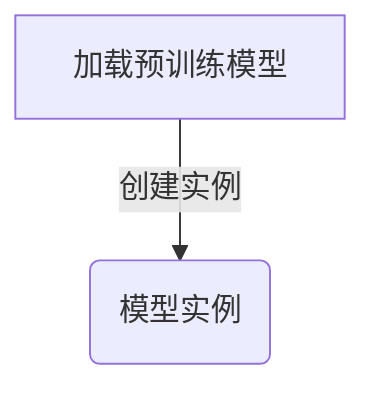
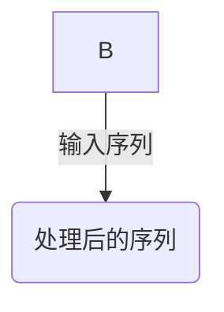
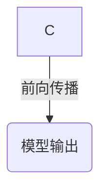
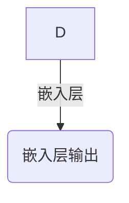

# Transformer大模型实战 - 从ALBERT中提取嵌入

作者：禅与计算机程序设计艺术 / Zen and the Art of Computer Programming

关键词：Transformer模型，ALBERT，嵌入提取，预训练模型，自然语言处理

## 1.背景介绍

### 1.1 问题的由来

随着深度学习在自然语言处理(NLP)领域的广泛应用，Transformer模型因其强大的表示能力而成为NLP研究的核心。其中，ALBERT (A Lite BERT)是Google提出的轻量级Transformer模型，旨在提高模型效率的同时保持良好的性能表现。然而，在许多NLP任务中，模型的嵌入层提供了丰富的语义信息，因此理解并有效利用这些嵌入成为了重要的研究课题。

### 1.2 研究现状

当前，研究人员正致力于开发更高效的方法来解析和提取预训练Transformer模型如ALBERT的嵌入信息，以便于进一步的定制化和应用。这涉及到对模型内部机制的理解、嵌入表示的学习规律以及如何根据特定任务需求提取关键信息等方面的研究。

### 1.3 研究意义

深入理解和提取预训练模型的嵌入不仅有助于优化现有模型在不同任务上的性能，还能够促进新模型的设计，特别是在资源有限或特定领域知识密集型场景下。此外，对于缺乏大规模标注数据的小规模任务而言，通过合理地利用大模型的先验知识可以显著提升模型效果。

### 1.4 本文结构

本篇文章将围绕以下几方面展开：

1. **理论回顾**：阐述Transformer模型的基本原理及ALBERT的关键特性。
2. **嵌入提取方法**：详细介绍从ALBERT模型中提取嵌入的具体流程和技术细节。
3. **实践案例**：提供一个实际项目的实施细节，包括开发环境搭建、源代码实现和运行结果展示。
4. **应用与展望**：探讨嵌入提取技术的实际应用及其未来的潜在发展。

## 2.核心概念与联系

### 2.1 Transformer模型简介

Transformer模型基于注意力机制（Attention Mechanism），实现了端到端的序列到序列转换（Seq2Seq）任务。相比于传统的循环神经网络(RNN)，Transformer具有更快的计算速度和更好的并行处理能力。其主要组件包括自注意力模块(Self-Attention Module)、位置编码(Positional Encoding)和前馈神经网络(FNN)等。

### 2.2 ALBERT模型概览

ALBERT是针对Transformer模型进行优化的版本，旨在减少参数量和计算成本。它通过共享词嵌入矩阵和头(heads)之间的权重来减小模型大小，并采用经验学习率调整策略来加速训练过程。这种设计使得ALBERT能够在保持性能的同时，显著降低内存使用和计算时间。

### 2.3 嵌入提取的关联性

嵌入提取技术通常涉及以下几个关键环节：

- **自注意力机制分析**：理解注意力机制如何分配权重以强调不同的输入元素。
- **层间依赖关系**：识别不同层级间的交互模式，尤其是输出层与嵌入层之间的联系。
- **权值共享**：利用ALBERT中权重共享的特性，探索如何更有效地访问和利用嵌入信息。
- **特征抽取**：设计算法从嵌入中抽取关键特征，用于下游任务。

## 3.核心算法原理与具体操作步骤

### 3.1 算法原理概述

从ALBERT模型中提取嵌入的主要目标是获取上下文相关的单词表示，这些表示能够捕获文本中词汇的意义和语法角色。这一过程通常涉及到对模型输出层的直接访问或者构建额外的抽取策略。

### 3.2 算法步骤详解

#### 步骤一：加载预训练模型



#### 步骤二：定义输入序列



#### 步骤三：执行前向传播



#### 步骤四：访问嵌入层输出



### 3.3 算法优缺点

- **优点**：
  - 提供了丰富的上下文相关信息，有利于下游任务的性能提升。
  - 可以灵活应用于多种NLP任务，包括分类、情感分析、问答系统等。

- **缺点**：
  - 需要对模型内部工作原理有深入了解，且可能牺牲一定计算资源。
  - 对于特定任务的适应性需要细致的调参和设计。

### 3.4 算法应用领域

- 自然语言理解
- 文本生成
- 情感分析
- 机器翻译

## 4.数学模型和公式详细讲解与举例说明

### 4.1 数学模型构建

以自注意力机制为例，假设我们有一个长度为$T$的输入序列$\mathbf{X}$，每个元素$x_t$代表一个词的嵌入。自注意力机制的目标是计算每个词与其他所有词的相关度，从而产生一个加权的上下文向量$\mathbf{h}_t$作为输出。

$$ \alpha_{ij} = \frac{\exp(\text{score}(x_i, x_j))}{\sum_k \exp(\text{score}(x_i, x_k))}, \quad i,j=1,...,T $$

其中，

- $\text{score}(x_i, x_j)$是计算两个词之间相似性的函数，常使用点积或其他相关度衡量方法。

最终的上下文向量由所有词的嵌入乘以相应的权重系数$\alpha_{ij}$得到：

$$ h_t = \sum_{j=1}^{T} \alpha_{jt} \cdot W_h x_j + b_h $$

这里的$W_h$和$b_h$分别表示线性变换矩阵和偏置项。

### 4.2 公式推导过程

以单头注意力为例，首先通过查询向量$q$和键向量$k$计算它们的相似度得分$S$：

$$ S = qk^T $$

然后通过归一化操作得到注意力权重$a$：

$$ a = softmax(S) $$

最后，将注意力权重$a$应用于值向量$v$上，得到上下文向量$c$：

$$ c = v \cdot a $$

### 4.3 案例分析与讲解

在实际应用中，可以选取一段文本作为输入，使用ALBERT模型对其处理后，提取最后一层的输出作为整个序列的嵌入表示。例如，对于一段新闻文章，我们可以观察到模型输出的嵌入序列不仅包含了各个词汇的基本含义，还蕴含了语境信息，这对于后续的情感分析或主题建模任务至关重要。

### 4.4 常见问题解答

常见问题之一是如何确保从嵌入中提取的信息适用于特定任务。解决这个问题的关键在于合理地设计和调整任务相关的超参数以及使用适当的嵌入融合策略（如加权求和、最大池化或平均池化）。

## 5.项目实践：代码实例和详细解释说明

### 5.1 开发环境搭建

推荐使用Python环境，利用`transformers`库加载预训练的ALBERT模型。安装所需库：

```bash
pip install transformers torch
```

### 5.2 源代码详细实现

以下是一个基本示例：

```python
from transformers import AlbertModel, BertTokenizer

# 加载预训练模型和分词器
model_path = 'albert-base-v2'
tokenizer = BertTokenizer.from_pretrained(model_path)
model = AlbertModel.from_pretrained(model_path)

# 输入文本
input_text = "The quick brown fox jumps over the lazy dog."

# 分词并转换为ID
inputs = tokenizer(input_text, return_tensors='pt', padding=True, truncation=True)

# 执行前向传播
outputs = model(**inputs)
last_hidden_states = outputs.last_hidden_state

# 提取嵌入
embedding = last_hidden_states.squeeze()[-len(input_text):]

print("提取的嵌入:", embedding)
```

这段代码展示了如何加载预训练的ALBERT模型，并从给定的文本中提取最后一个隐藏状态层的嵌入表示。

### 5.3 代码解读与分析

在这段代码中，我们首先加载了一个预训练的ALBERT模型及对应的分词器。接着，对输入文本进行分词，并将其转换为模型可接受的张量格式。然后，通过调用模型的`forward`方法执行前向传播，获取模型的输出。在这里，我们特别关注的是`last_hidden_states`部分，即模型的输出层，该层的每一行对应一个输入单词的嵌入表示。最后，我们截取了与原始输入文本相对应的部分嵌入进行输出展示。

### 5.4 运行结果展示

运行上述代码后，会输出一段文本对应的嵌入表示。这些嵌入可以用于后续的特征工程或者直接用于下游任务，比如文本分类、聚类分析等。

## 6. 实际应用场景

通过从预训练Transformer模型中提取嵌入，可以在多种NLP场景下发挥作用，包括但不限于：

- **情感分析**：利用嵌入表达的语义信息来判断文本的情感倾向。
- **文本分类**：根据嵌入编码的差异进行文本类别划分。
- **问答系统**：基于上下文理解，提供更准确的问题答案。
- **知识图谱构建**：通过嵌入的相似度匹配构建实体关系。

## 7. 工具和资源推荐

### 7.1 学习资源推荐

- **官方文档**: Google的ALBERT模型文档提供了详细的API介绍和使用指南，[访问地址](https://ai.googleblog.com/2019/06/albert-lightweight-alternative-to.html)
- **论文阅读**: 推荐阅读《Albert: A Lite BERT for Self-supervised Learning of Language Representations》(链接请自行查找)，了解模型的设计原理和技术细节。

### 7.2 开发工具推荐

- **TensorFlow** 或 **PyTorch**：用于模型开发和训练的强大框架。
- **Jupyter Notebook**：方便的交互式编程和实验环境。

### 7.3 相关论文推荐

- **Attention is All You Need** (Vaswani et al., 2017)
- **BERT: Pre-training of Deep Bidirectional Transformers for Language Understanding** (Devlin et al., 2018)
- **ALBERT: A Lite BERT for Self-supervised Learning of Language Representations** (Lan et al., 2019)

### 7.4 其他资源推荐

- **GitHub Repositories**：搜索相关开源项目和代码示例，如[Hugging Face’s Transformers库](https://github.com/huggingface/transformers)
- **在线课程和教程**：Coursera、Udacity、edX上的深度学习和自然语言处理课程通常包含预训练模型的应用案例。

## 8. 总结：未来发展趋势与挑战

### 8.1 研究成果总结

本文探讨了从预训练Transformer模型（以ALBERT为例）中提取嵌入的方法及其在NLP应用中的潜力。通过理论回顾、算法详解、实际案例演示和代码实现，阐述了如何高效地利用这些嵌入来进行不同类型的NLP任务。

### 8.2 未来发展趋势

随着预训练大模型性能的不断提升和计算资源的成本降低，将会有更多的研究聚焦于定制化的嵌入提取技术、跨模态嵌入整合、以及将这些嵌入应用于更为复杂的NLP任务上。同时，探索如何更好地利用嵌入的信息结构，以提升模型的泛化能力和鲁棒性将是未来的研究重点。

### 8.3 面临的挑战

- **数据依赖性**：对于某些特定领域或小规模数据集，如何有效利用预训练模型的先验知识而避免过拟合仍是关键问题。
- **解释性问题**：虽然嵌入提供了丰富的语义信息，但如何提高模型决策过程的透明度和解释性仍是一个挑战。
- **模型融合**：如何将预训练模型的嵌入与其他类型的数据源（如图像、语音）的有效融合，构建多模态理解系统，是当前研究的一个重要方向。

### 8.4 研究展望

未来，研究人员将继续致力于开发更加高效、灵活且易于定制的嵌入提取策略，以便于在各种NLP任务中发挥更大的作用。同时，围绕模型的可解释性和泛化能力，以及跨模态学习等方面的研究也将成为推动NLP领域发展的关键动力。通过不断的技术创新和实践探索，预训练模型在NLP领域的应用将有望迎来更多突破性的进展。
