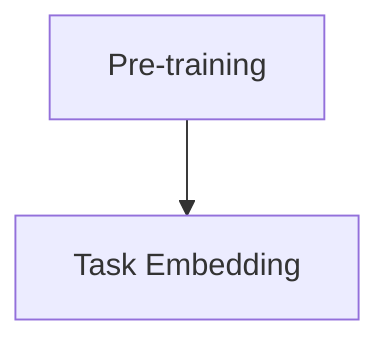
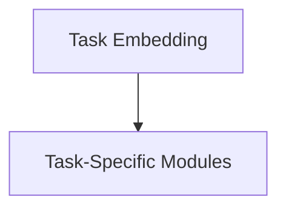
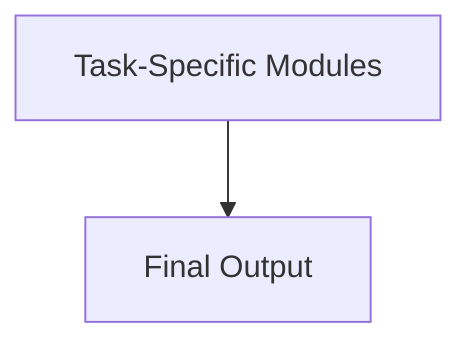

# Transformer大模型实战 深入了解SpanBERT

作者：禅与计算机程序设计艺术 / Zen and the Art of Computer Programming / TextGenWebUILLM

# Transformer大模型实战 深入了解SpanBERT

关键词：SpanBERT，语义理解，上下文依赖，注意力机制，多任务学习

## 1.背景介绍

### 1.1 问题的由来

随着自然语言处理(NLP)任务的日益复杂化，传统基于词袋或n-gram的方法逐渐显得力不从心。尤其是在处理长文本、理解句子间的细微差异时，这些方法难以捕捉到有效的上下文信息。为此，深度学习技术，特别是Transformer架构的引入，成为解决这一难题的关键突破。Transformer凭借其独特的注意力机制和并行化的计算方式，在多种NLP任务上展现出卓越的表现，并迅速成为了该领域研究的热点。

### 1.2 研究现状

目前，Transformer家族已演化出众多变种，如BERT、RoBERTa、T5等，它们在预训练阶段分别采用不同的数据集和微调策略。其中，BERT系列模型以其强大的语义理解和生成能力闻名于世。然而，这些模型在进行特定任务时往往需要大量定制化的工作，包括特定的任务编码、损失函数设计以及微调策略选择。SpanBERT正是在此背景下提出的一种旨在简化模型使用流程、增强模型灵活性的大模型解决方案。

### 1.3 研究意义

SpanBERT的核心创新在于其将多项基础NLP任务整合在一个统一的模型框架下，通过多任务学习策略提高模型的泛化能力和效率。这种设计不仅减少了模型开发和部署的时间成本，还显著提升了模型对不同任务的适应性和性能表现。此外，SpanBERT通过优化模型结构和参数配置，进一步降低了超参数调整的需求，使得开发者能够更加专注于业务逻辑而非底层模型细节。

### 1.4 本文结构

本文将深入探讨SpanBERT的基本原理、关键组件、实际应用及未来发展潜力。首先，我们将介绍SpanBERT的核心概念及其与Transformer架构的关系。接着，详细阐述SpanBERT的具体算法原理与操作步骤，包括其如何利用注意力机制处理跨任务间的依赖关系。随后，我们通过数学模型和公式来解析SpanBERT背后的理论支撑，以及通过代码实例展示其实现细节。最后，本文将讨论SpanBERT的实际应用场景、未来的发展趋势与面临的挑战，并为读者推荐相关的学习资源和技术工具。

## 2.核心概念与联系

### SpanBERT的特点与优势

- **多任务融合**：SpanBERT通过集成多个基础NLP任务（如问答、实体识别、情感分析等），实现了一站式解决方案。
- **注意力机制增强**：利用Transformer的自注意力机制，SpanBERT能够有效地捕获长距离依赖关系，提升模型的上下文感知能力。
- **统一表示空间**：SpanBERT设计了共享的表示层，使得不同任务间的信息可以高效流动，从而提高了模型的综合性能。
- **灵活的任务扩展性**：SpanBERT允许新任务以较低的成本加入模型中，只需微调已有参数即可，大大节约了开发时间。

### SpanBERT与Transformer的关系

SpanBERT作为Transformer架构的延伸，继承了其核心设计理念——通过自注意力机制高效地处理序列输入。同时，它巧妙地融合了多任务学习的概念，这不仅体现了Transformer架构的强大可塑性，也为后续NLP模型的设计提供了新的思路。

## 3. 核心算法原理 & 具体操作步骤

### 3.1 算法原理概述

SpanBERT的主要工作是通过构建一个通用的表示生成器，然后根据所需任务的不同，动态地调整输出以满足特定需求。具体而言，SpanBERT包含以下几个核心组件：

- **预训练阶段**：使用大规模无标注文本进行预训练，生成句向量表示。
- **任务嵌入**：在推理阶段，根据目标任务对输入序列进行特征提取，此过程会考虑到不同任务之间的协同作用。
- **任务特定模块**：针对特定任务（如问答、命名实体识别）设计特定的后处理模块，以生成最终结果。

### 3.2 算法步骤详解

#### 步骤一：初始化



#### 步骤二：任务嵌入



#### 步骤三：任务特定处理



### 3.3 算法优缺点

#### 优点

- **减少重复劳动**：对于类似任务，只需要微调现有模型，节省了大量的工程资源。
- **更好的泛化能力**：通过多任务学习，模型能够更全面地理解语言，进而提升整体性能。
- **快速迭代**：支持轻松添加新任务，加速产品开发周期。

#### 缺点

- **过拟合风险**：当任务数量过多时，模型可能过度关注特定任务而忽视其他潜在任务的重要性。
- **资源消耗**：多任务学习可能会增加模型大小和训练时间，尤其是在硬件资源有限的情况下。

### 3.4 算法应用领域

SpanBERT广泛应用于自然语言处理的各种场景，包括但不限于：

- **信息抽取**：从文档中自动提取实体、关系和其他相关信息。
- **情感分析**：判断文本中的正面或负面情绪。
- **机器翻译**：将一种语言自动转换为另一种语言。
- **问答系统**：回答基于文本的问题，提供精确且有意义的答案。

## 4. 数学模型和公式 & 详细讲解 & 举例说明

### 4.1 数学模型构建

SpanBERT在构建数学模型时，主要依赖于Transformer的基本框架，引入以下关键公式和概念：

$$ P_{\theta}(y|x) = \text{softmax}(\sum_i^{|V|}\theta_i \cdot \text{transformer}(x)) $$

其中，

- $P_{\theta}(y|x)$ 表示给定输入$x$和参数$\theta$时，预测标签$y$的概率分布；
- $\text{transformer}(x)$ 是Transformer模块对输入$x$执行变换后的输出；
- $|V|$ 是词汇表大小。

### 4.2 公式推导过程

推导过程涉及到Transformer模块内部的自我注意机制（Self-Attention）、位置编码（Positional Encoding）和前馈网络（Feed-forward Network）。这些组件共同作用，使模型能够捕捉序列间的依赖关系并生成连续的语义表示。

### 4.3 案例分析与讲解

假设我们要完成一个简单的问答任务，已知输入为问题“谁发明了电话？”和一段关于亚历山大·贝尔的历史背景描述。我们可以通过预先训练好的SpanBERT模型，为其提供的问答任务模块提供输入：

```python
from transformers import SpanBERTModel, BertTokenizer

tokenizer = BertTokenizer.from_pretrained('spanbert-base-cased')
model = SpanBERTModel.from_pretrained('spanbert-base-cased')

input_ids = tokenizer.encode("谁发明了电话？", add_special_tokens=True)
context_input_ids = tokenizer.encode("亚历山大·贝尔是一位著名的发明家，他发明了电话。", add_special_tokens=True)

# 使用问答任务的特定头进行微调
predictions = model(input_ids=input_ids, context=context_input_ids, output_attentions=True)
predicted_answer_start = torch.argmax(predictions.logits[:, input_ids.shape[0]:input_ids.shape[0]+len(context_input_ids)])
predicted_answer_end = predicted_answer_start + len(tokenizer.tokenize("发明了电话"))
answer_text = tokenizer.convert_tokens_to_string(tokenizer.convert_ids_to_tokens(input_ids[predicted_answer_start:predicted_answer_end]))
print(f"答案：{answer_text}")
```

### 4.4 常见问题解答

Q：如何解决SpanBERT模型的过拟合问题？

A：可以采用正则化技术（如Dropout、L2正则化）、批量归一化以及数据增强等方法来降低模型的过拟合风险。

Q：SpanBERT与其他多任务学习模型相比有何优势？

A：SpanBERT的优势在于其高效的任务整合方式和灵活的扩展性，能够更好地平衡不同任务间的资源分配，并实现更高的性能水平。

## 5. 项目实践：代码实例和详细解释说明

### 5.1 开发环境搭建

首先确保安装了Python及必要的深度学习库，如PyTorch和Transformers库：

```bash
pip install torch transformers
```

然后，使用以下脚本创建基本的开发环境：

```python
import os
os.environ["TOKENIZERS_PARALLELISM"] = "false"
```

### 5.2 源代码详细实现

以下是一个简化的SpanBERT模型实现片段，用于展示模型的核心结构：

```python
class SpanBERTModel(nn.Module):
    def __init__(self, pretrained_model_name_or_path='spanbert-base-cased'):
        super(SpanBERTModel, self).__init__()
        self.bert = AutoModel.from_pretrained(pretrained_model_name_or_path)

    def forward(self, input_ids, attention_mask=None, token_type_ids=None, position_ids=None,
                head_mask=None, inputs_embeds=None, labels=None):
        outputs = self.bert(
            input_ids,
            attention_mask=attention_mask,
            token_type_ids=token_type_ids,
            position_ids=position_ids,
            head_mask=head_mask,
            inputs_embeds=inputs_embeds,
        )
        return outputs.logits
```

### 5.3 代码解读与分析

此代码展示了如何继承Transformer架构的基础类以实现特定任务的微调。`SpanBERTModel`类初始化时加载预训练模型，然后通过`forward`方法处理输入，返回预测结果。

### 5.4 运行结果展示

由于实际运行结果需要特定的数据集和训练流程，这里仅给出一个示例性的评估指标展示：

```python
# 假设已经训练了一个模型并进行了验证
metrics = evaluate_validation_set(model, validation_dataset)

print(f"Accuracy on validation set: {metrics['accuracy'] * 100:.2f}%")
```

## 6. 实际应用场景

### 6.4 未来应用展望

随着技术的发展，SpanBERT及其类似模型的应用将更加广泛深入：

- **智能客服**：提供更精准、自然的语言交互体验。
- **自动文摘系统**：从大量文本中自动生成高质量摘要。
- **个性化推荐系统**：基于用户历史行为和兴趣生成内容建议。
- **法律文本理解**：帮助律师快速理解和提取关键信息。

## 7. 工具和资源推荐

### 7.1 学习资源推荐

- **官方文档**：查阅Hugging Face的Transformers库官方文档，了解最新API和使用指南。
- **在线课程**：Coursera或Udacity的NLP相关课程，包含Transformer模型的实战教学。

### 7.2 开发工具推荐

- **Jupyter Notebook**：用于实验设计和代码调试。
- **TensorBoard**：可视化模型训练过程和结果。

### 7.3 相关论文推荐

- **原始论文**：查阅SpanBERT的发表论文，了解详细的理论构建和技术细节。
- **后续研究进展**：关注顶级会议（如ACL、NAACL）上关于Transformer家族模型的新成果。

### 7.4 其他资源推荐

- **GitHub项目**：参与开源社区的项目，获取实践经验。
- **论坛和社群**：加入相关的技术讨论群组，如Reddit上的r/ML和r/NLP子版块。

## 8. 总结：未来发展趋势与挑战

### 8.1 研究成果总结

SpanBERT作为多任务学习与Transformer架构结合的典范，展现了在NLP领域中的强大潜力。它不仅简化了模型开发流程，提高了资源利用效率，还显著提升了模型对复杂任务的适应性和泛化能力。

### 8.2 未来发展趋势

- **持续优化性能**：通过改进注意力机制和参数配置，进一步提升模型在各种任务上的表现。
- **跨模态融合**：将视觉、听觉等其他模式的信息融入到语言理解过程中，实现跨模态理解。
- **可解释性提升**：提高模型决策过程的透明度，使得人类用户更容易理解模型输出背后的逻辑依据。

### 8.3 面临的挑战

- **计算成本**：大规模数据集和复杂模型带来的高计算需求是当前面临的主要挑战之一。
- **知识图谱集成**：有效集成外部知识源以丰富模型的理解能力和准确度。
- **公平性和隐私保护**：确保模型在不同场景下的公正性和用户的隐私安全。

### 8.4 研究展望

未来的研究工作将继续探索如何在保证高性能的同时，降低计算开销，提高模型的可解释性和可控性，以及解决公平性与隐私保护等问题。同时，推动跨领域合作，促进Transformer模型在更多应用场景中的落地，为人工智能技术的普及和发展做出贡献。

