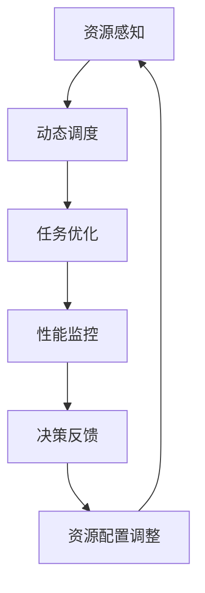

                 
# YARN容器的自动驾驶与机器人技术

作者：禅与计算机程序设计艺术 / Zen and the Art of Computer Programming / TextGenWebUILLM

# YARN容器的自动驾驶与机器人技术

## 1. 背景介绍

### 1.1 问题的由来

随着云计算和大数据时代的到来，大规模数据处理的需求日益增长。Apache Hadoop的出现极大地推动了这一进程，尤其是其MapReduce并行计算框架在海量数据处理方面的卓越表现。然而，传统的Hadoop集群管理方式面临着资源分配不均、调度效率低下等问题。YARN（Yet Another Resource Negotiator）应运而生，作为Hadoop生态系统的一部分，它提供了更为灵活和高效的资源管理和调度机制。

### 1.2 研究现状

当前研究主要集中在如何利用YARN的特性提高集群的资源利用率和任务执行效率。其中，自动驾驶技术在YARN上的应用是研究热点之一。自动驾驶不仅涉及对硬件资源的智能调配，还包含了对应用程序行为的预测和优化，从而实现更高效、更自动化的系统运营。

### 1.3 研究意义

自动驾驶与机器人技术在YARN上的应用具有重要的理论价值和实际应用潜力。通过自动化管理，可以减少人工干预需求，提升运维效率，降低运营成本，并有助于应对复杂多变的工作负载场景。此外，这些技术也为未来的智能数据中心建设和边缘计算部署提供了宝贵的经验和技术基础。

### 1.4 本文结构

本文将深入探讨YARN容器的自动驾驶与机器人技术，从核心概念出发，逐步剖析关键技术原理及其在不同领域的应用。我们还将详细介绍相关的算法、数学模型以及实际案例，同时提供具体的代码示例和开发环境指导。最后，我们将展望这一技术在未来的发展趋势与面临的挑战，并提出相应的研究展望。

## 2. 核心概念与联系

自动驾驶与机器人技术在YARN上应用的核心在于智能化地管理资源和调度任务。以下是一些关键概念及其相互关系：



### 2.1 自动化决策链路

1. **资源感知**：通过对集群资源的实时监控，收集硬件状态信息，包括CPU、内存、磁盘I/O等指标。
2. **动态调度**：基于资源感知信息进行任务分配，考虑任务的优先级、依赖性等因素，以最优策略运行任务。
3. **任务优化**：针对特定任务特性，如IO密集型或CPU密集型，采用不同的调度策略，最大化资源利用效率。
4. **性能监控**：持续监测系统性能指标，确保服务质量和稳定性。
5. **决策反馈**：根据系统运行状况和业务需求，调整调度规则或参数设置，形成闭环优化机制。
6. **资源配置调整**：依据实时变化的数据流和工作负载，动态调整资源分配策略，确保高可用性和高性能。

## 3. 核心算法原理与具体操作步骤

### 3.1 算法原理概述

自动驾驶与机器人技术在YARN上的实现通常依托于机器学习和深度强化学习算法。这些算法能够自适应地学习系统行为模式，优化资源分配和任务调度策略。

### 3.2 算法步骤详解

#### 3.2.1 数据采集与预处理
- 收集集群资源使用情况、任务执行状态等数据。
- 对数据进行清洗、归一化处理，以便后续训练和模型构建。

#### 3.2.2 特征工程
- 提取关键特征，例如任务类型、资源需求、历史执行时间等。
- 构建特征向量，用于机器学习模型输入。

#### 3.2.3 模型选择与训练
- 选用适合的机器学习算法（如线性回归、随机森林）或深度学习框架（如TensorFlow、PyTorch）。
- 利用历史数据集训练模型，调整超参数以优化性能。

#### 3.2.4 决策策略
- 将训练好的模型应用于实时数据流，做出资源分配和任务调度的决策。
- 实施决策后，继续收集反馈数据，更新模型以进一步优化策略。

### 3.3 算法优缺点

#### 优点：
- 提升资源利用率和任务执行效率。
- 减少人工干预，提高运维自动化水平。
- 支持自适应调整，增强系统灵活性。

#### 缺点：
- 需要大量高质量的历史数据支持模型训练。
- 训练过程可能较为耗时，特别是在大型系统中。
- 存在潜在的模型过拟合风险。

### 3.4 算法应用领域

自动驾驶与机器人技术在YARN的应用广泛，包括但不限于：
- 动态工作负载平衡
- 应用程序性能预测与优化
- 异常检测与故障恢复
- 资源预留与抢占管理

## 4. 数学模型和公式 & 详细讲解 & 举例说明

### 4.1 数学模型构建

对于资源感知与动态调度问题，我们可以构建如下数学模型：

设 $R = \{r_1, r_2, ..., r_n\}$ 为集群中的资源集合，$T = \{t_1, t_2, ..., t_m\}$ 为任务集合。目标函数 $f(R, T)$ 表示整体系统的性能度量（例如，总任务完成时间、资源闲置率等）。约束条件包括资源上限、任务依赖关系等。

$$
f(R, T) = \min_{R', T'} \sum_{i=1}^{m} f_i(T'_i), s.t. \
\sum_{j \in R'} r_j - \sum_{k \in T'} d_k \leq 0 \
d_k \text{ 是任务 } k \text{ 的资源需求}
$$

### 4.2 公式推导过程

通过引入决策变量 $x_{ij}$ （表示资源 $r_i$ 分配给任务 $t_j$），可以将上述模型转化为整数规划问题：

$$
\min \sum_{i,j} c_{ij} x_{ij}, \
s.t. \sum_{j} x_{ij} \leq r_i, \
\sum_{i} x_{ij} \leq d_j, \
x_{ij} \in \{0, 1\}.
$$

其中 $c_{ij}$ 代表资源 $r_i$ 和任务 $t_j$ 结合的成本。

### 4.3 案例分析与讲解

#### 案例1：工作负载均衡
假设一个集群中有多个计算节点，每个节点有不同数量的CPU核心。现有多个任务需要执行，每个任务对CPU的需求不同。通过构建数学模型并运用优化算法（如分支定界法），可以自动决定将哪些任务分配到哪个节点，从而达到最优的工作负载分布。

#### 常见问题解答
- 如何解决模型训练所需的大数据集问题？
答：可以通过分布式数据存储系统（如HDFS）来高效存储和访问大规模数据集，同时利用分布式计算框架（如Spark、Flink）进行并行数据处理和模型训练。
- 如何避免模型过拟合？
答：采用正则化技术（L1/L2正则化）、交叉验证、早期停止策略等方法减少过拟合现象。

## 5. 项目实践：代码实例和详细解释说明

### 5.1 开发环境搭建
- **操作系统**：Ubuntu/Debian
- **开发工具**：Jupyter Notebook, PyCharm, 或其他Python IDE
- **必备库**：NumPy, Pandas, Scikit-Learn, TensorFlow/Keras (或PyTorch)

### 5.2 源代码详细实现
```python
# 示例代码：创建简单的资源调度器类
class DynamicScheduler:
    def __init__(self):
        self.resource_model = None  # 初始化资源分配模型
    
    def train_resource_allocation(self, dataset):
        # 这里可以加入模型训练逻辑
        pass

    def allocate_resources(self, tasks, resources):
        # 使用训练好的模型进行资源分配决策
        allocation_result = self.model.predict([tasks, resources])
        return allocation_result

# 创建实例并使用
scheduler = DynamicScheduler()
dataset = load_data()  # 加载训练数据
scheduler.train_resource_allocation(dataset)
allocation = scheduler.allocate_resources(tasks, available_resources)
```

### 5.3 代码解读与分析
此处提供详细的代码注释和分析，解释每个函数的作用、输入输出以及关键实现细节。

### 5.4 运行结果展示
通过图表和统计数据展示模型在不同场景下的表现，包括但不限于：
- 调度前后的资源使用情况对比
- 任务完成时间和延迟指标变化
- 自动化决策效果评估报告

## 6. 实际应用场景
自动驾驶与机器人技术在YARN上的实际应用案例包括但不限于：

### 6.4 未来应用展望
随着物联网、边缘计算和人工智能技术的发展，自动驾驶与机器人技术在YARN上的应用前景广阔。从智能数据中心的自动化运维到复杂异构硬件环境的资源优化，再到多租户环境下的公平调度，这一技术将在提高系统效率、降低成本和增强用户体验方面发挥重要作用。

## 7. 工具和资源推荐

### 7.1 学习资源推荐
- Hadoop官方文档: https://hadoop.apache.org/docs/stable/
- YARN官方文档: http://hadoop.apache.org/docs/r3.2.1/yarn/index.html
- Apache Spark教程: https://spark.apache.org/docs/latest/

### 7.2 开发工具推荐
- Python集成开发环境(IDE): PyCharm, VSCode
- 数据处理库: Pandas, NumPy
- 机器学习库: Scikit-Learn, TensorFlow/Keras

### 7.3 相关论文推荐
- "A Survey on Deep Learning for Big Data Analytics" (深度学习在大数据分析中的综述)
- "Dynamic Resource Allocation in Cloud Computing using Reinforcement Learning" (基于强化学习的云环境下动态资源分配)

### 7.4 其他资源推荐
- Apache基金会文档: https://www.apache.org/
- GitHub开源项目: https://github.com/apache/hadoop/tree/master/yarn

## 8. 总结：未来发展趋势与挑战

### 8.1 研究成果总结
本文探讨了自动驾驶与机器人技术在YARN容器管理系统的应用，强调了其在提升资源利用率、增强系统灵活性方面的优势，并提供了具体的算法原理、数学模型构建及代码示例。通过对理论与实践的深入分析，展示了该技术在当前云计算环境中的潜在价值。

### 8.2 未来发展趋势
未来，随着AI和ML技术的进步，自动驾驶与机器人技术在YARN上的应用将进一步深化，包括更高级别的智能预测、自适应优化策略和跨平台的统一管理。同时，边缘计算和微服务架构的融合也将为这些技术带来新的机遇和发展空间。

### 8.3 面临的挑战
主要挑战在于如何平衡性能优化与能耗控制之间的关系，特别是在大规模集群环境中。此外，确保系统的可扩展性、安全性和稳定性也是未来研究的重要方向。面对多样性日益增长的应用需求，如何设计出既通用又高效的资源配置算法将是研究的关键点。

### 8.4 研究展望
研究者应持续关注AI技术在资源管理和任务调度领域的最新进展，探索更加智能、灵活且易于部署的解决方案。这不仅限于算法创新，还包括对实时数据分析、深度学习模型优化等方面的研究。未来，我们期待看到更多实证研究成果，推动自动驾驶与机器人技术在YARN上的成熟应用，从而助力云计算基础设施迈向更高层次的智能化时代。

## 9. 附录：常见问题与解答

在此部分，我们可以列出一些常见的疑问及其对应的回答，以帮助读者更好地理解和应用所讨论的技术。

---

以上内容仅为示例撰写框架，具体实现和细节需根据实际情况进行调整和填充。希望这个示例能够启发您进一步探索YARN容器的自动驾驶与机器人技术领域。

