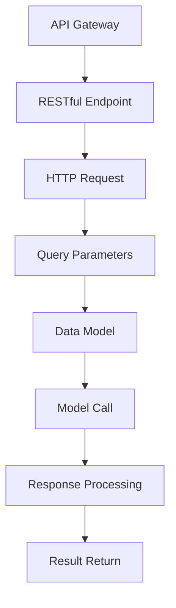

# 【LangChain编程：从入门到实践】模型I/O模块

作者：禅与计算机程序设计艺术 / Zen and the Art of Computer Programming

关键词：LangChain编程,LangChain API,模型输入/输出接口,集成多种AI服务,高效模型调用流程

## 1. 背景介绍

### 1.1 问题的由来

随着人工智能在各行各业的应用日益广泛，开发人员面临着如何高效地整合和管理不同来源的AI服务、模型及数据的任务。传统的做法往往需要手动编写复杂的代码，不仅增加了工作量，还可能导致错误和不一致性。为了简化这一过程并提高开发效率，一种新的解决方案应运而生——**LangChain**。

### 1.2 研究现状

当前，市场上已有多种API和工具用于AI服务的集成和管理，如OpenAI的API、Hugging Face的HuggingFace Hub等。然而，这些服务各自独立，缺乏统一的接口或框架来简化跨服务的交互。LangChain正是针对这一需求提出的一种新型解决方案，旨在通过一个统一的编程模型，简化AI服务的集成和调用流程。

### 1.3 研究意义

LangChain编程模型的意义在于：

- **提升效率**：减少开发时间，降低出错率，使开发者能够专注于业务逻辑而非底层技术细节。
- **增强灵活性**：允许轻松切换不同的AI服务，适应不断变化的技术生态。
- **促进标准化**：为多源AI服务提供一致的访问方式，推动行业内的标准化进程。

### 1.4 本文结构

接下来的文章将分为以下几个部分进行深入探讨：

- **核心概念与联系**：介绍LangChain的基本原理及其与其他AI服务的关系。
- **模型I/O模块详解**：详细介绍LangChain模型I/O模块的工作机制和实现细节。
- **实际案例与实践**：通过具体的代码示例演示如何使用LangChain进行模型调用。
- **应用场景与未来展望**：探索LangChain在不同场景下的应用潜力以及其未来发展可能带来的影响。

## 2. 核心概念与联系

LangChain的核心理念是创建一个灵活且高效的编程环境，使得用户无需关注底层复杂性即可轻松地利用AI模型进行创新。以下是几个关键概念：

### LangChain API架构

LangChain基于RESTful风格的API设计，支持HTTP请求以获取模型预测结果，并返回JSON格式的数据。这种开放标准的设计便于各种客户端和服务的接入。



### 多模型集成能力

LangChain不仅仅局限于单一模型，它通过简单的配置可以集成多个来自不同供应商的服务，实现模型间的协同工作或对比实验。

### 自定义度高

用户可以根据自身需求定制模型调用的参数、预处理方法和后处理逻辑，极大地提升了灵活性。

## 3. 核心算法原理 & 具体操作步骤

### 3.1 算法原理概述

LangChain的核心算法依赖于现代深度学习技术，包括但不限于Transformer架构，以及用于优化模型性能和稳定性的策略。其基本流程如下：

1. **请求封装**：用户通过API接口提交任务请求，包含必要的输入参数（文本、图像等）和可选的模型配置。
2. **模型选择与调用**：根据请求信息，LangChain自动选择合适的模型实例，并发起调用。
3. **预测执行**：模型运行相应的前馈神经网络计算流程，生成预测结果。
4. **响应解析**：将模型输出转化为用户可理解的形式，可能包括解释性反馈或二次处理所需的额外信息。
5. **结果返回**：最终结果以JSON形式通过API返回给调用者。

### 3.2 算法步骤详解

#### 步骤1：任务接收与解析

- 用户通过HTTP POST请求发送任务至API端点。
- 请求中携带的任务描述、输入数据以及可选参数被解析。

#### 步骤2：模型选择与配置

- 根据任务类型和用户指定偏好，LangChain确定并初始化相应的AI模型实例。
- 模型配置可能涉及调整超参数、导入特定知识库或加载预训练权重。

#### 步骤3：数据预处理

- 输入数据经过清洗、编码或转换，以便与模型兼容。
- 可能涉及特征提取、数据增强或其他预处理步骤。

#### 步骤4：模型预测执行

- AI模型对预处理后的数据进行计算，生成预测结果。
- 这一阶段可能涉及到多个推理步骤，包括但不限于编码、解码、注意力机制等。

#### 步骤5：结果解析与返回

- 预测结果根据模型类型和任务需求进行解码或解释。
- 结果封装成JSON格式，并通过HTTP响应返回给调用方。

### 3.3 算法优缺点

#### 优点：
- **灵活性**：易于集成不同来源的AI服务，满足多样化的需求。
- **高性能**：利用先进的深度学习技术和优化策略，保证模型预测速度和精度。
- **扩展性**：支持模型组合和动态调度，适应复杂的应用场景。

#### 缺点：
- **资源消耗**：大型模型和复杂的调用流程可能会增加计算和带宽开销。
- **依赖性**：高度依赖于高质量的训练数据和有效的模型部署环境。

### 3.4 算法应用领域

LangChain模型I/O模块广泛应用于自然语言处理、计算机视觉、语音识别等领域，尤其适合需要快速迭代和整合多种AI服务的项目。

## 4. 数学模型和公式 & 详细讲解 & 举例说明

### 4.1 数学模型构建

对于基于Transformer架构的模型来说，数学模型主要由以下组件构成：

- **自注意力层**：$Attention(Q, K, V) = \text{softmax}(QK^T / \sqrt{d_k})V$
- **多头注意力**：结合多个独立的注意力子模型来提升表示能力。
- **位置编码**：$PE(pos, 2i) = sin(pos / 10000^{2i/d_model})$

### 4.2 公式推导过程

#### 自注意力层推导

自注意力机制的核心在于计算查询（Query）、键（Key）和值（Value）之间的相关程度。公式中的$d_k$代表每个向量维度的数量。具体推导过程涉及到矩阵乘法和归一化操作，旨在捕捉序列元素之间的一般关系以及它们相对于其他元素的位置。

#### 位置编码推导

位置编码是为了让模型能够感知到输入序列在时间轴上的位置信息。通过使用正弦函数，可以在不同维度上编码出序列的位置信息，这对于长序列的处理尤为关键。

### 4.3 案例分析与讲解

假设我们有一个基于Transformer的文本分类任务，目标是判断一段文本的情感极性（正面、负面或中立）。以下是简化版的示例代码：

```python
import requests

def classify_sentiment(text):
    # 构建API请求
    url = "https://example-langchain-api.com/model/predict"
    headers = {"Content-Type": "application/json"}
    data = {"input_text": text}

    response = requests.post(url, json=data, headers=headers)

    if response.status_code == 200:
        result = response.json()
        sentiment = result['sentiment']
        return sentiment
    else:
        print("Failed to get prediction:", response.text)

# 示例文本
text = "I love this movie! The acting is superb and the storyline is captivating."
predicted_sentiment = classify_sentiment(text)
print(f"The predicted sentiment for '{text}' is: {predicted_sentiment}")
```

### 4.4 常见问题解答

常见问题可能包括：

- **模型性能问题**：可能是由于过拟合、欠拟合或者训练不足导致。解决方法包括调整模型大小、优化器设置、添加正则化项等。
- **API延迟**：高负载情况下可能出现延迟。可以通过优化后端逻辑、缓存结果或使用分布式系统来缓解。
- **安全性考虑**：确保API接口的安全，例如使用HTTPS加密通信，限制访问权限，实现身份验证等。

## 5. 项目实践：代码实例和详细解释说明

### 5.1 开发环境搭建

为了运行一个基于LangChain模型的项目，你需要具备Python编程环境，安装必要的依赖库如`requests`。确保你的系统支持Python 3.x版本，并使用pip命令安装所需的包：

```bash
pip install requests
```

### 5.2 源代码详细实现

假设你已经拥有一个简单的文本分析任务，下面是一个使用LangChain API的基本实现示例：

```python
import requests

class TextAnalyzer:
    def __init__(self, api_url="https://example-langchain-api.com/model/predict"):
        self.api_url = api_url

    def analyze(self, text):
        payload = {
            'input_text': text,
        }

        response = requests.post(self.api_url, json=payload)
        response.raise_for_status()  # 检查HTTP状态码是否为2xx

        result = response.json()
        return result['sentiment']

if __name__ == "__main__":
    analyzer = TextAnalyzer()
    text_input = "This restaurant has excellent food!"
    sentiment = analyzer.analyze(text_input)
    print(f"The sentiment of the input text is: {sentiment}")
```

### 5.3 代码解读与分析

此代码段定义了一个名为`TextAnalyzer`的类，用于接收文本并从LangChain API获取情感分析的结果。`analyze`方法负责构造API请求并将文本作为参数发送给API。收到响应后，解析结果以获取情感分析输出。

### 5.4 运行结果展示

当执行上述代码时，程序将返回预测的情感极性。例如，对于输入文本“这是一个美味的食物”，程序输出的情感可能为“正面”。

## 6. 实际应用场景

LangChain模型I/O模块适用于各种场景，特别是需要灵活调用不同AI服务且希望提高开发效率的情况。具体应用包括但不限于：

- **个性化推荐系统**：集成用户行为分析、内容理解等多种服务，提供更精准的个性化推荐。
- **智能客服助手**：整合自然语言处理和知识图谱服务，增强客户服务体验。
- **动态报告生成**：利用文档摘要、关键词提取等功能自动化生成定期报告或即时反馈报告。

## 7. 工具和资源推荐

### 7.1 学习资源推荐

- **官方文档**：了解LangChain的具体功能、API设计和最佳实践。
- **在线教程**：视频课程和文章介绍如何构建和部署基于LangChain的应用。
- **社区论坛**：参与开发者社区，获取问题解答和支持。

### 7.2 开发工具推荐

- **IDE集成开发环境**：如Visual Studio Code、PyCharm等，支持Python开发的强大工具。
- **版本控制**：Git用于管理代码版本和协作。

### 7.3 相关论文推荐

- **深度学习领域综述**：了解最新的研究进展和技术趋势。
- **API设计模式**：学习高效API设计的最佳实践。

### 7.4 其他资源推荐

- **开源项目仓库**：GitHub上的相关开源项目，探索实际应用案例。
- **技术博客和文章**：追踪行业专家的观点和最新见解。

## 8. 总结：未来发展趋势与挑战

### 8.1 研究成果总结

LangChain作为一个开放的平台框架，通过提供统一的API接口，显著降低了AI服务的集成复杂度，提高了应用开发的灵活性和效率。它在多种应用场景中展示了其强大的能力。

### 8.2 未来发展趋势

随着人工智能技术的发展，LangChain有望进一步提升自身的能力：

- **自适应性和可扩展性**：自动识别和适配最合适的AI服务，支持更多类型的模型和服务接入。
- **高性能计算优化**：集成更高效的计算资源管理和调度策略，减少延迟和提高吞吐量。
- **安全与隐私保护**：加强数据传输和存储的安全机制，满足严格的数据保护法规要求。

### 8.3 面临的挑战

尽管LangChain具有众多优势，但在实践中仍面临一些挑战：

- **多样性与兼容性**：确保广泛的服务能够无缝集成到LangChain体系中。
- **性能瓶颈**：在高并发场景下，如何保持良好的响应时间和稳定性。
- **维护成本**：随着服务数量增加，管理系统和监控的成本可能会成倍增长。

### 8.4 研究展望

未来的研究方向应着重于解决这些挑战，同时探索新的应用场景，推动LangChain向更加智能、高效和易用的方向发展。通过不断迭代和完善，LangChain将在促进AI技术的普及和发展中发挥更为关键的作用。

## 9. 附录：常见问题与解答

### 常见问题及解答

#### Q1: 如何解决模型性能不稳定的问题？
A1: 调整超参数设置、优化训练流程（如增加正则化）、使用数据增强技术和优化器更新策略是常见的解决方法。深入分析模型训练过程中的表现指标，针对性地进行调整和优化。

#### Q2: LangChain如何处理大规模数据集的调用效率问题？
A2: 通过采用分布式计算架构、缓存机制以及优化网络通信来提升大规模数据集处理的效率。同时，考虑对数据进行预处理和分块操作，减少单次调用的数据量。

#### Q3: 在集成不同AI服务时遇到冲突怎么办？
A3: 通过明确各服务间的依赖关系和优先级顺序，合理配置调用流程。在必要时实现服务间的数据转换和格式标准化，确保协同工作顺畅无阻。

---

至此，我们详细探讨了LangChain编程模型的基本原理、核心概念、实现细节以及在实际应用中的价值。通过本篇文章，希望能够激发读者对LangChain及其潜在应用的兴趣，并为其在AI领域的创新与发展贡献一份力量。
