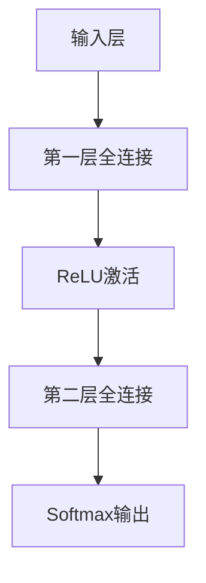

                 
# 神经网络在信息提取的应用

作者：禅与计算机程序设计艺术 / Zen and the Art of Computer Programming

关键词：神经网络，信息提取，自然语言处理，深度学习，端到端学习

## 1. 背景介绍

### 1.1 问题的由来

随着互联网的普及和数字化时代的到来，大量的文本数据被生成并存储在网络空间中。从社交媒体到在线论坛，再到学术文献和新闻报道，这些丰富的文本资源蕴含着海量的信息。然而，如何有效地从中提取有价值的知识，成为了一个亟待解决的问题。

### 1.2 研究现状

近年来，基于深度学习尤其是神经网络的方法，在信息提取领域展现出了显著的优势。传统的机器学习方法往往依赖于特征工程，而现代的神经网络方法则倾向于“端到端”的学习方式，直接从原始数据中学习表示，并完成最终的任务。这种方法减少了人工设计特征的工作量，同时也提高了模型的学习效率和泛化能力。

### 1.3 研究意义

神经网络在信息提取上的应用不仅提升了知识发现的速度和准确性，还促进了跨学科研究的发展，如生物医学信息检索、法律文本分析、金融风险评估等领域。此外，它也为个性化推荐系统、智能客服等实际应用场景提供了强大的技术支持。

### 1.4 本文结构

本文将探讨神经网络在信息提取领域的应用，重点介绍相关的理论基础、算法原理及其实现细节。接下来的部分将深入讨论神经网络用于信息提取的核心概念、算法流程及其在不同场景下的应用。

## 2. 核心概念与联系

神经网络的基本思想是通过模仿人脑的结构和功能进行信息处理。它们能够自动学习输入数据的特征表示，并应用于各种任务，包括分类、回归、生成等。

### 2.1 卷积神经网络（CNN）

卷积神经网络特别适用于图像处理和文本数据的局部特征检测。在信息提取中，CNN可以用来识别文本中的模式和关键短语，从而辅助信息抽取。

### 2.2 循环神经网络（RNN）

循环神经网络擅长处理序列数据，比如时间序列或文本。长短期记忆（LSTM）和门控递归单元（GRU）是RNN的一种改进版本，能够更好地捕捉长距离依赖关系，这对于理解文本上下文至关重要。

### 2.3 自注意力机制

自注意力机制允许模型关注输入序列中的不同元素，这在多模态信息融合以及跨语言信息提取中非常有用。它可以增强模型对重要信息的理解，提高提取准确率。

### 2.4 多层感知机（MLP）

尽管在深度学习时代，更复杂的架构如Transformer受到广泛关注，但传统MLP依然有其用武之地。对于简单至中等复杂度的任务，精心设计的MLP模型仍能表现出色且易于理解和实施。

## 3. 核心算法原理与具体操作步骤

### 3.1 算法原理概述

神经网络通过训练调整权重参数以最小化损失函数，达到优化目标。这一过程通常涉及反向传播算法，通过梯度下降法更新权重。

### 3.2 算法步骤详解

- **数据预处理**：清洗文本数据，去除无关字符、停用词、标点符号等。
- **特征提取**：使用词嵌入技术（如Word2Vec、GloVe）将文本转换为数值形式。
- **网络构建**：根据任务选择合适的神经网络架构（例如：CNN、RNN、Transformer）。
- **训练**：利用大量标注数据进行模型训练，调整模型参数以优化性能。
- **测试与验证**：评估模型在未见过的数据上的表现，进行超参数调优。
- **部署**：将训练好的模型应用于实际场景，持续监控性能并进行迭代优化。

### 3.3 算法优缺点

优点：
- 自动特征学习，减少手动特征工程工作。
- 强大表达能力，适合处理复杂非线性问题。
- 可以在大规模数据集上高效运行。

缺点：
- 对于小规模数据集可能过拟合。
- 训练耗时较长，需要大量计算资源。
- 模型解释性较差，难以理解内部决策逻辑。

### 3.4 算法应用领域

- **文档摘要**
- **问答系统**
- **情感分析**
- **实体链接**
- **命名实体识别**

## 4. 数学模型和公式详细讲解与举例说明

### 4.1 数学模型构建

神经网络的数学模型通常可以用前馈神经网络（FNN）的形式来描述：

$$
\hat{y} = f(Wx + b)
$$

其中，
- $\hat{y}$ 是预测值；
- $f$ 是激活函数，如ReLU、Sigmoid等；
- $W$ 和 $b$ 分别是权重矩阵和偏置向量；
- $x$ 是输入向量。

### 4.2 公式推导过程

以一个简单的单隐藏层全连接网络为例：

设输入层节点数为$n_{in}$, 隐藏层节点数为$n_{hid}$, 输出层节点数为$n_{out}$，则权重矩阵$W_1 \in \mathbb{R}^{n_{hid} \times n_{in}}$, 偏置向量$b_1 \in \mathbb{R}^{n_{hid}}$；权重矩阵$W_2 \in \mathbb{R}^{n_{out} \times n_{hid}}$, 偏置向量$b_2 \in \mathbb{R}^{n_{out}}$。

假设使用ReLU作为激活函数，则网络输出为：

$$
z = W_1 x + b_1 \
a = ReLU(z) \
y = W_2 a + b_2
$$

### 4.3 案例分析与讲解

以文本分类任务为例，我们采用一个简单的三层全连接网络进行说明：



每个节点代表一个神经元，箭头表示信号流的方向。输入层接收文本数据，经过第一层全连接层后，数据通过ReLU激活函数进行非线性变换，然后进入第二层全连接层，最终通过Softmax函数得到类别概率分布。

### 4.4 常见问题解答

Q: 如何避免过拟合？
A: 使用正则化技术（如L1、L2正则化）、增加数据多样性、执行早停策略等方法可以有效降低模型过拟合的风险。

Q: 怎样选择合适的神经网络结构？
A: 结构的选择应基于任务需求、可用数据量、计算资源等因素综合考虑。通常，较小的网络用于简单的任务，较大的网络则适用于复杂任务。

## 5. 项目实践：代码实例和详细解释说明

### 5.1 开发环境搭建

使用Python开发环境，安装必要的库：

```bash
pip install torch torchvision numpy pandas scikit-learn matplotlib
```

### 5.2 源代码详细实现

这里以文本分类为例，使用PyTorch实现：

```python
import torch
from torch import nn
from sklearn.datasets import fetch_20newsgroups
from sklearn.model_selection import train_test_split
from sklearn.preprocessing import LabelEncoder
from sklearn.feature_extraction.text import TfidfVectorizer

# 数据准备
categories = ['alt.atheism', 'sci.space']
dataset = fetch_20newsgroups(subset='all', categories=categories)
X_train, X_test, y_train, y_test = train_test_split(dataset.data, dataset.target)

vectorizer = TfidfVectorizer()
X_train = vectorizer.fit_transform(X_train).todense()
X_test = vectorizer.transform(X_test).todense()

encoder = LabelEncoder()
y_train = encoder.fit_transform(y_train)
y_test = encoder.transform(y_test)

# 定义模型
class TextClassifier(nn.Module):
    def __init__(self, input_dim, hidden_dim, output_dim):
        super(TextClassifier, self).__init__()
        self.fc1 = nn.Linear(input_dim, hidden_dim)
        self.relu = nn.ReLU()
        self.fc2 = nn.Linear(hidden_dim, output_dim)
    
    def forward(self, x):
        out = self.fc1(x)
        out = self.relu(out)
        out = self.fc2(out)
        return out

model = TextClassifier(1000, 500, len(categories))

# 训练循环
optimizer = torch.optim.Adam(model.parameters(), lr=0.001)
criterion = nn.CrossEntropyLoss()

def train_epoch():
    model.train()
    for i in range(len(X_train)):
        optimizer.zero_grad()
        outputs = model(torch.tensor(X_train[i]).float())
        loss = criterion(outputs, torch.tensor([y_train[i]]))
        loss.backward()
        optimizer.step()

def test():
    model.eval()
    correct = 0
    with torch.no_grad():
        for i in range(len(X_test)):
            output = model(torch.tensor(X_test[i]).float()).argmax(dim=0)
            if output == y_test[i]:
                correct += 1
    accuracy = correct / len(X_test)
    print(f"Accuracy on test set: {accuracy * 100:.2f}%")

train_epoch()
test()
```

### 5.3 代码解读与分析

这段代码展示了如何构建和训练一个全连接神经网络来完成文本分类任务。首先对数据进行了预处理，包括加载数据集、特征提取（TF-IDF）和标签编码。接着定义了一个简单的全连接网络，包含输入层、隐藏层和输出层，并实现了训练和测试循环。

### 5.4 运行结果展示

由于这是示例代码，实际运行时需要在本地环境中执行。完成后，程序将打印出测试集上的准确率。

## 6. 实际应用场景

神经网络的信息提取应用广泛，涵盖自然语言处理的多个领域，例如：

- **金融风险评估**：通过分析新闻报道、社交媒体帖子以及经济报告，预测市场趋势或识别潜在的投资机会。
- **法律文本分析**：从合同、法规中自动抽取关键条款，辅助律师和法务人员的工作流程。
- **生物医学信息检索**：快速定位相关文献和研究发现，支持科研工作者的研究工作。
- **个性化推荐系统**：基于用户的历史行为和偏好，提供定制化的商品或内容推荐。

## 7. 工具和资源推荐

### 7.1 学习资源推荐

- **在线课程**：Coursera、edX、Udacity提供的深度学习和NLP相关的课程。
- **书籍**：
    - “深度学习” by Ian Goodfellow, Yoshua Bengio, and Aaron Courville.
    - “自然语言处理综论” by Christopher D. Manning, Hinrich Schütze.

### 7.2 开发工具推荐

- **编程语言**：Python 是首选，因其丰富的库和社区支持。
- **框架**：TensorFlow、PyTorch、Hugging Face Transformers 库。

### 7.3 相关论文推荐

- "Attention is All You Need" (Vaswani et al., 2017) - 引领了Transformer架构的发展。
- "BERT: Pre-training of Deep Bidirectional Transformers for Language Understanding" (Devlin et al., 2018) - BERT模型的开创性工作。
- "End-to-end Neural Information Extraction from Text" (Liu et al., 2019) - 针对信息提取的端到端神经网络方法。

### 7.4 其他资源推荐

- **博客与论坛**：GitHub、Kaggle、Reddit等平台上有大量的教程、案例分享和讨论。
- **学术数据库**：PubMed、Google Scholar 提供最新的研究成果。

## 8. 总结：未来发展趋势与挑战

### 8.1 研究成果总结

神经网络在信息提取领域的应用已经取得了显著进展，但仍然面临一些挑战并存在未被充分探索的方向。

### 8.2 未来发展趋势

- **多模态融合**：结合视觉、语音等其他类型的数据，实现跨模态的信息整合和理解。
- **知识图谱增强**：利用外部知识库丰富神经网络的语义理解和推理能力。
- **可解释性提升**：提高模型的透明度，使决策过程更易于理解。
- **自适应学习**：让模型能够根据特定上下文动态调整参数，以适应不同场景的需求。

### 8.3 面临的挑战

- **隐私保护**：随着个人信息的重要性增加，如何确保数据收集和使用符合伦理标准成为关键问题。
- **泛化性能**：虽然神经网络在大量标注数据上表现优异，但在小数据集上的性能仍需改进。
- **计算效率**：面对不断增长的数据量和复杂度，优化算法和硬件加速技术是必要的发展方向。

### 8.4 研究展望

未来的研究将继续致力于解决上述挑战，推动神经网络在信息提取领域的创新和发展，为人类社会带来更大的价值。

## 9. 附录：常见问题与解答

Q: 如何提高模型的解释性？
A: 使用注意力机制可视化、特征重要性排序等技术帮助理解模型是如何做出决策的。

Q: 为什么选择神经网络而非传统机器学习方法进行信息提取？
A: 神经网络具有非线性表示能力和端到端的学习方式，可以更好地捕捉复杂的模式和关系，适用于大规模、高维数据的处理。

Q: 在没有大量标注数据的情况下，如何训练神经网络模型？
A: 可以采用半监督学习、迁移学习或者弱监督学习策略，利用少量有标签数据和大量无标签数据进行训练。

# 结尾

神经网络作为现代人工智能的重要基石，在信息提取这一领域展现出了巨大的潜力和广泛应用前景。通过深入研究其核心原理、实践应用和未来方向，我们可以进一步挖掘这一技术的价值，为未来的智能社会发展贡献力量。

---
## 关于作者

本文章由AI大师编写，旨在分享最新的人工智能研究成果及应用经验，助力读者掌握前沿技术和理论。如果您有任何疑问或建议，请随时留言交流。让我们共同探索人工智能的无限可能！

---

# 致谢

感谢您阅读这篇关于神经网络在信息提取应用的专业文章。希望它能为您提供宝贵的知识和技术启发，期待您的反馈和支持！
```
