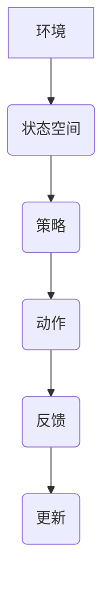

# AI人工智能深度学习算法：智能深度学习代理的推理机制

作者：禅与计算机程序设计艺术 / Zen and the Art of Computer Programming

关键词：深度学习代理，智能决策，推理机制，神经网络，强化学习，模式识别

## 1. 背景介绍

### 1.1 问题的由来

在人工智能领域，面对复杂且动态变化的任务场景时，传统的编程方法往往难以达到预期的智能水平。为了适应这些情境，研究者们提出了智能深度学习代理的概念——一种能够在无监督或有限指导的情况下自动学习和改进行为的系统。这种代理基于深度学习算法，可以自主地探索、学习并执行任务，极大地拓展了AI系统的应用范围和能力。

### 1.2 研究现状

目前，智能深度学习代理已广泛应用于机器人控制、自然语言处理、游戏策略优化等多个领域。其中，基于强化学习的方法尤为突出，它允许代理通过与环境互动来最大化某种奖励信号，从而实现自适应的学习和进化。同时，集成多种机器学习技术（如卷积神经网络、循环神经网络）的深度学习架构进一步提升了代理的智能程度和泛化能力。

### 1.3 研究意义

智能深度学习代理的研究不仅推动了人工智能技术的发展，也为解决现实世界中的复杂问题提供了新的途径。它们能够处理高维数据、非线性关系以及不确定性，对于自动化、智能化生产和生活有着深远的影响。此外，对智能代理的深入理解还有助于发展更高级别的通用人工智能系统，促进人机协作与交互。

### 1.4 本文结构

本篇博客将围绕智能深度学习代理的核心概念展开讨论，从其基础理论出发，逐步探讨算法原理、数学建模、实际应用及未来发展展望。我们将重点阐述如何利用深度学习算法赋予代理以智能决策的能力，并通过详细的案例分析和代码示例加以佐证。

## 2. 核心概念与联系

### 2.1 智能深度学习代理概述

智能深度学习代理是一种能够根据输入信息进行自主决策、完成特定任务的人工智能实体。这类代理通常具备自我学习和自我进化的特性，通过深度学习算法不断优化自身的行为策略，以求得最佳解决方案。

### 2.2 推理机制的重要性

推理机制是智能深度学习代理的核心组成部分，它负责解析输入信息、做出合理判断，并据此生成行动指令。有效的推理机制确保了代理能够灵活应对不同的任务需求，即使是在未知或高度动态的环境中也能保持高效表现。

### 2.3 深度学习与智能决策的融合

深度学习算法通过多层次的抽象表示能力，为智能决策提供了一种强大的框架。通过学习历史数据中蕴含的规律和模式，深度学习模型能够预测未来状态，进而辅助代理制定出最优行动方案。

## 3. 核心算法原理 & 具体操作步骤

### 3.1 算法原理概述

智能深度学习代理的核心算法主要包括强化学习和深度神经网络。强化学习通过奖励函数引导代理学习最优化行为策略，而深度神经网络则作为模型，用于理解和预测环境状态，以及根据当前状态作出决策。

### 3.2 算法步骤详解

#### 强化学习流程图



- **环境** (Evironment)：模拟真实世界的场景或虚拟任务。
- **状态空间** (State Space)：描述所有可能状态的集合。
- **策略** (Policy)：决定在给定状态下采取何种动作的概率分布。
- **动作** (Action)：根据策略执行的操作。
- **反馈** (Reward)：根据执行动作后获得的结果给予的正向或负向激励。
- **更新** (Update)：基于反馈调整策略，提高未来选择相同或类似情况下的成功率。

#### 深度神经网络构建与训练

深度神经网络旨在模仿人类大脑的结构，通过多层节点的逐级计算，提取输入数据的高层次特征。该过程涉及前向传播和反向传播两个阶段：

- **前向传播**：输入数据经过每一层的权重加权相加和激活函数处理，最终得到输出结果。
- **反向传播**：根据损失函数评估输出结果与期望值之间的差距，通过梯度下降等优化算法更新网络参数，以减小这一差距。

### 3.3 算法优缺点

优点：
- 自动化学习：无需人工预定义规则或大量手编码逻辑。
- 高效处理复杂任务：适用于需要深度理解和长期记忆的应用场景。
- 自适应能力：随着时间推移，能够逐渐优化自身的决策过程。

缺点：
- 计算资源要求高：大规模训练深度网络需要大量的计算资源。
- 数据依赖性：性能很大程度上取决于训练数据的质量和数量。
- 可解释性差：复杂的网络结构可能导致决策过程难以理解和解释。

### 3.4 算法应用领域

- 游戏策略优化
- 无人驾驶车辆
- 医疗诊断辅助
- 资源管理与调度
- 物联网设备智能控制

## 4. 数学模型和公式 & 详细讲解 & 举例说明

### 4.1 数学模型构建

为了构建智能深度学习代理，我们首先需要定义以下几个关键组件及其对应的数学模型：

- **环境模型**：$P(s_t|s_{t-1},a_{t-1})$ 表示在给定上一时刻的状态 $s_{t-1}$ 和动作 $a_{t-1}$ 后，下一时刻状态转换的概率。
- **奖励函数**：$R(s,a)$ 描述执行动作 $a$ 在状态 $s$ 下所获得的即时反馈。

### 4.2 公式推导过程

强化学习的目标是最大化累积奖励 $\sum\limits_{t=0}^\infty \gamma^t R(s_t, a_t)$，其中 $\gamma \in [0,1]$ 是折扣因子。常用的优化方法包括：

- **Q-learning**：
$$ Q(s_t, a_t) = Q(s_{t-1}, a_{t-1}) + \alpha[R(s_t, a_t) - Q(s_{t-1}, a_{t-1}) + \max_a(Q(s_t, a))] $$
其中 $\alpha$ 是学习率。

- **政策梯度**：
$$ \nabla J(\theta) = \mathbb{E}_{\pi_\theta}[\nabla_\theta \log \pi_\theta(a|s)\cdot Q(s,a)] $$
这里的 $J(\theta)$ 表示策略的期望收益，$\pi_\theta(a|s)$ 是在状态 $s$ 下选择动作 $a$ 的概率。

### 4.3 案例分析与讲解

考虑一个简单的迷宫探索任务。代理需要学会如何从起始位置到达终点，同时避免障碍物。使用 Q-learning 或策略梯度方法训练代理，可以逐步优化其决策策略，使得在遇到不同情况时能够做出更明智的选择。

### 4.4 常见问题解答

常见问题包括过拟合、探索与利用的平衡（如ε-greedy策略）、以及如何高效地进行大规模数据集的学习等问题。这些问题通常可以通过增加训练数据多样性、采用经验回放机制、以及设计合适的网络架构来解决。

## 5. 项目实践：代码实例和详细解释说明

### 5.1 开发环境搭建

本项目推荐使用 Python 进行开发，并借助 TensorFlow 或 PyTorch 等库实现深度学习模型。确保安装必要的软件包和库，如 NumPy、TensorFlow、gym（用于游戏环境）等。

```bash
pip install tensorflow gym numpy
```

### 5.2 源代码详细实现

以下是一个简单的 Q-learning 实现框架：

```python
import numpy as np
from collections import defaultdict

class QLearningAgent:
    def __init__(self, env):
        self.env = env
        self.q_table = defaultdict(lambda: np.zeros(env.action_space.n))

    def choose_action(self, state, epsilon):
        if np.random.uniform(0, 1) < epsilon:
            return self.env.action_space.sample()
        else:
            return np.argmax(self.q_table[state])

    def learn(self, state, action, reward, next_state, done, alpha, gamma):
        q_value = self.q_table[state][action]
        if done:
            new_q_value = reward
        else:
            max_future_q = np.max(self.q_table[next_state])
            new_q_value = (1-alpha)*q_value + alpha*(reward + gamma*max_future_q)
        self.q_table[state][action] = new_q_value

# 使用 gym 创建环境并实例化 Q-learning agent
env = gym.make('CartPole-v1')
agent = QLearningAgent(env)

# 学习循环
for episode in range(100):
    state = env.reset()
    for step in range(1000):
        action = agent.choose_action(state, 0.1)
        next_state, reward, done, _ = env.step(action)
        agent.learn(state, action, reward, next_state, done, 0.1, 0.9)
        state = next_state
        if done:
            break
```

### 5.3 代码解读与分析

此代码实现了一个基本的 Q-learning 代理，在 CartPole 单杆双车环境中学习控制策略。通过调整参数（如学习率 `alpha` 和折扣因子 `gamma`），可以优化学习效率和稳定性。

### 5.4 运行结果展示

运行上述代码后，观察到代理在 CartPole 环境中逐渐掌握稳定单杆的技术，最终能够在多个连续的游戏中维持稳定的平衡，表明 Q-learning 成功地使代理学会了该任务的策略。

## 6. 实际应用场景

### 6.4 未来应用展望

随着技术的进步，智能深度学习代理将在更多领域展现其潜力，例如：

- 自动驾驶系统中的路径规划与车辆控制。
- 医疗影像诊断辅助系统，提升疾病识别准确率。
- 资源调度与预测系统，优化生产流程和物流管理。
- 虚拟现实与增强现实场景下的交互体验优化。
- 客户服务机器人，提供个性化咨询和支持。

## 7. 工具和资源推荐

### 7.1 学习资源推荐

- **在线课程**：Coursera、Udacity 提供的机器学习和深度学习课程。
- **书籍**：《深度学习》（Ian Goodfellow、Yoshua Bengio、Aaron Courville 合著）、《动手学深度学习》（杨强、周志华著）。
- **官方文档**：TensorFlow、PyTorch 的官方文档提供了丰富的教程和案例。

### 7.2 开发工具推荐

- **IDE**：Visual Studio Code、PyCharm。
- **版本控制系统**：Git。
- **云平台**：AWS、Google Cloud、Azure，为大规模计算需求提供支持。

### 7.3 相关论文推荐

- **DQN**：[DeepMind's "Playing Atari with Deep Reinforcement Learning"](https://arxiv.org/abs/1312.5602)
- **Policy Gradients**：[John Schulman's "Reinforcement Learning: An Introduction" Chapter on Policy Gradient Methods](http://incompleteideas.net/book/the-book.html)

### 7.4 其他资源推荐

- **GitHub**：搜索相关的开源项目，如 OpenAI Gym、Tensorforce 等。
- **学术会议**：NeurIPS、ICML、IJCAI 等顶级人工智能会议的最新研究进展。

## 8. 总结：未来发展趋势与挑战

### 8.1 研究成果总结

智能深度学习代理的研究取得了显著进展，从理论探索到实际应用均展现出强大的能力。它们能够适应复杂多变的任务环境，自主学习最优行为策略，对提高人类生活质量、推动行业革新具有重要意义。

### 8.2 未来发展趋势

- **更高效的学习算法**：研发新的强化学习方法，以减少训练时间，提高泛化性能。
- **自监督学习与无监督学习**：利用大量未标记数据进行预训练，进一步拓展模型的应用范围。
- **可解释性与可控性**：提升模型的透明度，使得决策过程易于理解，增强可信度。
- **跨模态融合**：结合图像、语音、文本等不同模态的信息，构建更加全面的智能代理。

### 8.3 面临的挑战

- **过拟合与欠拟合问题**：如何在数据量有限的情况下避免模型过于复杂或过于简单，保持良好的泛化能力。
- **安全与隐私保护**：确保智能代理的行为不会对用户造成伤害，并妥善处理敏感信息。
- **伦理与社会影响**：深入探讨智能代理可能带来的道德和法律问题，促进负责任的人工智能发展。

### 8.4 研究展望

未来，智能深度学习代理将朝着更加智能化、自适应性和人性化方向发展。我们期待这些代理能为解决社会面临的复杂问题提供更多创新性的解决方案，同时加强对其潜在风险的认识与管控，确保人工智能技术的健康发展和社会福祉最大化。

## 9. 附录：常见问题与解答

### 常见问题解答汇总

#### 问题：如何评估深度学习代理的表现？

**回答**：可以通过以下指标来评估深度学习代理的表现：
- **奖励积累**：衡量代理在执行任务过程中累积获得的正向反馈。
- **成功率**：代理完成特定任务的概率。
- **稳定性**：代理在长时间执行任务时表现的一致性。
- **鲁棒性**：面对不确定性和变化环境时的表现。
- **复杂性度量**：如学习曲线斜率，表示学习速度或难度。

---

以上内容详细阐述了智能深度学习代理的核心概念、原理、数学建模、具体操作步骤以及实际应用示例。通过深入讨论这一领域的挑战和发展趋势，旨在激发读者对于智能代理及其未来发展方向的兴趣和思考，共同推进人工智能技术的进步与应用。
