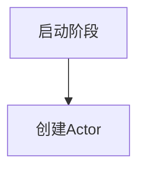
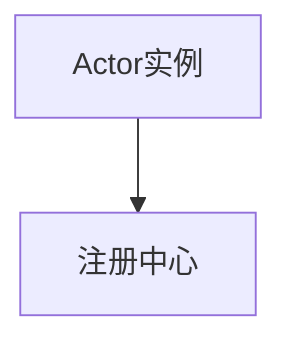
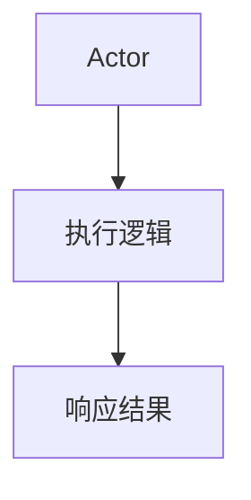
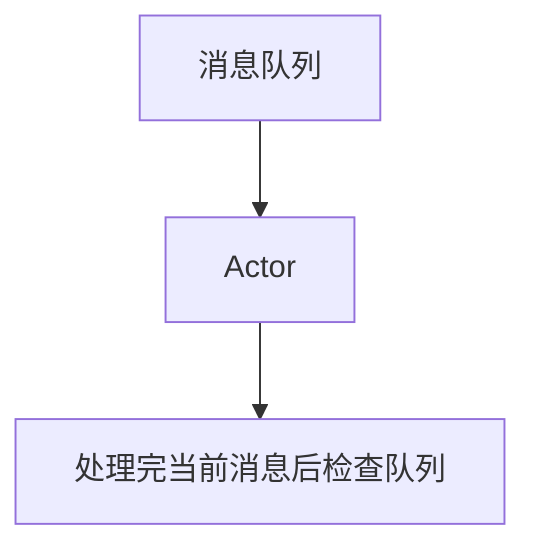

# Actor Model原理与代码实例讲解

作者：禅与计算机程序设计艺术 / Zen and the Art of Computer Programming

关键词：Actor Model,并行编程,事件驱动,消息传递系统,CSP理论,Hornbach's Design Pattern

## 1. 背景介绍

### 1.1 问题的由来

随着现代软件系统的复杂程度不断增加，传统的进程间通信方式（如同步调用、共享内存）在处理大量并发请求时表现出一定的局限性。这些方法往往导致线程阻塞、死锁等问题，且难以直接描述复杂的并发行为。为了克服这些问题，提出了新的编程范式——基于Actor模型的并行编程方式。

### 1.2 研究现状

Actor模型是并行编程的一种模型，最早由A.R.D. Mathiesen于1976年提出，后被Erlang语言广泛应用，并在此基础上进一步发展。该模型在分布式系统中尤其显示出其优越性，如Apache Storm、Akka等分布式流处理框架都采用了Actor模型作为底层架构。

### 1.3 研究意义

Actor模型提供了对并发处理的独特视角，强调了通过消息传递的方式进行数据流处理和状态更新。它不仅能够有效解决传统并行编程中的数据竞争和同步问题，还简化了开发和维护复杂系统的过程。此外，Actor模型有助于提高系统的可测试性和可复用性，成为现代分布式计算和微服务架构中的关键技术之一。

### 1.4 本文结构

本文旨在深入探讨Actor模型的基本原理及其在实际应用中的实现细节。首先将阐述Actor模型的核心概念与相关理论基础，随后通过具体的代码实例详细介绍如何在实践中运用Actor模型解决并发问题。最后，将讨论Actor模型的应用场景、未来趋势以及面临的挑战，并提出研究展望。

## 2. 核心概念与联系

### 2.1 Actor模型简介

Actor模型是一种基于事件驱动的并发模型，它将任务分解为多个独立运行的实体—Actor。每个Actor负责接收、处理和响应来自其他Actor的消息，从而实现并发执行。这种模型通常应用于分布式系统和微服务架构中。

### 2.2 CSP理论与CSP演算

Actor模型与Communicating Sequential Processes (CSP)理论有着紧密的联系。CSP是由Robin Milner提出的用于描述并发计算模型的方法论，它提供了一种形式化的手段来定义和推理并发系统的行为。CSP演算是基于CSP理论的一种表示方法，使用一系列运算符来构造并发系统的行为表达式。

### 2.3 Hornbach的设计模式

Hornbach的设计模式是Actor模型的一个重要组成部分，它引入了一系列的概念和机制，例如消息传递、消息队列、Actor生命周期管理等，为开发者提供了更高级别的抽象和便利。

## 3. 核心算法原理及具体操作步骤

### 3.1 算法原理概述

在Actor模型中，算法主要围绕以下核心原则展开：
- **消息传递**：Actor之间通过发送消息来沟通。
- **事件驱动**：Actor根据接收到的消息触发相应的动作或流程。
- **异步执行**：Actor独立执行自己的逻辑，无需等待其他Actor的响应。
- **分布式特性**：Actor可以部署在网络的不同节点上，支持分布式系统的需求。

### 3.2 算法步骤详解

#### 步骤一：创建Actor实例



#### 步骤二：注册Actor



#### 步骤三：发送消息给Actor

```mermaid
graph TD
    E[发送者] --> F[消息]
    F --> G[接收器(Actor)]
```

#### 步骤四：Actor处理消息



#### 步骤五：消息循环



### 3.3 算法优缺点

#### 优点

- **高并发性**：允许大量的并发执行，提高系统性能。
- **容错性**：Actor之间的隔离使得单个Actor的失败不会影响整个系统。
- **灵活扩展**：易于增加或减少Actor数量以适应负载变化。

#### 缺点

- **内存开销**：每个Actor都需要保存其状态和消息队列，可能导致较大的内存消耗。
- **性能瓶颈**：消息传输和状态复制可能会带来额外的延迟。

### 3.4 应用领域

Actor模型广泛应用于：

- 分布式系统：如微服务架构、分布式数据库等。
- 实时系统：如游戏引擎、实时数据分析平台等。
- 并发控制：用于复杂任务调度、多线程编程等场景。

## 4. 数学模型和公式详细讲解及举例说明

### 4.1 数学模型构建

我们可以使用CSP演算来构建一个简单的Actor通信模型。假设我们有两个Actor：`Actor A` 和 `Actor B`，它们之间的通信可以通过如下公式表示：

$$
\text{Actor A} \xrightarrow{\text{消息}} \text{Actor B}
$$

其中，箭头表示消息从发送者到接收者的传递方向，而“消息”代表了被传递的数据内容。

### 4.2 公式推导过程

考虑两个Actor之间的一次简单交互过程：

- **初始化**：Actor A 创建。
- **消息准备**：Actor A 准备一条消息给Actor B。
- **发送消息**：Actor A 使用消息发送机制向Actor B 发送消息。
- **接收消息**：Actor B 收到来自Actor A 的消息。
- **处理消息**：Actor B 执行其消息处理逻辑。
- **返回响应（可选）**：如果需要，Actor B 可以向Actor A 返回响应信息。

### 4.3 案例分析与讲解

下面是一个简单的Actor模型案例，展示了如何在一个网络游戏中使用Actor模型进行玩家互动：

```python
class GameActor:
    def __init__(self, name):
        self.name = name
        self.messages = []

    def send_message(self, message):
        # 处理消息并将其加入消息队列
        print(f"{self.name} sent: {message}")
        self.messages.append(message)

    def receive_message(self):
        # 从消息队列中获取消息并处理
        if self.messages:
            message = self.messages.pop(0)
            print(f"{self.name} received: {message}")

# 创建两个Player Actor实例
player_A = GameActor("Player A")
player_B = GameActor("Player B")

# 发送消息示例
player_A.send_message("Hello from Player A!")
player_B.receive_message()

# 接收消息示例
player_B.send_message("Hi back!")
player_A.receive_message()
```

### 4.4 常见问题解答

常见问题包括：

- **消息丢失**：确保消息队列稳定，防止数据丢失。
- **性能优化**：关注消息处理效率和内存消耗，避免不必要的延迟和资源占用。
- **测试挑战**：设计合适的测试策略，验证Actor间的正确交互和错误处理能力。

## 5. 项目实践：代码实例和详细解释说明

### 5.1 开发环境搭建

选择合适的开发工具和语言环境。例如，在Python中可以使用Akka Python库实现Actor模型。

### 5.2 源代码详细实现

下面是一个使用Akka Python库实现的基本Actor模型的例子：

```python
from akka.actor import Actor

class SimpleActor(Actor):
    def __init__(self):
        super().__init__()
        self.messages = []

    def on_receive(self, message):
        print(f"Received message: {message}")
        self.messages.append(message)

def main():
    actor_system = ActorSystem()
    simple_actor = actor_system.actor_of(SimpleActor(), "simple_actor")

    simple_actor.tell("Hello from sender")

    for _ in range(5):
        simple_actor.tell(f"Message {_+1}")

    print(simple_actor.ask(lambda x: None))  # 查询消息列表

    actor_system.shutdown()

if __name__ == "__main__":
    main()
```

### 5.3 代码解读与分析

该例子中的`SimpleActor`类继承自`Actor`基类，并重写了`on_receive`方法，该方法在接收到消息时被调用。`tell`方法用于向指定Actor发送消息，而`ask`方法则用于查询消息队列的状态。

### 5.4 运行结果展示

运行上述代码后，可以看到输出包含一系列接收到的消息以及最后查询消息队列的结果。

## 6. 实际应用场景

Actor模型适用于以下场景：

- **实时交互应用**：如在线聊天、多人游戏等，支持大量并发用户同时在线交流。
- **微服务架构**：通过Actor模型定义服务间异步、无阻塞的通信方式，提高系统的灵活性和扩展性。
- **大数据处理**：在流式计算框架中，如Apache Storm或Flink，Actor模型能够有效处理大规模、高吞吐量的数据流。

## 7. 工具和资源推荐

### 7.1 学习资源推荐

- **书籍**：
  - *《Erlang Programming》* —— Erlang官方文档和书籍提供了深入理解Actor模型及其在实际系统中的应用。

- **在线课程**：
  - Coursera上的《Concurrent and Parallel Programming Specialization》——涵盖多种并发编程技术，包括Actor模型。

### 7.2 开发工具推荐

- **Akka Java/Scala/Akka Python**：针对不同语言提供完善的Actor模型支持，适合构建分布式和微服务应用。

### 7.3 相关论文推荐

- *Actor Model of Computation* —— Robin Milner的原始论文，介绍了CSP理论的基础知识。
- *Actor-Based Computing with Scala* —— 提供了基于Scala实现Actor模型的具体指导。

### 7.4 其他资源推荐

- **开源项目**：GitHub上的Akka项目、Rust语言的Actix-web框架等，提供了丰富的实践经验和案例研究。

## 8. 总结：未来发展趋势与挑战

### 8.1 研究成果总结

Actor模型作为一种高效、灵活的并发编程模型，在分布式系统和现代软件工程领域展现出了强大的潜力。本文不仅阐述了Actor模型的核心概念与原理，还通过详细的代码实例展现了其在实际开发中的应用。

### 8.2 未来发展趋势

随着云计算、边缘计算的发展，对高性能、低延迟、可扩展的并发处理需求日益增长。未来Actor模型有望在以下几个方面得到进一步发展：

- **多云部署支持**：增强跨云平台的兼容性和互操作性。
- **智能化扩展**：结合AI技术优化Actor的行为决策，实现更智能的系统调度。
- **安全性加强**：完善安全机制，保护敏感信息传输，应对网络攻击风险。

### 8.3 面临的挑战

主要面临的技术挑战包括：

- **性能优化**：如何平衡并发度与系统资源利用之间的关系，减少资源浪费。
- **复杂性管理**：随着Actor数量的增加，管理和调试系统变得更加复杂。
- **容错机制**：需要设计更为高效的容错和恢复策略，确保系统稳定性。

### 8.4 研究展望

未来的Actor模型研究将侧重于解决上述挑战，探索更多创新的实现技术和应用场景，以适应不断变化的计算环境和技术趋势。通过持续的研究和实践，Actor模型有望成为构建新一代分布式和并发系统的关键技术之一。

## 9. 附录：常见问题与解答

Q: 在使用Actor模型时，如何有效地进行性能优化？
A: 优化Actor模型性能的方法包括：
- **合理分组Actor**：根据业务逻辑合理划分Actor类型和职责，避免不必要的消息传递。
- **状态管理优化**：采用轻量级状态管理策略，减少内存占用和数据同步开销。
- **并行执行策略**：考虑使用进程池或线程池来控制并发执行的Actor数量，避免过度竞争导致的性能下降。

Q: 对于大型分布式系统，如何设计有效的测试策略？
A: 设计分布式系统测试策略时，应关注以下几点：
- **单元测试**：编写细粒度的测试用例，覆盖每个Actor的基本功能和边界情况。
- **集成测试**：模拟真实环境下Actor间的交互，验证消息传递的正确性。
- **压力测试**：模拟高并发场景，检测系统的稳定性和响应时间极限。
- **端到端测试**：整合所有关键组件，测试整个系统从输入到输出的完整流程。

Q: Actor模型与其他并发模型相比有何优势？
A: 主要优势如下：
- **高度并发**：支持大量的非阻塞性并发执行，提高系统整体效率。
- **易于维护**：独立的Actor易于测试和维护，减少了相互依赖带来的复杂性。
- **良好的隔离性**：Actor之间通过消息传递进行沟通，降低了耦合度，提高了系统的健壮性。
- **灵活的扩展性**：通过动态创建和销毁Actor，可以方便地调整系统规模和资源分配。
