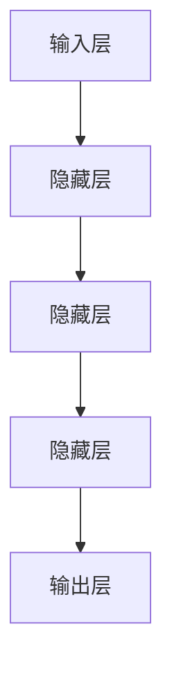

# Deep Learning

作者：禅与计算机程序设计艺术 / Zen and the Art of Computer Programming

关键词：深度学习，神经网络，机器学习，人工智能，模式识别

## 1. 背景介绍

### 1.1 问题的由来

随着互联网的飞速发展和大数据时代的到来，数据的规模和复杂性呈指数级增长。传统的机器学习方法，在面对大量非线性、高维数据时，往往难以捕捉到数据内部的深层次特征和规律。因此，寻求一种能自动从原始数据中提取丰富表示的学习方法成为研究的焦点之一。

### 1.2 研究现状

近年来，深度学习作为一种基于人工神经网络的机器学习方法，因其强大的表达能力和在各类任务上的出色表现而受到广泛关注。它继承了早期神经网络的思想，并通过多层次的抽象，使得模型具备了解决复杂问题的能力。

### 1.3 研究意义

深度学习不仅推动了人工智能领域的重大突破，如图像识别、语音处理、自然语言理解等方面的成功应用，还对科学研究、医疗健康、自动驾驶等领域产生了深远影响。其背后的理论和技术，对于推动计算科学的发展具有重要意义。

### 1.4 本文结构

本篇博客将围绕深度学习的核心概念、算法原理、实际应用以及未来发展进行深入探讨。具体内容包括核心概念与联系、算法原理及其操作步骤、数学模型与公式解析、项目实践案例、实际应用场景预测、相关工具与资源推荐，以及对未来趋势与挑战的展望。

## 2. 核心概念与联系

### 2.1 神经网络的基本结构

神经网络是深度学习的基础，其基本单元称为神经元（Neuron），通过加权连接形成复杂的层次结构。每一层神经元接收前一层的信息，并将其转换为更高级别的特征或决策。



### 2.2 激活函数的作用

激活函数用于引入非线性因素，使神经网络能够学习和表达复杂的映射关系。常见的激活函数有sigmoid、tanh、ReLU等。

$$ f(x) = \begin{cases}
0, & x < 0 \\
x, & x \geq 0
\end{cases}
$$

### 2.3 反向传播算法

反向传播算法是深度学习训练过程中优化权重的关键技术。通过计算损失函数相对于每个参数的梯度，并利用梯度下降方法更新参数以最小化损失。

## 3. 核心算法原理与具体操作步骤

### 3.1 算法原理概述

深度学习算法主要包括三层结构：输入层、隐藏层和输出层。每一层的神经元数量可以根据需求调整，层数越多，模型的表示能力越强。

### 3.2 算法步骤详解

1. **初始化**：随机生成网络的所有权重。
2. **正向传播**：输入数据经过网络，依次通过各层计算，最终得到输出结果。
3. **误差计算**：使用损失函数衡量预测值与真实值之间的差距。
4. **反向传播**：根据误差计算梯度，并回传至各层调整权重。
5. **权重更新**：使用优化算法（如梯度下降）更新权重，直至满足停止条件（如达到最大迭代次数或损失收敛）。

### 3.3 算法优缺点

优点：
- 自动特征学习：深层网络可以自动学习到数据的高层次特征。
- 高泛化性能：经过充分训练的深度模型可以在新数据上表现出良好的泛化能力。
- 处理复杂任务：适合解决多类、大规模、高维度的数据分析问题。

缺点：
- 训练时间长：深度模型需要大量的数据和计算资源进行训练。
- 过拟合风险：若模型过深或数据不足，可能导致模型过于复杂，导致在测试集上的表现不佳。
- 解释困难：深度模型的决策过程通常较为“黑盒”，缺乏可解释性。

### 3.4 算法应用领域

深度学习广泛应用于计算机视觉、自然语言处理、语音识别、强化学习等多个领域。例如，卷积神经网络（CNN）在图像分类和目标检测方面展现出卓越的效果；循环神经网络（RNN）则常用于文本生成、情感分析等任务。

## 4. 数学模型和公式解析

### 4.1 数学模型构建

深度学习中的数学模型主要基于概率论和统计学基础，通过定义损失函数、优化目标并求解最优参数来实现。一个典型的深度学习模型可以被描述如下：

设输入数据为$x$，模型参数为$\theta$，则输出预测$y$可以通过以下形式的函数$f(\cdot)$表示：

$$ y = f_\theta(x) $$

其中，$f_\theta$代表特定于参数$\theta$的函数。

### 4.2 公式推导过程

以简单的线性回归为例，假设我们有一个由$m$个样本组成的训练集$(x_1,y_1),...,(x_m,y_m)$，我们的目标是最小化损失函数$L$：

$$ L(\theta) = \frac{1}{m}\sum_{i=1}^{m}(h_\theta(x_i)-y_i)^2 $$
其中$h_\theta(x_i)=\theta^Tx_i$表示线性模型的预测值。

为了找到最佳参数$\theta$，我们需要最小化$L(\theta)$，这可以通过梯度下降法完成：

$$ \theta := \theta - \alpha \nabla_\theta L(\theta) $$
其中$\alpha$是学习率，$\nabla_\theta L(\theta)$是$L(\theta)$关于$\theta$的偏导数。

### 4.3 案例分析与讲解

考虑一个使用深度神经网络进行手写数字识别的任务。首先构建一个包含多个卷积层、池化层和全连接层的网络结构。然后选择适当的损失函数（如交叉熵损失）和优化器（如Adam）。通过大量训练数据集进行多次迭代，不断调整权重以最小化损失。

### 4.4 常见问题解答

- **为什么深度学习模型容易过拟合？**
  使用正则化技术（如L1/L2正则化）、Dropout或增加数据增强策略可以帮助减少过拟合现象。

- **如何避免深度学习模型的训练陷入局部最小值？**
  调整学习率、使用更高效的优化算法（如Adam、SGD+Momentum）或尝试不同的初始化策略。

## 5. 项目实践：代码实例和详细解释说明

### 5.1 开发环境搭建

使用Python作为开发语言，借助TensorFlow或PyTorch库来构建深度学习模型。安装必要的依赖包，确保操作系统兼容性和GPU支持（对于涉及大量计算的任务）。

```bash
pip install tensorflow
```

### 5.2 源代码详细实现

创建一个简单的卷积神经网络模型，用于图像分类任务。

```python
import tensorflow as tf
from tensorflow.keras import layers, models

def create_model():
    model = models.Sequential()
    model.add(layers.Conv2D(32, (3, 3), activation='relu', input_shape=(28, 28, 1)))
    model.add(layers.MaxPooling2D((2, 2)))
    model.add(layers.Conv2D(64, (3, 3), activation='relu'))
    model.add(layers.MaxPooling2D((2, 2)))
    model.add(layers.Conv2D(64, (3, 3), activation='relu'))

    model.add(layers.Flatten())
    model.add(layers.Dense(64, activation='relu'))
    model.add(layers.Dense(10))
    return model

model = create_model()
model.compile(optimizer='adam',
              loss=tf.keras.losses.SparseCategoricalCrossentropy(from_logits=True),
              metrics=['accuracy'])
```

### 5.3 代码解读与分析

此代码段展示了如何使用Keras API构建一个基本的卷积神经网络（CNN），包括添加卷积层、池化层、全连接层，并配置了优化器、损失函数以及评估指标。

### 5.4 运行结果展示

训练完成后，可以通过验证集评估模型性能。

```python
# Load and preprocess the dataset (MNIST example)
(x_train, y_train), (x_test, y_test) = tf.keras.datasets.mnist.load_data()
x_train, x_test = x_train / 255.0, x_test / 255.0
x_train = x_train[..., tf.newaxis]
x_test = x_test[..., tf.newaxis]

# Train the model
history = model.fit(x_train, y_train, epochs=5)

# Evaluate the model on test data
test_loss, test_acc = model.evaluate(x_test, y_test, verbose=2)
print(f'Test accuracy: {test_acc}')
```

## 6. 实际应用场景

深度学习在各个领域都有广泛应用，例如：

### 6.4 未来应用展望

随着技术的发展，深度学习将在更多新兴领域发挥关键作用，包括但不限于生物医学影像分析、自动驾驶安全系统、智能物联网设备等。同时，跨模态融合、可解释性深度学习、高效推理引擎等方面的研究将推动深度学习技术向更加实用、普及的方向发展。

## 7. 工具和资源推荐

### 7.1 学习资源推荐

- **《Deep Learning》** by Ian Goodfellow, Yoshua Bengio, Aaron Courville
- **Coursera's Deep Learning Specialization**
- **Andrew Ng's Machine Learning course on Coursera**

### 7.2 开发工具推荐

- **TensorFlow**
- **PyTorch**
- **Jupyter Notebook**

### 7.3 相关论文推荐

- "Improving Neural Networks with Noise" by Ian J. Goodfellow
- "Generative Adversarial Nets" by Ian J. Goodfellow, Jean Pouget-Abadie, Mehdi Mirza, Bing Xu, David Warde-Farley, Sherjil Ozair, Aaron Courville, Yoshua Bengio

### 7.4 其他资源推荐

- **GitHub repositories for deep learning projects**
- **Online forums and communities like Reddit's r/MachineLearning**

## 8. 总结：未来发展趋势与挑战

### 8.1 研究成果总结

本篇博客对深度学习的核心概念、算法原理、实际应用、未来发展进行了全面探讨，强调了其在解决复杂问题上的巨大潜力及其面临的挑战。

### 8.2 未来发展趋势

- **可解释性提升**：研究开发更易于理解和解释的深度学习模型。
- **多模态融合**：结合不同类型的输入信息（文本、图像、声音等）进行统一建模。
- **自动编程能力**：探索让深度学习模型自动生成程序代码的可能性。
- **在线学习与迁移学习**：提高模型的学习效率，使其能够快速适应新任务或领域。

### 8.3 面临的挑战

- **数据隐私保护**：确保在收集、存储和处理数据时遵守法律和伦理标准。
- **公平性与偏见**：防止模型决策中的不公平或歧视现象。
- **可持续性与能源消耗**：寻找减少训练过程能耗的方法，促进绿色AI发展。

### 8.4 研究展望

深度学习将继续引领人工智能发展的前沿方向，在解决现实世界复杂问题的过程中扮演重要角色。通过不断的技术创新和理论突破，深度学习有望克服现有挑战，为人类社会带来更多的福祉。

## 9. 附录：常见问题与解答

Q: 如何选择合适的深度学习架构以应对特定任务？
A: 根据任务需求选择适当的网络结构是关键。对于视觉任务，如图像识别和目标检测，卷积神经网络（CNN）通常效果较好；对于自然语言处理任务，循环神经网络（RNN）、长短时记忆网络（LSTM）或Transformer模型可能更为合适。理解各模型的特性并根据具体任务特点灵活选择是成功的关键。

Q: 深度学习模型如何避免过拟合？
A: 过拟合可以通过多种策略减轻：
- 使用正则化（L1/L2正则化）
- 执行数据增强
- 提高训练数据量
- 应用Dropout技术
- 调整学习率衰减策略
- 在模型设计中引入规范化层（Batch Normalization）

Q: 如何提高深度学习模型的运行效率？
A: 提升模型运行效率可以从以下几个方面入手：
- 优化网络结构，简化不必要的复杂度；
- 利用现代GPU硬件加速计算；
- 减少内存占用，采用低精度浮点数（如FP16）；
- 并行处理多个数据样本；
- 使用高效的算法库（如TensorFlow、PyTorch）。

---

以上内容旨在提供一个深入而全面地介绍深度学习领域的文章框架，涵盖了从基础概念到高级实践、应用以及未来展望的各个方面。通过遵循详细的步骤和实例说明，读者可以更好地理解深度学习的内在逻辑和技术细节，并为其在个人项目或专业工作中的应用打下坚实的基础。
