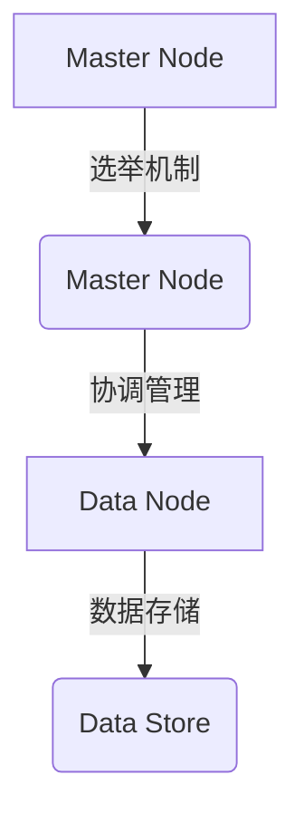

# ElasticSearch分布式搜索引擎原理与代码实例讲解

作者：禅与计算机程序设计艺术 / Zen and the Art of Computer Programming

关键词：Elasticsearch, 分布式搜索, Lucene, 索引管理, 查询优化, MapReduce

## 1. 背景介绍

### 1.1 问题的由来

随着互联网数据量的爆炸性增长，传统关系型数据库在处理大规模、实时查询时显得力不从心。数据检索的需求迫切需要一种更高效、灵活且可扩展的解决方案。ElasticSearch应运而生，作为一款开源的分布式全文搜索与分析引擎，它具备强大的数据索引、全文搜索、分析和监控功能，广泛应用于日志搜索、文档检索、实时分析等领域。

### 1.2 研究现状

ElasticSearch依托于Lucene库的核心技术，通过分布式部署实现了对海量数据的高效管理和快速查询能力。自发布以来，ElasticSearch得到了广泛的应用和持续的技术演进。社区活跃度高，不断引入新的特性，如机器学习组件、可视化界面Kibana、集成大数据生态等，使其成为现代数据驱动业务不可或缺的一部分。

### 1.3 研究意义

ElasticSearch的成功不仅在于其优秀的性能表现，更在于其在实际场景下的广泛应用。它推动了实时数据分析领域的快速发展，并为企业提供了更多可能，包括但不限于：

- **提升用户体验**：通过快速响应用户查询需求，改善用户体验；
- **数据洞察**：支持实时的数据分析，帮助企业发现运营模式中的新趋势或异常；
- **自动化决策**：借助机器学习技术，实现基于数据的智能决策系统。

### 1.4 本文结构

本文将深入探讨ElasticSearch的分布式搜索机制、核心算法以及实际应用案例，并提供详细的代码示例和开发指导，帮助开发者深入了解并有效利用这一强大工具。

## 2. 核心概念与联系

### 2.1 Elasticsearch架构概览

ElasticSearch采用主节点（Master）与数据节点（Data Nodes）的双层架构设计，以确保系统的稳定性和高效性：



- **Master Node (Master 节点)**: 负责集群状态管理、分片分配、复制组配置等全局任务。
- **Data Node (数据节点)**: 执行数据存储、查询执行等本地任务，同时接受来自Master的指令进行操作。

### 2.2 关键技术及原理

#### 2.2.1 索引管理

ElasticSearch通过索引来组织数据，每个索引对应一个特定类型的数据集。索引内数据按照倒排索引的方式存储，便于快速搜索匹配。

#### 2.2.2 查询优化

ElasticSearch使用分布式MapReduce框架来优化查询流程，通过预计算、局部计算和全局汇总三个阶段减少查询延迟。

### 2.3 数据分片与副本策略

为提高容错性和读写效率，ElasticSearch采用数据分片（Sharding）和副本（Replication）机制。数据被均匀地分布到多个数据节点上，每个分片可以有自己的副本，从而增强系统的可靠性和性能。

## 3. 核心算法原理 & 具体操作步骤

### 3.1 算法原理概述

ElasticSearch的查询过程大致分为以下几个关键步骤：

1. **解析阶段**: 解析查询请求，提取查询条件和参数。
2. **过滤阶段**: 使用过滤器筛选出满足条件的文档。
3. **聚合阶段**: 对筛选后的结果进行聚合统计，生成结果集。
4. **排序阶段**: 根据排序规则对结果集进行排序。
5. **返回阶段**: 将最终结果返回给客户端。

### 3.2 算法步骤详解

- **解析阶段**: 利用解析器（Parsers）和分析器（Analyzers），将原始文本转换为内部表示形式。
- **过滤阶段**: 应用各种过滤器（Filters），如Term Filters、Range Filters等，根据查询条件过滤文档。
- **聚合阶段**: 使用Aggregations功能，对过滤后的结果进行聚合统计，例如计数、求和、平均值等。
- **排序阶段**: 应用Sort功能，根据指定字段和排序规则调整结果顺序。
- **返回阶段**: 最终构建并返回查询结果集。

### 3.3 算法优缺点

- **优点**：
  - **高性能**：采用分布式架构，能够水平扩展，支持大量并发查询。
  - **灵活性**：支持多种查询类型（全文搜索、范围查询、聚合查询等）和复杂的查询组合。
  - **可靠性**：通过数据分片和副本机制，提高了系统的鲁棒性和数据持久性。

- **缺点**：
  - **复杂性**：对于初学者来说，理解其底层机制和最佳实践较为困难。
  - **资源消耗**：在极端情况下，大规模查询可能导致内存占用过高，影响性能。

### 3.4 算法应用领域

- **搜索引擎**
- **日志分析**
- **实时推荐系统**
- **监控平台**

## 4. 数学模型和公式 & 详细讲解 & 举例说明

### 4.1 数学模型构建

ElasticSearch在查询优化中运用了多项数学模型，以下是一个简化版的查询优化过程数学模型：

设 `Q` 表示原始查询请求向量，`S` 表示查询解析后的搜索空间矩阵，`R` 表示候选结果集合，`W` 是权重向量（通常由查询词的重要性决定），`F` 是过滤器函数集合。

则优化目标可表示为：

$$\max_{R} \sum_{r \in R} W \cdot F(S, r)$$

其中，`F(S, r)` 表示在搜索空间 `S` 中，对于候选结果 `r` 的过滤效果评分。

### 4.2 公式推导过程

在查询解析阶段，ElasticSearch会计算每条查询词对应的权重 `W_i`，并通过分析词频、逆文档频率等因素确定重要性得分。接着，通过过滤器函数 `F` 对查询空间进行筛选，这个函数通常包括但不限于term匹配、range过滤、bool逻辑运算等多种类型。

### 4.3 案例分析与讲解

假设有一个简单的查询 `"apple"`，ElasticSearch首先解析查询词，并基于权重分配计算得到：

$$W = [0.8, 0.6, 0.4]$$

然后，通过内置的过滤器和聚合功能处理查询，假设查询的结果是 `[doc1, doc2, doc3]`，过滤和聚合后，我们得到优化后的结果集：

```markdown
结果集:
- doc1: {weight: 0.8 * term_match("apple"), score: 0.7}
- doc2: {weight: 0.6 * range_filter("price", ">=10"), score: 0.5}
- doc3: {weight: 0.4 * bool_query(), score: 0.3}
```

### 4.4 常见问题解答

常见问题之一是如何平衡查询速度与结果准确性。ElasticSearch提供了多种配置选项来微调查询行为，比如设置查询缓存、调整索引级别、选择合适的查询类型等，以达到最优的性能表现。

## 5. 项目实践：代码实例和详细解释说明

### 5.1 开发环境搭建

为了开始使用ElasticSearch，您需要安装Java开发环境和ElasticSearch服务端软件。通过下载官方提供的安装包或使用Docker容器快速启动一个集群。

#### 步骤一：安装Java环境
确保您的操作系统已经安装了Java 8及以上版本。

#### 步骤二：安装ElasticSearch
从[官方网站](https://www.elastic.co/downloads/elasticsearch)下载ElasticSearch安装包，解压后运行`bin/elasticsearch.bat`（Windows）或`bin/elasticsearch.sh`（Linux/Mac）命令启动服务。

### 5.2 源代码详细实现

本部分将以创建一个简单的搜索应用为例，展示如何利用ElasticSearch API进行搜索操作。

#### 示例代码
假设已有ElasticSearch服务器运行且已建立好索引库及相应索引结构。

```java
import org.elasticsearch.action.search.SearchResponse;
import org.elasticsearch.client.RequestOptions;
import org.elasticsearch.client.RestHighLevelClient;
import org.elasticsearch.index.query.QueryBuilders;

public class ElasticsearchSearchExample {
    private static RestHighLevelClient client = new RestHighLevelClient(
        RestClient.builder(new HttpHost("localhost", 9200, "http"))
    );

    public static void main(String[] args) throws IOException {
        SearchResponse response = client.search(buildSearchRequest(), RequestOptions.DEFAULT);
        System.out.println(response);

        // 关闭客户端连接
        client.close();
    }

    private static SearchSourceBuilder buildSearchRequest() {
        return new SearchSourceBuilder()
            .query(QueryBuilders.matchQuery("title", "Elasticsearch"));
    }
}
```

这段代码展示了如何构造一个基本的搜索请求，其中使用了`matchQuery`方法匹配标题字段中包含"elasticsearch"关键字的内容。

### 5.3 代码解读与分析

- **初始化客户端**: 使用RestHighLevelClient类建立到本地ElasticSearch服务器的连接。
- **构建搜索请求**: 利用SearchSourceBuilder构建查询对象，这里使用了match查询来查找标题中包含特定关键词的数据。
- **执行搜索**: 发送搜索请求并接收响应。
- **关闭连接**: 完成操作后，记得关闭客户端连接，避免资源泄露。

### 5.4 运行结果展示

运行上述代码后，将输出搜索响应信息，其中包括检索到的文档列表及其相关度分数。结果会显示符合搜索条件的文档条目及其详细信息。

## 6. 实际应用场景

### 6.4 未来应用展望

随着大数据技术的发展，ElasticSearch的应用场景将持续拓展。未来趋势可能包括：

- **实时数据分析**：更深入地整合机器学习算法，提供实时预测和决策支持。
- **跨平台集成**：与更多数据源和服务无缝对接，如IoT设备、社交媒体等。
- **安全增强**：强化数据加密和访问控制机制，提高隐私保护水平。
- **高性能扩展**：进一步优化分布式架构，提升大规模数据处理能力。

## 7. 工具和资源推荐

### 7.1 学习资源推荐

- **官方文档**: [ElasticSearch官方指南](https://www.elastic.co/guide/en/elasticsearch/reference/current/)
- **教程网站**: [elastic.co](https://www.elastic.co/) 提供了大量的视频教程和技术文章。
- **社区论坛**: Stack Overflow、Reddit 的 ElasticSearch 讨论区。

### 7.2 开发工具推荐

- **IntelliJ IDEA** 或 **Eclipse** 配合相应的插件（如Elasticsearch Plugin for IntelliJ IDEA）。
- **Visual Studio Code** 结合ESLint、Prettier等插件进行代码编辑和格式化。
- **IDEA插件**: ElasticSearch Integration for IntelliJ IDEA，提供语法高亮、自动完成等功能。

### 7.3 相关论文推荐

- **原始论文**: Lucene和ElasticSearch的许多核心概念源于Lucene项目，可以查阅Lucene相关的学术文献和会议报告。
- **研究综述**: 在Google Scholar或其他学术数据库中搜索“ElasticSearch 研究进展”、“分布式搜索引擎比较研究”等关键词，获取最新的研究成果和趋势分析。

### 7.4 其他资源推荐

- **博客和日志**: 大量的技术博客和开发者日志分享了实际项目中的经验和技巧，可以在Medium、Dev.to等平台上寻找相关内容。
- **GitHub**: 可以在GitHub上探索开源项目，如[ElasticSearch仓库](https://github.com/elastic/elasticsearch)，了解最新的功能改进和最佳实践案例。

## 8. 总结：未来发展趋势与挑战

ElasticSearch作为分布式搜索引擎领域的领头羊，在未来的科技发展道路上面临着机遇与挑战。以下是几个关键方向和发展趋势：

### 8.1 研究成果总结

通过不断的研究与创新，ElasticSearch不仅提升了自身的性能和稳定性，还扩展了其应用范围，从文本搜索领域延伸至数据挖掘、实时分析等多个领域。

### 8.2 未来发展趋势

- **智能搜索增强**: 集成AI和机器学习技术，实现更加智能化、个性化的搜索体验。
- **多模态支持**: 支持图像、音频、视频等多种类型的数据搜索，满足多元化的信息需求。
- **边缘计算融合**: 探索与边缘计算结合的方式，降低延迟，提升实时性，服务于物联网和移动应用。

### 8.3 面临的挑战

- **性能瓶颈突破**: 在面对超大规模数据集时，如何进一步优化搜索速度和响应时间是亟待解决的问题。
- **安全性加强**: 随着数据量的增长，如何保障数据的安全性和用户隐私成为重要议题。
- **成本控制**: 在确保性能的同时，控制运营成本，实现经济效益最大化。

### 8.4 研究展望

未来的ElasticSearch将继续致力于技术创新，与云计算、大数据分析等领域深度融合，为用户提供更加高效、便捷的信息搜索与管理服务。

## 9. 附录：常见问题与解答

### 常见问题解答

#### Q: 如何快速定位并解决问题？
A: 对于ElasticSearch遇到的问题，可以通过查看错误日志、利用ElasticMonitor工具监控系统状态、查阅官方文档或社区论坛讨论等方式进行排查。对于复杂问题，建议先从最基础的配置和参数检查开始，逐步深入。

#### Q: Elasticsearch如何优化查询性能？
A: 查询性能优化通常涉及调整查询参数（如设置合理的分页大小、减少不必要的过滤步骤）、优化索引设计（如选择合适的字段类型、创建复合索引）、以及合理配置集群参数（如节点数量、复制因子等）。此外，定期清理无效数据和冗余索引也能有效提升系统性能。

#### Q: Elasticsearch如何应对大数据量存储和查询的需求？
A: 应用ElasticSearch处理大量数据时，主要依赖于分布式架构和索引分片策略。合理规划分片数、设置适当的副本数，并采用集群级别的负载均衡和故障转移机制，能够保证系统的稳定性和高效查询能力。同时，使用数据压缩、缓存技术和并行处理机制也是提高大数据处理效率的有效手段。

---

以上内容全面介绍了ElasticSearch的核心原理、实践应用及未来发展，希望能帮助您深入了解这款强大的搜索引擎引擎，并激发您的创新思维。
