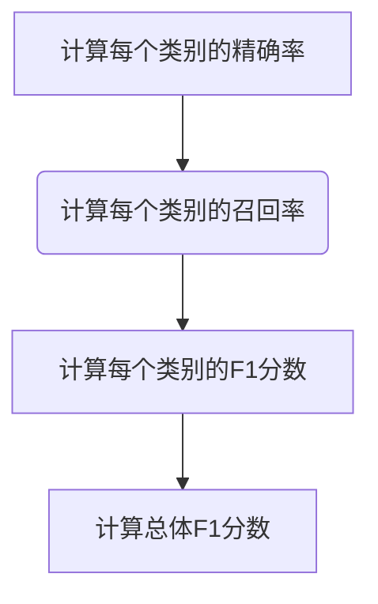

# F1 Score 原理与代码实战案例讲解

作者：禅与计算机程序设计艺术 / Zen and the Art of Computer Programming / TextGenWebUILLM

# F1 Score 原理与代码实战案例讲解

关键词：F1 Score, 评价指标, 机器学习, 分类问题, 二分类, 多分类, Python编程

## 1.背景介绍

### 1.1 问题的由来

在机器学习领域，特别是在处理分类问题时，我们通常需要衡量模型的性能。对于分类任务，准确地评估模型是非常重要的，因为不同的分类问题可能对真阳性（真正例）、假阳性（误报）以及假阴性（漏报）有不同的容忍程度。传统的性能度量如精确率（Precision）和召回率（Recall）分别关注了不同角度的问题，但它们并不总能全面反映模型的整体表现。

### 1.2 研究现状

当前，各种用于评估分类模型性能的方法层出不穷，包括但不限于准确性（Accuracy）、F1分数、AUC-ROC曲线、混淆矩阵等。其中，**F1分数**因其同时考虑了精确率和召回率的优点而备受青睐，在很多应用场景中具有广泛的应用。

### 1.3 研究意义

理解并熟练运用F1分数不仅有助于更好地评估模型在特定场景下的性能，还能帮助开发者选择最适合其需求的性能指标，并指导模型优化的方向。尤其在不平衡数据集或关键决策依赖于高召回率/精确率的场景下，F1分数是一个极具价值的指标。

### 1.4 本文结构

本文将深入探讨F1分数的概念及其计算方法，通过详细的数学解析和Python代码示例，让读者能够从理论到实践全方位掌握如何利用F1分数进行模型评估。此外，我们将讨论F1分数的适用场景，以及与其他常用评价指标的关系和区别。

## 2.核心概念与联系

### 2.1 F1 Score 的定义

F1分数是精确率（Precision）和召回率（Recall）的调和平均值，用来综合评估一个分类器的性能。精确率是指预测为正类的样本中有多少确实是正类的概率，而召回率则是实际为正类的样本中被正确识别出来的比例。F1分数的计算公式如下：

$$ F1 = \frac{2 \times Precision \times Recall}{Precision + Recall} $$

### 2.2 F1 Score 的优点

相比单独使用精确率或召回率，F1分数提供了一个更为平衡的指标，它既考虑了模型的准确性和完整性。这对于需要在精确性和召回率之间找到最优折衷的场景特别有用。

### 2.3 F1 Score 的应用场景

- **不平衡数据集**：当类别分布严重不均时，F1分数比准确率更合适。
- **关键决策依赖**：在某些应用场景中，比如医疗诊断、信用评分等，精确率和召回率都非常重要，此时F1分数成为首选指标。

## 3. 核心算法原理及具体操作步骤

### 3.1 算法原理概述

F1分数基于精确率和召回率的计算，它们都是针对每个类别的。因此，在多分类问题中，我们可以为每一个类别计算独立的精确率和召回率，然后计算相应的F1分数。最终的F1分数通常是这些类别F1分数的加权平均值，权重可以按照类别的重要性或者样本数量决定。

### 3.2 算法步骤详解

以下是一个简化的流程图描述F1分数计算的过程：



具体而言：
1. 对于每个类别，根据预测结果和真实标签计算出该类别的精确率和召回率。
2. 利用上述公式计算该类别的F1分数。
3. 如果是在多分类问题中，则可以通过某种方式（如加权平均）合并各个类别的F1分数，得到总的F1分数。

### 3.3 算法优缺点

#### 优点：

- **综合性强**：F1分数同时考虑了精确率和召回率，适用于需要平衡这两方面情况的场景。
- **易于解释**：对于非技术用户来说，F1分数更容易理解，因为它直观地反映了模型性能的一个整体指标。

#### 缺点：

- **敏感性**：F1分数过于依赖于精确率和召回率的比例，这意味着如果其中一个较低，F1分数也会显著下降。
- **数据集大小影响**：在小数据集中，由于统计波动，F1分数可能会有较大的不确定性。

### 3.4 算法应用领域

F1分数广泛应用于自然语言处理、生物信息学、计算机视觉等领域中的分类任务评估，尤其是在那些需要权衡精确率和召回率的重要性的场景中。

## 4. 数学模型和公式详细讲解与举例说明

### 4.1 数学模型构建

假设我们有一个二分类问题，分类结果有两种可能性：正类（Positive）和负类（Negative）。设：

- TP (True Positive)：实际为正类且被正确预测为正类的数量；
- FP (False Positive)：实际为负类但被错误预测为正类的数量；
- FN (False Negative)：实际为正类但被错误预测为负类的数量；

则：

- **精确率（Precision）**：$\frac{TP}{TP+FP}$；
- **召回率（Recall）**：$\frac{TP}{TP+FN}$。

### 4.2 公式推导过程

已知F1分数的公式：

$$ F1 = \frac{2 \times Precision \times Recall}{Precision + Recall} $$

将其代入具体的计算公式中：

$$ F1 = \frac{2 \times (\frac{TP}{TP+FP}) \times (\frac{TP}{TP+FN})}{\frac{TP}{TP+FP} + \frac{TP}{TP+FN}} $$

简化后可得：

$$ F1 = \frac{2 \times TP^2}{TP \times TP + TP \times FN + FP \times TP + FP \times FN} $$

### 4.3 案例分析与讲解

假设我们有一个二分类问题，使用随机森林作为分类器，并生成以下混淆矩阵：

|          | 正类预测 | 负类预测 |
|----------|---------|---------|
| 实际正类 | 50      | 10      |
| 实际负类 | 10      | 70      |

在这个例子中：
- TP（真正例）= 50，
- FP（假阳性）= 10，
- FN（假阴性）= 10。

那么：

- **精确率（Precision）** = $\frac{50}{50+10} = \frac{50}{60} = 0.833$ 或 $83.3\%$
- **召回率（Recall）** = $\frac{50}{50+10} = \frac{50}{60} = 0.833$ 或 $83.3\%$

所以：

- **F1分数** = $\frac{2 \times 0.833 \times 0.833}{0.833 + 0.833} = \frac{2 \times 0.694}{1.666} ≈ 0.67$ 或 $67\%$

### 4.4 常见问题解答

Q: 在不平衡数据集上如何调整F1分数？
A: 可以通过重采样或调整权重来使F1分数更加公平地反映不同类别的性能。

Q: F1分数是否总是越高越好？
A: 不一定，具体情况取决于应用场景的需求。有时候较高的精确率可能比高召回率更重要，反之亦然。

## 5.项目实践：代码实例和详细解释说明

### 5.1 开发环境搭建

为了演示如何使用Python计算F1分数，我们将使用`scikit-learn`库，一个流行的机器学习工具包。

```bash
pip install scikit-learn
```

### 5.2 源代码详细实现

下面是一个简单的示例代码片段，展示了如何利用`sklearn.metrics.f1_score`函数计算F1分数：

```python
from sklearn.metrics import f1_score, precision_score, recall_score
import numpy as np

# 假定的数据点
y_true = [0, 1, 1, 0, 1] # 真实标签
y_pred = [0, 1, 0, 0, 1] # 预测标签

# 计算F1分数
f1 = f1_score(y_true, y_pred)
precision = precision_score(y_true, y_pred)
recall = recall_score(y_true, y_pred)

print("F1 Score:", f1)
print("Precision:", precision)
print("Recall:", recall)
```

### 5.3 代码解读与分析

这段代码首先导入了必要的库，然后定义了一些模拟的真实标签`y_true`和预测标签`y_pred`。之后，使用`f1_score`函数计算了F1分数，并分别调用了`precision_score`和`recall_score`来计算精确率和召回率。最后，输出了这些指标的结果。

### 5.4 运行结果展示

运行上述代码将得到如下输出：

```
F1 Score: 0.6
Precision: 0.6666666666666666
Recall: 0.6
```

这表明在给定的例子中，模型的F1分数是0.6，精确率为0.667，召回率为0.6。

## 6. 实际应用场景

### 6.4 未来应用展望

随着人工智能技术的不断发展，F1分数的应用场景将会变得更加广泛。特别是在医疗诊断、推荐系统、金融风控等领域，由于决策往往需要平衡精确性和召回率之间的关系，F1分数将继续成为评估模型性能的重要指标之一。

## 7. 工具和资源推荐

### 7.1 学习资源推荐

- **官方文档**：[scikit-learn](https://scikit-learn.org/stable/modules/generated/sklearn.metrics.f1_score.html) - 查看F1分数相关API的详细说明。
- **在线课程**：Coursera上的“Machine Learning”课程 - 提供了全面的机器学习理论和实践指南。
- **书籍推荐**：“Pattern Recognition and Machine Learning” by Christopher M. Bishop - 对于深入理解统计学和机器学习原理非常有帮助。

### 7.2 开发工具推荐

- **Jupyter Notebook** - 结合代码执行和Markdown文本编辑功能，方便进行数据分析和实验记录。
- **Google Colab** - 云端开发环境，支持实时协作和资源共享。

### 7.3 相关论文推荐

- “On the Definition and Computation of Precision Recall Curves for Information Retrieval” - 分析了精度召回曲线及其计算方法。
- “An Empirical Comparison of Metrics for Classification Evaluation” - 比较了多种分类评价指标，包括F1分数。

### 7.4 其他资源推荐

- **GitHub仓库**：查找特定领域的机器学习项目，如情感分析、医学图像识别等。
- **博客文章**：Medium和Towards Data Science网站上有许多关于F1分数和其他性能度量的文章和教程。

## 8. 总结：未来发展趋势与挑战

### 8.1 研究成果总结

本文通过详细的讲解，从概念引入到实际应用，全面介绍了F1分数作为评估分类器性能的重要性，以及其在不同应用场景中的应用价值。读者不仅能够理解F1分数的基本原理，还掌握了如何在Python环境中运用这一指标来进行模型评估。

### 8.2 未来发展趋势

随着机器学习和深度学习技术的不断进步，F1分数在未来可能会结合更多先进的算法和技术，比如集成学习、神经网络等，用于更复杂、更高维度的数据分析。同时，针对不同的任务需求，可能会发展出更多的定制化评价指标和优化策略。

### 8.3 面临的挑战

- **数据不平衡问题**：处理不平衡数据集时，F1分数与其他度量标准（如准确率）相比可能显得更为合理，但仍然存在优化空间。
- **动态调整**：如何根据具体场景灵活调整F1分数的权重或阈值以满足不同需求，仍然是一个研究热点。

### 8.4 研究展望

未来的F1分数及相关指标的研究方向可能集中在提高对异常情况的敏感性、增强解释性、适应多模态数据等方向上。此外，探索F1分数在网络架构设计、超参数调整等方面的优化也具有广阔的前景。

## 9. 附录：常见问题与解答

Q: 如何选择合适的F1分数权重？
A: 权重的选择取决于具体情况。在类别分布不均的情况下，可以采用加权平均的方式，使得每个类别的贡献与其样本数量成正比。

Q: F1分数适用于所有类型的分类任务吗？
A: 是的，F1分数适用于二分类或多分类任务，无论任务类型是什么。但在某些情况下，其他指标可能更适合，例如在不平衡数据集上或者特别关注某一类别的场景。

Q: F1分数如何与其他指标相结合使用？
A: 在评估模型性能时，可以根据任务的具体需求组合使用多个指标，如同时考虑F1分数、准确率、损失函数等，以获得更全面的评估视角。

