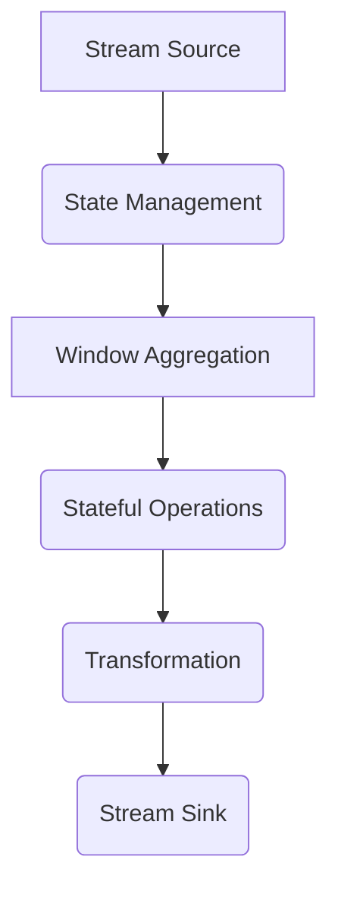

# Flink 有状态流处理和容错机制原理与代码实例讲解

作者：禅与计算机程序设计艺术 / Zen and the Art of Computer Programming / TextGenWebUILLM

# Flink 有状态流处理和容错机制原理与代码实例讲解

关键词：Apache Flink, 状态处理, 数据流处理, 容错机制, 并行计算, 窗口聚合

## 1. 背景介绍

### 1.1 问题的由来

在大数据和实时数据处理领域，数据流通常是指连续不断地产生数据记录的数据源。对于这些数据流，我们需要实时地对数据进行处理、分析，并且能够在系统故障时恢复处理的状态，这需要高效且可靠的流处理引擎。Apache Flink 是一个广泛使用的开源流处理框架，它提供了丰富的功能集，支持多种类型的数据源接入、复杂的窗口聚合操作、以及强大的容错能力。

### 1.2 研究现状

近年来，随着云计算和物联网的发展，实时数据分析的需求日益增长。Flink 在这一背景下得到了广泛应用，不仅在商业智能、金融风控等领域展现出其价值，而且也在工业监控、网络流量分析等方面发挥了重要作用。研究者们持续关注 Flink 的性能优化、新特性和生态系统扩展，以满足不断变化的技术需求。

### 1.3 研究意义

理解 Flink 的有状态流处理及容错机制对于开发者和研究者具有重要意义。它不仅能够帮助他们更有效地开发基于流数据的应用程序，还能够促进社区知识和技术的传播。此外，深入学习 Flink 可以提高处理大规模实时数据的能力，进而推动行业创新和发展。

### 1.4 本文结构

本篇文章将分为以下几个部分：

- **核心概念与联系**：阐述 Flink 中涉及的关键概念及其相互关系。
- **算法原理与具体操作步骤**：详细介绍 Flink 的有状态流处理流程以及容错机制的工作原理。
- **数学模型和公式**：通过具体的数学表达来说明算法的核心思想和实现细节。
- **项目实践：代码实例和详细解释**：提供实际的代码示例并解析关键组件的功能。
- **实际应用场景**：讨论 Flink 如何应用于不同的业务场景中。
- **总结与展望**：总结 Flink 的当前成就和未来发展方向，指出面临的主要挑战和研究方向。

## 2. 核心概念与联系

### 2.1 数据流模型与状态处理

在 Flink 中，数据流被视为一个无限序列的事件集合，每个事件携带了时间戳和值。有状态流处理指的是处理过程中会维护一些内部状态，以便在后续的处理阶段使用已有的处理结果。

#### 流处理架构图：


在这个架构中，从 Stream Source 接入的数据流首先经过 State Management（状态管理）模块，然后进入 Window Aggregation（窗口聚合），接着是 Stateful Operations（状态化操作）。之后，数据流可以通过 Transformation（转换操作）进行进一步加工，最后流向 Stream Sink 输出结果。

### 2.2 窗口聚合与滑动窗口机制

窗口聚合是流处理中的一种重要操作，用于根据特定的时间或事件间隔对数据进行分组和聚合。滑动窗口机制允许在处理过程中重新访问先前的窗口数据，这对于某些应用而言至关重要，如日志分析、交易流水统计等。

### 2.3 容错机制概述

Flink 提供了一套全面的容错机制，包括检查点、内存恢复、分布式跟踪等，确保在系统出现故障时可以快速恢复处理进度。

## 3. 核心算法原理 & 具体操作步骤

### 3.1 算法原理概述

#### 状态存储与管理
Flink 使用 Checkpoint 和 Savepoint 进行状态存储与恢复。Checkpoint 是一种周期性或者触发式的快照，可以用来保存整个作业状态到持久化存储中。Savepoint 则用于创建新的作业版本，在作业迁移或重启时可以作为新的起点。

#### 水位线机制
水位线（Watermark）是 Flink 确定事件顺序的关键指标。它用于追踪事件到达的最晚时刻，对于延迟事件和乱序事件特别有用。

### 3.2 算法步骤详解

#### 初始化作业配置
定义作业名称、输入源、输出目标、并行度等参数。

#### 构建状态管理器
选择合适的状态后端，如内存、文件系统或数据库。

#### 定义窗口操作
配置窗口大小、滑动步长等属性，执行窗口内元素的聚合操作。

#### 实现状态化逻辑
编写 UDF（User Defined Functions）、Operator 或 Connector 来执行具体的处理逻辑。

#### 配置容错策略
启用检查点，设置检查点间隔、保留历史版本数量等参数。

#### 启动作业
启动 Flink 作业，开始接收数据并执行处理逻辑。

### 3.3 算法优缺点

优点：
- 支持复杂窗口和时间相关操作，适用于多种业务场景。
- 强大的容错机制保证了高可用性。
- 基于内存的状态存储提供了低延迟的响应。

缺点：
- 对于非常大状态量的处理可能存在内存限制。
- 需要精心设计状态管理和容错策略，以平衡资源消耗和性能。

### 3.4 算法应用领域

Flink 被广泛应用于实时数据分析、日志处理、金融风控、网络流量监控等多个领域。

## 4. 数学模型和公式 & 详细讲解 & 举例说明

### 4.1 数学模型构建

假设我们有一个流式数据 `D = {d_1, d_2, ..., d_n}`，其中 `d_i` 表示第 `i` 个事件的时间戳和值。为了构建窗口聚合的基本数学模型，我们可以定义以下变量：

- **时间戳**: 时间戳 `t` 表示事件的发生时间。
- **窗口长度**: 设定窗口长度为 `W`。
- **滑动步长**: 如果采用滑动窗口，则设定步长为 `S`。

### 4.2 公式推导过程

窗口聚合通常涉及到计算一定时间范围内的平均值、最大值、最小值等统计数据。例如，计算过去 `W` 秒内的事件平均值：

$$ \text{Average}(D) = \frac{\sum_{i=t-W+1}^{t} v_i}{\min(t, W)} $$

这里的 `v_i` 是时间戳在区间 `[t-W+1, t]` 内的所有事件的值。

### 4.3 案例分析与讲解

考虑一个实时交易数据流，我们需要计算过去5分钟内的每笔交易金额的总和。通过定义相应的窗口和聚合函数，可以在 Flink 上实现这一功能。

### 4.4 常见问题解答

常见问题包括如何优化窗口划分、如何处理超大规模数据集中的状态存储效率以及如何在分布式环境中有效地分配资源等。

## 5. 项目实践：代码实例和详细解释说明

### 5.1 开发环境搭建

安装 Apache Flink，并配置相应的依赖库和环境变量。

### 5.2 源代码详细实现

```java
import org.apache.flink.api.common.functions.MapFunction;
import org.apache.flink.api.java.tuple.Tuple2;
import org.apache.flink.streaming.api.datastream.DataStream;
import org.apache.flink.streaming.api.environment.StreamExecutionEnvironment;

public class StreamingWindowJob {

    public static void main(String[] args) throws Exception {
        // 创建流处理环境
        final StreamExecutionEnvironment env = StreamExecutionEnvironment.getExecutionEnvironment();

        // 加载数据源
        DataStream<String> text = env.socketTextStream("localhost", 9999);

        // 转换为元组 (时间戳, 交易金额)
        DataStream<Tuple2<Long, Double>> data =
                text.map(new MapFunction<String, Tuple2<Long, Double>>() {
                    @Override
                    public Tuple2<Long, Double> map(String value) throws Exception {
                        String[] parts = value.split(",");
                        return new Tuple2<>(Long.parseLong(parts[0]), Double.parseDouble(parts[1]));
                    }
                });

        // 定义窗口和聚合操作
        DataStream<Tuple2<Long, Double>> result = data
                .keyBy(0) // 根据时间戳分组
                .timeWindow(Time.minutes(5)) // 设置5分钟窗口
                .sum(1); // 计算每笔交易金额的总和

        // 输出结果
        result.print();

        // 执行任务
        env.execute("Streaming Window Job");
    }
}
```

### 5.3 代码解读与分析

此代码示例展示了如何使用 Flink 进行实时数据流处理，具体实现了如下功能：

- **数据加载**：从本地主机的指定端口读取文本数据。
- **数据转换**：将原始字符串转换为包含时间戳和交易金额的元组格式。
- **窗口聚合**：对时间戳分组，使用5分钟作为窗口长度进行时间窗口聚合。
- **结果输出**：打印聚合后的结果。

### 5.4 运行结果展示

运行上述代码后，控制台将显示过去5分钟内所有交易金额的累计总和。

## 6. 实际应用场景

Flink 的有状态流处理能力在多个实际场景中得到了广泛应用，如：

- **日志分析**：实时监控系统日志，快速识别异常行为或趋势变化。
- **网络流量监测**：实时分析网络流量数据，辅助网络安全管理。
- **金融风险评估**：实时处理交易数据，支持自动化风险管理决策。

## 7. 工具和资源推荐

### 7.1 学习资源推荐

- **官方文档**：Apache Flink 官方网站提供详细的 API 文档和技术指南。
- **在线课程**：Coursera、Udacity 和 edX 等平台提供了关于 Flink 的在线课程。
- **社区论坛**：Stack Overflow、GitHub 和 Flink 社区论坛等，可获取开发者经验分享和解决方案。

### 7.2 开发工具推荐

- **IDE**：IntelliJ IDEA 和 Eclipse 提供了良好的 Flink 插件支持。
- **集成开发环境（IDE）**：Visual Studio Code 配合相关插件也是不错的选择。

### 7.3 相关论文推荐

- **Flink 官方技术报告**：了解 Flink 的最新进展和最佳实践。
- **学术期刊文章**：Google Scholar 或其他数据库搜索 Flink 关键词，可以找到相关的研究论文。

### 7.4 其他资源推荐

- **开源社区**：参与 GitHub、GitLab 或者其他开源项目的贡献，以获得实践经验。
- **博客和教程**：关注知名博主和技术大牛的文章，学习最新的技术动态和案例分析。

## 8. 总结：未来发展趋势与挑战

### 8.1 研究成果总结

本篇文章深入探讨了 Flink 在有状态流处理领域的原理、算法、实现细节及其在不同应用中的实践。我们强调了其强大的容错机制和灵活的状态管理特性，这些是 Flink 受到广泛关注的原因之一。

### 8.2 未来发展趋势

随着大数据和云计算的发展，Flink 在处理大规模实时数据方面的需求将继续增长。未来的研究方向可能包括：

- **性能优化**：针对特定应用场景进一步提升执行效率和吞吐量。
- **弹性扩展**：增强 Flink 在多云环境下的部署和管理能力。
- **异构计算支持**：整合更多类型的硬件加速设备（如 GPU、FPGA），提高并行处理能力。

### 8.3 面临的挑战

当前面临的主要挑战包括：

- **资源高效利用**：在有限的硬件资源下最大化处理能力和吞吐量。
- **复杂性管理**：随着数据规模和处理逻辑的增加，如何简化开发流程和维护工作成为关键问题。
- **安全性与隐私保护**：确保数据处理过程的安全性和用户隐私保护，在合规的前提下发挥 Flink 的潜力。

### 8.4 研究展望

未来的 Flink 将继续推动实时数据分析和处理领域的发展，通过技术创新和生态系统建设，为企业和研究机构提供更强大、更灵活的数据处理工具，助力于业务创新和社会进步。

## 9. 附录：常见问题与解答

### 常见问题 Q&A

Q: 如何设置正确的检查点间隔来平衡恢复时间和内存消耗？
A: 检查点间隔应该根据数据流的稳定性和可用存储资源来调整。频繁的检查点可能导致过多的内存占用，而过长的时间间隔则会降低系统的恢复速度。建议在实践中逐步试验，并结合监控指标进行调优。

Q: Flink 是否支持分布式环境下的一致性保证？
A: 是的，Flink 引入了水位线机制和检查点机制来确保在分布式环境中的一致性。通过这些机制，Flink 能够在出现故障时恢复到正确的处理位置，同时保证事件顺序的正确性。

Q: 大型项目中如何有效地管理和优化 Flink 应用程序？
A: 大型项目中，可以通过以下策略优化 Flink 应用程序：
   - 分布式状态后端：选择合适的分布式存储系统，如 RocksDB 或 Cassandra，以减少内存消耗和提高持久化效率。
   - 平衡并行度与资源分配：合理规划并行任务的数量，避免资源瓶颈。
   - 使用 Flink 的内置优化功能，如类型推断和表达式优化。
   - 定期监控和调试，使用 Flink 监控工具，如 Prometheus 和 Grafana，以及日志记录和跟踪工具，如 Log4j 或 ELK Stack。

通过以上内容，我们详细介绍了 Apache Flink 中的有状态流处理及容错机制的核心概念、算法原理、代码实例、实际应用场景以及未来发展趋势，旨在为读者提供一个全面且深入的理解框架。希望本文能够激发对 Flink 更深层次探索的兴趣，并帮助开发者在实际项目中更好地运用这一强大工具。

