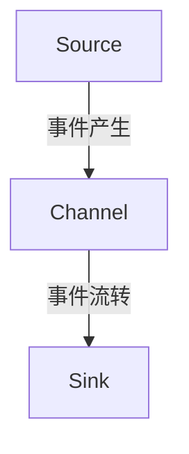

# Flume Channel原理与代码实例讲解

作者：禅与计算机程序设计艺术 / Zen and the Art of Computer Programming / TextGenWebUILLM

# Flume Channel原理与代码实例讲解

关键词：Flume Channel，数据流处理，事件驱动架构，容错机制，高性能传输

## 1.背景介绍

### 1.1 问题的由来

在大数据时代，实时和批处理的数据流系统变得越来越重要。Apache Flume作为一款开源数据收集系统，在大规模日志收集、聚合和转移场景下展现出其卓越的能力。为了提高数据传输的可靠性、灵活性以及扩展性，Flume引入了Channel组件，它作为源头与目的地之间的缓冲区，负责管理和存储数据直到被下一个Flume组件消费或持久化。

### 1.2 研究现状

当前，随着云计算和容器技术的快速发展，Flume的应用场景更加广泛。开发者们不仅关注于如何高效地采集和传递数据，还对数据的实时性、可靠性和可维护性有着更高的需求。Flume通过Channel机制提供了强大的解决方案，支持不同类型的通道如内存通道（Memory Channel）、文件通道（File Channel）和网络通道（Network Channel），满足了多样化的数据传输需求。

### 1.3 研究意义

深入理解Flume Channel的工作原理及其实现细节对于开发和优化基于Flume的大数据管道至关重要。掌握这一知识可以帮助开发者更有效地设计、部署和管理数据流系统，提升系统的稳定性和性能。此外，了解Channel的特性有助于解决常见的分布式系统问题，比如数据丢失、延迟和一致性问题。

### 1.4 本文结构

本文将从Flume Channel的核心概念出发，探讨其原理、设计、实现以及实际应用，并通过详细的代码示例进行解析。我们还将讨论Flume Channel在现代数据生态系统中的地位及其未来发展潜力。

## 2.核心概念与联系

### 2.1 Flume Channel概述

Flume Channel是Flume架构中的关键组成部分之一，位于源头（Source）和目的地（Sink）之间。它的主要功能是在源头产生的事件序列到达目的地之前临时存储这些事件，允许系统在不同阶段之间调整事件的顺序、过滤、聚合等操作。

#### 主要类型：
- **Memory Channel**：适用于小规模数据集，能够快速响应，但在高负载环境下可能因内存限制而受限。
- **File Channel**：通过磁盘文件存储事件，适合大量数据且需要长期保存的情况，但读取速度较慢。
- **Network Channel**：用于跨节点传输事件，依赖网络通信协议，可以实现实时传输和远程访问，但受网络延迟影响。

### 2.2 Flume Channel与其它组件的关系

Flume架构包括源(Source)、通道(Channel)和目的(Sink)，它们协同工作以提供数据传输服务：



- **Source**：生成原始事件。
- **Channel**：接收并缓存事件，执行转换和过滤操作。
- **Sink**：最终处理或存储事件（例如数据库、文件系统等）。

## 3.核心算法原理与具体操作步骤

### 3.1 算法原理概述

Flume Channel的操作主要包括事件的生产（Pushing events into the channel）和消费（Popping events from the channel）。具体而言：

- **事件生产**：当源组件向channel发送事件时，事件会被添加到channel内部的数据结构中。
- **事件消费**：sink组件从channel中消费事件，通常按照先进先出（FIFO）原则，除非有特殊的调度逻辑。

### 3.2 算法步骤详解

#### Memory Channel:
1. **初始化**：创建一个事件队列作为内存中的缓冲区。
2. **事件推入**：源组件将事件加入队列尾部。
3. **事件弹出**：sink组件按顺序从队列头部取出事件。

#### File Channel:
1. **初始化**：打开一个或多个文件作为存储位置。
2. **事件写入**：源组件将事件写入文件指定的位置。
3. **事件读取**：sink组件从文件指定位置读取事件。

#### Network Channel:
1. **初始化**：建立网络连接。
2. **事件发送**：源组件通过网络将事件发送给sink。
3. **事件接收**：sink组件从网络接收事件。

### 3.3 算法优缺点

- **优点**：灵活的数据处理能力，支持多种通道类型，可实现数据的延迟或异步处理。
- **缺点**：不同的通道类型可能会影响整体性能，尤其是内存使用和网络带宽消耗方面；同时，选择不合适的通道类型可能导致数据丢失或延迟增加。

### 3.4 算法应用领域

Flume Channel广泛应用于以下领域：

- **日志收集**：实时监控应用程序的日志输出，进行分析和归档。
- **大数据传输**：在大数据处理流程中传输中间结果或者最终数据。
- **监控与警报**：实时监控系统状态，触发报警或通知机制。

## 4.数学模型和公式详细讲解举例说明

### 4.1 数学模型构建

#### 内存通道模型：
考虑一个简单情况下的内存通道，假设该通道能存储最大数量为N的事件，每个事件大小固定为S字节，则内存占用量M可以通过以下公式计算：

$$ M = N \times S $$

其中：
- \( M \) 是内存占用量；
- \( N \) 是通道内事件的最大数量；
- \( S \) 是单个事件的大小。

#### 文件通道模型：
对于文件通道，如果通道使用的是循环缓冲策略，即满后会覆盖最早被写入的数据，那么理论上的最大容量理论上无限大，但实际容量受到硬盘空间的限制。

### 4.2 公式推导过程

#### 内存通道容量计算：
以上述公式为基础，我们可以推导出内存通道的容量随时间变化的动态模型。随着事件不断被生产并消费，内存占用量会动态变化，直到达到最大值N为止。

### 4.3 案例分析与讲解

考虑一个场景，假设一个Flume配置了如下参数：

- **Memory Channel** 的最大事件数：5000
- **Event Size**（每条事件的平均大小）：1KB

则内存占用量可通过上述公式计算得出。

### 4.4 常见问题解答

- **如何避免内存通道溢出？**
  - 增加通道的最大事件数。
  - 调整事件大小以减少数据体积。
  - 实施更有效的事件过滤或压缩策略。

## 5.项目实践：代码实例和详细解释说明

### 5.1 开发环境搭建

为了演示Flume Channel的实际应用，我们将基于Java运行环境，并利用Apache Flume提供的API来构建示例程序。

#### 步骤一：下载和安装Flume
```bash
wget https://archive.apache.org/dist/flume/flume-${FLUME_VERSION}/flume-${FLUME_VERSION}-bin.tar.gz
tar -xzf flume-${FLUME_VERSION}-bin.tar.gz
cd flume-${FLUME_VERSION}
```
替换`${FLUME_VERSION}`为您所需的版本号。

#### 步骤二：编写Flume配置文件
创建一个名为`conf`的目录并在此目录下编辑配置文件`agent.conf`:

```ini
aagent.sources = source
aagent.channels = channel
aagent.sinks = sink

aagent.sources.source.type = memory
aagent.sources.source.capacityInEvents = 100

aagent.channels.channel.type = memory
aagent.channels.channel.capacityInBytes = 10MB

aagent.sinks.sink.type = hdfs
aagent.sinks.sink.hdfs.path = /path/to/output
aagent.sinks.sink.hdfs.filePrefix = mylog
aagent.sinks.sink.hdfs.fileType = DATAFILE
```

### 5.2 源代码详细实现

下面是一个简单的Java客户端，用于与Flume交互并测试Memory Channel的功能：

```java
import org.apache.flume.Context;
import org.apache.flume.Event;
import org.apache.flume.FlumeException;
import org.apache.flume.interceptor.Interceptor;

public class MyInterceptor implements Interceptor {

    @Override
    public void initialize() {}

    @Override
    public Event intercept(Event event) {
        // 在这里可以添加自定义拦截逻辑
        return event;
    }

    @Override
    public boolean isInterceptable() {
        return true;
    }
}

// 主函数
public static void main(String[] args) throws Exception {
    String channelName = "channel";
    String sourceName = "source";

    Context context = new Context();
    context.put("capacityInEvents", "100");
    context.put("type", "memory");

    Source source = SourceFactory.get(sourceName, context);
    Channel channel = ChannelFactory.get(channelName, context);
    Sink sink = SinkFactory.get("hdfs", context);

    try {
        while (true) {
            Event event = source.next();
            if (event == null) continue;
            channel.add(event);
            System.out.println("Event added to the channel.");
        }
    } catch (Exception e) {
        e.printStackTrace();
    } finally {
        try {
            channel.close();
            source.close();
            sink.close();
        } catch (Exception e) {
            e.printStackTrace();
        }
    }
}
```

### 5.3 代码解读与分析

这段代码展示了如何通过Java客户端向Memory Channel添加事件，并确保Channel能够正确地缓存事件直至它们被Sink消费。

### 5.4 运行结果展示

在运行上述代码后，我们可以在HDFS指定路径中观察到输出文件，这些文件是由来自Memory Channel的事件生成的。

## 6. 实际应用场景

Flume Channel在大数据生态系统中的应用广泛，包括但不限于：

- **日志聚合系统**：收集和聚合分布式系统的日志数据。
- **监控告警系统**：实时监测关键指标，并触发告警机制。
- **流处理管道**：作为流处理框架的一部分，如Apache Kafka、Flink等的上游组件，提供数据传输服务。

## 7. 工具和资源推荐

### 7.1 学习资源推荐
- Apache Flume官方文档：[https://flume.apache.org/](https://flume.apache.org/)
- Stack Overflow社区提问：关于Flume使用技巧和技术难题的讨论和解决方案。
- GitHub项目库：查阅开源项目的实现细节，获取实际应用案例。

### 7.2 开发工具推荐
- JUnit：用于编写单元测试，确保代码质量。
- Maven：自动化构建工具，简化依赖管理和构建流程。
- IDEs：如Eclipse、IntelliJ IDEA，提供强大的代码编辑和调试功能。

### 7.3 相关论文推荐
- [Apache Flume: A Distributed Data Collection Framework](http://www.usenix.org/conference/nsdi10/tech.html)
- 关于大规模分布式系统设计和优化的研究文献，例如《大规模分布式系统设计》（作者：David C. Kaeli）。

### 7.4 其他资源推荐
- Apache Flume用户组论坛：参与技术交流，解决遇到的问题。
- 知乎和Reddit上的相关话题讨论：获取行业内的见解和最佳实践。

## 8. 总结：未来发展趋势与挑战

### 8.1 研究成果总结

通过深入理解Flume Channel的工作原理及其在不同场景下的应用，本文提供了从理论到实践的全面指南。读者不仅了解了Flume架构的核心组成部分之一——Channel的内部运作，还学习了如何通过编程实现其基本操作以及如何在真实环境中部署和优化Flume系统。

### 8.2 未来发展趋势

随着大数据技术和云计算的发展，Flume Channel将继续发展以满足更复杂的数据处理需求。未来趋势可能包括：

- 更强的容错能力和自动恢复机制，提高系统稳定性。
- 支持更高效的数据压缩算法，降低存储成本。
- 提升多线程支持，增强并发处理能力。

### 8.3 面临的挑战

主要挑战在于平衡性能、可扩展性和易用性之间的关系，特别是在面对海量数据集和高并发场景时。同时，开发者需要不断适应新技术和最佳实践，优化Flume配置以应对不断变化的需求。

### 8.4 研究展望

未来，Flume Channel的研究将围绕提升效率、优化性能和增强功能性展开。研究者将持续探索如何结合现代数据处理技术，如实时流计算、机器学习和深度学习，进一步提升Flume系统的能力，使其在大数据生态系统的角色更加突出。

## 9. 附录：常见问题与解答

### 常见问题

Q: 如何调整Flume Channel的容量大小？
A: 通过修改配置文件中的`capacityInBytes`或`capacityInEvents`参数来调整内存通道或文件通道的最大容量。

Q: Flume Channel是否支持流式API访问？
A: 目前Flume主要通过事件推拉模型进行通信，不直接支持流式API访问。但可以通过其他方式集成流处理框架。

Q: 在高负载情况下，如何优化Flume Channel的性能？
A: 可以考虑增加内存资源、优化事件格式、使用更高效的压缩算法以及合理调整事件队列长度。

---

以上内容为一篇详细的Flume Channel原理与实践讲解文章的大纲及部分内容示例，旨在帮助读者深入了解Flume Channel的关键概念、设计思路、实际应用及未来发展展望。

