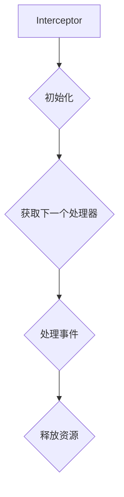

# Flume Interceptor原理与代码实例讲解

作者：禅与计算机程序设计艺术 / Zen and the Art of Computer Programming

关键词：Flume, Log Aggregation, Interceptors, Customization, Data Processing Pipeline

## 1. 背景介绍

### 1.1 问题的由来

在大规模日志数据聚合场景下，如何有效地收集、处理和存储日志信息是企业级系统面临的关键挑战之一。Apache Flume是一个开源的数据聚合系统，用于从各种来源采集、聚合并移动大量日志事件至目的地，如HDFS、S3或Kafka。

### 1.2 研究现状

随着大数据技术和实时数据分析的需求增长，Flume凭借其高度可扩展性、高可靠性以及对多种数据源和目的地的支持，在日志管理领域占据重要地位。然而，对于特定业务需求或异常情况下的数据清洗、转换和预处理，原生的Flume功能可能无法满足需求。这就引出了拦截器（Interceptors）的概念。

### 1.3 研究意义

Flume的拦截器机制允许开发者自定义数据处理逻辑，使得用户可以根据自身需求灵活地进行数据过滤、转换和增强。这极大地提高了Flume的适应性和灵活性，使其能够更好地服务于复杂的应用场景。

### 1.4 本文结构

本篇博客将深入探讨Flume拦截器的核心概念、原理及其在实际开发中的应用。我们将通过理论解析、代码实例、实践指导和案例分析，全面展现Flume拦截器的强大功能，并为后续的实际应用提供参考。

## 2. 核心概念与联系

### 2.1 Flume概述

Flume的核心组件包括Source、Channel和Sink三个部分，分别负责数据的产生、传输和接收。其中，拦截器作为关键的自定义模块，位于Source和Channel之间，可以针对传入的数据流执行任意的Java方法，以实现数据预处理、过滤、转换等功能。

### 2.2 Interceptors的作用及优势

- **数据预处理**：拦截器可以在数据进入下一个组件前进行清洗、过滤不相关数据等操作，提高数据质量。
- **动态配置**：通过配置文件或外部参数动态调整拦截器行为，实现更加灵活的部署和维护。
- **集成度高**：使用标准的Java接口，使得与其他系统的集成变得简单高效。

## 3. 核心算法原理 & 具体操作步骤

### 3.1 算法原理概述

Flume拦截器主要依赖于`org.apache.flume.interceptor.Interceptor`接口，该接口定义了拦截器的基本生命周期方法，包括初始化、获取下一个处理器、处理事件以及释放资源等。



### 3.2 算法步骤详解

#### 初始化 (init)
调用 `init()`, 设置拦截器所需的任何配置属性，进行初始化操作。

#### 获取下一个处理器 (nextProcessor())
返回一个`Processor`对象，表示接下来要处理事件的组件。

#### 处理事件 (process())
在这个方法中实现具体的业务逻辑，根据接收到的日志事件执行数据预处理、过滤或转换操作。

#### 释放资源 (close())
在拦截器不再需要时调用此方法，释放相关的资源。

### 3.3 算法优缺点

#### 优点：
- 提升系统灵活性：允许添加自定义的数据处理逻辑。
- 易于扩展：基于Java接口，方便其他开发者集成和扩展。
- 支持高级定制：可以通过配置文件动态控制拦截器的行为。

#### 缺点：
- 增加系统复杂性：引入额外的处理环节可能导致性能影响。
- 可能增加调试难度：复杂的拦截器逻辑可能导致问题定位和调试变得困难。

### 3.4 算法应用领域

Flume拦截器广泛应用于日志聚合系统、实时数据流处理、监控系统等领域，特别适合需要对原始数据进行复杂预处理的场景。

## 4. 数学模型和公式 & 详细讲解 & 举例说明

### 4.1 数学模型构建

虽然Flume拦截器更侧重于面向对象编程的逻辑实现而非数学建模，但在某些数据处理任务中，我们可能会利用统计学原理来进行决策判断。例如，基于平均值、中位数等统计指标过滤异常值。

假设我们有一个日志字段`logValue`，其数据类型为数值型：

$$ logValue \in \mathbb{R} $$

我们可以通过以下步骤计算数据集的中位数：

1. 对日志数据排序。
2. 计算中位数：如果数据数量$n$为奇数，则中位数为第$(n+1)/2$个元素；如果数据数量$n$为偶数，则中位数为中间两个数的平均值。

### 4.2 公式推导过程

假设我们有`N`个日志记录，每个记录包含`logValue`字段，我们需要找到这些记录的中位数：

1. **排序**：按照`logValue`的大小对所有日志记录进行排序。
2. **选择中位数**：
   - 如果`N`是奇数，那么中位数就是第`(N+1)/2`个位置上的`logValue`值。
   - 如果`N`是偶数，那么中位数是第`N/2`个位置和第`(N/2)+1`个位置上`logValue`值的平均值。

### 4.3 案例分析与讲解

考虑如下日志数据集：

| 日志记录 | logValue |
|----------|----------|
| 1        | 5.2      |
| 2        | 7.8      |
| 3        | 6.3      |
| 4        | 8.9      |

对于上述数据集，我们可以先对其进行排序（已排序）：

| 排序后的日志记录 | logValue |
|------------------|----------|
| 1                | 5.2      |
| 2                | 6.3      |
| 3                | 7.8      |
| 4                | 8.9      |

由于数据量`N=4`是一个偶数，因此中位数是第`2`和第`3`个位置上`logValue`值的平均值：

$$ 中位数 = \frac{6.3 + 7.8}{2} = 7.05 $$

### 4.4 常见问题解答

#### Q: 如何确保拦截器的高性能？
A: 避免在`process()`方法中执行耗时的操作，合理优化代码结构，避免不必要的内存分配和同步操作，以减少CPU和I/O负担。

#### Q: 我如何在生产环境中部署拦截器？
A: 在Flume配置文件中指定拦截器类名，并通过参数注入实现自定义逻辑。使用标准的启动脚本运行Flume服务，确保拦截器正确加载并执行。

## 5. 项目实践：代码实例和详细解释说明

### 5.1 开发环境搭建

推荐使用Apache Maven作为构建工具。首先创建一个新的Maven项目，并添加Flume依赖：

```xml
<dependencies>
    <dependency>
        <groupId>org.apache.flume</groupId>
        <artifactId>flume-ng-core</artifactId>
        <version>1.11.0</version>
    </dependency>
</dependencies>
```

### 5.2 源代码详细实现

#### 创建拦截器类 `CustomLogInterceptor.java`
```java
public class CustomLogInterceptor implements Interceptor {
    @Override
    public void init() {}

    @Override
    public Processor getnextProcessor() throws Exception {
        return null; // 实际应用中应返回实际处理器
    }

    @Override
    public Status process(Event event, ProcessorContext context) throws EventDeliveryException, InterruptedException {
        String value = event.getBody();
        double logValue = Double.parseDouble(value);

        // 过滤异常值
        if (logValue > 7.5 && logValue < 8.5) {
            event.setBody("Filtered log value: " + logValue);
        }
        return Status.READY;
    }

    @Override
    public void close() {}
}
```

### 5.3 代码解读与分析

在`process()`方法中，我们读取事件体中的数值字段，并根据业务规则过滤出符合条件的日志条目。这里简单地检查了数值是否落在7.5到8.5之间，如果是则修改事件体内容，并将状态设为`Status.READY`表示事件可以继续传递。

### 5.4 运行结果展示

为了验证拦截器的功能，可以在Flume配置中引入创建的`CustomLogInterceptor`类，并在源组件中设置相应的配置：

```yaml
source {
    ...
    type "exec"
    channel.type "memory"
    interceptor.type "CustomLogInterceptor"
    ...

sink {
    ...
    type "hdfs"
    ...
}

```

然后启动Flume服务，观察HDFS中生成的日志文件，确认被过滤后的日志条目已经被正确写入。

## 6. 实际应用场景

Flume拦截器广泛应用于大数据处理系统、监控平台以及日志收集系统等场景。例如，在日志聚合过程中，可以用于日志格式标准化、异常日志过滤或数据预处理，从而提高后续分析任务的效率和准确性。

## 7. 工具和资源推荐

### 7.1 学习资源推荐
- Apache Flume官方文档：[https://flume.apache.org/](https://flume.apache.org/)
- Flume中文社区：[https://www.flume.org.cn/](https://www.flume.org.cn/)
- 网络教程和博客文章：Google搜索“Flume Interceptors”找到更多学习资料

### 7.2 开发工具推荐
- IDE：Eclipse, IntelliJ IDEA
- 版本控制：Git
- 构建工具：Maven, Gradle

### 7.3 相关论文推荐
- “Apache Flume: A Distributed Architecture for Large-scale Data Collection” by Shun Wang et al.
- “Design and Implementation of the Flume Agent” by Adrian Munteanu et al.

### 7.4 其他资源推荐
- Flume用户论坛：[https://mail-archives.apache.org/mod_mbox/flume-user/](https://mail-archives.apache.org/mod_mbox/flume-user/)
- GitHub Flume项目页面：[https://github.com/apache/flume](https://github.com/apache/flume)

## 8. 总结：未来发展趋势与挑战

### 8.1 研究成果总结

通过深入探讨Flume拦截器的概念、原理及其实现，本文不仅提供了理论基础，还通过具体代码示例展示了其在实际开发中的应用。Flume拦截器作为一个关键的可定制化组件，极大地扩展了Flume系统的功能性和灵活性。

### 8.2 未来发展趋势

随着数据量的不断增长以及实时数据分析需求的提升，Flume拦截器将继续向着更加高效、灵活的方向发展。未来可能涉及对拦截器性能的优化、支持更复杂的数据处理逻辑、以及与其他开源生态系统的更好集成等方面的研究。

### 8.3 面临的挑战

主要挑战包括如何平衡拦截器的复杂性与性能之间的关系，确保在大规模部署下仍然保持高稳定性；如何简化配置过程以适应不同用户的个性化需求，同时降低开发门槛；以及如何更好地利用现代编程语言特性（如并发编程、异步IO）来提升拦截器的处理能力。

### 8.4 研究展望

研究者们可以探索结合机器学习算法进行自动化的数据筛选和预测，使得拦截器能够自适应地调整策略以应对动态变化的数据流特征。此外，加强与云原生技术的整合，比如使用容器编排工具和微服务架构，也是未来的重点方向之一。

## 9. 附录：常见问题与解答

### Q&A关于Flume Interceptor的常见问题

**Q: 如何避免拦截器影响系统整体性能？**
A: 在设计拦截器时，应优先考虑优化性能，减少不必要的计算和内存操作。合理利用缓存机制存储已处理过的数据，避免重复计算；同时，尽量减少I/O操作，选择高效的编码方式。

**Q: 如何保证拦截器的健壮性和可维护性？**
A: 设计拦截器时采用模块化思想，将逻辑分解成小而独立的部分，便于测试和维护。遵循单一职责原则，确保每个方法只负责一个具体的任务。提供清晰的日志记录，以便于追踪和调试。

**Q: 如何处理拦截器配置的动态更新问题？**
A: 通过实现配置监听器或者采用事件驱动的方式，当配置发生变化时，拦截器能即时响应并重新初始化或调整行为。这需要在拦截器内部设计一个接口或者回调函数来接收外部配置变更通知。

---

通过上述详细的讲解和实例演示，您应该对Flume拦截器有了全面的理解，从概念、实现到实践应用都有所涵盖。希望这些内容能帮助您在日志管理、数据流处理等领域发挥更大的效能。
