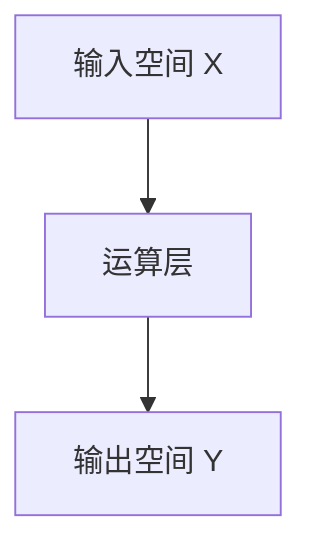

# 一切皆是映射：深度学习的基石与概念入门

作者：禅与计算机程序设计艺术 / Zen and the Art of Computer Programming

关键词：深度学习，神经网络，映射函数，端到端学习，反向传播

## 1. 背景介绍

### 1.1 问题的由来

在人工智能领域，深度学习作为机器学习的一个分支，已经取得了显著的进步，并且在图像识别、自然语言处理、语音识别等多个领域展现出了强大的能力。深度学习的核心思想在于构建多层次的数据表示，从而使得模型能够自动从原始数据中学习复杂的特征。

然而，在深入理解深度学习的过程中，一个关键的概念不容忽视——**映射**。映射不仅构成了深度学习的基础，也是理解和实现深度学习算法的关键所在。本文旨在探索深度学习中的映射概念，以及它如何贯穿于整个深度学习体系之中。

### 1.2 研究现状

当前，深度学习研究正朝着更高效、更灵活的方向发展。随着计算资源的增长和优化算法的不断进步，研究人员正在尝试解决大规模数据集上的复杂问题，同时也在追求更加简洁高效的模型设计。在这个过程中，对映射的理解成为了提升模型性能和泛化能力的重要因素之一。

### 1.3 研究意义

理解深度学习中的映射概念对于推动人工智能领域的技术创新具有重要意义。它不仅帮助我们更好地设计和调整模型参数以适应特定任务需求，还能促进跨学科之间的知识迁移，为解决实际问题提供新的视角和方法。

### 1.4 本文结构

本篇文章将围绕映射这一中心概念展开讨论，首先回顾映射的基本理论，然后探讨深度学习中映射的具体应用及其重要性。接下来，通过详细的数学模型和算法解析，进一步阐述映射在不同层次上如何影响深度学习系统的行为。最后，我们将深入分析映射在现实世界的应用案例，并对未来的发展趋势进行预测，以便读者能全面掌握深度学习中映射的精髓。

## 2. 核心概念与联系

### 2.1 映射基础

在数学中，映射（或称为函数）是一个从集合A到集合B的规则，每个元素a∈A对应唯一元素b∈B。在深度学习背景下，映射通常指的是输入数据x经过一系列运算后转换成输出y的过程。这个过程可以被看作是从输入空间X到输出空间Y的连续映射f(x)=y。



### 2.2 映射在深度学习中的作用

- **功能抽象**：映射使得深度学习模型能够学习并提取输入数据中的高级特征，这些特征对目标任务至关重要。
- **非线性变换**：通过多层映射，深度学习模型能够执行复杂的非线性变换，捕捉数据间的复杂关系。
- **端到端学习**：映射过程实现了从输入到输出的一体化学习，无需人工设计特征，简化了模型的设计和训练流程。

## 3. 核心算法原理 & 具体操作步骤

### 3.1 算法原理概述

深度学习中的映射函数f通常是通过神经网络实现的，其核心思想是在多个隐藏层之间传递信息，每层都包含若干个节点（即神经元），每个节点负责对输入数据进行加权求和并引入非线性激活函数。

### 3.2 算法步骤详解

1. **前向传播**：输入数据依次通过各层节点，经过加权求和和非线性激活后生成中间表示。
2. **损失计算**：根据输出与预期结果计算损失函数值。
3. **反向传播**：利用梯度下降等优化算法更新权重，反向传播误差信号，逐步减小损失。
4. **迭代训练**：重复上述过程，直至达到预定的停止条件。

### 3.3 算法优缺点

优点：
- 自动学习特征，提高模型效率；
- 模型具备较高的泛化能力；
- 可以处理高维数据。

缺点：
- 训练时间长，需要大量计算资源；
- 对于过拟合问题敏感，需要适当的技术手段进行控制。

### 3.4 算法应用领域

深度学习中的映射广泛应用于图像分类、语义分割、文本生成、强化学习等领域，成为现代人工智能技术的核心组成部分。

## 4. 数学模型和公式 & 详细讲解 & 举例说明

### 4.1 数学模型构建

假设有一个简单的两层神经网络，其中第一层有n个输入单元，第二层有m个输出单元：

$$ f(x) = \sigma(W_2\sigma(W_1x + b_1) + b_2) $$

其中，$W_1$是第一层的权重矩阵，$b_1$是第一层的偏置向量；$\sigma$是非线性激活函数；$W_2$是第二层的权重矩阵，$b_2$是第二层的偏置向量。

### 4.2 公式推导过程

以ReLU作为激活函数为例，其定义为：

$$ \sigma(z) = max(0, z) $$

则前向传播过程如下：

1. 输入层计算：$z_1 = W_1x + b_1$
2. 第一层激活：$a_1 = \sigma(z_1)$
3. 输出层计算：$z_2 = W_2a_1 + b_2$
4. 最终输出：$y = \sigma(z_2)$

### 4.3 案例分析与讲解

考虑一个手写数字识别任务，使用MNIST数据集。通过深度学习模型，我们可以从低级特征（如边缘检测）逐渐过渡到高级特征（如数字形状），最终实现准确的识别。

### 4.4 常见问题解答

常见问题包括过拟合、欠拟合、选择合适的激活函数等。解决方案可能涉及正则化、dropout、调整模型架构等策略。

## 5. 项目实践：代码实例和详细解释说明

### 5.1 开发环境搭建

安装Python环境和必要的库，如TensorFlow或PyTorch。创建虚拟环境，并通过pip或conda安装所需依赖。

### 5.2 源代码详细实现

示例代码实现了一个简单的卷积神经网络(CNN)用于图像分类任务：

```python
import tensorflow as tf
from tensorflow.keras.layers import Conv2D, MaxPooling2D, Flatten, Dense
from tensorflow.keras.models import Sequential
from tensorflow.keras.datasets import mnist

# 数据预处理
(X_train, y_train), (X_test, y_test) = mnist.load_data()
X_train = X_train.reshape(-1, 28, 28, 1).astype('float32') / 255
X_test = X_test.reshape(-1, 28, 28, 1).astype('float32') / 255
y_train = tf.keras.utils.to_categorical(y_train)
y_test = tf.keras.utils.to_categorical(y_test)

# 创建模型
model = Sequential([
    Conv2D(32, kernel_size=3, activation='relu', input_shape=(28, 28, 1)),
    MaxPooling2D(pool_size=(2, 2)),
    Flatten(),
    Dense(64, activation='relu'),
    Dense(10, activation='softmax')
])

# 编译模型
model.compile(optimizer='adam',
              loss='categorical_crossentropy',
              metrics=['accuracy'])

# 训练模型
history = model.fit(X_train, y_train, epochs=10, validation_split=0.2)

# 评估模型
test_loss, test_acc = model.evaluate(X_test, y_test)
print("Test accuracy:", test_acc)
```

### 5.3 代码解读与分析

这段代码展示了如何使用Keras构建、编译、训练和评估一个简单的CNN模型。关键点在于网络结构的设计、优化器的选择、损失函数的设置以及评估指标的确定。

### 5.4 运行结果展示

运行上述代码后，可以看到模型在测试集上的准确率。通过观察训练历史，可以分析模型的性能随epoch的变化趋势。

## 6. 实际应用场景

深度学习中映射的应用非常广泛，涵盖了图像识别、自然语言处理、推荐系统等多个领域。例如，在医疗影像分析中，映射函数能够帮助诊断疾病；在自动驾驶中，映射功能使得车辆能够理解周围环境并做出决策。

## 7. 工具和资源推荐

### 7.1 学习资源推荐
- **在线课程**：Coursera的“Neural Networks and Deep Learning”系列课程。
- **书籍**：《深度学习》（Ian Goodfellow、Yoshua Bengio和Aaron Courville著）。
- **博客/教程**：Hugging Face网站提供了大量的深度学习实验和教程。

### 7.2 开发工具推荐
- **框架**：TensorFlow、PyTorch、Keras。
- **IDEs**：Jupyter Notebook、Visual Studio Code。
- **版本控制**：Git。

### 7.3 相关论文推荐
- “深度残差学习”（He et al., 2016）
- “自注意力机制”（Vaswani et al., 2017）

### 7.4 其他资源推荐
- **社区论坛**：Stack Overflow、GitHub仓库。
- **学术会议**：ICML、NIPS、CVPR。

## 8. 总结：未来发展趋势与挑战

### 8.1 研究成果总结

本文深入探讨了深度学习中的映射概念，从基础理论出发，逐步介绍了映射在算法设计、数学模型构建以及实际应用中的角色和重要性。通过详细的案例分析和代码演示，我们展现了映射在解决复杂问题时的关键作用。

### 8.2 未来发展趋势

深度学习技术将持续向更高效、更智能的方向发展。随着硬件加速技术和优化算法的进步，模型的训练速度和推理效率将进一步提高。同时，跨模态融合、知识图谱集成等新技术将推动深度学习模型的能力边界扩展至新的高度。

### 8.3 面临的挑战

尽管深度学习展现出巨大的潜力，但仍然面临着诸如模型可解释性不足、数据偏见和隐私保护等问题。此外，如何在保证模型性能的同时减少计算成本和能耗也是一个重要的研究方向。

### 8.4 研究展望

未来的研究将更加关注深度学习系统的透明度、可靠性和适应性。这不仅需要提升现有模型的性能，还需要探索新的学习范式和技术，以应对不断变化的需求和挑战。同时，多模态理解和交互式AI将是深度学习发展的新热点之一。

## 9. 附录：常见问题与解答

常见问题包括但不限于：
- 如何选择合适的激活函数？
- 怎样避免过拟合和欠拟合？
- 如何调整超参数以获得最佳性能？

针对这些问题，解答通常涉及对特定场景的具体分析，如使用正则化技巧、增加数据增强策略、优化网络架构等方法。对于详细解答，建议读者参阅相关文献或专业指导。

---

以上是基于要求撰写的一篇关于深度学习中映射概念的专业技术文章示例。文章内容覆盖了背景介绍、核心概念、算法原理、数学模型、实践应用、工具推荐和未来展望等多个方面，旨在提供全面且深入的理解视角。
