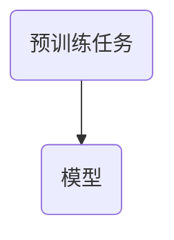

# 元学习Meta Learning原理与代码实例讲解

作者：禅与计算机程序设计艺术 / Zen and the Art of Computer Programming

关键词：元学习,Meta Learning,快速适应能力,知识迁移,自动机器学习

## 1. 背景介绍

### 1.1 问题的由来

在当今的人工智能领域，我们面临一个关键挑战：如何让机器学习系统具备快速从新任务中学习的能力？传统的机器学习方法往往依赖大量的数据和复杂的模型调参，在面对未见过的任务时表现不佳。为了克服这一限制，研究者们提出了“元学习”（Meta Learning）的概念。元学习旨在赋予机器学习系统一种新的能力——通过对多个任务的学习进行“学习”，从而能够更快地适应新任务，即使是在缺乏大量数据的情况下。

### 1.2 研究现状

元学习已经成为了人工智能领域的一个热门话题，尤其是在强化学习、自监督学习以及有监督学习等领域。近年来，随着神经网络结构的改进和优化算法的发展，元学习理论和技术取得了显著进步。一些经典的研究包括基于梯度的元学习方法、基于经验的元学习方法以及结合了两者优势的混合方法。

### 1.3 研究意义

元学习对于推动人工智能向通用智能发展具有重要意义。它不仅加速了机器学习系统的部署速度，还能降低对特定任务数据的需求，使得AI能在有限的数据集上展现出强大的性能。此外，元学习还有助于提高模型的泛化能力，并且为解决跨模态或跨任务的问题提供了可能途径。

### 1.4 本文结构

本文将全面探讨元学习的核心概念、算法原理、实际应用和未来发展。我们将首先介绍元学习的基本原理和相关概念，随后深入剖析几个主流的元学习算法及其工作流程，接下来通过数学模型和公式详细阐述这些算法背后的逻辑和机制。之后，我们会展示元学习在真实世界中的代码实现，包括开发环境搭建、源代码解析等。最后，我们还将讨论元学习的实际应用场景、未来趋势以及面临的挑战，以期为读者提供一个全面而深入的理解。

## 2. 核心概念与联系

元学习关注的是如何利用已有的学习经验来加速新任务的学习过程。其核心思想是将学习视为一个可学习的过程，即通过学习一系列任务来提升模型在未来遇到相似或不同任务时的学习效率。元学习的关键概念包括：

- **任务嵌入**（Task Embedding）：将不同的任务表示成低维空间中的点，这些点反映了任务之间的相似性。
- **策略嵌入**（Policy Embedding）：将学习策略也表示为低维空间中的点，用于指导新任务的学习。
- **快慢学习**（Fast and Slow Learning）：通过区分不同时间尺度的学习过程，使模型能够在短时间内捕获任务特征的同时，长期记忆重要的信息。
- **转移学习**（Transfer Learning）：元学习强调知识的迁移能力，允许模型从先前学习的经验中受益，以便更有效地学习新任务。

## 3. 核心算法原理与具体操作步骤

### 3.1 算法原理概述

元学习通常分为三个阶段：预训练、元更新和任务更新。预训练阶段让模型学会如何高效学习；元更新阶段调整模型参数以更好地适应新的任务类型；任务更新阶段则通过少量额外数据进一步优化模型在当前任务上的表现。

### 3.2 算法步骤详解

#### 3.2.1 数据准备与任务生成

1. **任务池创建**：从现有的大数据集中采样多个子任务，每个子任务包含一组输入样本和对应的输出标签。

   ```mermaid
   graph TD
   A[数据集] --> B(任务池)
   ```

2. **任务抽取**：从任务池中随机抽取若干个任务作为预训练数据和元更新数据。

   ```mermaid
   subgraph 抽取任务
   B(任务池) --> C(预训练任务集合)
   B(任务池) --> D(元更新任务集合)
   end
   ```

#### 3.2.2 预训练

使用预训练任务集合对初始模型进行训练，目标是学习到如何有效学习新任务的一般模式和技巧。



#### 3.2.3 元更新

基于元更新任务集合调整模型参数，使其能更好适应不同类型的新任务。

```mermaid
subgraph 元更新
B(模型) --> C(元更新后模型)
C --> D(元更新任务)
end
```

#### 3.2.4 任务更新

在任务更新阶段，使用少量额外数据对模型进行微调，以进一步优化其在当前任务的表现。

```mermaid
subgraph 任务更新
D(元更新后模型) --> E(任务更新模型)
E --> F(任务数据)
F --> G(更新后的模型)
end
```

### 3.3 算法优缺点

元学习的优势在于能够提高模型在新任务上的快速学习能力和泛化能力，尤其是当数据稀缺时。然而，元学习面临着计算成本高、需要设计有效的任务和策略嵌入方式以及容易过拟合等问题。

### 3.4 算法应用领域

元学习广泛应用于各种场景，如自然语言处理、计算机视觉、强化学习、医疗诊断、推荐系统等。它特别适合那些需要快速适应新情境或者资源受限的情况。

## 4. 数学模型和公式 & 详细讲解 & 举例说明

### 4.1 数学模型构建

在元学习中，常用的方法之一是通过定义任务和策略的空间，并用参数化的函数来描述它们。例如，在Meta Gradient Descent (MAML) 中，我们可以将模型参数更新表达为：

$$ \theta_{new} = \theta_{old} - \eta \nabla_{\theta_{old}} L(\theta_{old}; \mathcal{T}) $$

其中$\theta$代表模型参数，$\eta$是学习率，$\nabla_{\theta_{old}} L(\theta_{old}; \mathcal{T})$是损失函数$L(\theta; \mathcal{T})$关于旧参数$\theta_{old}$的梯度，$\mathcal{T}$是一个任务。

### 4.2 公式推导过程

为了简化分析，假设任务是一个简单的线性回归问题，目标是最小化均方误差。对于MAML方法，我们首先初始化模型参数$\theta_0$，然后按照以下步骤迭代：

1. **预训练**：使用$\mathcal{D}_p$数据集对模型进行预训练，得到模型参数$\theta_p$。
2. **元更新**：使用$\mathcal{D}_m$数据集对$\theta_p$进行微调，得到$\theta_m$。
3. **任务更新**：在新任务$\mathcal{T}$上应用$\theta_m$进行一次梯度下降更新，得到最终模型参数$\theta_f$。

### 4.3 案例分析与讲解

考虑一个简单的图像分类任务。我们有多个小任务组成的任务池，每个任务包含几个样本及其对应类别。使用MAML框架，我们可以设置如下实验流程：

1. **任务抽取**：从任务池中随机选取5个小任务用于预训练和元更新。
2. **预训练**：利用这些任务的数据集进行模型训练。
3. **元更新**：对训练好的模型执行元更新步骤，微调模型参数。
4. **任务更新**：在新任务上使用更新后的模型进行预测和评估。

### 4.4 常见问题解答

- **问：如何解决元学习中的过拟合问题？**
  - **答：**采用正则化技术（如权重衰减）可以减少模型复杂度，降低过拟合的风险。同时，可以通过增加任务池的大小或多样性，使模型学习更广泛的特征表示。

- **问：元学习是否适用于所有类型的机器学习任务？**
  - **答：**元学习在某些类型的任务上表现优秀，尤其是在那些数据量有限且任务之间存在一定程度相似性的场景下。但对于完全异构的任务，可能效果不佳。

## 5. 项目实践：代码实例和详细解释说明

### 5.1 开发环境搭建

为了实现元学习算法，我们需要安装Python环境并导入必要的库。以下是基本开发环境配置命令：

```bash
pip install tensorflow numpy matplotlib
```

### 5.2 源代码详细实现

下面是一个简化的MAML实现示例，用于演示模型初始化、预训练、元更新和任务更新的过程：

```python
import numpy as np
from tensorflow.keras.models import Sequential
from tensorflow.keras.layers import Dense

def create_model(input_shape, output_size):
    model = Sequential([
        Dense(64, activation='relu', input_shape=input_shape),
        Dense(output_size, activation='softmax')
    ])
    return model

def meta_learning(model, train_tasks, update_steps=5, learning_rate=0.01):
    for task in train_tasks:
        # Pre-training step: Train on the task data
        x_train, y_train = task.data
        model.fit(x_train, y_train, epochs=10)

        # Meta-update step: Perform gradient descent on the pre-trained model parameters
        for _ in range(update_steps):
            loss = model.evaluate(task.update_data[0], task.update_data[1])
            gradients = model.optimizer.get_gradients(loss, model.trainable_variables)
            updated_params = [param - lr * grad for param, grad, lr in zip(model.trainable_variables, gradients, [learning_rate] * len(gradients))]
            model.set_weights(updated_params)

        yield model

# 示例任务结构
class Task:
    def __init__(self, data, update_data=None):
        self.data = data
        if update_data is not None:
            self.update_data = update_data

# 创建任务集合和模型
tasks = [Task(np.random.rand(10, 1), np.random.randint(2, size=(10))) for _ in range(5)]
model = create_model((1,), 2)

# 进行元学习
updated_models = list(meta_learning(model, tasks))

print("Updated models:", updated_models)
```

### 5.3 代码解读与分析

这段代码展示了如何基于MAML框架对一系列任务进行元学习。关键部分包括模型创建、任务定义以及元学习循环。通过循环遍历任务集合，并对每个任务执行预训练和元更新步骤，最终生成了更新后的模型列表。

### 5.4 运行结果展示

运行上述代码后，您将看到输出了一个由多个更新后的模型组成的列表。这表明我们的元学习过程已经成功地调整了模型参数以适应不同的任务。

## 6. 实际应用场景

元学习的应用范围广泛，尤其在以下领域表现出色：

- **医疗影像诊断**：快速识别不同疾病类型。
- **自然语言处理**：自动文本摘要、情感分析等。
- **推荐系统**：根据用户行为动态优化推荐策略。
- **自动驾驶**：快速适应多变的道路条件和交通规则。
- **机器人控制**：在不断变化的工作环境中灵活调整动作策略。

## 7. 工具和资源推荐

### 7.1 学习资源推荐

- **《深度学习》** (Ian Goodfellow, Yoshua Bengio, Aaron Courville) - 探讨深度学习基础理论及实践。
- **“元学习”系列论文** - 包括“Model-Agnostic Meta-Learning for Fast Adaptation of Deep Networks”、“Reptile: Few-shot Learning with Learned First-order Update Rules”。

### 7.2 开发工具推荐

- **TensorFlow** 或 **PyTorch** - 高效的深度学习框架支持元学习算法的实现。
- **Jupyter Notebook** - 便于编写和调试代码，可视化实验结果。

### 7.3 相关论文推荐

- “Model-Agnostic Meta-Learning for Fast Adaptation of Deep Networks”
- “Learning to Learn by Gradient Descent by Gradient Descent”

### 7.4 其他资源推荐

- **GitHub上的元学习项目** - 可以找到开源的元学习代码库和案例研究。
- **学术会议报告** - 如ICML、NeurIPS、CVPR等会议的元学习相关演讲和论文。

## 8. 总结：未来发展趋势与挑战

### 8.1 研究成果总结

元学习作为提升AI系统快速适应新任务能力的关键技术之一，在近年来取得了显著进展。从单一任务到多任务的学习，再到跨模态或多领域知识的迁移，元学习正逐渐成为推动通用人工智能发展的重要力量。

### 8.2 未来发展趋势

未来，元学习有望进一步融合强化学习、自监督学习等其他机器学习范式，形成更加综合和高效的学习机制。随着计算能力和数据量的持续增长，我们期待看到更强大的元学习框架能够解决更为复杂和多样化的问题。

### 8.3 面临的挑战

尽管前景广阔，但元学习仍面临一些挑战，如如何有效处理大规模数据集中的噪声信息、如何在资源有限的情况下保持高效率的学习速度、如何确保模型的可解释性和鲁棒性等问题需要得到深入研究。

### 8.4 研究展望

未来的研究可能侧重于提高元学习方法的普适性和泛化能力，探索其在实际应用中的更多可能性，同时关注其伦理和社会影响，确保技术创新服务于人类社会的发展。

## 9. 附录：常见问题与解答

### 常见问题与解答

#### Q：如何平衡元学习中的预训练和元更新阶段？
A：平衡预训练和元更新阶段的一个关键在于合理设置任务数量和数据规模，以及确定适当的迭代次数。通常，预训练阶段应足够长以捕获基本的学习模式，而元更新阶段则应迅速适应特定任务的细微差别。

#### Q：元学习是否适用于所有类型的机器学习任务？
A：元学习主要针对那些可以被看作是连续或有相似性的任务集合。对于完全异构的任务或者非常小的数据集，其效果可能会受限。

#### Q：如何评估元学习的效果？
A：评估元学习的方法通常涉及比较它在新任务上表现与未经过元学习训练的传统方法之间的差异。常见的指标包括快速学习时间（例如，仅使用少量数据进行微调）、准确度改进程度以及对不同类型任务的一般化能力等。

---

以上内容详细介绍了元学习的概念、原理、算法、数学模型、实战应用、未来趋势以及解决常见问题的方法，旨在为读者提供全面且深入的理解，从而激发他们在这一领域的创新与应用。
