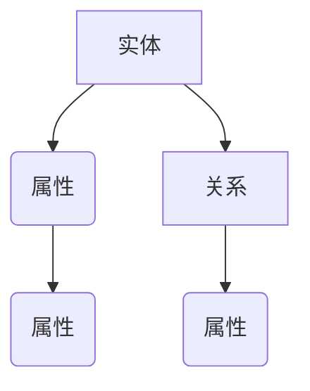

                 
# 知识表示与知识图谱原理与代码实战案例讲解

作者：禅与计算机程序设计艺术 / Zen and the Art of Computer Programming

关键词：知识表示，知识图谱，语义网络，实体链接，推理引擎，自然语言处理，机器学习

## 1. 背景介绍

### 1.1 问题的由来

随着大数据时代的到来，数据量呈爆炸性增长，如何有效地管理、组织和检索这些信息成为了一个关键问题。传统的基于文本搜索的方法在面对复杂的查询需求时显得力不从心。因此，引入了知识表示的概念，旨在将无序的数据转化为有序的知识结构，从而提高信息检索的准确性和效率。

### 1.2 研究现状

当前，知识表示方法主要包括知识图谱、语义网、本体论等多种形式。其中，知识图谱作为一种结构化的知识库，通过连接实体之间的关系，形成了一个丰富且可扩展的知识网络。近年来，基于深度学习的知识图谱生成和增强技术取得了显著进展，推动了知识图谱在多个领域的广泛应用，如推荐系统、搜索引擎优化、个性化服务等。

### 1.3 研究意义

知识表示与知识图谱的研究对于提升人工智能系统的理解能力、决策能力和交互体验具有重要意义。它们不仅可以帮助系统更精准地理解和回答复杂的问题，还能支持更高级的智能行为，如自动推理、知识发现和创新思维。

### 1.4 本文结构

本文将围绕知识表示与知识图谱的核心概念、算法原理、实际应用以及开发实践等方面展开，力求为读者提供一个全面而深入的理解。

## 2. 核心概念与联系

知识表示通常指的是将知识以某种形式进行编码的过程，使得计算机能够理解和处理这些知识。常见的知识表示形式包括规则集合、逻辑表达式、向量空间模型、标记图等。

### 关键概念

- **实体**：知识图谱中表示特定对象或概念的基本单位。
- **属性**：描述实体特征的信息，例如年龄、地点等。
- **关系**：实体之间的相互作用或联系，如“出生于”、“属于”等。
- **路径**：连接两个实体的一系列关系组成的序列。
- **推理**：根据已知事实推断出新的事实的能力。
- **关联学习**：利用数据驱动的方式学习实体间的潜在关系。

### 知识图谱的架构

知识图谱通常可以分为三个主要部分：实体（Nodes）、关系（Edges）和属性（Properties）。这三者构成了知识图谱的基本要素，并通过一系列的数学和算法模型进行组织和存储。



## 3. 核心算法原理 & 具体操作步骤

### 3.1 算法原理概述

知识图谱构建的主要目标是将分散在网络上的各种信息集成到一个统一的、结构化的知识体系中。这一过程涉及到数据收集、清洗、整合、表示等多个阶段。

#### 数据收集：
- **Web爬虫**：自动化抓取网页内容。
- **API调用**：通过开放API获取特定数据源的信息。
- **用户输入**：接收用户的反馈或交互信息。

#### 数据清洗：
- **去重**：去除重复记录。
- **格式化**：转换数据格式，确保一致性。
- **完整性检查**：验证数据质量，修复缺失值或错误。

#### 数据整合：
- **实体链接**：识别并合并相同实体的不同表示。
- **关系匹配**：确定实体间的关系类型及其强度。
- **属性填充**：为实体添加或更新属性值。

#### 表示方法：
- **有向图**：使用节点和边表示实体和关系。
- **矩阵**：通过矩阵表示关系的权重。
- **张量**：用于多维关系的表示。
- **知识嵌入**：将实体和关系表示为低维向量，便于计算相似度和预测新关系。

### 3.2 算法步骤详解

以下是一些常用的算法步骤：

#### 实体链接：
- **基于字符串匹配**：比较实体名称的相似度。
- **基于语义相似性**：使用预训练的语言模型评估实体含义的近似度。
- **基于知识库**：利用外部知识库中的实体信息进行链接。

#### 关系抽取：
- **规则基抽取**：定义模式匹配规则提取关系。
- **统计基抽取**：利用机器学习模型（如CRF、RNN）自动学习关系抽取。
- **基于上下文**：考虑文本周围的上下文信息来辅助关系识别。

#### 属性填充：
- **数据融合**：综合多种来源的数据更新属性。
- **自适应学习**：通过观察实体的行为调整属性值。

### 3.3 算法优缺点

#### 优点
- 提高信息检索的准确性。
- 支持更丰富的查询功能，如路径查询、层次查询。
- 促进知识发现和创新。

#### 缺点
- 数据质量依赖于数据源的质量和可靠性。
- 构建大规模知识图谱可能面临资源消耗大、时间成本高的问题。
- 需要持续维护和更新以保持知识图谱的时效性和准确性。

### 3.4 算法应用领域

知识图谱广泛应用于以下几个领域：
- **搜索引擎**：改进搜索结果的相关性和准确性。
- **推荐系统**：基于实体间的关联推荐商品和服务。
- **医疗健康**：整合临床知识，支持个性化诊断和治疗建议。
- **金融风控**：识别潜在风险和欺诈行为。
- **社交网络分析**：挖掘用户兴趣、偏好和社会关系。

## 4. 数学模型和公式 & 详细讲解 & 举例说明

### 4.1 数学模型构建

在知识图谱构建过程中，数学模型常被用来表征实体、关系和属性之间的复杂关系。下面是一个简单的例子来展示如何通过矩阵表示来实现这种表征。

假设我们有一个包含三个实体A、B、C的关系矩阵 `R`，其中 `R_{ij}` 表示从实体 `i` 到实体 `j` 的关系存在与否。矩阵的大小取决于实体的数量。

```latex
R = \begin{pmatrix}
0 & 1 & 0 \
0 & 0 & 1 \
1 & 0 & 0 
\end{pmatrix}
```

在这个例子中，矩阵表示了如下关系：
- 实体A与实体B有关联。
- 实体B与实体C有关联。
- 实体C与实体A有关联。

### 4.2 公式推导过程

对于实体链接，我们可以采用余弦相似度公式来衡量两个实体的相似度。设 `e_i` 和 `e_j` 分别代表实体 i 和 j 的向量表示，则其余弦相似度 S 可由下式给出：

$$S(e_i, e_j) = \frac{e_i \cdot e_j}{||e_i|| \times ||e_j||}$$

其中，
- `$e_i \cdot e_j$` 是向量内积，
- `$||e_i||$` 和 `$||e_j||$` 分别是向量 $e_i$ 和 $e_j$ 的模长。

### 4.3 案例分析与讲解

考虑一个图书数据库的例子，我们将书名、作者和出版社等信息构建为知识图谱。通过实体链接技术，可以自动地将不同网站上描述相同的实体连接起来，从而提高信息的一致性和完整性。例如，将所有“哈利·波特”系列书籍作为一个实体，并连接到相关的作者J.K.罗琳和出版社Bloomsbury。

### 4.4 常见问题解答

常见问题包括如何处理大量的实体链接、如何保证关系抽取的准确性和效率以及如何优化知识图谱的存储和查询性能等问题。这些问题通常可以通过引入更加先进的技术和算法，以及有效的数据管理策略来解决。

## 5. 项目实践：代码实例和详细解释说明

### 5.1 开发环境搭建

为了实现实验室级的知识图谱构建项目，首先需要准备以下开发环境：

- **操作系统**：Windows/Linux/Mac OS均可。
- **编程语言**：Python/R/Java/C++等均可选择。
- **工具**：Neo4j/Dexie/KGX等知识图谱存储与查询引擎。
- **库与框架**：Spacy/Semantic Scholar/PyTorch等自然语言处理库与深度学习框架。

### 5.2 源代码详细实现

以下是使用Python和Neo4j构建简单知识图谱的代码示例：

```python
import neo4j

# 初始化连接
driver = neo4j.Driver("bolt://localhost", auth=bolt_auth)

with driver.session() as session:
    # 创建节点和关系
    session.run(
        """
        CREATE (:Author {name: "J.K. Rowling"}) 
        CREATE (:Book {title: "Harry Potter"})
        CREATE (:Publisher {name: "Bloomsbury"})

        MATCH (a:Author), (b:Book)
        WHERE a.name = 'J.K. Rowling' AND b.title = 'Harry Potter'
        CREATE (a)-[:WRITTEN]->(b)

        MATCH (p:Publisher), (b:Book)
        WHERE p.name = 'Bloomsbury' AND b.title = 'Harry Potter'
        CREATE (p)-[:PUBLISHED]->(b)
        """
    )

# 进行查询操作
query_results = session.run("MATCH ()-[r]-() RETURN r")
for record in query_results:
    print(record["r"].type)

# 关闭连接
driver.close()
```

### 5.3 代码解读与分析

这段代码展示了如何使用Neo4j创建一个基本的知识图谱。它首先定义了实体（如作者、书籍和出版商）及其属性，并通过关系链接将这些实体联系在一起。然后，执行了一个查询以检索并打印实体间的关系类型。

### 5.4 运行结果展示

运行上述代码后，输出结果应显示了已创建关系的类型，例如“WRITTEN”和“PUBLISHED”，这表明成功建立了图书、作者和出版商之间的关联。

## 6. 实际应用场景

知识图谱的应用场景广泛，涵盖了多个领域，例如：

### 6.1 搜索引擎优化
利用知识图谱增强搜索引擎的功能，提供更丰富、相关性更高的搜索结果。

### 6.2 推荐系统
通过构建用户偏好和产品间的知识图谱，提升个性化推荐系统的准确性。

### 6.3 医疗健康
整合临床知识、药物信息等，支持医生进行精准诊断和治疗决策。

### 6.4 金融风控
识别潜在风险点，监测异常交易行为，加强反欺诈机制。

### 6.5 社交网络分析
分析用户行为模式、兴趣爱好，挖掘社交网络中的社区结构和影响力。

## 7. 工具和资源推荐

### 7.1 学习资源推荐

- **在线课程**：Coursera、edX上的机器学习和数据科学课程，涵盖知识图谱的相关内容。
- **书籍**：
  -《知识图谱：概念、理论和技术》
  -《Graph Databases for Big Data》
- **学术论文**：Google Scholar或IEEE Xplore中关于知识图谱的最新研究论文。

### 7.2 开发工具推荐

- **数据库平台**：Neo4j、Dexie、TiDB等。
- **编程语言**：Python、R、Java、C++等。
- **图形处理库**：NetworkX、pygraphviz、Graphviz等。

### 7.3 相关论文推荐

- **[知识图谱构建方法综述](https://www.sciencedirect.com/science/article/pii/S089360801730107X)**
- **[大规模知识图谱的构建与应用](https://dl.acm.org/doi/pdf/10.1145/3238328.3238335)**

### 7.4 其他资源推荐

- **开源项目**：KGX、KGTK、Dexie等。
- **社区论坛**：Stack Overflow、Reddit、GitHub Issues等。

## 8. 总结：未来发展趋势与挑战

### 8.1 研究成果总结

本文探讨了知识表示与知识图谱的核心概念、原理及实际应用案例，强调了其在人工智能领域的价值和潜力。通过对算法原理、数学模型、开发实践的深入解析，揭示了知识图谱构建的关键技术和挑战。

### 8.2 未来发展趋势

随着AI技术的不断进步和大数据量的增长，知识图谱将在以下几个方面展现出更多可能性和发展趋势：

- **融合多模态信息**：结合图像、语音、文本等多种形式的数据，构建更加丰富的知识网络。
- **实时更新与自适应学习**：引入自动化和自适应学习机制，使得知识图谱能够及时响应外部环境变化。
- **隐私保护与安全性**：加强数据加密和访问控制，确保用户数据的安全性和隐私保护。
- **跨领域知识共享**：促进不同行业之间知识图谱的交流与融合，实现知识的跨界迁移和复用。

### 8.3 面临的挑战

面对这些发展，知识表示与知识图谱也将面临新的挑战：

- **数据质量与完整性**：确保知识图谱数据的质量和完整性，避免错误和冗余信息影响决策过程。
- **计算效率与可扩展性**：随着数据规模的增加，如何提高数据存储和查询的效率，以及系统架构的可扩展性成为关键问题。
- **模型解释性与透明度**：提升模型的解释性，让非专业人员也能理解知识图谱背后的工作原理和逻辑。
- **伦理和社会影响**：考虑知识图谱对社会的影响，包括公平性、偏见和隐私保护等问题，确保技术的正向应用。

### 8.4 研究展望

未来的研究工作应当聚焦于解决当前面临的挑战，探索知识图谱在更广泛的领域内的应用，并推动其与其他先进AI技术的集成，如深度学习、自然语言处理、强化学习等，共同推动智能科技的发展和创新。

## 9. 附录：常见问题与解答

### 常见问题 Q&A

#### 如何选择合适的工具和框架来构建知识图谱？
选择工具时需要考虑项目的具体需求、数据类型、团队的技术栈、性能要求等因素。例如，对于复杂的实体链接任务，可以使用Spacy这样的NLP库；对于高性能的图数据库操作，则可以选择Neo4j或Titan。

#### 在知识图谱构建过程中，如何处理大量的异构数据？
异构数据可以通过统一的映射规则进行标准化处理，将不同类型的数据转换为统一格式。此外，可以采用集成学习的方法，利用多种特征和模型组合，提高关系抽取的准确率。

#### 如何优化知识图谱的存储和查询性能？
优化存储方式，如采用索引、分片等策略减少查询时间；优化查询语句设计，合理使用关联聚合等操作；定期进行数据清理和更新维护，保持图谱的新鲜度和有效性。

#### 如何确保知识图谱的持续更新和维护？
建立一套自动化和半自动化的流程，包括定时抓取新数据、监控数据质量和更新频率、设置反馈循环以收集用户意见和建议，以及定期评估和调整模型参数，保证知识图谱的时效性和准确性。

通过上述回答，我们可以更好地理解和应对知识图谱构建和维护中的各种挑战，从而推动这一领域取得更大的进展。
