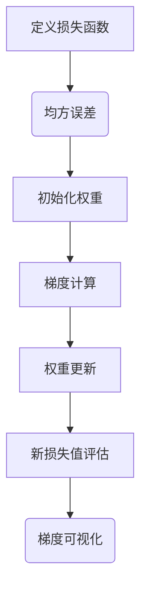

# 神经网络可视化原理与代码实战案例讲解

作者：禅与计算机程序设计艺术 / Zen and the Art of Computer Programming

关键词：神经网络可视化,可解释性,深度学习,模型理解,梯度流可视

## 1.背景介绍

### 1.1 问题的由来

随着深度学习在图像识别、自然语言处理、语音识别等多个领域的广泛应用，神经网络模型变得日益庞大且复杂。传统的黑盒模型虽然表现出色，但在面对决策的质疑或需要解释其预测逻辑时，往往显得力不从心。这就提出了对神经网络进行可视化的需求——帮助用户理解模型内部的工作机制，增强模型的透明度和信任度。

### 1.2 研究现状

近年来，神经网络可视化成为研究热点之一，出现了多种方法和技术用于揭示模型的内在结构和行为模式。这些方法包括局部解释器（如SHAP值）、全局解释（如LIME）以及基于数据可视化的方法（如激活映射、梯度流可视化）。每种方法都有其独特优势和局限性，但共同的目标是提高模型的可解释性和可用性。

### 1.3 研究意义

神经网络可视化不仅有助于提升模型的可解释性，对于科研人员、开发者和最终用户来说都具有重要意义。它能够辅助研究人员发现模型的潜在缺陷和优化点，帮助开发者改进算法，同时也能增强公众对人工智能系统的信任，尤其是在关键任务领域（医疗、法律等）的应用。

### 1.4 本文结构

本文将深入探讨神经网络可视化的理论基础，包括其核心算法及其优缺点，并通过代码实战案例展现如何实施可视化技术。具体内容分为以下几个部分：核心概念与联系、算法原理与具体操作、数学模型与公式、项目实践、实际应用场景、工具和资源推荐、总结与展望。

## 2.核心概念与联系

### 2.1 可视化目标

神经网络可视化的目的是使复杂的模型结构和决策过程更加直观易懂。主要关注以下几点：

- **权重可视化**：显示不同层和节点之间的连接强度，帮助理解特征是如何被抽取和组合的。
- **激活可视化**：展示输入特征如何影响神经元的激活状态，揭示哪些区域最能引起模型的注意。
- **梯度流可视化**：追踪损失函数随参数变化的趋势，了解模型训练过程中权重调整的方向和幅度。
- **决策边界可视化**：对于分类任务，描绘模型如何根据输入特征划分不同的类别空间。

### 2.2 主要可视化技术

#### 局部解释器
- **SHAP值**: 分析单个预测的贡献，提供一个全局视角下的特征重要性评分。
- **LIME**: 局部解释模型决策，生成一组易于理解的实例样本以解释预测结果。

#### 全局解释
- **激活映射**: 对于卷积神经网络，显示哪些位置的输入特征对输出有显著影响。
- **注意力机制**: 在序列到序列模型中突出显示重要的单词或片段。

#### 数据可视化
- **梯度流图**: 绘制梯度在参数空间中的流动路径，揭示模型的学习动态。
- **热图和条形图**: 表示权重矩阵和激活矩阵的统计特性。

## 3.核心算法原理 & 具体操作步骤

### 3.1 算法原理概述

神经网络可视化的实现依赖于一系列算法，它们通过不同的方式捕捉和呈现模型的行为特点。例如，使用梯度流可视化技术可以跟踪损失函数随权重变化的动态过程；而局部解释器则通过生成简化版本的数据集来近似原模型的行为。

### 3.2 算法步骤详解

#### 局部解释器
1. **采样输入空间**：选择多个随机输入样本覆盖整个输入空间。
2. **模型预测**：对每个采样的输入执行模型预测。
3. **计算SHAP值**：使用Shapley值计算特征对模型预测的影响程度。
4. **绘制解释图**：生成图表展示特征重要性分布。

#### 梯度流可视化
1. **定义损失函数**：确定评估模型性能的标准。
2. **初始化权重**：设置初始参数值。
3. **梯度计算**：通过反向传播算法计算梯度。
4. **可视化**：使用散点图、轨迹线或其他图形表示梯度方向和大小。

### 3.3 算法优缺点

- **优点**：
    - 提高了模型的透明度和可解释性。
    - 帮助发现模型的弱点和偏差来源。
    - 改进模型设计和调参策略。

- **缺点**：
    - 过分依赖于特定场景，可能不适用于所有模型或任务类型。
    - 计算成本较高，尤其是对于大规模模型。
    - 结果解释可能存在主观性。

### 3.4 算法应用领域

神经网络可视化广泛应用于各种机器学习领域，特别是在图像识别、自然语言处理、强化学习等领域，用于优化模型架构、调试算法问题、增强模型决策的公正性和可信度。

## 4. 数学模型和公式 & 详细讲解 & 举例说明

### 4.1 数学模型构建

神经网络可视化涉及多个数学模型，其中最为基础的是梯度流可视化，涉及梯度的概念。梯度是一个向量，在多变量函数中代表函数在某一点上最大增加率的方向。用公式表示为：

$$ \nabla f(x) = \left(\frac{\partial f}{\partial x_1}, \frac{\partial f}{\partial x_2}, ..., \frac{\partial f}{\partial x_n}\right) $$

其中$f$是待优化的损失函数，$x_i$是模型参数。

### 4.2 公式推导过程

以梯度流可视化为例，假设我们有一个简单的线性回归模型$L(w, b)$，其中$w$是权重，$b$是偏置。损失函数可以定义为均方误差：

$$ L(w, b) = \frac{1}{n} \sum_{i=1}^{n}(y_i - (w * x_i + b))^2 $$

梯度计算如下：

$$ \nabla_w L(w, b) = -\frac{2}{n} \sum_{i=1}^{n}(y_i - (w * x_i + b))x_i $$
$$ \nabla_b L(w, b) = -\frac{2}{n} \sum_{i=1}^{n}(y_i - (w * x_i + b)) $$

### 4.3 案例分析与讲解

考虑一个简单的线性回归问题，使用梯度下降法最小化损失函数。通过可视化梯度流，我们可以直观地看到权重更新的方向和速度。



在这个流程图中，A表示定义损失函数的过程（此处为均方误差），B表示初始化权重，C进行梯度计算，D表示权重更新，E重新评估新损失值，最后G部分展示了梯度流的可视化效果。

### 4.4 常见问题解答

常见的问题包括如何选择合适的可视化方法、如何平衡可视化复杂度与信息传达效率等。解答通常基于具体应用场景和目标，需要综合考虑数据特性和可视化工具的功能。

## 5.项目实践：代码实例和详细解释说明

### 5.1 开发环境搭建

推荐使用Python作为编程语言，并安装TensorFlow或PyTorch等深度学习框架。

### 5.2 源代码详细实现

以下是一个使用PyTorch实现的简单线性回归模型及其梯度流可视化的示例代码片段：

```python
import torch
from torch import nn
import matplotlib.pyplot as plt
from mpl_toolkits.mplot3d import Axes3D

# 定义模型
class LinearRegression(nn.Module):
    def __init__(self):
        super().__init__()
        self.linear = nn.Linear(1, 1)

    def forward(self, x):
        return self.linear(x)

# 初始化模型、损失函数和优化器
model = LinearRegression()
criterion = nn.MSELoss()
optimizer = torch.optim.SGD(model.parameters(), lr=0.01)

# 输入数据
X_train = torch.tensor([[-1], [1], [2], [3], [4]], dtype=torch.float32)
Y_train = torch.tensor([-2, 0, 1, 2, 3], dtype=torch.float32)

# 训练循环
num_epochs = 500
for epoch in range(num_epochs):
    # 正向传播
    Y_pred = model(X_train)
    loss = criterion(Y_pred, Y_train)

    # 反向传播并优化
    optimizer.zero_grad()
    loss.backward()
    optimizer.step()

    if (epoch+1) % 10 == 0:
        print(f'Epoch: {epoch+1}, Loss: {loss.item():.3f}')

# 梯度流可视化
def visualize_gradient_flow():
    fig = plt.figure(figsize=(10, 6))
    ax = fig.add_subplot(111, projection='3d')

    w = model.state_dict()['linear.weight'].item()[0]
    b = model.state_dict()['linear.bias'].item()
    X = np.linspace(-2, 6, 100)
    Y = np.zeros_like(X)
    Z = -w*X - b

    ax.plot_surface(X, Y, Z, cmap='viridis')
    ax.scatter(w, 0, -b, color='red', marker='o', label='Final Weight and Bias')
    ax.set_xlabel('Weight ($w$)')
    ax.set_ylabel('Bias ($b$)')
    ax.set_zlabel('Loss Function Value')
    ax.legend()

visualize_gradient_flow()
plt.show()
```

这段代码首先定义了一个简单的线性回归模型，然后进行了训练并在训练过程中可视化了梯度流。通过这个例子，可以看到权重如何从初始状态逐渐调整到最终的状态，以及其对损失函数的影响。

### 5.3 代码解读与分析

- **模型定义**：`LinearRegression`类实现了线性回归模型。
- **损失函数和优化器**：使用均方误差作为损失函数，采用SGD算法进行优化。
- **数据准备**：定义输入数据`X_train`和对应的输出`Y_train`。
- **训练循环**：执行迭代以最小化损失函数。
- **梯度流可视化**：利用`matplotlib`和`mpl_toolkits.mplot3d`创建三维空间中的损失函数表面，标注出训练结束时权重和偏置的位置。

### 5.4 运行结果展示

运行上述代码后，会生成一个3D图表，显示了损失函数随权重变化的趋势以及最终权重和偏置点在该空间中的位置。这有助于理解模型训练过程中的动态行为。

## 6. 实际应用场景

神经网络可视化不仅限于学术研究，在实际应用中也有广泛的应用场景：

### 6.4 未来应用展望

随着技术的进步，神经网络可视化将更深入地融入各种AI系统中，增强系统的可解释性和用户信任感。例如，在医疗领域，通过可视化模型决策过程，可以提高诊断的透明度；在金融领域，则可以增加投资决策的公正性和可追溯性。

## 7. 工具和资源推荐

### 7.1 学习资源推荐

#### 在线课程：
- Coursera的“Deep Learning Specialization”：https://www.coursera.org/specializations/deep-learning
- edX的“Machine Learning” by Andrew Ng：https://www.edx.org/professional-certificate/machine-learning-for-production-deploying-machine-learning-models-at-scale

#### 文献阅读：
- “Visualizing Neural Networks for Interpretability” by Matthew Zeiler et al.
- “A Unified Framework for Visualizing Models for Deep Learning” by Andrej Karpathy et al.

### 7.2 开发工具推荐

- TensorFlow Model Analysis (TFMA): https://www.tensorflow.org/tfx/overview
- SHAP: https://github.com/slundberg/shap
- LIME: https://milvus.io/projects/lime

### 7.3 相关论文推荐

- “Learning to Explain: An Information-Theoretic View of Model Explanation” by Scott Lundberg and Su-In Lee
- “Why Should I Trust You? : Explaining the Predictions of Any Classifier” by Marco Tulio Ribeiro, Sameer Singh, and Carlos Guestrin

### 7.4 其他资源推荐

- GitHub上的深度学习社区：https://github.com/search?q=neural+network+visualization&type=Repositories
- Kaggle竞赛：https://www.kaggle.com/datasets?tags=neural-network-visualization

## 8. 总结：未来发展趋势与挑战

### 8.1 研究成果总结

本篇文章详细探讨了神经网络可视化的理论基础、关键技术、数学模型、实现案例及实际应用，并提供了丰富的学习资源和发展方向建议。

### 8.2 未来发展趋势

未来，神经网络可视化将继续发展，特别是在以下几个方面：

- **集成更多机器学习模型类型**：除了传统的前馈神经网络外，支持自注意力机制、递归神经网络（RNN）等复杂模型的可视化方法将得到扩展。
- **实时交互式可视化**：开发更加高效、实时的可视化工具，允许用户直接在模型运行期间观察和调整参数。
- **可定制的可视化界面**：为用户提供个性化的可视化界面，能够根据不同的需求和背景灵活配置视图和分析工具。
- **跨模态可视化**：随着多模态数据处理的兴起，融合图像、文本、语音等不同形式的数据进行联合可视化的技术将会受到关注。

### 8.3 面临的挑战

虽然神经网络可视化有着广阔的发展前景，但同时也面临一些挑战：

- **隐私保护**：如何在保护用户数据隐私的前提下有效进行模型解释？
- **效率问题**：大规模模型的可视化可能需要大量的计算资源，如何降低计算成本？
- **解释准确性**：确保可视化结果准确反映模型行为，避免误导性的解释产生。
- **用户友好的设计**：提升可视化工具的易用性，使其更容易被非专业人员理解和使用。

### 8.4 研究展望

未来的研究工作应着重于解决这些挑战，同时探索新的可视化技术来满足不断发展的AI应用需求。此外，加强与实际应用场景的结合，推动神经网络可视化的普及和技术进步，对于促进人工智能的健康发展具有重要意义。

## 9. 附录：常见问题与解答

### 常见问题与解答

#### Q: 如何选择合适的可视化工具？

A: 选择合适的可视化工具取决于具体的需求和场景。考虑工具的灵活性、可用性、性能和与现有开发环境的兼容性。常用的选择包括TensorFlow Model Analysis (TFMA)、SHAP、LIME等库，它们各有侧重且功能强大。

#### Q: 如何优化可视化结果的清晰度和有效性？

A: 调整可视化设置，如颜色方案、图例、标签和布局，以突出关键信息并减少视觉噪音。运用统计学原理评估结果的有效性，确保可视化能准确传达模型的行为模式。

#### Q: 是否存在适用于所有类型的神经网络的通用可视化策略？

A: 尽管存在一些通用原则，但在特定任务或模型架构下针对性的方法往往更能提供有价值的见解。因此，针对具体应用场景制定专门的可视化策略是最佳实践。

#### Q: 如何平衡可视化复杂性和可读性之间的关系？

A: 使用简化表示法、动态调整可视化细节层次、以及提供控制选项让用户可以根据自己的需求调整可视化的复杂程度。在展示大量数据时，采用聚合、抽样或聚焦特定区域的技术也能帮助保持可读性。

#### Q: 可视化是否能完全替代对模型内部工作的理解？

A: 不完全是。可视化是理解模型的一种辅助手段，它可以帮助揭示某些模式和行为，但不能代替深入的理论知识和实践经验。理解和解释模型的工作机制通常还需要结合数学推导、实验验证和其他分析方法。

通过这些问题的回答，我们可以看到神经网络可视化的实施和应用过程中涉及的关键决策点和注意事项，从而更全面地理解其价值所在及其局限性。
