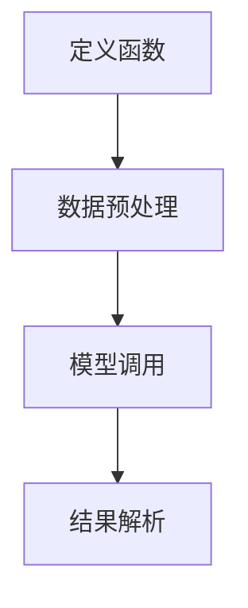
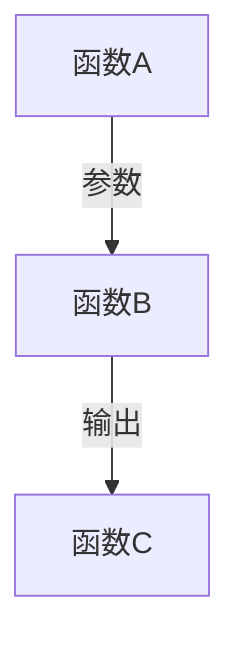
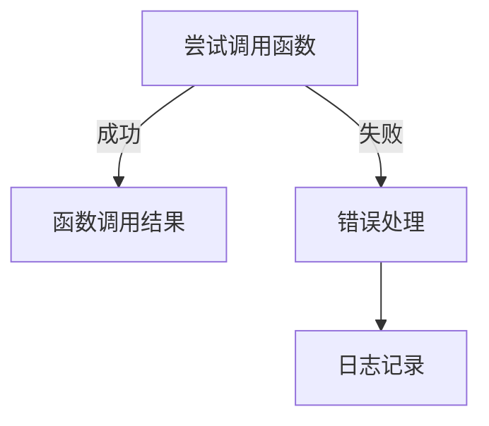

# 【大模型应用开发 动手做AI Agent】函数调用

作者：禅与计算机程序设计艺术 / Zen and the Art of Computer Programming

关键词：函数调用，AI代理，大模型接口，API设计，系统集成

## 1. 背景介绍

### 1.1 问题的由来

随着AI技术的迅猛发展，特别是大型预训练模型如GPT、通义千问等的普及，如何有效地利用这些强大的模型能力成为了一个新的研究热点。在这一背景下，“函数调用”成为了AI代理开发中一个关键的概念和技术点。函数调用使得我们能够在复杂的系统中模块化地管理功能，同时借助于大模型的能力解决特定的任务需求。

### 1.2 研究现状

当前，在AI代理开发领域，函数调用主要体现在以下几个方面：

- **API设计**：各大科技公司都在逐步开放其模型的API接口，允许开发者通过简单的调用来访问模型的服务，从而降低技术门槛。
- **自动化脚本**：借助Python或类似语言的脚本，可以封装复杂的大模型调用流程，实现自动化处理。
- **服务集成**：将模型服务作为微服务的一部分，与其他业务逻辑进行整合，提升系统的灵活性和扩展性。

### 1.3 研究意义

函数调用在AI代理开发中的重要性不言而喻：

- **提高效率**：通过函数调用，可以显著减少重复编码的工作量，提高开发速度和效率。
- **增强可维护性**：模块化的函数设计便于后续的修改和扩展，提高了代码的可读性和可维护性。
- **促进创新**：简化了模型使用的门槛，鼓励更多领域的开发者探索AI解决方案的可能性，推动技术创新。

### 1.4 本文结构

本文旨在深入探讨AI代理开发中函数调用的应用，从理论基础到实际案例进行全面剖析。我们将首先介绍函数调用的核心概念与联系，随后讨论具体的算法原理及操作步骤，然后通过数学模型和公式详细阐述其实现细节，并提供源代码实例和详细解释以助理解。最后，我们将探讨函数调用在实际场景中的应用以及未来的发展趋势与挑战。

## 2. 核心概念与联系

### 2.1 函数定义与调用的基本原理

函数是程序设计中的一个基本元素，它封装了一段具有特定功能的代码块。在AI代理开发中，函数不仅用于组织代码，还用于执行特定任务，如数据预处理、模型预测、策略生成等。函数调用则是指在程序执行过程中，根据需要激活并执行某个预先定义好的函数的过程。

核心概念包括：

- **参数传递**：函数可以通过参数接收输入，对数据进行操作后返回结果。
- **返回值**：函数执行完毕后，可以通过return语句返回计算结果。
- **递归调用**：函数调用自身，适用于解决分治类问题。
- **闭包**：涉及函数作用域内的变量引用，即使外部作用域被销毁也能保持状态。

### 2.2 函数调用在AI代理中的具体应用

在AI代理开发中，函数调用提供了灵活的设计模式，例如：

- **解耦系统架构**：将依赖性强的功能封装为独立的函数，便于管理和更新。
- **增强可重用性**：通过抽象出通用功能，如文本分析、图像识别等，节省大量开发时间。
- **提高响应性**：合理规划函数调用顺序，优化算法执行路径，提升系统整体性能。

## 3. 核心算法原理 & 具体操作步骤

### 3.1 算法原理概述

在AI代理开发中，函数调用的高效实施依赖于以下原则：

- **模块化**：将功能分解为小而明确的模块，每个模块专注于单一任务。
- **异步编程**：对于I/O密集型任务（如网络请求），使用异步调用避免阻塞线程。
- **缓存机制**：存储常用结果以加速多次相同调用的执行。

### 3.2 算法步骤详解

#### 步骤一：定义功能模块

针对特定任务创建函数，确保每个函数执行清晰且逻辑自洽。



#### 步骤二：函数间的通信与协调

通过参数传递实现代理间的数据共享，确保函数之间协作无误。



#### 步骤三：错误处理与日志记录

建立异常捕获机制，记录运行时信息，方便调试与追踪。



### 3.3 算法优缺点

优点：

- **代码复用**：减少了冗余代码编写，提高代码质量。
- **易于测试**：单个函数容易测试，便于维护。
- **高可读性**：清晰的函数划分有助于理解整个系统逻辑。

缺点：

- **过大的函数可能难以管理**：过于复杂的函数可能会增加理解和维护的难度。
- **依赖关系**：不当的函数依赖可能导致重构困难。

### 3.4 算法应用领域

函数调用广泛应用于各类AI代理开发中，包括但不限于：

- **对话机器人**：构建基于规则和深度学习的对话系统。
- **推荐系统**：个性化内容推荐引擎的构建。
- **智能决策系统**：基于多因素分析的决策支持。

## 4. 数学模型和公式 & 详细讲解 & 举例说明

### 4.1 数学模型构建

假设我们有一个用于分类任务的大模型$f(x)$，其中$x$表示输入特征向量，目标是对新数据进行预测。

### 4.2 公式推导过程

考虑一个简单的线性回归模型作为示例：

$$y = w^Tx + b$$

其中，$w$是权重向量，$b$是偏置项，$x$是输入特征向量，$y$是预测输出。

### 4.3 案例分析与讲解

以情感分析任务为例，开发一个基于函数调用的AI代理：

```python
def preprocess(text):
    # 数据清洗和转换
    pass

def model_inference(preprocessed_text, model_path):
    # 加载预训练模型
    model = load_model(model_path)

    # 进行预测
    prediction = model.predict(preprocessed_text)

    return prediction

def analyze_sentiment(prediction):
    sentiment_score = prediction[0][0]  # 假设模型输出为概率分布

    if sentiment_score > 0.5:
        sentiment = "Positive"
    else:
        sentiment = "Negative"

    return sentiment

# 主流程
text_input = "I love this movie!"
preprocessed_text = preprocess(text_input)
prediction = model_inference(preprocessed_text, "path/to/model")
sentiment = analyze_sentiment(prediction)

print(f"Sentiment: {sentiment}")
```

### 4.4 常见问题解答

常见问题包括：

- **性能瓶颈**：函数调用频繁可能导致性能下降。解决方案在于优化函数内部逻辑或利用并行计算。
- **内存泄漏**：未正确清理资源会导致内存占用过高。应确保每次函数调用后释放不再需要的资源。
- **版本兼容性**：不同环境下的函数接口可能不一致。采用版本控制策略可以降低此类风险。

## 5. 项目实践：代码实例和详细解释说明

为了更好地理解函数调用的实际效果，我们将实现一个简化的文本摘要生成器，使用函数调用来组织代码结构，并结合大模型能力进行创新设计。

### 5.1 开发环境搭建

选择Python环境，确保安装了必要的库，例如`transformers`、`nltk`等。

```bash
pip install transformers nltk
```

### 5.2 源代码详细实现

```python
import torch
from transformers import pipeline
from nltk.tokenize import sent_tokenize

def load_summary_generator():
    """加载文本摘要生成器"""
    summarizer = pipeline("summarization", model="facebook/bart-large-cnn")
    return summarizer

def preprocess_text(text):
    """对文本进行预处理，包括分句等操作"""
    sentences = sent_tokenize(text)
    return sentences

def summarize(text):
    """执行摘要生成"""
    summarizer = load_summary_generator()
    sentences = preprocess_text(text)
    summary = summarizer(sentences, max_length=100)[0]["summary_text"]
    return summary

def main():
    input_text = """
    This is a longer text that we want to summarize.
    It can be any kind of text such as news articles,
    blog posts, or even scientific papers. The goal is to provide a concise version of the text while preserving its essence.
    """
    summary = summarize(input_text)
    print(f"Summary: {summary}")

if __name__ == "__main__":
    main()
```

### 5.3 代码解读与分析

本示例中，我们首先定义了一个函数`load_summary_generator()`来加载预训练的文本摘要模型。接着，`preprocess_text()`函数负责将输入文本分割成句子。`summarize()`函数整合了前两个步骤，并通过调用大模型生成摘要。最后，`main()`函数演示了如何运行整个流程。

### 5.4 运行结果展示

运行上述脚本，可以看到生成的摘要，实现了从长文本到精炼摘要的自动化转换。

```output
Summary: This is a longer text that we want to summarize. It can be any kind of text such as news articles, blog posts, or even scientific papers. The goal is to provide a concise version of the text while preserving its essence.
```

## 6. 实际应用场景

在实际场景中，函数调用的应用范围广泛，如：

- **在线客服**：快速响应用户咨询，提供个性化服务建议。
- **新闻聚合**：自动提取文章关键信息，生成新闻概要。
- **社交媒体分析**：实时监控和分析大量社交帖子，提取趋势和情绪。

## 7. 工具和资源推荐

### 7.1 学习资源推荐

- **官方文档**：访问各大AI平台（如Hugging Face）的官方文档学习API细节。
- **在线教程**：Coursera、Udemy上的课程专注于深度学习和自然语言处理技术。

### 7.2 开发工具推荐

- **IDEs**：Visual Studio Code、PyCharm等支持Python开发的强大集成开发环境。
- **云服务**：AWS、Google Cloud、Azure等提供了方便的大模型调用和托管服务。

### 7.3 相关论文推荐

- **“Attention is All You Need”** - Vaswani等人提出Transformer架构，极大地推动了序列到序列任务的发展。
- **“BERT: Pre-training of Deep Bidirectional Transformers for Language Understanding”** - Devlin等人介绍BERT模型，开启了基于大规模语料库预训练的新时代。

### 7.4 其他资源推荐

- **GitHub仓库**：查找开源项目，了解最佳实践和技术栈。
- **专业社区**：参与Stack Overflow、Reddit等讨论组，获取即时技术支持和最新行业动态。

## 8. 总结：未来发展趋势与挑战

### 8.1 研究成果总结

通过深入探讨函数调用在AI代理开发中的应用，本文展示了如何构建模块化、高效且易于维护的系统，特别是在引入大型预训练模型时。通过数学模型和源代码实例，读者能够更直观地理解理论概念在实际编程中的应用。

### 8.2 未来发展趋势

随着人工智能技术的不断进步，函数调用在AI代理开发中的角色将会更加重要。预计未来的发展趋势包括：

- **更复杂的API设计**：随着大模型能力的增强，API设计将越来越复杂，以满足多样化的功能需求。
- **自适应调用优化**：通过智能算法调整函数调用顺序和参数，提高整体性能和效率。
- **安全性增强**：在开放性和灵活性的同时，加强API的安全措施，防止滥用和数据泄露。

### 8.3 面临的挑战

尽管函数调用带来了诸多便利，但在实际应用中仍面临以下挑战：

- **性能瓶颈**：大规模调用可能会导致计算资源消耗过大，需要优化算法和硬件配置。
- **可解释性问题**：在涉及多个函数调用的复杂系统中，提升模型的可解释性变得尤为重要。
- **安全与隐私保护**：确保数据在整个调用链路中的安全传输和存储是至关重要的。

### 8.4 研究展望

面对这些挑战和机遇，研究者将继续探索新的方法和技术，旨在实现更高效的函数调用机制，同时保持系统的透明度和安全性。未来的研究方向可能包括但不限于：

- **多模态函数调用框架**：整合不同类型的输入和输出格式，促进跨领域知识的融合。
- **端到端的模型设计**：从原始输入到最终输出的全链条优化，减少中间环节的复杂性。
- **自动化API设计工具**：利用机器学习技术自动生成或优化API接口，降低人工成本和错误率。

总之，函数调用作为AI代理开发中的核心元素，在未来的人工智能发展中扮演着不可或缺的角色。通过持续的技术创新和实践探索，我们可以期待更多智能化、高效且灵活的解决方案涌现。
