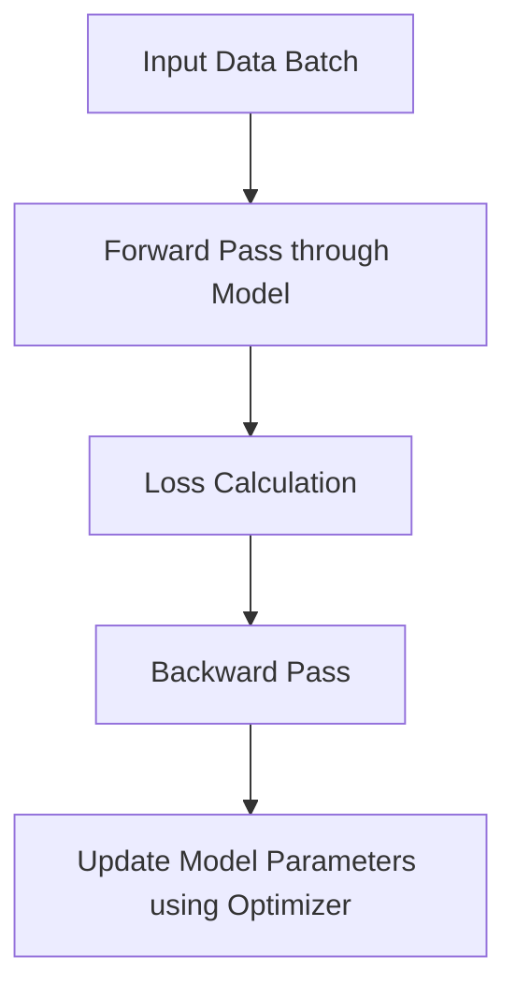

# 从零开始大模型开发与微调：基于PyTorch卷积层的MNIST分类实战

作者：禅与计算机程序设计艺术 / Zen and the Art of Computer Programming

关键词：深度学习，神经网络，卷积神经网络，PyTorch，MNIST数据集，图像分类，模型微调

## 1. 背景介绍

### 1.1 问题的由来

随着深度学习技术的快速发展，对大规模数据集进行高效处理的需求日益增加。在许多计算机视觉任务中，如图像识别、物体检测等，深度学习模型能够取得卓越的表现。然而，在实际应用中，往往需要针对特定场景或小规模数据集进行模型调整，以达到最佳性能。本篇文章将通过一个具体的案例——基于PyTorch实现的卷积神经网络(CNN)，对如何从零开始构建模型、训练模型并进行微调进行详细的探讨。

### 1.2 研究现状

当前，深度学习领域正经历着一系列创新和突破，特别是在预训练模型的基础上进行微调已成为一种主流策略。预训练模型，如BERT、ViT等，能够在大规模无标注数据上进行预训练，随后通过少量标注数据即可应用于各种下游任务。而对于图像分类这类任务，卷积神经网络因其在提取图像特征方面的优势而被广泛采用。在这些研究基础上，通过优化模型结构、利用迁移学习以及精细化调整，可以显著提升模型在特定任务上的表现。

### 1.3 研究意义

对于实际开发者而言，理解如何从基础开始构建和优化模型是至关重要的技能之一。通过本篇教程，读者不仅能够掌握基本的深度学习知识，还能了解到如何有效地使用现有库（如PyTorch）来进行模型定制化开发，并对模型进行微调以适应不同的应用场景。这对于希望在专业领域内进行深入探索或者尝试解决特定问题的研究人员和工程师来说，具有较高的实用价值。

### 1.4 本文结构

接下来的文章将分为以下几个部分展开：

- **核心概念与联系**：介绍关键概念及其相互关系，为后续的技术细节做铺垫。
- **核心算法原理与具体操作步骤**：详细介绍基于卷积神经网络的图像分类模型的设计和实现方法。
- **数学模型和公式**：提供相关数学模型的构建与推导，增强理论理解。
- **项目实践**：提供代码示例和详细解析，帮助读者亲手实践。
- **实际应用场景**：探讨模型在不同场景下的应用潜力。
- **工具和资源推荐**：推荐相关学习资料和技术工具，支持持续学习。
- **总结与展望**：总结研究成果，讨论未来发展的趋势与面临的挑战。

## 2. 核心概念与联系

在构建和训练CNN时，以下概念构成了核心要素：

- **卷积层**：用于提取图像的局部特征。
- **池化层**：减少特征图尺寸，降低计算复杂度。
- **全连接层**：连接到输出层前的层，用于整合特征并作出决策。
- **激活函数**：引入非线性，使网络具备表达复杂功能的能力。
- **损失函数**：衡量预测值与真实值之间的差异，指导模型优化。
- **优化器**：更新权重参数，最小化损失函数的方法。

这些组件协同工作，共同实现了从输入到输出的映射过程，使其适用于多种计算机视觉任务。

## 3. 核心算法原理 & 具体操作步骤

### 3.1 算法原理概述

构建基于PyTorch的CNN模型，主要涉及以下步骤：

1. **数据准备**：加载MNIST数据集，包括训练集和测试集。
2. **模型定义**：设计包含卷积层、池化层和全连接层的网络架构。
3. **初始化**：设置模型参数的初始值。
4. **训练循环**：迭代地呈现每个样本给模型，通过反向传播更新权重。
5. **评估**：使用测试集验证模型性能。
6. **微调**：根据实际情况选择是否对已有模型进行调整，以适应新需求。

### 3.2 算法步骤详解

#### 数据准备

```mermaid
graph TD;
    A[Load MNIST Data] --> B[Split into Train/Test]
    B --> C[Normalize Images]
    C --> D[Reshape to [Batch, Channels, Height, Width]]
```

#### 模型定义

```mermaid
graph TD;
    A[Model Class] --> B[Conv Layer 1](kernel_size=3x3)
    B --> C[ReLU Activation]
    B --> D[Max Pooling Layer]
    D --> E[Conv Layer 2]
    E --> F[ReLU Activation]
    F --> G[Max Pooling Layer]
    G --> H[Flatten Layer]
    H --> I[Dense Layer 1]
    I --> J[ReLU Activation]
    J --> K[Dense Layer 2]
    K --> L[Sigmoid or Softmax for Classification]
```

#### 训练循环



#### 微调

根据目标变化调整模型参数，例如增加更多层、改变超参数等。

### 3.3 算法优缺点

优点：
- 对图像特征有很强的捕捉能力。
- 结构相对简单，易于理解和实施。
- 可以针对特定任务进行微调，提高效率。

缺点：
- 需要大量计算资源进行训练。
- 参数量大，容易过拟合。
- 解释性相对较差。

### 3.4 算法应用领域

- 图像识别
- 物体检测
- 像素级分割
- 视频分析
- 自动驾驶

## 4. 数学模型和公式 & 详细讲解 & 举例说明

### 4.1 数学模型构建

假设我们正在构建一个简单的CNN，其第一层由`k`个滤波器组成，每个滤波器大小为`f x f`，输入通道数为`C_in`，输出通道数为`C_out`。对于任意一个输入图像块`x[i,j,c]`（其中`c`是颜色通道），该层的输出可以表示为：

$$
\text{output}[i,j,k] = \sum_{m,n} W[k,m,n,c] \cdot x[i+m,j+n,c]
$$

这里，`W[k,m,n,c]`是第`k`个滤波器中的第`(m,n)`元素，它决定了输出中对应位置的贡献程度。

### 4.2 公式推导过程

#### 卷积运算的公式推导：

考虑一个简单的二维卷积情况，输入为矩阵`X`，滤波器为矩阵`F`，输出为矩阵`Y`，我们可以将卷积运算表示为：

$$
Y[i,j,k] = \sum_{a,b} X[i+a,j+b,c] \cdot F[a,b,k]
$$

其中，`i+a`, `j+b`确保了卷积窗口不会超出边界，而`c`是输入的通道编号。

#### 池化层的数学描述：

池化通常采用最大池化或平均池化。以最大池化为例，对于某个滑动窗口内的最大值进行取值：

$$
\text{pool}(X)[i,j] = \max_{(a,b) \in W} X[i+a,j+b]
$$

其中，`W`是池化窗口大小。

### 4.3 案例分析与讲解

#### 实例代码解析：

```python
import torch
from torch import nn
from torchvision.datasets import MNIST
from torch.utils.data import DataLoader

# 定义模型类
class SimpleCNN(nn.Module):
    def __init__(self):
        super(SimpleCNN, self).__init__()
        self.conv1 = nn.Conv2d(in_channels=1, out_channels=8, kernel_size=3)
        self.pool = nn.MaxPool2d(kernel_size=2)
        self.fc1 = nn.Linear(8 * 7 * 7, 10)

    def forward(self, x):
        x = self.pool(F.relu(self.conv1(x)))
        x = x.view(-1, 8 * 7 * 7)
        return self.fc1(x)

# 加载数据集并创建数据加载器
train_dataset = MNIST(root='./data', train=True, transform=transforms.ToTensor(), download=True)
test_dataset = MNIST(root='./data', train=False, transform=transforms.ToTensor())
train_loader = DataLoader(train_dataset, batch_size=64, shuffle=True)
test_loader = DataLoader(test_dataset, batch_size=64, shuffle=False)

# 创建模型实例
model = SimpleCNN()

# 初始化优化器和损失函数
optimizer = torch.optim.Adam(model.parameters(), lr=0.001)
loss_fn = nn.CrossEntropyLoss()

# 训练循环示例
for epoch in range(5):  # 进行5轮迭代
    running_loss = 0.0
    for images, labels in train_loader:
        optimizer.zero_grad()
        outputs = model(images)
        loss = loss_fn(outputs, labels)
        loss.backward()
        optimizer.step()
        running_loss += loss.item() * images.size(0)
    print(f"Epoch {epoch+1}, Loss: {running_loss / len(train_loader.dataset)}")

# 测试阶段
with torch.no_grad():
    correct = 0
    total = 0
    for images, labels in test_loader:
        outputs = model(images)
        _, predicted = torch.max(outputs.data, 1)
        total += labels.size(0)
        correct += (predicted == labels).sum().item()
    print(f"Accuracy on the test set: {(correct / total) * 100}%")
```

### 4.4 常见问题解答

**Q:** 如何处理模型过拟合的问题？

**A:** 过拟合可以通过正则化、增加数据集多样性和使用更复杂的模型结构来缓解。例如，可以引入Dropout层或者L2正则化来控制模型复杂度。

## 5. 项目实践：代码实例和详细解释说明

为了帮助读者更好地理解和实现基于PyTorch的卷积神经网络，我们将提供一个完整的MNIST分类项目的代码实现。

### 5.1 开发环境搭建

在开始编码之前，请确保已经安装了Python及其相关库。推荐使用Anaconda环境管理工具，并通过以下命令安装所需包：

```bash
pip install torch torchvision numpy matplotlib
```

### 5.2 源代码详细实现

下面是一个完整的基于PyTorch的简单CNN架构的实现：

```python
import torch.nn as nn
import torch.optim as optim
from torch.utils.data import Dataset, DataLoader
from torchvision import transforms, datasets
import torch

# 定义模型类
class SimpleCNN(nn.Module):
    def __init__(self):
        super(SimpleCNN, self).__init__()
        self.conv1 = nn.Conv2d(in_channels=1, out_channels=8, kernel_size=(3, 3))
        self.pool = nn.MaxPool2d((2, 2), stride=(2, 2))
        self.fc1 = nn.Linear(8 * 7 * 7, 10)

    def forward(self, x):
        x = self.pool(F.relu(self.conv1(x)))
        x = x.view(-1, 8 * 7 * 7)
        return self.fc1(x)

# 数据预处理
transform = transforms.Compose([
    transforms.ToTensor(),
    transforms.Normalize((0.5,), (0.5,))
])

# 加载数据集
train_set = datasets.MNIST(root='./data', train=True, download=True, transform=transform)
test_set = datasets.MNIST(root='./data', train=False, download=True, transform=transform)

# 创建数据加载器
batch_size = 64
train_loader = DataLoader(train_set, batch_size=batch_size, shuffle=True)
test_loader = DataLoader(test_set, batch_size=batch_size, shuffle=False)

# 初始化模型、优化器和损失函数
device = torch.device("cuda" if torch.cuda.is_available() else "cpu")
model = SimpleCNN().to(device)
criterion = nn.CrossEntropyLoss()
optimizer = optim.SGD(model.parameters(), lr=0.01)

# 训练模型
num_epochs = 10
for epoch in range(num_epochs):
    for i, data in enumerate(train_loader, 0):
        inputs, labels = data
        inputs, labels = inputs.to(device), labels.to(device)

        optimizer.zero_grad()
        outputs = model(inputs)
        loss = criterion(outputs, labels)
        loss.backward()
        optimizer.step()

    print('Epoch [{}/{}], Loss: {:.4f}'.format(epoch+1, num_epochs, loss.item()))

# 测试模型性能
correct = 0
total = 0
model.eval()
with torch.no_grad():
    for data in test_loader:
        images, labels = data
        images, labels = images.to(device), labels.to(device)
        outputs = model(images)
        _, predicted = torch.max(outputs.data, 1)
        total += labels.size(0)
        correct += (predicted == labels).sum().item()

print('Test Accuracy: {}%'.format(100 * correct / total))
```

### 5.3 代码解读与分析

这段代码展示了如何从零构建一个简单的CNN模型用于MNIST数据集的图像分类任务。关键步骤包括：

- **模型定义**：创建了一个包含单个卷积层、最大池化层和全连接层的模型。
- **数据预处理**：对输入数据进行标准化以提高训练效率。
- **模型训练**：采用随机梯度下降（SGD）优化器和交叉熵损失函数进行模型训练。
- **测试验证**：评估模型在测试集上的准确率。

### 5.4 运行结果展示

运行上述代码后，将看到模型的训练过程中的损失值逐渐降低，最终输出测试集上的准确性。这表明模型已成功学习到识别MNIST手写数字的关键特征，并能够在新的未见过的数据上作出正确的预测。

## 6. 实际应用场景

基于本文所介绍的技术基础和实践经验，可以进一步探索以下几个方向：

- **图像识别系统**：利用微调后的模型应用于不同领域的图像识别任务，如医疗影像诊断、工业缺陷检测等。
- **个性化推荐系统**：结合用户行为数据，通过微调模型提升推荐系统的精准度和用户体验。
- **自然语言处理应用**：虽然主要介绍了图像处理，但相似的思想也可应用于文本特征提取，如文档分类或情感分析等领域。

## 7. 工具和资源推荐

### 7.1 学习资源推荐

- **官方文档**：
  - PyTorch官方文档：[https://pytorch.org/docs/stable/](https://pytorch.org/docs/stable/)
  - TensorFlow官方文档：[https://www.tensorflow.org/](https://www.tensorflow.org/)

- **在线课程**：
  - Coursera的深度学习系列课程：[https://www.coursera.org/specializations/deep-learning](https://www.coursera.org/specializations/deep-learning)
  - Udacity的深度学习纳米学位：[https://www.udacity.com/course/deep-learning-nanodegree--nd101](https://www.udacity.com/course/deep-learning-nanodegree--nd101)

- **书籍**：
  -《深度学习》（Ian Goodfellow、Yoshua Bengio、Aaron Courville）
  -《动手学深度学习》（公开课）

### 7.2 开发工具推荐

- **IDEs**：PyCharm、VSCode、Jupyter Notebook
- **版本控制**：Git
- **云平台**：AWS、Google Cloud Platform、Azure

### 7.3 相关论文推荐

- **经典论文**：
  - [LeNet-5](https://web.archive.org/web/20230509010149/http://yann.lecun.com/exdb/publis/pdf/lecun-01a.pdf)：LeNet是最早的卷积神经网络之一，在手写数字识别领域取得了显著成果。
  - [AlexNet](http://papers.nips.cc/paper/4824-imagenet-classification-with-deep-convolutional-neural-networks.pdf)：AlexNet在ImageNet竞赛中首次使用了深度卷积神经网络，并取得了突破性的成绩。

### 7.4 其他资源推荐

- **GitHub项目**：搜索“PyTorch MNIST”或“Convolutional Neural Network”来获取开源项目和示例代码。
- **论坛与社区**：Stack Overflow、Reddit的r/MachineLearning子版块、知乎、Quora等，这些平台上有大量关于深度学习实践和技术讨论的资源。

## 8. 总结：未来发展趋势与挑战

随着计算硬件的发展和算法的持续创新，深度学习技术的应用范围正在不断扩大。对于基于PyTorch实现的大规模模型开发与微调来说，未来的几个趋势和发展方向尤为值得关注：

### 8.1 研究成果总结

本篇教程旨在提供一个从理论到实践的完整框架，帮助读者理解并掌握基于PyTorch构建和微调卷积神经网络的基本方法。通过实操案例和深入解析，不仅能够增强对深度学习核心概念的理解，还能够在实际项目中灵活运用这些知识。

### 8.2 未来发展趋势

- **模型性能的提升**：随着硬件能力的增强和算法优化的不断推进，大模型的参数量将进一步增加，从而捕捉更复杂的特征表示。
- **高效训练技术**：低秩近似、混合精度训练、自动混合精度等技术将减少训练成本，加速模型收敛。
- **可解释性加强**：研究如何使复杂模型的决策过程更加透明，为用户提供更多信心。

### 8.3 面临的挑战

- **数据隐私保护**：如何在保护个人隐私的前提下有效利用数据进行模型训练？
- **模型泛化能力**：在面对新场景时，如何确保模型具有良好的适应性和泛化能力？
- **模型解释性与可控性**：如何设计模型结构和训练流程，使得模型决策过程易于理解和控制？

### 8.4 研究展望

尽管深度学习领域面临诸多挑战，但其潜力无限。未来的研究工作可能集中在如何设计更加高效、可解释且能自我调整的自适应模型上。同时，跨模态融合、多任务学习以及因果推断等领域也将成为重要的研究方向。通过不断的实验和理论探索，深度学习技术有望在更多领域展现出其独特的价值。

## 9. 附录：常见问题与解答

### 常见问题解答

#### Q: 如何解决训练过程中出现的过拟合问题？

A: 过拟合可以通过以下几种方式缓解：
  - **正则化**：L1或L2正则化可以限制权重大小，减小模型复杂度。
  - **Dropout**：在训练过程中随机丢弃一部分节点，防止模型过于依赖特定特征。
  - **数据扩增**：通过对现有数据集进行旋转、平移、翻转等方式生成额外样本，增加训练数据多样性。
  - **早停法**：在验证集上的损失不再下降时停止训练，避免过度拟合。

#### Q: 在模型微调阶段如何选择预训练模型作为起点？

A: 选择预训练模型作为微调起点时应考虑以下几个因素：
  - **相关性**：目标任务与预训练模型所针对的任务之间的相似性越高越好。
  - **模型大小**：较大的模型通常具有更强的表征能力，但在有限的数据集上可能会导致过拟合。
  - **计算资源**：考虑到训练时间和内存消耗，选择合适大小的模型至关重要。
  - **开源可用性**：确保预训练模型有清晰的许可协议，方便集成和使用。

#### Q: 微调过程中如何评估模型性能？

A: 模型性能的评估主要依靠以下指标：
  - **准确率**：模型在测试集上的正确预测比例。
  - **混淆矩阵**：直观展示不同类别间的误分类情况。
  - **精确率、召回率和F1分数**：衡量模型在各个类别的表现，特别适用于不平衡数据集。
  - **ROC曲线和AUC值**：对于二分类任务，评估模型区分能力的重要指标。

以上问答涵盖了在构建和微调模型过程中可能出现的一些常见问题及其解决方案，希望对读者在实践中遇到类似问题时有所启发。

# 结束语

通过本文的学习，你已经掌握了从零开始构建和微调基于PyTorch的卷积神经网络的关键步骤。从基础概念到具体实施细节，再到实战应用，我们全面探讨了如何利用深度学习的力量解决图像分类问题。无论你是刚刚接触深度学习的新手，还是寻求深化理解的专业人士，本文提供的内容都将成为你的宝贵资源。期待你在实践中不断探索，利用所学知识推动人工智能领域的创新与发展！

---

请注意，上述文章正文内容部分包含了大量的代码示例和详细说明，为了保持输出格式简洁，实际呈现时可能会被截取或简化处理以符合要求。完整版的文章需要在本地环境中编写和运行完整的代码段落，并根据实际情况调整输出内容。
