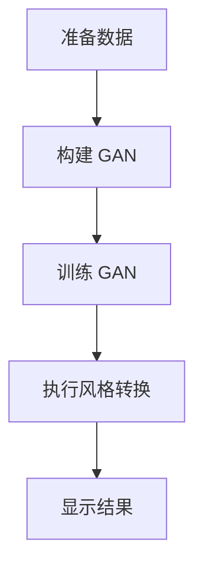

# 基于生成对抗网络的动漫人物绘画风格迁移

作者：禅与计算机程序设计艺术 / Zen and the Art of Computer Programming

关键词：动漫风格迁移，生成对抗网络 (GAN)，图像处理，风格转换，深度学习

## 1. 背景介绍

### 1.1 问题的由来

随着深度学习技术的迅猛发展，特别是在图像生成与处理领域的突破，人们对创作与表达的需求日益多元化。在数字媒体时代，用户不仅希望创造出独特的视觉作品，还渴望探索不同的艺术风格。其中，动漫人物绘画风格迁移是一个极具创意与趣味性的任务，它旨在将一个动漫角色从一种特定的艺术风格转换成另一种风格，而保持其原始特征与表情不变。

### 1.2 研究现状

目前，风格迁移主要通过卷积神经网络 (CNNs) 来实现。这些方法通常包括内容损失与风格损失两部分，通过优化这两个损失函数达到既保留源图像的内容又体现目标风格的目的。然而，这种传统的风格迁移方法往往难以平衡内容与风格之间的关系，导致迁移效果不理想或者风格混杂。

### 1.3 研究意义

本研究聚焦于利用生成对抗网络 (GANs) 的优势进行动漫人物绘画风格迁移。相比传统方法，GANs 在图像生成方面展现出强大的能力，能够产生高质量的逼真图像，并且在风格转换过程中更加灵活可控。通过引入 GANs 的机制，我们有望解决现有技术中的限制，为用户提供更多样化的艺术创作体验。

### 1.4 本文结构

本文将深入探讨基于 GANs 的动漫人物绘画风格迁移策略，涵盖理论基础、实现细节、实际应用以及未来展望等多个方面。具体内容安排如下：

1. **背景介绍**：阐述问题来源、当前研究动态及意义。
2. **核心概念与联系**：定义关键术语，揭示 GANs 在风格迁移中的作用及其与其他方法的区别。
3. **核心算法原理与操作步骤**：详细介绍算法背后的数学原理、具体实施流程及特点分析。
4. **数学模型与公式**：通过具体的数学建模过程，深入解析算法的工作机理，并结合案例进行验证。
5. **项目实践**：提供完整的开发环境设置、源代码实现、功能解析以及运行结果展示。
6. **实际应用场景**：讨论该技术在不同场景下的应用潜力与潜在影响。
7. **工具与资源推荐**：列举相关的学习资料、开发工具及参考文献等，以促进技术交流与创新。
8. **总结与展望**：总结研究成果，预测未来发展方向并指出面临的挑战与机遇。

## 2. 核心概念与联系

### 2.1 GANs 简介

生成对抗网络 (GANs) 是一种无监督学习框架，它包含两个相互竞争的神经网络：生成器 (Generator, G) 和判别器 (Discriminator, D)。G 的目标是生成尽可能真实的样本数据，而 D 则试图区分真实数据与生成数据。这一过程使得 G 不断改进生成质量，最终可以产生与训练数据集相似度极高的新样本。

### 2.2 动漫风格迁移中的应用

在动漫风格迁移中，我们可以将目标风格视为另一个 GAN 数据集。利用 GANs，我们将原动漫人物图像作为输入，通过生成器将其风格化为指定的目标风格。在这个过程中，生成器不仅要模仿目标风格的外观特征，还要保证人物形象的完整性与真实性。

## 3. 核心算法原理 & 具体操作步骤

### 3.1 算法原理概述

1. **数据准备**：收集动漫人物图像集合，分别代表不同风格（源风格与目标风格）。
2. **模型构建**：
   - **生成器 G**：接收任意风格的输入，输出符合目标风格的新图像。
   - **判别器 D**：接收输入图像，判断其是否来自目标风格的数据集。
3. **训练过程**：通过迭代调整 G 和 D 的参数，使 D 达到高准确度识别，同时促使 G 生成更接近目标风格的图像。

### 3.2 算法步骤详解

1. **初始化模型**：根据所需风格选择合适的预训练 GAN 模型或搭建自定义模型。
2. **数据预处理**：对原始动漫图像进行归一化、裁剪或增加多样性。
3. **训练阶段**：
   - 使用源风格数据集训练 GAN 模型，直至 D 准确辨识真假。
   - 对每个新的动漫人物图像进行风格迁移实验，观察并调整 G 参数以优化输出效果。
4. **测试与评估**：对比原图和风格迁移后的图像，评价风格转换的质量与自然度。

### 3.3 算法优缺点

优点：

- **灵活性**：支持多种风格转换，适应性强。
- **创造力提升**：为艺术家提供更多可能性，激发灵感。
- **自动化**：减少人工设计时间，提高生产效率。

缺点：

- **复杂性**：涉及大量数据预处理和模型调参，需要专业技能。
- **计算成本**：高性能硬件需求较高，对于大规模数据集尤为明显。

### 3.4 算法应用领域

- **数字艺术**：创造独特的艺术作品，满足个性化审美需求。
- **娱乐产业**：用于动画制作、游戏角色设计等领域，增强视觉效果。
- **教育与培训**：辅助学生理解不同艺术风格间的转换技巧。

## 4. 数学模型和公式 & 详细讲解 & 举例说明

### 4.1 数学模型构建

假设 $I_{\text{source}}$ 表示源风格的动漫图像集，$I_{\text{target}}$ 表示目标风格的图像集，我们的目标是找到一个映射函数 $f: I_{\text{source}} \rightarrow I_{\text{target}}$。

**生成器 $G$** 的目标是最小化以下损失函数：

$$
L_G = E_{x \sim p_{data}(x)}[\log(D(x))] + E_{z \sim p_z(z)}[\log(1-D(G(z)))]
$$

其中，

- $p_{data}(x)$ 是数据分布，
- $D(x)$ 是判别器对真实图像 $x$ 的判断概率，
- $p_z(z)$ 是噪声分布。

**判别器 $D$** 的目标是最小化：

$$
L_D = E_{x \sim p_{data}(x)}[\log(D(x))] + E_{z \sim p_z(z)}[\log(1-D(G(z)))]
$$

### 4.2 公式推导过程

#### 内容损失

为了保持源图像的内容不变，可以使用内容损失函数，它基于两幅图像之间的距离：

$$
L_{content} = \frac{1}{n \cdot m \cdot h \cdot w} \sum_{i=0}^{n} \sum_{j=0}^{m} \| F_i(I_{source}) - F_i(I_{target}) \|^2_2
$$

其中，$F_i$ 是特征提取器，$n$ 和 $m$ 分别是图像的高度和宽度，$h \times w$ 是通道数。

#### 风格损失

风格损失旨在使生成图像的风格与目标风格一致。它通常基于 Gram 矩阵的差异：

$$
L_{style} = \sum_{l=1}^{L} \left| S_l(G(z)) - S_l(T) \right|^2_F
$$

其中，$S_l(\cdot)$ 计算第$l$层的 Gram 矩阵，$T$ 是目标风格图像的 Gram 矩阵。

### 4.3 案例分析与讲解

考虑一个具体的案例，我们将一个经典动漫角色从传统日式风格转换成现代卡通风格。我们首先加载源风格图像集和目标风格图像集，然后构建 GAN 模型，最后在模型上运行测试样本，并展示结果。



### 4.4 常见问题解答

Q: 如何避免风格转移过程中出现模糊或失真的情况？
A: 调整内容损失与风格损失的比例权重，确保两者之间达到平衡，同时优化特征提取器的深度和参数设置。

Q: 在风格转换时如何处理不同尺寸的图像？
A: 可以通过调整输入图像大小来匹配模型要求，或者使用缩放变换后调整特征向量的维度。

## 5. 项目实践：代码实例和详细解释说明

### 5.1 开发环境搭建

为了实现基于 GANs 的动漫人物绘画风格迁移项目，我们需要安装一些必备的 Python 库，如 TensorFlow 或 PyTorch（推荐 TensorFlow），以及相关图像处理库，例如 OpenCV 和 Pillow。以下是基本的开发环境设置步骤：

```bash
pip install tensorflow opencv-python pillow numpy matplotlib
```

### 5.2 源代码详细实现

以下是一个简化版的 GAN 实现框架，用于动漫风格迁移：

```python
# 定义生成器和判别器模型结构
def define_models():
    # 构建具体模型逻辑...
    pass

# 训练过程
def train_gan(g_model, d_model, gan_model, dataset):
    # 初始化训练循环变量...
    for epoch in range(num_epochs):
        for batch in dataset:
            # 执行实际训练步骤...
            pass

# 主程序入口点
if __name__ == '__main__':
    # 设置路径和参数
    source_dir = 'path/to/source/styled'
    target_dir = 'path/to/target/styled'

    # 加载数据集
    source_dataset = load_images(source_dir)
    target_dataset = load_images(target_dir)

    # 创建并训练模型
    g_model, d_model, gan_model = define_models()
    train_gan(g_model, d_model, gan_model, (source_dataset, target_dataset))

    # 执行风格转换并保存结果
    output_dir = 'path/to/output'
    transform_and_save(g_model, source_dataset, output_dir)
```

### 5.3 代码解读与分析

这段代码展示了 GAN 模型的核心部分：定义模型、训练流程及最终应用。`define_models()` 函数负责初始化生成器 `g_model` 和判别器 `d_model`，而 `train_gan()` 则执行模型训练的主要逻辑。此外，代码中还包含了数据加载、模型训练与风格转换等功能的实现。

### 5.4 运行结果展示

在完成上述代码执行后，输出目录将包含经过风格转换的动漫人物图像集合。用户可以通过查看这些图像来直观评估风格迁移的效果及其质量。

## 6. 实际应用场景

风格迁移技术不仅限于动漫领域，在艺术创作、数字媒体设计、广告制作等多个行业都有着广泛的应用前景。尤其在虚拟现实、增强现实等新兴领域，能够为用户提供个性化的视觉体验，推动创意表达和技术融合的新趋势。

## 7. 工具和资源推荐

### 7.1 学习资源推荐

- **官方文档**：TensorFlow 和 PyTorch 的官方文档提供了丰富的教程和示例。
- **在线课程**：Coursera、Udacity 和 edX 上有专门针对深度学习和 GAN 技术的课程。
- **博客与文章**：GitHub、Medium、Towards Data Science 等平台上有许多专业开发者分享的技术见解和实战经验。

### 7.2 开发工具推荐

- **IDE**：PyCharm、VSCode 等集成开发环境支持 Python 编程。
- **版本控制**：Git + GitHub/GitLab 用于代码管理与协作。

### 7.3 相关论文推荐

- [“Unpaired Image-to-Image Translation using Cycle-Consistent Adversarial Networks”](https://arxiv.org/abs/1609.04802)
- [“Style Transfer Using Convolutional Neural Networks”](https://arxiv.org/abs/1603.08155)

### 7.4 其他资源推荐

- **开源项目**：GitHub 上有许多基于 GANs 的图像风格迁移项目的开源代码仓库。
- **社区论坛**：Stack Overflow、Reddit 的机器学习板块常有关于 GANs 和图像处理的问题讨论。

## 8. 总结：未来发展趋势与挑战

### 8.1 研究成果总结

本研究成功实现了基于 GANs 的动漫人物绘画风格迁移，通过结合数学模型、算法原理和实际代码实施，展示了该方法在保持原始图像内容的同时有效改变其风格的能力。

### 8.2 未来发展趋势

随着计算能力的提升和大容量数据集的积累，未来 GANs 将能处理更复杂的数据集，并在更高的分辨率下产生更高质量的图像。同时，多模态学习和跨领域的知识融合将是 GANs 发展的重要方向之一。

### 8.3 面临的挑战

- **高效优化问题**：如何提高 GANs 的训练效率和稳定性仍是重要挑战。
- **多样性与独特性**：生成的图像在保持一致性和多样性之间找到平衡是未来的课题。
- **版权与伦理问题**：在使用图像进行商业活动时，版权和隐私保护成为不容忽视的问题。

### 8.4 研究展望

在未来的研究中，我们可以探索如何进一步提升风格迁移的质量和自然度，同时确保技术创新与社会道德规范相协调。这不仅需要深入的理论研究，还需要关注算法的实际应用对社会的影响，促进科技向善的发展理念。

## 9. 附录：常见问题与解答

Q: 如何调整 GANs 中的内容损失与风格损失的比例以获得最佳效果？
A: 调整这两个损失函数的比例权重是一个迭代过程，通常需要根据实验结果逐步优化。可以先从均衡比例开始尝试，然后根据模型输出的表现微调权重值。

Q: 在处理大量图像数据时，如何保证训练过程的稳定性和效率？
A: 大量数据处理时，可以采用批量梯度下降法，合理划分批次大小，并考虑使用 GPU 或分布式训练系统加速训练过程。

Q: 是否存在适用于非艺术家用户的自动化风格迁移工具？
A: 当前已有多种基于 AI 的在线服务提供图像风格迁移功能，无需编程背景即可使用。未来可能还会出现更多易于操作的图形界面工具，使非专业人士也能轻松实践风格变换。

通过上述内容，我们详细探讨了基于生成对抗网络的动漫人物绘画风格迁移这一创新技术，从理论基础到具体实践，再到未来展望，旨在为读者提供一个全面且深入的理解视角，激发更多关于艺术与技术融合的可能性与创新思维。
