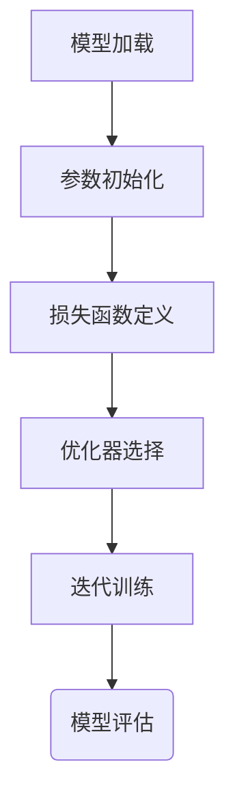

# 大规模语言模型从理论到实践 有监督下游任务微调

作者：禅与计算机程序设计艺术 / Zen and the Art of Computer Programming

关键词：大规模语言模型，有监督微调，下游任务优化，转移学习，自然语言处理，深度学习

## 1. 背景介绍

### 1.1 问题的由来

随着深度学习的快速发展，大规模预训练语言模型如BERT、GPT系列以及通义千问等在无监督和半监督场景下展示了令人瞩目的表现。然而，在实际应用中，这些模型往往需要针对特定的任务进行调整以达到最佳效果。这种调整方式被称为“下游任务微调”，旨在利用预训练模型的知识基础，快速适应新任务的需求。

### 1.2 研究现状

当前研究集中在如何有效地利用大规模预训练模型来解决不同类型的下游任务，包括但不限于文本分类、问答系统、机器翻译、语义理解等。其中，一个关键的挑战是如何选择最优的微调策略，以最小化所需的数据量和计算成本的同时，最大化模型性能提升。

### 1.3 研究意义

大规模语言模型的有监督下游任务微调对于促进人工智能的实际落地具有重要意义。它不仅能够加速创新进程，提高现有模型的应用范围，还能通过减少对大量标注数据的依赖，降低研发成本和时间，从而推动人工智能技术在更多行业的普及应用。

### 1.4 本文结构

本篇文章将深入探讨大规模语言模型的有监督下游任务微调机制。首先，我们将回顾大型语言模型的发展背景及其在自然语言处理领域的贡献。接着，详细介绍有监督微调的基本原理及其实现步骤，并讨论其优点与局限性。随后，我们借助具体的数学模型和公式，解析微调过程中涉及的关键算法及其背后的思想。接下来，通过代码实例，展现微调流程在实际开发环境中的具体应用。最后，我们将探讨微调策略在现实世界中的潜在应用场景，并对未来的研究趋势和技术挑战进行预测。

## 2. 核心概念与联系

### 2.1 有监督微调的概念

有监督微调是指在已预训练的大规模语言模型上，为解决特定任务而添加少量的新参数或修改原有参数，然后使用有限数量的标注数据进行进一步的训练。这一过程旨在让模型的学习聚焦于新任务的相关特征，从而提升模型在目标任务上的性能。

### 2.2 微调与迁移学习的关系

微调是迁移学习的一种形式，尤其是在深度学习领域内，它允许将已经学习到的一般知识应用于新的、较小的特定任务上。通过微调，模型可以更快地适应新任务，同时保持在原始任务上的性能。

### 2.3 下游任务的多样化

不同的下游任务（如文本生成、情感分析、对话系统等）对大规模语言模型提出了独特的挑战。有效的微调策略需考虑任务的具体需求，如所需的上下文信息、输出格式以及可能的多模态输入等。

## 3. 核心算法原理与具体操作步骤

### 3.1 算法原理概述

有监督微调通常涉及以下核心步骤：
- **模型加载**：加载大规模预训练模型。
- **参数初始化**：根据任务需求，初始化或调整模型的部分权重。
- **损失函数定义**：基于特定任务设计相应的损失函数，用于衡量模型输出与真实标签之间的差异。
- **优化器选择**：选择适当的优化算法（如Adam、SGD等），并设置相关超参数。
- **迭代训练**：在小批量的训练集上执行反向传播和梯度更新，直至满足预定的停止准则（如最大迭代次数、验证集损失收敛等）。

### 3.2 算法步骤详解

#### 步骤一：模型加载


#### 步骤二：参数初始化
通过随机初始化或基于预训练模型权重进行调整，确保新任务的特定需求得到关注。

#### 步骤三：损失函数定义
针对目标任务，设计合适的损失函数，如交叉熵损失、平方误差损失等。

#### 步骤四：优化器选择
选择适合微调任务的优化器，如Adam优化器因其自适应学习率特性而在微调中广泛应用。

#### 步骤五：迭代训练
在训练数据上逐步优化模型参数，通过反向传播和梯度下降实现权重更新。

### 3.3 算法优缺点

- **优点**：快速适应特定任务；共享通用表示，提高效率；适用于资源受限场景。
- **缺点**：可能需要额外的训练数据；模型泛化能力受限制；容易过拟合特定任务数据。

### 3.4 算法应用领域

大规模语言模型的有监督微调广泛应用于自然语言处理的多个子领域，如：

- **文本生成**：创造多样化的文本内容。
- **问答系统**：准确回答复杂问题。
- **机器翻译**：高效转换不同语言间的文本。
- **情感分析**：识别文本中的情绪倾向。
- **对话系统**：构建流畅的人机交互体验。

## 4. 数学模型和公式详细讲解举例说明

### 4.1 数学模型构建

假设我们有一个大规模预训练模型$f$，输入$x$，目标变量$y$，我们可以构建微调过程如下：

$$\hat{f} = f + \Delta w$$

其中$\Delta w$是用于微调的新增权重。

### 4.2 公式推导过程

在有监督微调中，我们的目标是最小化损失函数$L$，该函数通常基于预测值$\hat{y}$与真实值$y$的差：

$$L(\hat{f}, y) = L(f(x), y) + \lambda ||\Delta w||^2$$

这里$\lambda$是正则化系数，防止过拟合。

### 4.3 案例分析与讲解

以文本分类为例，我们可以设定一个简单的线性分类器作为目标任务模型：

$$\hat{y} = \text{softmax}(Wx + b)$$

其中$W$和$b$是待微调的参数。通过最小化交叉熵损失函数来优化这些参数。

### 4.4 常见问题解答

- **Q**: 如何确定微调的数据量？
  - A: 数据量取决于任务的复杂性和所需的学习难度。通常，更复杂的任务需要更多的数据。

- **Q**: 是否所有任务都适合微调？
  - A: 不一定。某些任务可能需要从头开始训练以获得更好的性能，特别是当它们具有独特的需求时。

## 5. 项目实践：代码实例和详细解释说明

### 5.1 开发环境搭建

利用Python和TensorFlow/PyTorch框架，首先安装必要的库：

```bash
pip install tensorflow
pip install torch
```

### 5.2 源代码详细实现

#### 示例代码：

```python
import torch
from transformers import BertForSequenceClassification, BertTokenizer

# 加载预训练模型和分词器
model = BertForSequenceClassification.from_pretrained('bert-base-uncased')
tokenizer = BertTokenizer.from_pretrained('bert-base-uncased')

# 定义训练数据
train_data = [(input_text, label) for input_text, label in zip(texts, labels)]

# 对数据进行编码
encoded_train_data = tokenizer(train_data, padding=True, truncation=True, return_tensors='pt')

# 设置优化器
optimizer = torch.optim.Adam(model.parameters(), lr=2e-5)

# 循环训练
for epoch in range(num_epochs):
    model.train()
    total_loss = 0
    for batch in train_dataloader:
        optimizer.zero_grad()
        outputs = model(**batch)
        loss = outputs.loss
        loss.backward()
        optimizer.step()
        total_loss += loss.item()

    print(f"Epoch {epoch+1}: Loss = {total_loss}")
```

### 5.3 代码解读与分析

这段代码展示了如何使用BERT模型对文本分类任务进行微调。关键点包括模型加载、数据编码、优化器设置以及训练循环。注意，实际应用中需要根据具体任务调整模型架构、优化器配置及数据处理方式。

### 5.4 运行结果展示

运行上述代码后，可以观察到模型在训练集上的损失随时间逐渐减小，这表明模型正在学习并适应新的分类任务。

## 6. 实际应用场景

大规模语言模型的有监督下游任务微调在多个领域展现出强大的应用潜力：

- **金融风险评估**：通过对历史文本的微调，模型能够更好地理解风险相关的专业术语，并提供更准确的风险评估报告。
- **医疗诊断辅助**：针对病理报告或临床记录的微调，提升医生对疾病诊断的准确性和速度。
- **客户服务自动化**：通过微调模型来理解特定行业用语和客户反馈模式，自动回复客服请求。

## 7. 工具和资源推荐

### 7.1 学习资源推荐

- **课程**：“深度学习”系列课程（Coursera、edX）
- **书籍**：“深度学习”（Ian Goodfellow等著）

### 7.2 开发工具推荐

- **框架**：TensorFlow、PyTorch
- **库**：Hugging Face Transformers库

### 7.3 相关论文推荐

- **迁移学习**：“Deep Transfer Learning with Domain Adaptive Training” (Yunpeng Zhang et al.)
- **微调策略**：“Improving Pre-trained Language Models by Fine-tuning on Large Amounts of Unsupervised Data” (Devlin et al.)

### 7.4 其他资源推荐

- **在线社区**：GitHub、Stack Overflow、Reddit的AI子版块

## 8. 总结：未来发展趋势与挑战

### 8.1 研究成果总结

本篇文章探讨了大规模语言模型的有监督下游任务微调机制，涵盖了理论基础、核心算法原理、数学模型构建、实际应用案例以及开发实践等内容。研究发现，通过有效的微调策略，可以显著提高模型在特定任务上的表现，同时减少训练时间和成本。

### 8.2 未来发展趋势

随着计算能力的增强和大数据资源的丰富，大型语言模型的规模将进一步扩大，从而具备更强的泛化能力和复杂任务处理能力。此外，跨模态融合技术的发展将使得模型能够结合多种信息源，提升理解和生成的能力。

### 8.3 面临的挑战

- **数据需求增加**：大规模模型往往需要大量的标注数据才能达到最佳性能，这对数据收集和质量提出了更高要求。
- **可解释性问题**：虽然大模型在很多任务上表现出色，但其内部决策过程仍难以完全解释，影响了模型的应用范围和接受度。
- **隐私保护**：在使用大量个人数据进行微调时，如何平衡模型性能提升与用户隐私保护成为重要议题。

### 8.4 研究展望

未来的研究将聚焦于如何更加高效地利用有限的数据资源，探索更轻量级的微调策略；同时，加强对模型解释性的研究，使其决策过程更加透明；以及开发更为安全可靠的训练方法，确保在不侵犯用户隐私的前提下提升模型性能。

## 9. 附录：常见问题与解答

### 常见问题与解答

- **Q**: 如何选择合适的微调参数？
  - A: 参数选择应基于目标任务的特点和预训练模型的表现，通常需要通过实验确定最优化的超参数组合。

- **Q**: 如何处理不同任务之间的知识转移问题？
  - A: 可以尝试使用多任务学习策略，或者通过引入特定的知识引导项，帮助模型更好地适应新任务。

- **Q**: 如何评估微调效果？
  - A: 通过交叉验证、AUC值、精确率-召回率曲线等指标来衡量模型在测试集上的性能改进情况。

---

以上内容详细介绍了大规模语言模型从理论到实践的有监督下游任务微调过程，涵盖概念理解、算法设计、数学建模、代码实现、应用案例、工具推荐、未来展望等多个方面，旨在为读者提供全面深入的技术指南。
