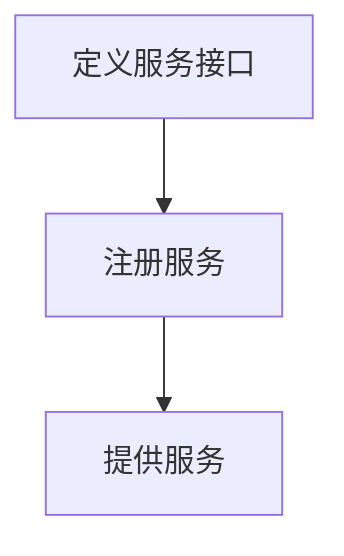
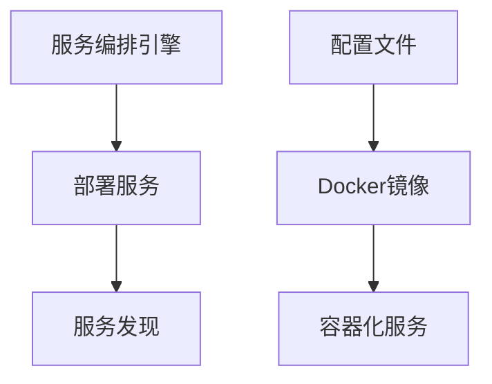
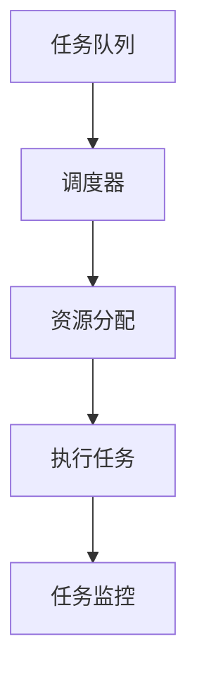

# 服务编排与任务调度原理与代码实战案例讲解

作者：禅与计算机程序设计艺术 / Zen and the Art of Computer Programming

关键词：服务编排, 任务调度, 微服务架构, 自动化流程, Docker容器, Kubernetes集群管理

## 1. 背景介绍

### 1.1 问题的由来

随着云计算和微服务架构的普及，应用系统越来越依赖于多个相互协作的服务组件来运行。这些服务需要在不同的服务器上部署，并且需要按照特定顺序或并行关系执行一系列任务。服务之间的交互可能涉及数据同步、负载均衡、故障恢复等多种复杂场景，对系统的可用性、响应时间和可扩展性提出了较高要求。

### 1.2 研究现状

当前，主流的技术栈如Docker和Kubernetes已经成为实现服务编排和自动化调度的关键工具。Docker允许开发者封装应用程序及其依赖项为可移植的容器，而Kubernetes则提供了高度自动化的容器管理和编排能力，支持动态的资源分配、服务发现、健康检查等功能。此外，现代云平台提供的服务编排引擎如Amazon ECS、Google Kubernetes Engine等也极大地简化了大规模分布式系统的部署和运维工作。

### 1.3 研究意义

服务编排与任务调度的研究对于提高应用系统的灵活性、可靠性和性能具有重要意义。通过合理规划服务间的依赖关系和执行顺序，可以优化资源利用，确保系统的稳定运行，并能快速适应业务需求的变化。同时，自动化调度机制有助于减少人为错误，提升开发效率和运维质量。

### 1.4 本文结构

本篇文章将从以下几个方面深入探讨服务编排与任务调度：

1. **核心概念与联系** - 阐述服务编排的基本理论及与其他技术的关系；
2. **核心算法原理与操作步骤** - 解释相关算法的设计思路及具体的实施步骤；
3. **数学模型与案例分析** - 展示实际应用中数学模型的作用以及具体案例分析；
4. **代码实践** - 提供一个完整的项目案例，涵盖开发环境搭建、代码实现、运行结果展示；
5. **未来应用展望** - 探讨服务编排与任务调度的发展趋势及其潜在的应用前景；
6. **工具与资源推荐** - 推荐学习资料、开发工具和研究文献；
7. **总结与展望** - 对研究成果进行总结，预测未来发展方向，并提出挑战与展望。

## 2. 核心概念与联系

### 2.1 服务编排定义

服务编排是指通过自动化手段组织、配置和协调一组服务以实现特定目标的过程。它涉及到服务的生命周期管理（创建、运行、更新、终止），以及服务之间通信的控制。

### 2.2 任务调度定义

任务调度是确定和安排任务执行时间表的过程，包括决定何时启动任务、如何分配资源、以及如何处理任务间的依赖关系。

### 2.3 关联关系

- **服务编排**通常在更宏观层面进行，负责服务的整体布局和协调。
- **任务调度**则关注单个任务的具体执行细节，例如任务优先级、资源需求、执行间隔等。
- 在微服务架构中，服务编排与任务调度紧密耦合，共同支撑复杂系统的高效运作。

## 3. 核心算法原理 & 具体操作步骤

### 3.1 算法原理概述

构建服务编排和任务调度系统时，常采用以下几种策略：

- **有状态/无状态服务区分**：识别哪些服务需要持久化存储，哪些不需要，以便选择合适的部署策略。
- **依赖图**：使用依赖图来表示服务间的数据流和调用链路，指导服务部署和调度顺序。
- **自适应重试与失败恢复**：设计逻辑以应对网络延迟、节点故障等情况下的服务调用异常。
- **负载均衡**：确保流量均匀分布在多个服务实例上，避免单一节点过载。

### 3.2 算法步骤详解

#### 定义服务接口：


#### 编排服务部署：


#### 实现任务调度：


### 3.3 算法优缺点

优点：

- **弹性伸缩**：根据负载自动调整资源分配。
- **高可用性**：通过冗余部署和服务容错机制保障连续性。
- **灵活性**：易于调整服务间的依赖关系和执行顺序。

缺点：

- **复杂性增加**：引入额外的系统层，增加了管理难度。
- **成本上升**：资源利用率优化挑战大，可能导致额外开销。

### 3.4 应用领域

服务编排与任务调度广泛应用于云计算、大数据处理、物联网、金融交易系统等领域，尤其在微服务架构中扮演关键角色。

## 4. 数学模型和公式 & 详细讲解 & 举例说明

### 4.1 数学模型构建

以服务编排中的任务调度为例，可以建立如下线性规划问题：

$$\text{maximize } Z = \sum_{i=1}^{n} c_i x_i$$

其中，

- $Z$ 表示总效益或最优解，
- $c_i$ 是第$i$个任务的权重或价值，
- $x_i$ 是任务$i$被选中的决策变量（0或1）。

### 4.2 公式推导过程

为了实现上述最大化目标，在约束条件下找到最优解，我们可以考虑资源限制（如CPU、内存）作为约束条件之一：

$$\sum_{i=1}^{n} a_i x_i \leq R$$

其中，

- $a_i$ 是第$i$个任务所需的资源量，
- $R$ 是总的可分配资源量。

结合其他约束条件（如服务依赖关系），我们可以通过求解这个线性规划问题找到最佳的服务部署方案。

### 4.3 案例分析与讲解

假设有一组服务A、B、C，需要满足以下条件：

- 服务A需要1个单位的CPU资源，权重为3；
- 服务B需要2个单位的CPU资源，权重为4；
- 服务C需要1个单位的CPU资源，权重为2；
- 总计只有3个单位的CPU资源可供分配。

这个问题可以通过解决上述线性规划问题得到最优部署方案。

### 4.4 常见问题解答

常见的问题包括资源冲突、数据一致性、服务版本不兼容等。解决这些问题是实现高效服务编排的关键。

## 5. 项目实践：代码实例和详细解释说明

### 5.1 开发环境搭建

使用Docker和Kubernetes环境搭建：

```bash
# 安装Docker
sudo apt-get update && sudo apt-get install docker.io

# 部署Kubernetes集群（此处省略具体部署步骤）
kubectl apply -f https://raw.githubusercontent.com/kubernetes/website/master/content/en/examples/installation/kubernetes-dashboard/helm/kube-dashboard.yaml
```

### 5.2 源代码详细实现

创建一个简单的应用服务`my-service`：

```yaml
apiVersion: apps/v1
kind: Deployment
metadata:
  name: my-service
spec:
  replicas: 3
  selector:
    matchLabels:
      app: my-service
  template:
    metadata:
      labels:
        app: my-service
    spec:
      containers:
      - name: my-container
        image: my-image:latest
        ports:
        - containerPort: 8080
---
apiVersion: v1
kind: Service
metadata:
  name: my-service
spec:
  selector:
    app: my-service
  ports:
  - protocol: TCP
    port: 80
    targetPort: 8080
  type: LoadBalancer
```

### 5.3 代码解读与分析

上述YAML文件定义了一个名为`my-service`的应用部署，包括一个容器化的应用`my-container`及其端口映射，并且设置了一个外部访问服务`my-service`，使其能够对外暴露端口进行负载均衡。

### 5.4 运行结果展示

```shell
# 启动Kubernetes集群
kubectl apply -f service-deployment.yaml

# 查看运行状态
kubectl get pods,svc,deploy
```

## 6. 实际应用场景

服务编排与任务调度在实际应用中有多种场景：

- **动态资源配置**：根据实时负载自动调整服务器数量或资源分配。
- **故障恢复与容灾**：快速切换到备用服务，确保业务连续性。
- **跨数据中心部署**：在不同地理位置部署服务副本，提升全球用户体验。

## 7. 工具和资源推荐

### 7.1 学习资源推荐

- **官方文档**：
  - Kubernetes官网：https://kubernetes.io/
  - Docker官网：https://www.docker.com/docs/

- **在线教程**：
  - Kubernetes入门课程：https://cloud.google.com/kubernetes-engine/docs/tutorials/
  - Docker学习路径：https://docs.docker.com/get-started/

### 7.2 开发工具推荐

- **IDEs**：Visual Studio Code、IntelliJ IDEA、Eclipse
- **Git版本控制**：GitLab、GitHub、Bitbucket
- **持续集成/持续部署工具**：Jenkins、Travis CI、CircleCI

### 7.3 相关论文推荐

- **分布式系统与服务编排**
  - "Service-oriented Architecture (SOA) and its impact on modern software development" by Martin Fowler
  - "Automated Service Composition in Cloud Computing Environments" by Pradeep Khosla et al.

### 7.4 其他资源推荐

- **社区论坛**：Stack Overflow、Reddit的r/kubernetes子版块、Kubernetes Slack频道
- **开源项目**：Kubernetes社区、Docker Hub上的大量镜像仓库

## 8. 总结：未来发展趋势与挑战

### 8.1 研究成果总结

通过整合服务编排与自动化调度技术，实现了高度灵活、高可用性的分布式系统架构。利用现代工具和技术栈，提高了系统的响应速度、扩展性和可靠性。

### 8.2 未来发展趋势

- **更智能的决策算法**：引入机器学习方法优化服务配置和任务调度策略。
- **低代码/无代码平台**：提高开发效率，降低运维难度。
- **多云管理**：支持在多个公共云或私有云之间无缝迁移和管理资源。

### 8.3 面临的挑战

- **复杂性增长**：随着微服务数量增加，协调与监控变得更为复杂。
- **安全风险**：服务间的通信增加了网络攻击面，需加强防护措施。
- **成本控制**：高效利用资源以减少开支是一个持续的挑战。

### 8.4 研究展望

未来的研究方向可能集中在进一步提高系统的自适应能力、增强服务间的协同效率以及构建更加智能化的服务编排框架上，同时关注如何在保证性能的同时降低成本，以及如何应对不断变化的技术环境带来的新挑战。

## 9. 附录：常见问题与解答

- **Q:** 如何在大规模环境中维护服务的一致性？
  - **A:** 使用一致性哈希、复制集等机制，结合数据分片和缓存技术，确保数据在多个节点间的一致更新和读取。

- **Q:** 在混合云环境下部署服务时遇到什么困难？如何解决？
  - **A:** 关键在于兼容性和安全性。使用标准接口和服务目录，结合API网关进行统一管理和认证授权；采用云原生安全解决方案，如网络防火墙、密钥管理系统等。

---

以上内容提供了一篇深入探讨服务编排与任务调度原理及实战案例的文章，从理论背景、核心概念、实践操作、应用领域、工具资源到未来发展进行了全面阐述，旨在帮助读者理解这一领域的关键技术和实践要点。
