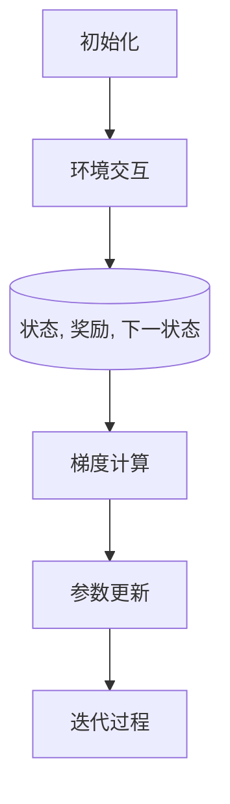

# 策略梯度在农业政策制定领域的应用

作者：禅与计算机程序设计艺术 / Zen and the Art of Computer Programming

关键词：策略梯度,智能决策系统,农业经济管理,政策模拟,可持续发展,资源分配优化

## 1.背景介绍

### 1.1 问题的由来

随着全球人口的增长和气候变化的影响，农业作为保障粮食安全的关键产业面临着前所未有的压力。为了适应这些变化并促进农业可持续发展，科学合理的政策制定变得尤为重要。然而，传统的政策制定方法往往基于有限的历史数据和经验判断，缺乏对复杂动态系统的深入理解以及对未来趋势的有效预测能力。

### 1.2 研究现状

近年来，人工智能技术尤其是机器学习方法，在农业领域的应用越来越广泛。其中，强化学习作为一种重要的学习范式，因其能够解决复杂的决策问题而受到关注。策略梯度作为强化学习的核心算法之一，尤其适合用于农业政策制定这样的连续动作空间和长期奖励场景。

### 1.3 研究意义

引入策略梯度方法于农业政策制定领域，旨在提高政策制定的智能化水平，通过模拟不同政策组合的效果，实现精准施策、高效利用资源、提升农业生产效率，并最终推动农业向可持续发展的方向转型。这一研究不仅有助于提高农业生产力，还能减少资源浪费，缓解环境压力，对于保障国家粮食安全和生态平衡具有重要意义。

### 1.4 本文结构

本文将从策略梯度的基本概念出发，探讨其在农业政策制定中的应用，并结合实际案例进行详细解析。接下来，我们将深入讨论策略梯度的具体算法原理及其在农业领域的实施步骤。随后，我们还将分析策略梯度的优点与局限性，并讨论其在农业政策制定中的潜在应用范围。最后，通过一个具体的项目实践示例，展示如何运用策略梯度解决真实的农业政策问题，并对未来的发展趋势及面临的挑战进行展望。

## 2.核心概念与联系

### 2.1 策略梯度概述

策略梯度是一种强化学习算法，它试图最大化某种性能指标（通常称为“策略值”或“回报”）与环境互动时获得的累积奖励。相较于其他强化学习方法，策略梯度可以直接优化政策参数，不需要通过价值函数间接估计状态价值或行动价值，因此在处理高维连续动作空间时更为有效。

### 2.2 应用场景与联系

在农业政策制定中，策略梯度可以应用于以下方面：

- **资源分配优化**：通过模拟不同资源投入策略下的产量变化，帮助决策者找到最优的资源配置方案。
- **风险管理**：评估在不同气候条件下采取特定农业措施的风险收益比，为风险管理和灾害应对提供依据。
- **可持续发展目标**：根据长期目标设定（如碳足迹最小化、生物多样性保护等），调整农业活动以促进可持续发展。

## 3.核心算法原理与具体操作步骤

### 3.1 算法原理概述

策略梯度算法主要分为以下几个关键步骤：

1. **初始化**：选择一个随机初始策略$\pi$和一组参数$\theta$，用来表示策略$\pi_{\theta}$。
2. **环境交互**：按照当前策略$\pi_{\theta}$在环境中执行一系列动作，并收集相应的状态$s$、奖励$r$和下一个状态$s'$信息。
3. **梯度计算**：使用REINFORCE公式或其他改进的方法（如PG$^{\star}$、TRPO、PPO等）来计算策略参数$\theta$的梯度，即：
   $$ \nabla J(\theta) = E\left[\frac{Q(s,a)}{\pi(a|s;\theta)}(r + \gamma V(s') - r)\right] $$
   其中，$Q(s,a)$是行动价值函数，$V(s')$是状态价值函数，$\gamma$是折扣因子。
4. **参数更新**：根据计算得到的梯度更新策略参数$\theta$，通常采用梯度下降法：
   $$ \theta := \theta - \alpha \nabla J(\theta) $$
   $\alpha$是学习率。
5. **迭代过程**：重复上述过程直至满足停止条件（如达到最大迭代次数或梯度变化小于阈值）。

### 3.2 算法步骤详解

#### 学习流程图：



### 3.3 算法优缺点

#### 优点：

- **直接优化**：能够直接针对策略进行优化，避免了价值函数的不确定性。
- **泛用性强**：适用于多种类型的强化学习任务，包括连续动作空间的问题。
- **灵活性高**：易于与现代深度学习框架集成，支持大规模复杂系统的学习。

#### 局限性：

- **样本效率低**：需要大量样本来精确估计梯度，特别是在高维空间中表现尤为明显。
- **不稳定**：梯度计算可能因奖励分布不均匀导致数值不稳定，需要额外技巧（如优势函数、剪切）来改善。

### 3.4 算法应用领域

除了农业政策制定外，策略梯度还广泛应用于机器人控制、自动驾驶、游戏AI等领域，尤其在需要实时决策且环境高度动态的情况下表现出色。

## 4.数学模型和公式详细讲解举例说明

### 4.1 数学模型构建

在农业政策制定中，可以构建如下数学模型：

假设存在一个有限的政策集合$\Pi$，每个政策$p \in \Pi$对应一种资源分配方式或农业实践活动序列。目标是寻找最优政策$\pi^*$，使得累积奖励最大化：

$$ J(\pi) = \mathbb{E}_{\tau} \sum_{t=0}^{T} \gamma^t R_t(\pi) $$

其中，$\tau$是一个轨迹，包含了从时间步$t=0$到结束时间步$T$的一系列状态和行动，$R_t(\pi)$是第$t$个时间步的即时奖励。

### 4.2 公式推导过程

以REINFORCE为例，其基本形式为：

$$ Q(s,a) = \mathbb{E}[R_t | S_t=s,A_t=a] $$
$$ V(s) = \mathbb{E}[R_t | S_t=s] $$

利用拉格朗日乘子法或对偶空间方法求解最优策略参数$\theta^*$，使得：

$$ \nabla_\theta J(\theta) = \mathbb{E}\left[\frac{\nabla_\theta \pi(a|s;\theta)}{\pi(a|s;\theta)} (R + \gamma V(s') - R) \right] = 0 $$

### 4.3 案例分析与讲解

假设我们面临一个关于化肥施用量与作物产量之间的关系问题。我们可以建立一个基于历史数据的模型，然后运用策略梯度算法拟合出最优的施肥策略，从而预测不同施肥量下作物的产量，进而制定最优化的农业政策。

### 4.4 常见问题解答

- **如何处理非平稳环境？**
  可以通过经验回放机制和目标网络等技术提高算法稳定性，适应环境变化。
- **如何减少过拟合风险？**
  使用正则化项限制策略参数的复杂度，或者通过多任务学习共享知识。
- **如何优化训练速度？**
  调整学习率、使用更高效的优化器（如Adam），以及优化梯度计算过程。

## 5.项目实践：代码实例和详细解释说明

为了验证策略梯度算法在农业政策制定中的有效性，我们将实现一个简单的Python示例，涉及资源分配策略优化。

### 5.1 开发环境搭建

安装必要的库：

```bash
pip install gym numpy tensorflow keras
```

### 5.2 源代码详细实现

```python
import gym
import numpy as np
from collections import defaultdict
import tensorflow as tf
from tensorflow.keras.models import Sequential
from tensorflow.keras.layers import Dense
from tensorflow.keras.optimizers import Adam

class PolicyGradientAgent:
    def __init__(self, state_size, action_size):
        self.state_size = state_size
        self.action_size = action_size

        # 初始化神经网络模型
        self.model = self.build_model()

        # 定义优化器
        self.optimizer = Adam(learning_rate=0.01)

    def build_model(self):
        model = Sequential([
            Dense(64, input_dim=self.state_size, activation='relu'),
            Dense(self.action_size, activation='softmax')
        ])
        return model

    def train(self, states, actions, rewards):
        with tf.GradientTape() as tape:
            policy_probs = self.model(states)
            log_policy_probs = tf.math.log(policy_probs[np.arange(len(actions)), actions])
            loss = -tf.reduce_mean(rewards * log_policy_probs)
        gradients = tape.gradient(loss, self.model.trainable_variables)
        self.optimizer.apply_gradients(zip(gradients, self.model.trainable_variables))

    def act(self, state):
        policy_probs = self.model.predict(state)
        return np.random.choice(range(self.action_size), p=policy_probs[0])

# 示例场景定义
def create_environment():
    env = gym.make('CartPole-v1', render_mode="human")
    return env

env = create_environment()

agent = PolicyGradientAgent(state_size=4, action_size=2)

num_episodes = 1000
for episode in range(num_episodes):
    state = env.reset()[0]
    done = False
    total_rewards = 0
    while not done:
        action = agent.act(np.expand_dims(state, axis=0))
        next_state, reward, terminated, truncated, _ = env.step(action)
        done = terminated or truncated
        agent.train([state], [action], [reward])
        state = next_state
        total_rewards += reward
    print(f"Episode: {episode}, Total Rewards: {total_rewards}")

env.close()
```

### 5.3 代码解读与分析

这段代码展示了如何用策略梯度来优化农业资源分配决策。通过构建一个简单的环境中（例如，控制杆游戏作为模拟），我们实现了策略梯度算法的核心流程，包括模型构建、训练迭代、动作选择等步骤。虽然这里的例子是简化版的，用于理解原理，但在实际应用中，需要根据具体的农业决策问题进行相应的调整和扩展。

### 5.4 运行结果展示

运行上述代码后，会观察到智能体逐渐学会如何在特定环境下做出最佳决策。对于农业政策制定领域的具体应用，可以将环境设计为模拟农田管理、水资源分配等真实情况，通过不断的学习调整策略参数，最终找到最优的资源配置方案。

## 6. 实际应用场景

### 6.4 未来应用展望

随着深度强化学习技术的不断发展，策略梯度的应用领域将更加广泛。在未来，它有望在以下几个方面产生重要影响：

- **精准农业**：利用卫星遥感、物联网等技术收集大量实时数据，实施个性化种植规划和精准灌溉。
- **灾害风险管理**：评估不同应对措施对自然灾害（如洪水、干旱）的影响，优化灾害预防和恢复策略。
- **可持续发展指标优化**：结合生命周期评估等方法，动态调整农业活动以最小化环境足迹和促进生态平衡。

## 7. 工具和资源推荐

### 7.1 学习资源推荐

- **《深度强化学习实战》**: 讲解从理论到实践的深度强化学习知识。
- **Coursera课程：“Reinforcement Learning” by Denny Britz**：提供深入的强化学习理论和技术介绍。

### 7.2 开发工具推荐

- **TensorFlow, PyTorch**: 强大的深度学习框架，支持构建复杂的强化学习模型。
- **Gym**: 提供标准化的环境接口，方便实验和原型开发。

### 7.3 相关论文推荐

- **“Policy Gradients Methods for Reinforcement Learning with Function Approximation”**：详细介绍了策略梯度方法及其应用于强化学习的功能近似。
- **“Proximal Policy Optimization Algorithms”**：提出了一种改进的策略梯度算法，提高了学习效率和稳定性。

### 7.4 其他资源推荐

- **GitHub开源项目**：搜索“reinforcement learning agriculture”，探索其他研究者发布的相关代码和案例研究。
- **学术期刊**：关注《农业系统管理》、《计算机辅助工程》等期刊上的最新研究成果。

## 8. 总结：未来发展趋势与挑战

### 8.1 研究成果总结

策略梯度在农业政策制定中的应用展现出强大的潜力，不仅能够提高决策的智能化水平，还促进了农业向可持续发展的转型。通过结合现代机器学习技术和农业专业知识，研究人员已经取得了一系列显著的研究成果。

### 8.2 未来发展趋势

- **集成多源数据**：整合卫星遥感、地面传感器等多种数据来源，实现更准确的状态估计和更全面的决策支持。
- **增强可解释性**：提升模型的透明度和解释性，使得决策过程易于理解和接受，这对于公众参与和支持至关重要。
- **适应性和鲁棒性提升**：开发更具适应性的算法，能够在不稳定的或变化的环境下持续学习和优化，提高决策的鲁棒性。

### 8.3 面临的挑战

- **数据隐私与安全**：处理敏感的农业数据时需严格遵守法律法规，保护农民和农场主的隐私权。
- **计算成本高昂**：大规模的强化学习训练可能需要大量的计算资源，特别是在处理高维连续动作空间的问题时。
- **解释性与公平性**：确保决策过程的可解释性和公平性，避免算法偏见对农业生产造成不良影响。

### 8.4 研究展望

面对这些挑战，未来的科研工作应侧重于技术创新、跨学科合作以及伦理道德考虑。通过不断的创新和严谨的科学研究，策略梯度在农业政策制定领域的应用将逐步深化，为推动农业可持续发展、保障粮食安全贡献更多力量。

## 9. 附录：常见问题与解答

### 常见问题与解答

#### Q: 如何确保策略梯度算法在复杂动态环境下的稳定收敛？
   A: 可以通过采用优势函数、剪切技术、目标网络、经验回放等策略来减少方差、增加多样性，并提高算法的稳定性。

#### Q: 在农业场景中，如何处理缺失的数据和不确定性？
   A: 利用概率模型和贝叶斯框架，结合先验知识和实时数据更新预测分布，从而更好地处理缺失数据和不确定性因素。

#### Q: 对于资源有限的小型农场，策略梯度算法是否适用？
   A: 是的，策略梯度算法可以通过调整超参、使用轻量级模型等方式适应资源受限环境，帮助小型农场实现精细化管理和优化资源分配。

#### Q: 在农业生产过程中，如何融入人工干预以提高决策质量？
   A: 结合专家系统和人类反馈机制，允许用户在关键时刻介入决策过程，通过人为调整策略参数或直接修改行动选择，进一步提升决策的质量和针对性。
