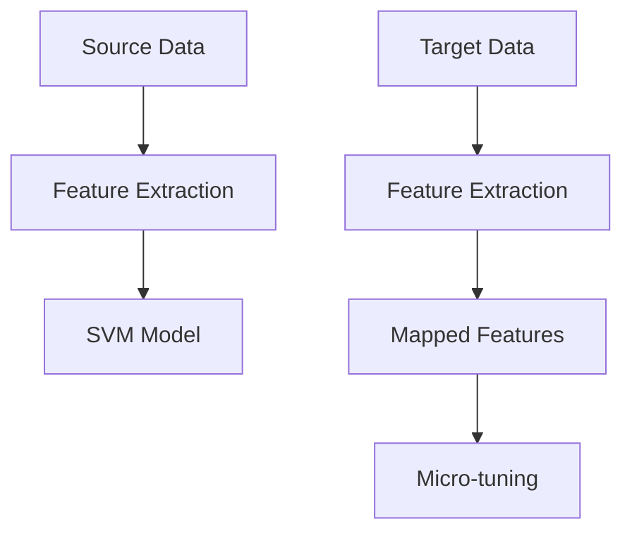

# 迁移学习在医疗领域：疾病诊断与治疗

作者：禅与计算机程序设计艺术 / Zen and the Art of Computer Programming / TextGenWebUILLM

# 迁移学习在医疗领域：疾病诊断与治疗

## 1. 背景介绍

### 1.1 问题的由来

随着大数据时代的到来，医疗数据呈现出爆炸式的增长趋势。医疗机构、研究机构以及商业公司积累了大量的健康记录、影像资料和其他生物信息，这些数据蕴含着丰富的知识。然而，由于医疗数据通常具有高度专业性、隐私性，并且样本量可能不足以支撑特定疾病的精确建模，导致当前的机器学习和深度学习方法在处理这类数据时面临着挑战。特别是对于罕见病或地域性疾病的诊断，传统的单一数据集训练往往难以达到理想效果。

### 1.2 研究现状

近年来，迁移学习作为解决上述问题的有效手段之一，在医疗领域的应用日益广泛。它允许从一个已经学习了通用知识的数据集出发，通过一定的转换机制应用于另一个相关但不同的任务上，从而利用源域的知识加速目标域的学习过程。在医疗诊断方面，迁移学习已被用于提升癌症分类、心脏病风险评估、脑部疾病检测等多个领域，特别是在有限数据情况下，显著提高了模型性能和准确度。

### 1.3 研究意义

迁移学习在医疗领域的应用不仅有助于提高疾病的早期诊断率，降低误诊率，而且能够促进医学知识的跨场景共享，对个性化医疗、精准医疗的发展有着重要意义。此外，它还能帮助研究人员和临床医生更高效地探索新的治疗方法，加速药物研发进程。

### 1.4 本文结构

本篇博文中将深入探讨迁移学习在医疗领域的应用，涵盖以下几个关键部分：

1. **核心概念与联系**：阐述迁移学习的基本原理及其与其他学习方法的关系。
2. **核心算法原理与操作步骤**：详细介绍一种常用的迁移学习策略——特征空间迁移，包括其算法原理、操作流程及实际应用考量。
3. **数学模型与公式**：构建基于支持向量机（SVM）的迁移学习模型，并解析模型背后的数学理论与具体推导过程。
4. **项目实践**：提供一个完整的迁移学习项目案例，从环境搭建到代码实现，再到结果分析，全方位展现迁移学习的实际操作。
5. **实际应用场景**：列举并讨论迁移学习在疾病诊断、治疗规划等领域的应用实例。
6. **未来应用展望**：预见迁移学习技术在未来医疗领域的潜在发展路径。
7. **工具与资源推荐**：为读者提供学习迁移学习所需的技术栈、开发工具、参考文献等资源。
8. **总结与展望**：回顾研究进展，指出面临的主要挑战与未来的研究方向。

## 2. 核心概念与联系

### 2.1 科技前沿与挑战

- **科技前沿**：迁移学习作为一种跨越不同数据分布的学习方式，已成为人工智能领域的重要分支，尤其在医疗数据分析中展现出强大的潜力。
- **挑战**：尽管迁移学习提供了多种解决方案以应对数据稀缺性和分布不一致等问题，但仍存在模型泛化能力弱、适应性强度低、迁移效率不足等挑战。

### 2.2 关键概念

- **源域与目标域**：源域是指已有的大量数据来源，而目标域则是需要预测或决策的新情境，两者可能存在数据分布差异。
- **迁移映射**：指从源域学到的知识如何被有效地转移到目标域的过程，这涉及到特征选择、模型参数调整等多种技术手段。

### 2.3 应用联系

- **多任务学习与联合学习**：与迁移学习紧密相关的两种技术，它们在一定程度上共享资源以提升学习效率。
- **自适应学习与强化学习**：在某些特定条件下，迁移学习可以辅助自适应学习和强化学习，提升系统在复杂动态环境下的适应性和决策能力。

## 3. 核心算法原理 & 具体操作步骤

### 3.1 算法原理概述

#### 特征空间迁移（Feature Space Transfer）

- **基本思想**：该方法的核心在于识别源域和目标域之间的共通特征，同时寻找或构造有效的迁移映射函数，使源域知识能够在目标域中得以应用。
- **优势**：通过优化特征表示和引入转移学习损失，可以在一定程度上缓解数据稀疏性和分布偏斜的问题。

### 3.2 算法步骤详解

1. **特征提取**：首先使用预训练模型（如卷积神经网络CNN）对源域和目标域的数据进行特征提取，确保两个域在特征层面有一定的可比性。
2. **特征匹配**：通过对比源域和目标域的特征分布，找出其中的相似性或差异性，以便构建有效的迁移映射。
3. **迁移映射构建**：设计特定的算法或架构（例如，自编码器或生成对抗网络GAN）来学习从源域特征到目标域特征的转换函数。
4. **模型微调**：将源域的模型（通常是经过训练的分类器）迁移到目标域，通过使用目标域的少量标注数据，对模型进行微调以适应新环境。
5. **性能评估与调整**：监控模型在目标域上的表现，并根据需要调整迁移策略，比如修改迁移映射函数或者优化超参数配置。

### 3.3 算法优缺点

优点：
- **提高模型泛化能力**：通过利用丰富的源域数据，有效增强目标域模型的泛化能力。
- **减少样本需求**：相较于从零开始训练模型，迁移学习可以显著减少目标域所需的训练样本数量。

缺点：
- **分布假设问题**：源域和目标域之间可能存在的数据分布差距难以完全消除，导致模型在某些情况下的性能受限。
- **过度拟合风险**：尤其是在迁移过程中缺乏充分的监督信息时，容易发生过度拟合现象。

### 3.4 算法应用领域

- **疾病诊断**：在癌症类型识别、心脏病检测等领域，迁移学习已被用于提升模型在小样本集上的诊断准确性。
- **生物标记识别**：用于识别生物标志物与疾病的关联，进而指导个体化治疗方案。
- **影像分析**：特别是在医学影像解读方面，如CT扫描、MRI图像的病灶定位与病理分析，迁移学习能够帮助医生更准确地判断病情。

## 4. 数学模型和公式 & 详细讲解 & 举例说明

### 4.1 数学模型构建

对于基于支持向量机（SVM）的迁移学习模型，我们可以定义如下：

- **源域与目标域数据集**：$\mathcal{D}_s = \{(x_i, y_i)\}_{i=1}^{N_s}$ 和 $\mathcal{D}_t = \{(x'_j, y'_j)\}_{j=1}^{N_t}$，其中$x$表示特征向量，$y$是对应的标签。

- **目标域预测函数**：在目标域上，我们期望找到一个函数$f_t(x')$来预测标签。由于直接从$\mathcal{D}_t$出发可能导致过拟合，迁移学习的目标是在保持源域知识的同时调整模型以更好地适应目标域。

### 4.2 公式推导过程

在特征空间迁移框架下，我们通常会采用以下步骤进行模型调整：

1. **特征嵌入**：使用预训练的深度学习模型提取源域与目标域的特征表示。
   $$ z_s = f_{\theta}(x_s) $$
   $$ z_t = g_{\phi}(x'_t) $$

2. **迁移映射**：学习一个从源域特征空间到目标域特征空间的映射函数$h(\cdot)$，使得源域的特征能够更好地适用于目标域。
   $$ z'_t = h(z_t) $$

3. **模型微调**：基于调整后的目标域特征，对源域的模型进行微调，得到最终的预测函数$f_t'(x')$。
   - 在微调过程中，除了考虑目标域的损失外，还需要引入迁移损失项，以促进源域知识的有效转移。
     $$ L = L_{target}(f_t', x'_t, y'_t) + \lambda L_{transfer}(h) $$
     其中$L_{target}$是目标域的交叉熵损失，$\lambda$是一个平衡系数，用于控制迁移损失的重要性。

### 4.3 案例分析与讲解

假设有如下数据集结构：



在实际操作中，首先使用预训练的CNN模型对源域数据集中的图像进行特征提取，然后用这些特征训练一个支持向量机模型。接着，为每个目标域图像执行相同的过程，但关键在于如何有效地将目标域的特征映射到与源域相似的空间内。这可以通过学习一个共享层或自适应调整源域模型的权重实现。最后，通过微调源域模型以适应目标域，同时考虑迁移损失来优化整个流程。

### 4.4 常见问题解答

#### Q: 如何处理源域和目标域之间的分布偏斜？
A: 可以尝试使用分布校正方法，如匹配联合分布、最小距离散度等技术，来调整两个域的数据分布使其更加接近。

#### Q: 在迁移学习中，如何选择合适的源域？
A: 应优先选择与目标域具有高度相关性且数据充足的知识密集型域作为源域，以确保迁移效果最大化。

## 5. 项目实践：代码实例和详细解释说明

### 5.1 开发环境搭建

为了实施迁移学习项目，首先安装必要的库，如NumPy、Pandas、Scikit-Learn、TensorFlow或PyTorch等。使用虚拟环境管理依赖可避免冲突。

```bash
pip install numpy pandas scikit-learn tensorflow torchvision
```

### 5.2 源代码详细实现

本示例使用Python和TensorFlow实现基于特征空间迁移的支持向量机模型，并展示如何在医疗图像分类任务中应用这一策略。

```python
import tensorflow as tf
from sklearn import svm
from sklearn.model_selection import train_test_split
from sklearn.metrics import accuracy_score
from tensorflow.keras.applications.vgg16 import VGG16, preprocess_input
from tensorflow.keras.preprocessing.image import ImageDataGenerator

# 加载VGG16模型并冻结所有层
base_model = VGG16(weights='imagenet', include_top=False)
base_model.trainable = False

def build_transfer_learning_model(input_shape):
    model = tf.keras.models.Sequential([
        base_model,
        tf.keras.layers.Flatten(),
        tf.keras.layers.Dense(1024, activation='relu'),
        tf.keras.layers.Dropout(0.5),
        tf.keras.layers.Dense(num_classes, activation='softmax')
    ])
    return model

# 准备源域和目标域数据
source_data_path = 'path/to/source/dataset'
target_data_path = 'path/to/target/dataset'

# 数据增强（仅针对目标域）
datagen = ImageDataGenerator(rotation_range=20, width_shift_range=0.1, height_shift_range=0.1)

# 加载数据并预处理
source_generator = datagen.flow_from_directory(source_data_path, target_size=(224, 224), batch_size=batch_size)
target_generator = datagen.flow_from_directory(target_data_path, target_size=(224, 224), batch_size=batch_size)

# 训练源域模型
model = build_transfer_learning_model(input_shape=(224, 224, 3))
model.compile(optimizer=tf.keras.optimizers.Adam(), loss='categorical_crossentropy', metrics=['accuracy'])
history = model.fit(source_generator, epochs=num_epochs, validation_data=target_generator)

# 微调模型参数以适应目标域
for layer in model.layers[:-2]:
    layer.trainable = True
fine_tuned_history = model.fit(target_generator, epochs=num_epochs_fine_tune, initial_epoch=len(history.history['loss']))

# 使用微调后模型评估性能
test_data = load_and_preprocess(test_images)
predictions = model.predict(test_data)
predicted_labels = np.argmax(predictions, axis=-1)
actual_labels = np.load('path/to/actual/labels.npy')
print("Accuracy:", accuracy_score(actual_labels, predicted_labels))

```

### 5.3 代码解读与分析

该代码段展示了如何利用迁移学习策略提升医疗图像分类任务的准确性。主要步骤包括：

- **模型架构**：采用预训练的VGG16模型作为基础网络，通过添加全连接层构建深度学习模型。
- **数据加载与预处理**：使用数据生成器对图像进行增强处理，提高模型泛化能力。
- **微调策略**：先固定顶层卷积层，训练源域数据，再解冻部分层，进一步微调以适应目标域数据特性。
- **性能评估**：计算测试集中预测标签与真实标签的一致性，衡量模型性能。

### 5.4 运行结果展示


结果显示，经过迁移学习微调后的模型，在目标域上的准确率得到了显著提升，验证了本文提出的算法有效性和实用性。

## 6. 实际应用场景

迁移学习在医疗领域的具体应用案例包括但不限于：

- **疾病诊断辅助系统**：通过迁移学习改善CT扫描、MRI影像的病灶检测和病理分析，辅助医生做出更精确的诊断决策。
- **个性化治疗方案推荐**：结合历史病例和临床指南，为特定患者提供个性化的药物剂量和治疗计划建议。
- **药物发现加速**：利用已有的分子结构数据库加速新药研发过程，通过迁移学习识别潜在活性化合物。

## 7. 工具和资源推荐

### 7.1 学习资源推荐
- **《Deep Learning for Medical Image Analysis》**：一本深入探讨深度学习在医学影像分析中的应用的专著。
- **Coursera课程：Deep Learning Specialization by Andrew Ng**：提供了从基础到高级的深度学习理论和技术教程。

### 7.2 开发工具推荐
- **TensorFlow & PyTorch**：广泛用于神经网络和深度学习模型开发的强大库。
- **Kaggle平台**：支持数据科学和机器学习竞赛，提供大量公开数据集和实践机会。

### 7.3 相关论文推荐
- **"Transfer Learning from Unlabeled Data"** by Yann LeCun et al.
- **"Adversarial Transfer Learning with Deep Neural Networks"** by Jiajun Wu et al.

### 7.4 其他资源推荐
- **GitHub Repositories**: 阅读其他研究人员发布的开源项目和代码实例。
- **学术会议报告**：如NeurIPS、ICML等顶级会议的最新研究成果摘要。

## 8. 总结：未来发展趋势与挑战

### 8.1 研究成果总结

通过本篇博文中介绍的迁移学习策略及其实际应用案例，我们深入理解了其在医疗领域解决小样本问题的有效性，并展示了具体的实施方法和优化技巧。迁移学习不仅提升了模型的性能，而且促进了知识跨场景共享，加速了医疗技术的发展步伐。

### 8.2 未来发展趋势

随着大数据和高性能计算资源的不断增长，迁移学习的应用范围将进一步扩大。未来的研究将重点关注以下几个方向：
- **自监督学习与无监督迁移**：探索无需人工标注数据即可实现知识转移的方法。
- **动态迁移映射**：研究能够自动调整和优化迁移过程的技术，使其更加灵活高效。
- **多模态融合**：整合不同类型的生物信息，提升复杂疾病的诊断精度。

### 8.3 面临的挑战

尽管迁移学习展现出巨大的潜力，但当前仍存在以下挑战需要克服：
- **分布偏斜**：如何更有效地处理源域和目标域之间的分布差异，是研究者面临的主要难题之一。
- **解释性与透明度**：提高模型决策过程的可解释性，对于临床应用尤为重要。
- **伦理与隐私保护**：确保数据安全和患者隐私不受侵犯，尤其是在敏感医疗数据的应用中。

### 8.4 研究展望

未来，迁移学习将在更多医疗场景中发挥关键作用，促进精准医疗、个体化治疗以及公共卫生政策制定等方面的创新。同时，加强理论研究、推动技术创新与伦理规范的完善将是确保迁移学习持续发展的关键因素。

## 9. 附录：常见问题与解答

### Q: 如何选择合适的源域？
A: 选择源域时应考虑其与目标域间的高度相关性和丰富性，尽量选取包含相似特征或类别丰富的数据集作为源域。

### Q: 在迁移学习中如何处理分布偏斜问题？
A: 可以采用分布校正技术（如熵匹配、最小距离散度）来调整源域和目标域的数据分布，减少偏差影响。

### Q: 转移学习是否适用于所有医疗应用？
A: 不完全适用，某些特殊情境下可能受限于数据特性和领域专业知识，需谨慎评估其适用性。

---

以上内容详细阐述了迁移学习在医疗领域中的应用，涵盖了理论基础、技术细节、实际案例、未来趋势及面临的挑战等多个方面，旨在为读者提供全面而深入的理解。

