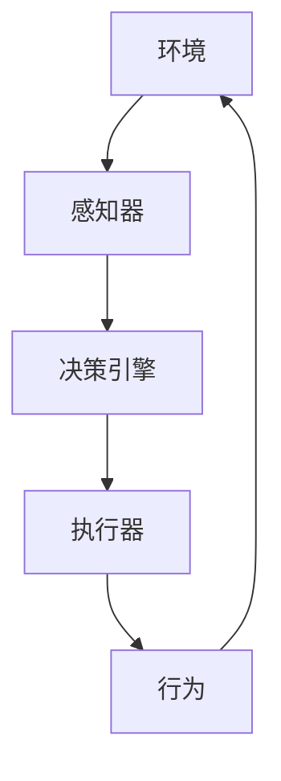

# AI Agent: AI的下一个风口 智能体的定义与特点

## 1. 背景介绍

### 1.1 问题的由来

随着人工智能(AI)技术的不断发展和应用范围的扩大,AI系统已经逐渐从狭隘的专门领域扩展到更广阔的领域。传统的AI系统通常被设计为专注于单一任务或特定领域,但未来的AI系统需要具备更广泛的能力,能够在复杂的环境中自主运行、学习和适应。这就催生了智能体(Agent)的概念。

智能体是一种具有自主性、反应性、主动性和持续时间的软件实体,能够感知环境、处理信息、做出决策并采取行动以实现既定目标。它们被视为AI系统发展的下一个风口,代表了AI技术向更智能、更通用和更自主的方向发展。

### 1.2 研究现状

智能体的概念源于人工智能和计算机科学领域,已经存在了几十年。早期的智能体系统主要应用于游戏、机器人和仿真领域。随着技术的进步,智能体正在逐步应用于更多领域,如自动驾驶、智能助理、网络安全和智能制造等。

目前,智能体研究主要集中在以下几个方面:

1. 智能体架构和框架
2. 决策理论和规划算法
3. 机器学习在智能体中的应用
4. 多智能体系统和协作
5. 人机交互和可解释性

尽管取得了一些进展,但智能体技术仍然面临着诸多挑战,如可扩展性、鲁棒性、安全性和可解释性等。

### 1.3 研究意义

智能体技术的发展对于推动人工智能向更通用、更智能和更自主的方向发展具有重要意义。智能体系统能够在复杂的环境中自主运行、学习和适应,这使得它们在诸多领域具有广阔的应用前景。

此外,智能体技术还可以促进人工智能系统的可解释性和可信赖性,使人类能够更好地理解和控制这些系统。因此,智能体技术不仅是人工智能发展的下一个风口,也是推动人工智能可持续发展的关键技术之一。

### 1.4 本文结构

本文将全面介绍智能体的定义、特点、架构、关键技术以及应用场景。文章结构如下:

1. 背景介绍
2. 核心概念与联系
3. 核心算法原理与具体操作步骤
4. 数学模型和公式详细讲解与举例说明
5. 项目实践:代码实例和详细解释说明
6. 实际应用场景
7. 工具和资源推荐
8. 总结:未来发展趋势与挑战
9. 附录:常见问题与解答

## 2. 核心概念与联系

智能体(Agent)是一种自主的软件实体,能够感知环境、处理信息、做出决策并采取行动以实现既定目标。智能体通常包含以下几个核心组件:

1. **感知器(Sensors)**: 用于从环境中获取信息和数据,如视觉、声音、温度等。
2. **决策引擎(Decision Engine)**: 基于感知到的信息和内部知识库,运行决策算法做出行为决策。
3. **执行器(Actuators)**: 根据决策引擎的指令,采取相应的行动影响环境。
4. **行为(Behavior)**: 智能体在环境中采取的行为,会反过来影响环境的状态。

智能体与环境之间是一个持续的感知-决策-行为循环。智能体需要具备以下几个关键特性:

1. **自主性(Autonomy)**: 智能体能够在没有外部指令的情况下,自主地做出决策和采取行动。
2. **反应性(Reactivity)**: 智能体能够感知环境的变化,并相应地调整自身行为。
3. **主动性(Pro-activeness)**: 智能体不仅被动地响应环境变化,还能够主动地采取行动以实现自身目标。
4. **持续时间(Temporally Continuous)**: 智能体是一个持续运行的过程,而不是一次性的计算。

智能体概念与其他AI相关概念有着密切联系:

- **机器学习(Machine Learning)**: 智能体可以利用机器学习算法从经验中学习,提高决策能力。
- **规划(Planning)**: 智能体需要规划未来行动序列以实现目标。
- **多智能体系统(Multi-Agent Systems)**: 多个智能体可以协作完成复杂任务。
- **人机交互(Human-Agent Interaction)**: 智能体需要与人类用户进行自然的交互。

## 3. 核心算法原理与具体操作步骤

智能体的核心是决策引擎,它根据感知到的环境信息和内部知识库,运行决策算法做出行为决策。常用的决策算法有:

### 3.1 算法原理概述

1. **反应型决策(Reactive Decision Making)**
    - 原理: 根据当前感知到的环境状态,通过条件-行为规则直接映射到行为决策。
    - 优点: 决策速度快,适合实时响应。
    -缺点: 缺乏长期规划能力,无法处理复杂环境。

2. **基于模型的决策(Model-based Decision Making)** 
    - 原理: 构建环境模型,通过搜索技术(如A*算法)在模型中寻找最优行为序列。
    - 优点: 具有全局规划能力,可处理复杂环境。 
    - 缺点: 计算代价高,对环境模型准确性要求高。

3. **基于效用的决策(Utility-based Decision Making)**
    - 原理: 为每个可能的状态-行为对分配一个效用值,选择期望效用最大的行为。
    - 优点: 能权衡风险和回报,适合不确定环境。
    - 缺点: 效用函数设计复杂,求解效用函数难。

4. **基于学习的决策(Learning-based Decision Making)**
    - 原理: 利用机器学习算法(如强化学习)从经验中学习最优决策策略。
    - 优点: 无需提前建模,可适应复杂环境。
    - 缺点: 收敛慢,样本效率低。

### 3.2 算法步骤详解

以基于模型的决策算法为例,一般包括以下步骤:

1. **构建环境模型**
    - 定义状态空间、行为空间和状态转移函数。
    - 可使用马尔可夫决策过程(MDP)等模型。

2. **确定目标函数**
    - 设置期望最大化或代价最小化的目标函数。
    - 常用目标函数有累积奖励、折扣累积奖励等。

3. **搜索最优解**
    - 在环境模型中搜索最优行为序列。
    - 可使用A*、实时动态规划等算法。

4. **执行和更新**
    - 执行搜索得到的最优行为。
    - 根据实际结果更新环境模型和值函数估计。

### 3.3 算法优缺点

不同决策算法有各自的优缺点:

- **反应型决策**
    - 优点: 决策速度快,适合实时响应。
    - 缺点: 缺乏长期规划能力,无法处理复杂环境。

- **基于模型决策**
    - 优点: 具有全局规划能力,可处理复杂环境。
    - 缺点: 计算代价高,对环境模型准确性要求高。

- **基于效用决策**
    - 优点: 能权衡风险和回报,适合不确定环境。  
    - 缺点: 效用函数设计复杂,求解效用函数难。

- **基于学习决策**
    - 优点: 无需提前建模,可适应复杂环境。
    - 缺点: 收敛慢,样本效率低。

在实际应用中,往往需要根据具体问题特点选择合适的决策算法,或结合多种算法的优点。

### 3.4 算法应用领域  

智能体决策算法在诸多领域都有广泛应用:

- **游戏AI**: 决策算法被广泛应用于游戏AI,控制游戏角色做出智能决策。
- **机器人控制**: 决策算法用于控制机器人在各种环境中autonomous导航和完成任务。
- **自动驾驶**: 自动驾驶系统需要基于传感器数据做出实时的驾驶决策。
- **网络安全**: 决策算法可用于检测和响应网络攻击。
- **智能制造**: 在智能制造中,决策算法可优化生产计划和控制流程。
- **个人助理**: 智能助理需要根据用户意图和上下文做出合理决策。

未来,随着智能体技术的发展,决策算法将在更多领域发挥重要作用。

## 4. 数学模型和公式详细讲解与举例说明  

智能体决策算法通常基于数学模型进行形式化描述和分析。本节将介绍一些常用的数学模型及公式。

### 4.1 数学模型构建

**马尔可夫决策过程(Markov Decision Process, MDP)**

MDP是建模智能体与环境交互的常用数学框架,由一个五元组 $\langle S, A, P, R, \gamma\rangle$ 定义:

- $S$ 是环境的**状态空间**集合
- $A$ 是智能体可执行的**行为空间**集合  
- $P(s'|s,a)$ 是**状态转移概率**,表示在状态$s$执行行为$a$后,转移到状态$s'$的概率
- $R(s,a)$ 是**奖励函数**,表示在状态$s$执行行为$a$获得的即时奖励
- $\gamma\in[0,1)$ 是**折扣因子**,表示对未来奖励的衰减程度

MDP旨在找到一个**策略**$\pi: S\rightarrow A$,使得期望累积奖励最大:

$$\max_\pi \mathbb{E}\left[\sum_{t=0}^\infty \gamma^t R(s_t, a_t)\right]$$

其中$s_t$和$a_t$分别是时间步$t$的状态和行为。

**部分可观测马尔可夫决策过程(Partially Observable MDP, POMDP)** 

在现实环境中,智能体通常无法完全观测到环境的真实状态,只能获取部分观测值。POMDP通过引入**观测空间**$\Omega$和**观测概率**$P(o|s',a)$来描述这种情况:

- $\Omega$ 是智能体可获取的**观测值空间**集合
- $P(o|s',a)$ 是在执行行为$a$并转移到状态$s'$后,获取观测值$o$的概率

POMDP的目标是找到一个**策略**$\pi: H\rightarrow A$,使期望累积奖励最大化,其中$H$是**历史数据**,包含之前的观测值和行为序列。

### 4.2 公式推导过程

**值函数(Value Function)**

在MDP中,我们定义**状态值函数**$V^\pi(s)$表示在策略$\pi$下,从状态$s$开始执行,期望获得的累积奖励:

$$V^\pi(s) = \mathbb{E}_\pi\left[\sum_{t=0}^\infty \gamma^t R(s_t, a_t) \Big| s_0 = s\right]$$

同理,我们定义**行为值函数**$Q^\pi(s,a)$表示在策略$\pi$下,从状态$s$执行行为$a$开始,期望获得的累积奖励:

$$Q^\pi(s,a) = \mathbb{E}_\pi\left[\sum_{t=0}^\infty \gamma^t R(s_t, a_t) \Big| s_0 = s, a_0 = a\right]$$

状态值函数和行为值函数可通过**贝尔曼方程**相互推导:

$$\begin{aligned}
V^\pi(s) &= \sum_{a\in A}\pi(a|s)Q^\pi(s,a)\
Q^\pi(s,a) &= R(s,a) + \gamma\sum_{s'\in S}P(s'|s,a)V^\pi(s')
\end{aligned}$$

**最优值函数**

我们定义**最优状态值函数**$V^*(s)$和**最优行为值函数**$Q^*(s,a)$分别为所有策略中状态值函数和行为值函数的最