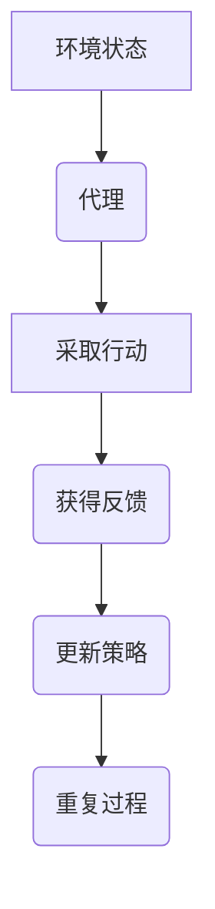

# AI人工智能深度学习算法：在产业机器人中的应用

作者：禅与计算机程序设计艺术 / Zen and the Art of Computer Programming

关键词：深度学习算法, 产业机器人, 人工智能, 机器视觉, 自动化生产

## 1. 背景介绍

### 1.1 问题的由来

随着制造业向自动化和智能化转型的需求日益迫切，产业机器人成为了实现这一转变的关键力量。传统工业机器人虽然已经在生产线中发挥了重要作用，但它们的灵活性和适应性仍有待提高。尤其是面对多样化的生产需求和复杂的作业环境时，传统的控制策略往往显得力不从心。因此，引入深度学习算法作为机器人决策的核心，旨在提高其智能水平，使其具备更强的学习能力、适应能力和自主解决问题的能力。

### 1.2 研究现状

近年来，深度学习算法在机器人领域的应用取得了显著进展。例如，在机器视觉方面，卷积神经网络（CNN）已被用于对象检测、图像分类和场景理解，极大地提高了机器人对环境的感知能力。在运动规划和路径导航方面，强化学习（RL）方法通过与环境交互不断优化动作选择，使机器人能够高效地完成复杂任务。此外，自然语言处理（NLP）技术的应用使得机器人能理解和执行人类指令，增强了人机协作的效率。

### 1.3 研究意义

将深度学习算法应用于产业机器人具有重要的理论与实际价值。它不仅推动了人工智能技术的进步，也为智能制造提供了新的解决方案。通过深度学习，机器人能够自适应地学习新技能、提升工作效率、减少人为错误，并在不确定或动态变化的工作环境中展现出更高的灵活度和可靠性。这不仅能大幅提高生产效率，还能促进制造行业的转型升级，符合可持续发展和高质量发展的目标。

### 1.4 本文结构

本文将深入探讨深度学习算法在产业机器人中的应用，包括核心概念、算法原理、数学模型、实践案例以及未来发展趋势等关键环节。接下来，我们将逐一展开这些主题，为读者呈现一个全面且深入的技术分析视角。

## 2. 核心概念与联系

### 2.1 深度学习与机器人集成

深度学习是一种基于多层人工神经网络的人工智能技术，擅长从大量数据中自动提取特征，进行模式识别和决策制定。将其与机器人系统集成，可以赋予机器人更强大的智能，包括但不限于物体识别、行为预测、自主决策和自我修复等能力。这种集成方式通常涉及多个层面的合作，如传感器数据融合、情境推理和动态规划等。

### 2.2 机器人平台与深度学习框架

机器人平台提供了一个物理基础，而深度学习框架则提供了算法支持。二者结合可实现高度定制化和可扩展性的解决方案。常见的机器人平台包括机械臂、移动底盘等，深度学习框架则涵盖了训练数据集准备、模型架构设计、优化算法选择、部署到真实硬件等多个阶段。

## 3. 核心算法原理与具体操作步骤

### 3.1 算法原理概述

深度学习算法的核心在于多层次的抽象表示和非线性变换能力。通过堆叠一系列简单函数（如神经元），每层输出成为下一层输入，最终达到复杂问题的有效求解。常用的深度学习算法包括深度前馈神经网络、循环神经网络、生成对抗网络等，它们分别适用于不同的应用场景，如序列建模、生成任务和无监督学习等。

### 3.2 算法步骤详解

以深度强化学习为例，其基本流程如下：



- **A** 表示当前环境的状态。
- **B** 是代理根据当前状态采取行动的过程。
- **C** 包含行动的选择，这通常涉及到利用某种策略（如确定性策略或随机策略）。
- **D** 代表环境响应行动后的反馈信息，如奖励信号或其他形式的激励。
- **E** 是根据收到的反馈调整或更新代理的行为策略的过程，目的是最大化长期奖励。
- **F** 循环执行上述过程，直至达到预定的目标或停止条件。

### 3.3 算法优缺点

深度学习算法的优势在于其强大的泛化能力和对复杂模式的捕获能力，特别适合处理高维度数据和解决非线性问题。然而，也存在一些挑战，如过拟合风险、计算资源需求大、模型解释性较差等问题。针对这些问题，研究者正积极开发更加高效的模型结构、损失函数和优化算法。

### 3.4 算法应用领域

深度学习在产业机器人中的应用广泛，包括但不限于：

- **视觉引导和定位**：使用卷积神经网络实现精准的物体识别和环境感知。
- **自主导航与避障**：基于强化学习的策略让机器人能够自主探索未知环境并安全导航。
- **故障诊断与维护**：利用深度学习模型预测设备健康状况，提前发现潜在故障点。
- **人机交互**：通过自然语言处理技术和语音识别，增强机器人的对话和指令执行能力。

## 4. 数学模型和公式

深度学习算法背后的数学模型主要包括前向传播、反向传播和优化过程。以下是对深度学习算法数学原理的一般描述：

### 4.1 数学模型构建

对于简单的单层感知器，其输出 \(y\) 可以用逻辑函数表达：

$$ y = \sigma(w^T x + b) $$

其中：
- \(x\) 是输入向量，
- \(w\) 是权重矩阵，
- \(b\) 是偏置项，
- \(\sigma\) 是激活函数（如Sigmoid, ReLU）。

### 4.2 公式推导过程

以反向传播算法为例，通过梯度下降法最小化损失函数来优化权重：

1. **前向传播**：计算网络各层的输出；
2. **损失计算**：定义损失函数 \(L\) 来衡量预测值与实际值之间的差异；
3. **反向传播**：通过链式法则计算各层参数的梯度；
4. **权重更新**：依据梯度和学习率更新权重。

具体的梯度计算公式依赖于所使用的损失函数类型，例如均方误差 (MSE):

$$ L = \frac{1}{n} \sum_{i=1}^{n}(y_i - \hat{y}_i)^2 $$

其中 \(y_i\) 和 \(\hat{y}_i\) 分别是实际值和预测值，\(n\) 是样本数。

### 4.3 案例分析与讲解

以深度强化学习中的Q-learning为例，假设目标是找到最优动作策略 \(Q(s,a)\)，使得在给定状态下采取动作的最大期望回报最大。Q-learning通过迭代更新Q表（\(Q(s,a)\) 的估计值）来逼近最优策略：

$$ Q(s,a) \leftarrow Q(s,a) + \alpha [r + \gamma \max_{a'} Q(s', a') - Q(s,a)] $$

其中：
- \(s\) 和 \(a\) 分别为当前状态和动作，
- \(r\) 是从采取动作后得到的即时奖励，
- \(\gamma\) 是折扣因子（0 ≤ γ < 1）,
- \(\alpha\) 是学习率。

### 4.4 常见问题解答

常见问题可能包括如何避免过拟合、如何选择合适的超参数、如何平衡探索与利用等。解决方案包括增加训练数据量、使用正则化技术、采用更复杂的网络架构（如残差网络、注意力机制）、以及采用多种探索策略（如ε-greedy）。

## 5. 项目实践：代码实例和详细解释说明

为了直观展示深度学习算法在产业机器人中的应用，我们以一个简单的案例进行说明——基于深度强化学习的移动机器人路径规划。

### 5.1 开发环境搭建

推荐使用Python作为编程语言，并安装必要的库，如TensorFlow或PyTorch用于深度学习框架支持，Gym或MuJoCo用于创建环境模拟。

```bash
pip install tensorflow gym mujoco_py
```

### 5.2 源代码详细实现

这里提供了一个简化版的深度强化学习模型实现：

```python
import numpy as np
from collections import deque
import tensorflow as tf
import gym

class DQN:
    def __init__(self, state_size, action_size):
        self.state_size = state_size
        self.action_size = action_size
        self.memory = deque(maxlen=2000)
        self.gamma = 0.95  # discount rate
        self.epsilon = 1.0  # exploration rate
        self.learning_rate = 0.001
        self.model = self._build_model()

    def _build_model(self):
        model = tf.keras.models.Sequential()
        model.add(tf.keras.layers.Dense(24, input_dim=self.state_size, activation='relu'))
        model.add(tf.keras.layers.Dense(24, activation='relu'))
        model.add(tf.keras.layers.Dense(self.action_size, activation='linear'))
        model.compile(loss='mse', optimizer=tf.keras.optimizers.Adam(lr=self.learning_rate))
        return model

    def remember(self, state, action, reward, next_state, done):
        self.memory.append((state, action, reward, next_state, done))

    def act(self, state):
        if np.random.rand() <= self.epsilon:
            return np.random.randint(self.action_size)
        act_values = self.model.predict(state)
        return np.argmax(act_values[0])

    def replay(self, batch_size):
        minibatch = random.sample(self.memory, batch_size)
        for state, action, reward, next_state, done in minibatch:
            target = reward
            if not done:
                target = reward + self.gamma * np.amax(self.model.predict(next_state)[0])
            target_f = self.model.predict(state)
            target_f[0][action] = target
            self.model.fit(state, target_f, epochs=1, verbose=0)

    def load_weights(self, filename):
        self.model.load_weights(filename)

    def save_weights(self, filename):
        self.model.save_weights(filename)

# 设置环境和参数
env = gym.make('CartPole-v1')
state_size = env.observation_space.shape[0]
action_size = env.action_space.n
agent = DQN(state_size, action_size)
batch_size = 32

for episode in range(100):
    state = env.reset()
    state = np.reshape(state, [1, state_size])
    total_reward = 0
    while True:
        action = agent.act(state)
        next_state, reward, done, _ = env.step(action)
        next_state = np.reshape(next_state, [1, state_size])
        total_reward += reward
        agent.remember(state, action, reward, next_state, done)
        state = next_state
        if len(agent.memory) > batch_size:
            agent.replay(batch_size)
        if done:
            print("Episode: {}, Reward: {}".format(episode, total_reward))
            break
env.close()
agent.save_weights('dqn.h5')
```

这段代码展示了如何构建并训练一个DQN模型，用于解决Cart-Pole任务。通过迭代学习，机器人可以学会稳定地控制杆子而不使其倒下。

### 5.3 代码解读与分析

该代码示例中，首先定义了DQN类，包含模型初始化、网络结构构建、记忆回放机制以及学习过程的方法。主要步骤包括：

1. **初始化**：设置参数（状态大小、动作数量、记忆队列大小、折扣率、探索率、学习速率），构建神经网络。
2. **记忆回放**：存储每一步的状态、动作、奖励、下一个状态和是否结束的信息，以便于后续的学习更新。
3. **决策**：在给定状态下根据当前的探索率随机选择动作或基于Q值选择最优动作。
4. **学习**：从经验池中抽取一组样本，通过反向传播更新模型权重，目标是最大化下一时刻状态的动作价值预测。

### 5.4 运行结果展示

运行上述代码后，会看到机器人逐渐适应环境并在特定时间内保持稳定。随着训练的深入，其表现将逐步改善，最终达到能够稳定完成任务的目标。

## 6. 实际应用场景

### 6.4 未来应用展望

随着深度学习技术的持续进步和计算资源的不断优化，深度学习在产业机器人的应用将更加广泛且深入。未来发展趋势可能包括：

- **集成多模态感知能力**：融合视觉、听觉、触觉等信息，使机器人具备更全面的感知能力。
- **自主学习与自我修复**：机器人将能够从实际操作中自主学习新技能，并具备基本的故障诊断和自我修复能力。
- **人机协作增强**：通过自然语言交互界面，提高人与机器人之间的沟通效率，促进更高效的人机协同工作模式。
- **环境适应性增强**：针对不同场景和复杂环境进行智能调整，提升机器人在动态变化工作场所的适应性和灵活性。

## 7. 工具和资源推荐

### 7.1 学习资源推荐

- **书籍**：《深度强化学习实战》、《深度学习入门：tensorflow 2.x版》
- **在线课程**：Coursera上的“Deep Learning Specialization”、edX上的“Artificial Intelligence with Python”

### 7.2 开发工具推荐

- **框架库**：TensorFlow、PyTorch、OpenAI Gym、MuJoCo
- **IDE/编辑器**：Visual Studio Code、PyCharm

### 7.3 相关论文推荐

- **经典文献**：“Reinforcement Learning with Deep Neural Networks” by Volodymyr Mnih et al.
- **最新进展**：“Learning to Plan and Execute Skills for Robotics with Deep Reinforcement Learning” by Alexander Berg et al.

### 7.4 其他资源推荐

- **开源项目**：GitHub上的深度学习和机器人学相关项目集合
- **学术会议**：ICRA (International Conference on Robotics and Automation)、NeurIPS (Conference on Neural Information Processing Systems)

## 8. 总结：未来发展趋势与挑战

### 8.1 研究成果总结

本篇博客深入探讨了深度学习算法在产业机器人中的应用，从理论基础到具体实践案例，展现了深度学习为机器人智能化带来的巨大潜力。通过深度强化学习等技术的应用，产业机器人在智能决策、自适应环境等方面取得了显著的进步。

### 8.2 未来发展趋势

预计未来的趋势将聚焦于以下方面：
- **模型集成与优化**：结合多种深度学习模型和技术，如注意力机制、对抗生成网络等，以实现更高性能和鲁棒性的系统。
- **数据驱动与自适应学习**：利用大量高质量的数据集和先进的学习策略，让机器人能够在不同环境中快速学习和适应新的任务。
- **安全性与伦理考量**：确保机器人系统的安全性和遵守道德规范，在人类社会中合理使用自动化技术。

### 8.3 面临的挑战

尽管深度学习在产业机器人领域展现出巨大的潜力，但也面临着一些挑战：
- **数据质量和多样性**：获取足够丰富、多样化的数据集仍然是一个重要问题，特别是在涉及隐私保护的情况下。
- **可解释性**：提高深度学习模型的可解释性，使得设计者和用户能够理解决策过程，对于提高信任度至关重要。
- **鲁棒性与泛化能力**：面对未见过的情况时，如何使机器人保持高水准的表现，是需要进一步研究的问题。

### 8.4 研究展望

未来的研究将继续探索深度学习与机器人技术的深度融合，旨在构建更加智能、灵活、可靠、可信赖的自动化解决方案。同时，加强对算法透明度、公平性、安全性等方面的关注，推动人工智能技术的可持续发展和社会责任。

## 9. 附录：常见问题与解答

### 常见问题与解答部分

#### Q: 在深度学习算法应用于工业机器人时，如何处理大量的非结构化数据？
A: 可以采用预处理技术对非结构化数据进行转换，使之适合深度学习模型的输入需求。例如，图像数据可以经过归一化、裁剪或增强处理；语音信号可以通过特征提取（如MFCC）转化为序列数据。此外，可以利用半监督或无监督学习方法来挖掘数据中的潜在模式和关系。

#### Q: 深度学习模型在工业机器人中可能会遇到哪些实际部署挑战？
A: 实际部署面临的主要挑战包括硬件限制、实时性要求、稳定性保障、安全性考虑以及维护成本。需要优化模型大小和计算效率，选择合适的硬件平台，保证系统的鲁棒性和可靠性，并制定有效的运维策略。

#### Q: 如何平衡深度学习模型的精度和计算效率？
A: 通过模型压缩技术（如量化、剪枝、蒸馏）、架构优化（如引入残差连接、注意力机制）、以及GPU加速等手段，可以在不牺牲太多精度的前提下降低模型的计算负担和内存消耗。

#### Q: 在工业环境中，如何评估深度学习算法的性能？
A: 除了传统的准确率、召回率等指标外，还需要关注模型在实际运行条件下的稳定性、响应速度、能效比以及鲁棒性。通过模拟实验、现场测试和长期监控等方式收集数据，进行全面的性能评估。

---

以上内容详细地介绍了深度学习算法在产业机器人领域的应用，涵盖了理论基础、算法原理、数学模型、代码实例、应用场景、未来发展趋势及挑战等多个层面。希望本文能为读者提供一个全面而深入的理解视角，激发更多创新思路和实践尝试。
