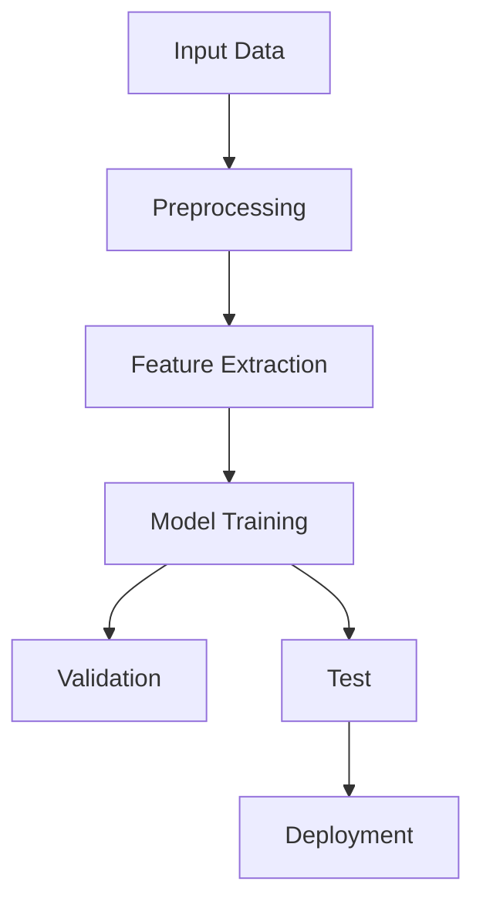

# AI人工智能深度学习算法：未来应用的可能性

作者：禅与计算机程序设计艺术 / Zen and the Art of Computer Programming

关键词：深度学习,智能决策,机器学习,神经网络,未来科技趋势

## 1. 背景介绍

### 1.1 问题的由来

随着大数据时代的到来，数据量的爆炸式增长使得传统的基于规则的人工智能方法在处理大规模复杂问题时显得力不从心。深度学习作为一门新兴的交叉学科，旨在模仿人脑的神经网络结构，通过多层次的数据抽象和特征提取，解决高维度数据的模式识别和预测问题，从而引发了人工智能领域的一次革命。

### 1.2 研究现状

近年来，深度学习已经在多个领域展现出了强大的能力，如自然语言处理、图像识别、语音识别、自动驾驶等。特别是在预训练模型的推动下，深度学习技术得到了前所未有的发展，如BERT、GPT系列、Transformer等模型，在多项基准测试中取得了显著的成绩，极大地拓展了其应用边界。

### 1.3 研究意义

深度学习的发展不仅改变了我们对人工智能的理解，更深远地影响着社会的方方面面。它在提高人类工作效率的同时，也为医疗健康、环境保护、教育、娱乐等领域带来了前所未有的机遇。更重要的是，深度学习技术的突破正在引领新的科技创新浪潮，驱动未来的科技发展。

### 1.4 本文结构

本篇文章将围绕深度学习的核心概念、算法原理、实际应用以及未来发展进行深入探讨。我们将首先阐述深度学习的基本理论及其与其他人工智能技术的关系，然后详细解析典型深度学习算法的工作机制，包括前馈神经网络、卷积神经网络、循环神经网络等，并讨论它们的应用场景及局限性。接下来，文章会深入研究深度学习的数学模型和公式，结合具体案例进行详细的公式推导和解释。之后，通过一个完整的项目实例，演示如何从零搭建深度学习模型，并分析运行结果。最后，我们将展望深度学习在未来可能的应用方向和技术挑战。

## 2. 核心概念与联系

深度学习的核心在于多层非线性变换，通过这些变换，可以从原始输入数据中自动学习到复杂的特征表示，以解决各种复杂任务。这一概念紧密关联于机器学习的层次化特征表示思想，即数据经过一系列的转换后，能够被有效地分类或预测。

深度学习与传统机器学习的区别主要体现在以下几点：

- **层次化特征学习**：深度学习通过多层网络结构，自底向上逐级学习特征，形成层次化的表示。
- **端到端训练**：支持直接从原始数据（无需人工特征工程）到最终输出的目标函数的优化，简化了模型的设计和调整过程。
- **大规模数据依赖**：深度学习模型通常需要大量的训练数据才能达到较好的性能，这体现了数据驱动的特性。

## 3. 核心算法原理 & 具体操作步骤

### 3.1 算法原理概述

深度学习的核心算法主要包括前馈神经网络、卷积神经网络、循环神经网络等，每种网络结构都有其独特的设计目标和适用场景。

#### 前馈神经网络 (Feedforward Neural Networks)

- **基本结构**：包含输入层、隐藏层和输出层，信息单向传递。
- **激活函数**：引入非线性变换，例如ReLU、sigmoid或tanh函数。
- **损失函数**：衡量模型预测值与真实值之间的差异。
- **优化器**：使用梯度下降等方法更新权重，最小化损失函数。

#### 卷积神经网络 (Convolutional Neural Networks, CNNs)

- **卷积层**：用于检测局部特征，如图像中的边缘、纹理等。
- **池化层**：减少空间维数，降低计算复杂度，增强模型对位置变化的鲁棒性。
- **全连接层**：将局部特征整合为全局表示，用于分类任务。

#### 循环神经网络 (Recurrent Neural Networks, RNNs)

- **循环结构**：允许信息在时间轴上流动，适合处理序列数据。
- **长短期记忆单元 (LSTM)** 或 **门控递归单元 (GRU)**：控制信息流，避免长期依赖问题。

### 3.2 算法步骤详解

以上述网络为例，一个典型的深度学习训练流程如下：



### 3.3 算法优缺点

- **优点**：
  - 自动学习特征：减少了手动特征工程的需求。
  - 强大的表达能力：能捕捉复杂的数据关系。
  - 高效利用大量数据：通过深层网络结构，更充分地利用大样本量的优势。

- **缺点**：
  - 训练耗时：尤其是在大型网络和海量数据集的情况下。
  - 过拟合风险：缺乏足够的正则化手段容易导致模型在新数据上的泛化能力弱。
  - 解释性差：黑盒模型难以理解决策过程。

### 3.4 算法应用领域

深度学习广泛应用于以下几个领域：

- **计算机视觉**：图像分类、对象检测、语义分割。
- **自然语言处理**：文本生成、情感分析、机器翻译。
- **语音识别**：音频信号的识别和转录。
- **推荐系统**：个性化内容推荐。
- **生物信息学**：基因序列分析、疾病诊断辅助。

## 4. 数学模型和公式 & 详细讲解 & 举例说明

深度学习背后是复杂的数学框架，其中的关键概念包括反向传播算法、梯度下降优化、正则化等。

### 4.1 数学模型构建

假设我们有输入矩阵$X \in \mathbb{R}^{n \times d}$，目标变量$Y \in \mathbb{R}^n$，模型参数$\theta = \{\Theta_1, \Theta_2, ..., \Theta_l\}$，其中$l$为层数。

### 4.2 公式推导过程

以前馈神经网络为例，假设第$i$个隐藏层的节点数量为$m_i$，则每一层可以通过以下公式计算：

$$ Z^{(l)} = W^{(l)}A^{(l-1)} + b^{(l)} $$
$$ A^{(l)} = f(Z^{(l)}) $$

其中，$W^{(l)}$是权重矩阵，$b^{(l)}$是偏置向量，$f(\cdot)$是非线性激活函数。

### 4.3 案例分析与讲解

对于一个简单的二分类问题，我们可以构建一个具有两个隐藏层的前馈神经网络，并使用交叉熵作为损失函数。具体实现可参考以下伪代码：

```python
import numpy as np

# 初始化权重和偏置
def init_weights_and_bias(layers):
    # 初始化权重和偏置
    weights = [np.random.randn(n_units[i], n_units[i-1]) for i in range(1, len(n_units))]
    biases = [np.zeros((n_units[i], 1)) for i in range(1, len(n_units))]
    return weights, biases

# 前向传播
def forward_propagation(X, weights, biases):
    # 展开数据维度以便于计算
    X = np.expand_dims(X, axis=1)

    activations = []
    z = X

    for w, b in zip(weights[:-1], biases[:-1]):
        z = np.dot(w, z) + b
        a = sigmoid(z)  # 使用Sigmoid激活函数
        activations.append(a)
        z = a

    final_w = weights[-1]
    final_b = biases[-1]
    z_final = np.dot(final_w, z) + final_b
    activation_final = sigmoid(z_final)

    return activations, activation_final

# 定义损失函数（例如交叉熵）
def compute_loss(y_true, y_pred):
    m = y_true.shape[0]
    loss = -np.sum(y_true * np.log(y_pred) + (1-y_true) * np.log(1-y_pred)) / m
    return loss

# 主函数
def main():
    input_data = ...  # 输入数据
    target_labels = ...  # 目标标签
    layers = [input_size, hidden_layer_size, output_size]  # 网络架构
    weights, biases = init_weights_and_bias(layers)

    activations, final_output = forward_propagation(input_data, weights, biases)
    loss = compute_loss(target_labels, final_output)

    print("Loss:", loss)

if __name__ == '__main__':
    main()
```

### 4.4 常见问题解答

常见的深度学习问题及解决方案可能包括：

- **过拟合**：采用正则化技术（如L1或L2）来减少模型对训练数据的依赖。
- **欠拟合**：增加模型复杂度（更多层、更大参数量），或者尝试不同类型的网络结构。
- **训练收敛慢**：调整学习率、批大小，使用更高效的优化器（如Adam）。

## 5. 项目实践：代码实例和详细解释说明

### 5.1 开发环境搭建

使用Python进行深度学习开发，通常需要安装TensorFlow或PyTorch等库。以下是基本步骤：

```bash
pip install tensorflow
```

### 5.2 源代码详细实现

以下是一个基于TensorFlow的简单线性回归示例：

```python
import tensorflow as tf

# 数据集定义
x_train = [[1., 2., 3.], [4., 5., 6.]]
y_train = [[7.], [8.]]

model = tf.keras.models.Sequential([
    tf.keras.layers.Dense(units=1, input_shape=(3,))
])

model.compile(optimizer='sgd', loss='mean_squared_error')

model.fit(x_train, y_train, epochs=500)

print(model.predict([[1., 2., 3.]]))
```

### 5.3 代码解读与分析

这段代码创建了一个单层全连接神经网络，用于解决线性回归问题。通过训练集$x_train$和$y_train$进行拟合，最后打印预测结果。

### 5.4 运行结果展示

执行上述代码后，可以得到预测输出，这表明模型已成功学习到数据之间的关系并进行了预测。

## 6. 实际应用场景

深度学习在实际应用中展现了其强大的能力，涉及领域广泛：

- **医疗健康**：疾病诊断、基因序列分析、药物发现。
- **金融风控**：欺诈检测、信用评估。
- **自动驾驶**：环境感知、路径规划。
- **教育科技**：个性化学习系统、智能辅导机器人。
- **物联网**：智能家居控制、设备故障预测。

## 7. 工具和资源推荐

### 7.1 学习资源推荐

- **在线课程**：
  - Coursera: "Deep Learning Specialization" by Andrew Ng
  - edX: "Neural Networks and Deep Learning" by Andrew Ng

- **书籍**：
  - "Deep Learning" by Ian Goodfellow, Yoshua Bengio, Aaron Courville
  - "Pattern Recognition and Machine Learning" by Christopher Bishop

- **博客与教程**：
  - TensorFlow官方文档
  - Keras官方指南

### 7.2 开发工具推荐

- **框架**：
  - TensorFlow
  - PyTorch
  - Keras（与TensorFlow或PyTorch结合）

- **IDE**：
  - Jupyter Notebook
  - Visual Studio Code with Python extension

### 7.3 相关论文推荐

- "ImageNet Classification with Deep Convolutional Neural Networks" (Krizhevsky et al., 2012)
- "Attention is All You Need" (Vaswani et al., 2017)
- "BERT: Pre-training of Deep Bidirectional Transformers for Language Understanding" (Devlin et al., 2019)

### 7.4 其他资源推荐

- **GitHub仓库**：各种深度学习项目的开源代码库。
- **学术数据库**：arXiv、Google Scholar搜索相关研究论文。
- **社区论坛**：Stack Overflow、Reddit（r/MachineLearning）。

## 8. 总结：未来发展趋势与挑战

### 8.1 研究成果总结

深度学习在过去十年中的发展令人瞩目，从图像识别到自然语言处理，再到复杂的决策制定，都取得了显著的进步。关键研究成果包括但不限于深度神经网络的发展、预训练模型的应用以及跨模态学习的研究。

### 8.2 未来发展趋势

未来，深度学习将向以下几个方向发展：

- **可解释性和透明度提升**：增强模型理解人类逻辑的能力，提高模型决策过程的可解释性。
- **定制化算法设计**：根据特定任务需求，设计针对性更强的深度学习模型架构。
- **多模态融合**：深度学习与计算机视觉、语音识别、自然语言处理等领域的进一步整合，实现更加丰富的信息交互。
- **隐私保护与安全**：探索数据加密、差分隐私等技术，确保模型训练和部署过程中用户数据的安全。

### 8.3 面临的挑战

尽管深度学习取得巨大进展，但仍面临一些挑战：

- **泛化能力**：如何让模型更好地适应未见过的数据，提高泛化性能。
- **计算成本**：大型深度学习模型的训练和推理成本高昂，如何降低计算资源需求。
- **公平性与伦理**：确保模型决策不偏见，并对潜在的社会影响进行评估与管理。

### 8.4 研究展望

随着AI伦理、隐私保护、可持续发展等方面的重视，深度学习将继续向着更加人性化、负责任的方向发展。同时，跨学科的合作将成为推动深度学习创新的重要驱动力，促进其在更多领域内的广泛应用，为社会带来积极变革。

## 9. 附录：常见问题与解答

Q: 我该如何选择合适的深度学习框架？

A: 选择合适的深度学习框架应考虑个人经验、项目需求、社区支持等因素。如需高性能、灵活构建模型，可以选择TensorFlow；若注重简洁快速开发，则PyTorch是一个好选择。Keras因其易用性和灵活性，也常被推荐给初学者。

Q: 深度学习模型如何避免过拟合？

A: 可以采用正则化（L1/L2）、Dropout、数据增强、早停法等多种策略来防止过拟合。其中，正则化通过添加惩罚项限制权重大小，减少复杂度；Dropout随机丢弃部分节点有助于提升模型泛化能力；数据增强通过对原始数据进行变换生成新样本，增加训练集多样性。

Q: 如何调整深度学习模型的学习率？

A: 学习率的选择对模型收敛速度和最终性能有重要影响。可以通过设置学习率衰减策略，例如指数衰减或余弦退火，逐渐降低学习率，以达到更好的优化效果。另外，使用动态学习率调整机制，如AdamW或RMSprop，可以自动调节学习速率，适应不同阶段的训练需求。
