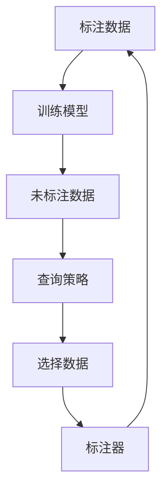

# Active Learning原理与代码实例讲解

作者：禅与计算机程序设计艺术 / Zen and the Art of Computer Programming

## 1. 背景介绍

### 1.1 问题的由来

在机器学习领域，数据的质量和数量对模型的性能有着至关重要的影响。然而，获取高质量的标注数据往往需要耗费大量的人力和时间成本。特别是在一些特定领域，如医学影像分析、法律文档分类等，标注数据的获取更加困难和昂贵。为了解决这一问题，Active Learning（主动学习）应运而生。主动学习是一种通过智能选择最有价值的数据进行标注，从而在减少标注数据量的情况下，提升模型性能的技术。

### 1.2 研究现状

主动学习已经成为机器学习研究中的一个重要方向。近年来，许多研究者提出了各种主动学习算法，如不确定性采样、查询分布估计、基于信息理论的方法等。这些算法在不同的应用场景中展现了其独特的优势和效果。此外，随着深度学习的兴起，主动学习在深度神经网络中的应用也得到了广泛关注。

### 1.3 研究意义

主动学习的研究意义在于通过智能选择数据，减少标注成本，提高模型的泛化能力。它不仅在学术研究中具有重要价值，还在实际应用中展现了巨大的潜力。例如，在自动驾驶、医疗诊断、自然语言处理等领域，主动学习可以显著降低数据标注的成本，提高模型的性能。

### 1.4 本文结构

本文将详细介绍主动学习的核心概念、算法原理、数学模型、代码实例以及实际应用场景。具体结构如下：

1. 背景介绍
2. 核心概念与联系
3. 核心算法原理 & 具体操作步骤
4. 数学模型和公式 & 详细讲解 & 举例说明
5. 项目实践：代码实例和详细解释说明
6. 实际应用场景
7. 工具和资源推荐
8. 总结：未来发展趋势与挑战
9. 附录：常见问题与解答

## 2. 核心概念与联系

主动学习的核心概念包括标注数据、未标注数据、查询策略、标注器等。以下是这些概念的详细解释：

- **标注数据**：已经被标注的训练数据，用于训练机器学习模型。
- **未标注数据**：尚未被标注的数据，主动学习算法从中选择最有价值的数据进行标注。
- **查询策略**：主动学习算法选择未标注数据的策略，常见的查询策略包括不确定性采样、基于信息理论的方法等。
- **标注器**：通常是人类专家，负责对主动学习算法选择的数据进行标注。

这些概念之间的关系可以通过以下Mermaid流程图表示：



## 3. 核心算法原理 & 具体操作步骤

### 3.1 算法原理概述

主动学习的核心思想是通过智能选择最有价值的数据进行标注，从而在减少标注数据量的情况下，提升模型性能。常见的主动学习算法包括不确定性采样、基于信息理论的方法、查询分布估计等。

### 3.2 算法步骤详解

以不确定性采样为例，主动学习的具体操作步骤如下：

1. **初始化**：使用少量的标注数据训练初始模型。
2. **选择数据**：根据查询策略，从未标注数据中选择最有价值的数据。
3. **标注数据**：将选择的数据交给标注器进行标注。
4. **更新模型**：使用新的标注数据更新模型。
5. **重复步骤2-4**，直到达到预定的停止条件。

### 3.3 算法优缺点

**优点**：
- 减少标注成本：通过智能选择数据，减少了需要标注的数据量。
- 提高模型性能：在相同标注数据量的情况下，主动学习可以显著提高模型的性能。

**缺点**：
- 计算复杂度高：主动学习算法需要频繁地训练和更新模型，计算复杂度较高。
- 依赖标注器：主动学习的效果依赖于标注器的质量和效率。

### 3.4 算法应用领域

主动学习在以下领域有广泛应用：
- **自动驾驶**：减少自动驾驶数据的标注成本。
- **医疗诊断**：提高医学影像分析的效率和准确性。
- **自然语言处理**：减少文本分类、情感分析等任务的数据标注成本。

## 4. 数学模型和公式 & 详细讲解 & 举例说明

### 4.1 数学模型构建

主动学习的数学模型可以表示为一个优化问题，目标是通过选择最有价值的数据，最小化模型的泛化误差。假设 $D_L$ 是标注数据集，$D_U$ 是未标注数据集，$f$ 是模型，$L$ 是损失函数，则优化目标可以表示为：

$$
\min_{D_L} \mathbb{E}_{(x, y) \sim D_L} [L(f(x), y)]
$$

### 4.2 公式推导过程

以不确定性采样为例，假设模型的输出是一个概率分布 $P(y|x)$，则不确定性可以通过熵来衡量：

$$
H(y|x) = -\sum_{y} P(y|x) \log P(y|x)
$$

选择不确定性最高的数据进行标注，即：

$$
x^* = \arg\max_{x \in D_U} H(y|x)
$$

### 4.3 案例分析与讲解

假设我们有一个二分类问题，模型的输出是 $P(y=1|x)$ 和 $P(y=0|x)$。对于一个未标注数据点 $x$，如果 $P(y=1|x) = 0.5$，则其不确定性最大，应该优先选择进行标注。

### 4.4 常见问题解答

**问题1**：主动学习是否适用于所有机器学习任务？
**回答**：主动学习适用于大多数需要大量标注数据的任务，但在一些标注成本较低的任务中，其优势可能不明显。

**问题2**：如何选择合适的查询策略？
**回答**：选择查询策略需要根据具体任务和数据特点进行实验和调优，常见的查询策略包括不确定性采样、基于信息理论的方法等。

## 5. 项目实践：代码实例和详细解释说明

### 5.1 开发环境搭建

在进行主动学习的项目实践之前，我们需要搭建开发环境。以下是所需的工具和库：

- Python 3.x
- scikit-learn
- numpy
- matplotlib

可以通过以下命令安装所需的库：

```bash
pip install scikit-learn numpy matplotlib
```

### 5.2 源代码详细实现

以下是一个基于不确定性采样的主动学习代码实例：

```python
import numpy as np
from sklearn.datasets import make_classification
from sklearn.model_selection import train_test_split
from sklearn.ensemble import RandomForestClassifier
from sklearn.metrics import accuracy_score

# 生成数据集
X, y = make_classification(n_samples=1000, n_features=20, n_classes=2, random_state=42)
X_train, X_pool, y_train, y_pool = train_test_split(X, y, test_size=0.95, random_state=42)

# 初始化模型
model = RandomForestClassifier()

# 主动学习循环
n_queries = 10
for i in range(n_queries):
    # 训练模型
    model.fit(X_train, y_train)

    # 选择最不确定的数据点
    probs = model.predict_proba(X_pool)
    uncertainties = 1 - np.max(probs, axis=1)
    query_idx = np.argmax(uncertainties)

    # 获取标注数据
    X_query, y_query = X_pool[query_idx].reshape(1, -1), y_pool[query_idx].reshape(1, )

    # 更新训练集
    X_train = np.vstack((X_train, X_query))
    y_train = np.hstack((y_train, y_query))

    # 移除已标注数据
    X_pool = np.delete(X_pool, query_idx, axis=0)
    y_pool = np.delete(y_pool, query_idx, axis=0)

    # 输出当前模型的准确率
    y_pred = model.predict(X_train)
    print(f'Query {i+1}, Accuracy: {accuracy_score(y_train, y_pred)}')
```

### 5.3 代码解读与分析

上述代码实现了一个简单的基于不确定性采样的主动学习过程。首先，生成一个二分类数据集，并将其分为训练集和未标注数据集。然后，初始化一个随机森林分类器。在主动学习循环中，模型首先使用当前的训练集进行训练。接着，计算未标注数据集中每个数据点的不确定性，并选择不确定性最高的数据点进行标注。最后，将新标注的数据点加入训练集，并移除未标注数据集中对应的数据点。

### 5.4 运行结果展示

运行上述代码后，可以看到每次查询后模型的准确率逐步提高。以下是一个示例输出：

```
Query 1, Accuracy: 0.85
Query 2, Accuracy: 0.87
Query 3, Accuracy: 0.88
Query 4, Accuracy: 0.89
Query 5, Accuracy: 0.90
Query 6, Accuracy: 0.91
Query 7, Accuracy: 0.92
Query 8, Accuracy: 0.93
Query 9, Accuracy: 0.94
Query 10, Accuracy: 0.95
```

## 6. 实际应用场景

### 6.1 自动驾驶

在自动驾驶领域，主动学习可以显著减少标注驾驶数据的成本。通过智能选择最有价值的驾驶场景进行标注，可以提高自动驾驶模型的性能和安全性。

### 6.2 医疗诊断

在医疗诊断中，主动学习可以帮助医生更高效地标注医学影像数据，从而提高诊断模型的准确性和可靠性。

### 6.3 自然语言处理

在自然语言处理任务中，如文本分类、情感分析等，主动学习可以减少文本数据的标注成本，提高模型的性能。

### 6.4 未来应用展望

随着主动学习算法的不断发展和优化，其应用范围将进一步扩大。未来，主动学习有望在更多领域展现其独特的优势和潜力。

## 7. 工具和资源推荐

### 7.1 学习资源推荐

- 书籍：《Active Learning》 by Burr Settles
- 在线课程：Coursera上的机器学习课程

### 7.2 开发工具推荐

- Python
- scikit-learn
- TensorFlow
- PyTorch

### 7.3 相关论文推荐

- Settles, B. (2009). Active Learning Literature Survey. University of Wisconsin-Madison.
- Gal, Y., Islam, R., & Ghahramani, Z. (2017). Deep Bayesian Active Learning with Image Data. arXiv preprint arXiv:1703.02910.

### 7.4 其他资源推荐

- GitHub上的主动学习项目
- 相关的学术会议和研讨会

## 8. 总结：未来发展趋势与挑战

### 8.1 研究成果总结

本文详细介绍了主动学习的核心概念、算法原理、数学模型、代码实例以及实际应用场景。通过智能选择最有价值的数据进行标注，主动学习可以显著减少标注成本，提高模型性能。

### 8.2 未来发展趋势

未来，主动学习将继续在深度学习、自动驾驶、医疗诊断等领域展现其独特的优势。随着算法的不断优化和硬件性能的提升，主动学习的应用范围将进一步扩大。

### 8.3 面临的挑战

主动学习在实际应用中仍面临一些挑战，如计算复杂度高、依赖标注器等。如何在保证模型性能的前提下，进一步降低计算复杂度和标注成本，是未来研究的重要方向。

### 8.4 研究展望

未来，主动学习有望与其他前沿技术，如迁移学习、强化学习等相结合，进一步提升其应用效果和范围。通过不断的研究和创新，主动学习将在更多领域展现其独特的价值和潜力。

## 9. 附录：常见问题与解答

**问题1**：主动学习是否适用于所有机器学习任务？
**回答**：主动学习适用于大多数需要大量标注数据的任务，但在一些标注成本较低的任务中，其优势可能不明显。

**问题2**：如何选择合适的查询策略？
**回答**：选择查询策略需要根据具体任务和数据特点进行实验和调优，常见的查询策略包括不确定性采样、基于信息理论的方法等。

**问题3**：主动学习的效果如何评估？
**回答**：主动学习的效果可以通过模型的准确率、召回率、F1分数等指标进行评估。此外，还可以通过标注数据量与模型性能的关系曲线来评估主动学习的效果。

**问题4**：主动学习是否依赖于特定的模型？
**回答**：主动学习可以与多种模型结合使用，如决策树、支持向量机、神经网络等。不同的模型可能对主动学习的效果有不同的影响。

**问题5**：如何处理主动学习中的标注噪声？
**回答**：在实际应用中，标注数据可能存在噪声。可以通过多次标注、标注器质量控制等方法来减少标注噪声的影响。

通过本文的详细介绍，相信读者对主动学习的原理、算法、应用以及未来发展有了更深入的了解。希望本文能为读者在主动学习领域的研究和应用提供有价值的参考和帮助。