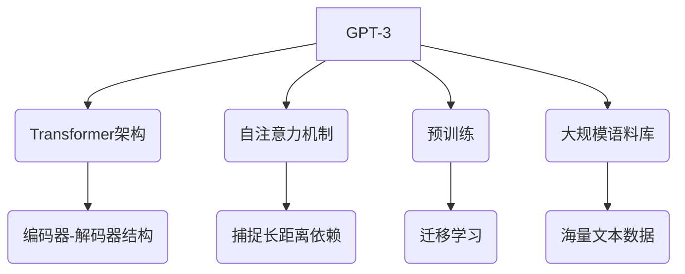

# GPT-3: AI强大与人类智力的对话

## 1. 背景介绍

### 1.1 问题的由来

自从图灵提出"机器能思考吗?"的著名问题以来,人工智能(AI)一直是科技界和哲学界广受关注和探讨的热门话题。近年来,随着深度学习、大数据和计算能力的飞速发展,AI取得了令人瞩目的进步,尤其是在自然语言处理(NLP)领域。其中,GPT-3(Generative Pre-trained Transformer 3)无疑是最耀眼的明星之一。

### 1.2 研究现状

GPT-3是一种基于transformer的大型语言模型,由OpenAI公司于2020年推出。它通过预训练的方式在大量文本数据上学习,获得了强大的自然语言生成能力。GPT-3不仅能生成看似人类写作的连贯文本,还能执行各种语言任务,如问答、文本总结、代码生成等,展现出惊人的通用能力。

GPT-3的出现引发了人们对AI能力的重新思考和热议。一方面,GPT-3的卓越表现令人惊叹,似乎正在逐步逼近"通用人工智能"(AGI)的目标;另一方面,GPT-3也暴露出当前AI系统的一些明显缺陷,如缺乏因果推理、常识理解等高阶认知能力。

### 1.3 研究意义

深入探讨GPT-3不仅有助于我们全面认识当前AI的发展水平,也将为未来AI技术的发展提供重要参考。本文将从GPT-3的核心技术、应用场景、潜在挑战等多个角度进行剖析,旨在为读者提供一个全景式的认知,并对GPT-3所代表的大模型范式的未来发展趋势进行前瞻性思考。

### 1.4 本文结构

本文共分为9个部分:

1. 背景介绍
2. 核心概念与联系
3. 核心算法原理与具体操作步骤
4. 数学模型和公式详细讲解与举例说明
5. 项目实践:代码实例和详细解释说明
6. 实际应用场景
7. 工具和资源推荐
8. 总结:未来发展趋势与挑战
9. 附录:常见问题与解答

## 2. 核心概念与联系



GPT-3作为一种大型语言模型,其核心概念和技术主要包括:

1. **Transformer架构**:GPT-3采用了Transformer的编码器-解码器结构,通过自注意力机制来捕捉输入序列中的长距离依赖关系,从而更好地建模语言。

2. **自注意力机制**:自注意力机制允许模型从输入序列中捕捉到任意两个位置之间的关联关系,而不受位置距离的限制,这是GPT-3获得强大语言理解和生成能力的关键。

3. **预训练**:GPT-3在海量语料库上进行了大规模的预训练,使其能够学习到丰富的语言知识和模式,为后续的微调和特定任务转移提供了良好的基础。

4. **大规模语料库**:GPT-3使用了高达几百亿个单词的海量文本数据进行训练,这为模型获取广博的知识提供了重要保证。

5. **迁移学习**:经过预训练后,GPT-3可以通过对部分参数进行微调,快速适应不同的下游任务,展现出了出色的迁移学习能力。

这些核心概念和技术的融合,赋予了GPT-3强大的语言生成和理解能力,使其在多个领域展现出卓越的表现。

## 3. 核心算法原理与具体操作步骤

### 3.1 算法原理概述

GPT-3的核心算法是一种基于Transformer的自回归语言模型。它的主要原理可以概括为以下几个方面:

1. **自注意力机制**:通过计算输入序列中每个单词与其他单词的相关性,捕捉长距离依赖关系。

2. **掩码自回归**:在生成文本时,模型会基于前面生成的单词来预测下一个单词,实现自回归生成。

3. **位置编码**:将单词在序列中的位置信息编码到输入中,使模型能够捕捉单词顺序信息。

4. **残差连接**:通过残差连接,允许梯度在深层网络中更好地传播,提高了模型的训练效率。

5. **规范化层**:对输入进行归一化处理,加速收敛并提高模型的泛化能力。

### 3.2 算法步骤详解

1. **输入embedding**:将输入文本序列转换为embedding向量表示。

2. **位置编码**:为每个embedding向量添加位置信息。

3. **多头自注意力**:计算每个单词与其他单词的注意力权重,捕捉长距离依赖关系。

4. **前馈神经网络**:对注意力输出进行非线性变换,提取更高层次的特征表示。

5. **残差连接与归一化**:融合残差连接和归一化层,加速收敛并提高泛化能力。

6. **掩码自回归**:在生成时,基于已生成的单词预测下一个单词,实现自回归生成。

7. **梯度下降优化**:使用梯度下降算法对模型参数进行优化,最小化损失函数。

### 3.3 算法优缺点

**优点**:

- 自注意力机制和大规模预训练使GPT-3具备强大的语言理解和生成能力。
- 通过迁移学习,可快速适应不同的下游任务,具有良好的泛化性。
- 无需人工设计特征,可自动从数据中学习语义和知识表示。

**缺点**:

- 需要大量计算资源进行训练,成本较高。
- 缺乏常识推理和因果推理能力,容易产生不合理的输出。
- 存在潜在的偏见和安全隐患,需要审慎使用和监管。

### 3.4 算法应用领域

GPT-3展现出了广泛的应用前景,主要包括但不限于:

- 自然语言生成:文本创作、内容生成、对话系统等。
- 问答系统:基于上下文理解并生成自然语言回答。
- 代码生成:根据自然语言描述生成相应的代码。
- 文本总结:自动生成文本的摘要和概括。
- 机器翻译:将一种语言文本翻译成另一种语言。
- 信息检索:根据查询生成相关的文本检索结果。

## 4. 数学模型和公式详细讲解与举例说明

### 4.1 数学模型构建

GPT-3的核心是一个基于Transformer的自回归语言模型,其目标是最大化给定上文 $X = (x_1, x_2, ..., x_n)$ 时下一个单词 $x_{n+1}$ 的条件概率:

$$P(x_{n+1}|x_1, x_2, ..., x_n)$$

为了计算上述条件概率,GPT-3采用了自注意力机制和掩码自回归的方法。具体来说,给定输入序列 $X$,模型首先计算每个单词的上下文表示 $h_i$:

$$h_i = \textrm{Transformer}(x_1, x_2, ..., x_n)$$

其中,Transformer是一个基于自注意力机制的编码器-解码器结构。在生成任务中,解码器部分被掩码,只保留编码器,从而实现自回归生成。

接下来,GPT-3使用一个线性投影层和softmax函数,从词表 $V$ 中预测下一个单词的概率分布:

$$P(x_{n+1}|x_1, x_2, ..., x_n) = \textrm{softmax}(W_o h_n + b_o)$$

其中, $W_o$ 和 $b_o$ 分别为权重矩阵和偏置向量。

在训练过程中,GPT-3采用最大化语言模型的对数似然作为目标函数:

$$\mathcal{L} = \sum_{i=1}^N \log P(x_i|x_1, x_2, ..., x_{i-1})$$

通过梯度下降算法对模型参数进行优化,最小化损失函数 $\mathcal{L}$,从而获得最优的语言模型。

### 4.2 公式推导过程

我们来推导一下GPT-3中自注意力机制的计算过程。

假设输入序列为 $X = (x_1, x_2, ..., x_n)$,我们首先将其映射为embedding表示 $E = (e_1, e_2, ..., e_n)$,其中 $e_i \in \mathbb{R}^{d_\textrm{model}}$ 是 $x_i$ 的embedding向量。

然后,我们计算查询(Query)、键(Key)和值(Value)向量:

$$\begin{aligned}
Q &= E W^Q \\
K &= E W^K \\
V &= E W^V
\end{aligned}$$

其中, $W^Q, W^K, W^V \in \mathbb{R}^{d_\textrm{model} \times d_k}$ 分别为查询、键和值的线性投影矩阵。

接下来,我们计算每个单词与其他单词之间的注意力权重:

$$\textrm{Attention}(Q, K, V) = \textrm{softmax}\left(\frac{QK^\top}{\sqrt{d_k}}\right)V$$

其中,分母 $\sqrt{d_k}$ 是为了缓解较大值的影响。注意力权重矩阵 $\alpha \in \mathbb{R}^{n \times n}$ 的每个元素 $\alpha_{ij}$ 表示单词 $x_i$ 对单词 $x_j$ 的注意力程度。

最后,我们将加权后的值向量相加,得到每个单词的上下文表示:

$$\textrm{head}_i = \sum_{j=1}^n \alpha_{ij} v_j$$

多头自注意力机制是将多个注意力头的输出进行拼接:

$$\textrm{MultiHead}(Q, K, V) = \textrm{Concat}(\textrm{head}_1, \textrm{head}_2, ..., \textrm{head}_h) W^O$$

其中, $W^O \in \mathbb{R}^{hd_v \times d_\textrm{model}}$ 是一个线性投影矩阵,用于将多头注意力的输出映射回模型维度空间。

通过自注意力机制,GPT-3能够捕捉输入序列中任意两个单词之间的依赖关系,从而更好地建模语言。

### 4.3 案例分析与讲解

让我们通过一个具体的案例,来进一步理解GPT-3的自注意力机制是如何工作的。

假设我们有一个简单的输入序列 "The cat sat on the mat"。首先,我们将每个单词映射为embedding向量,如下所示:

```
The: [0.2, 0.1, -0.3, ...]
cat: [-0.1, 0.4, 0.2, ...]
sat: [0.3, -0.2, 0.1, ...]
on: [-0.4, 0.3, -0.1, ...]
the: [0.2, 0.1, -0.3, ...]
mat: [0.1, -0.2, 0.4, ...]
```

接下来,我们计算查询、键和值向量,以及注意力权重矩阵。为了简化计算,我们只考虑一个注意力头。

假设查询向量为 $Q = [0.1, 0.2, 0.3]$,键向量为 $K = [0.4, 0.3, 0.2]$,值向量为 $V = [0.2, 0.1, 0.4]$。根据公式 $\textrm{Attention}(Q, K, V) = \textrm{softmax}\left(\frac{QK^\top}{\sqrt{d_k}}\right)V$,我们可以计算出注意力权重矩阵:

$$\alpha = \textrm{softmax}\left(\frac{1}{\sqrt{3}} \begin{bmatrix}
0.1 \times 0.4 & 0.1 \times 0.3 & 0.1 \times 0.2 \\
0.2 \times 0.4 & 0.2 \times 0.3 & 0.2 \times 0.2 \\
0.3 \times 0.4