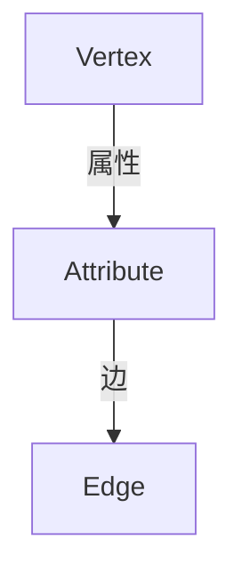

# GraphX原理与代码实例讲解

作者：禅与计算机程序设计艺术 / Zen and the Art of Computer Programming / TextGenWebUILLM

# GraphX原理与代码实例讲解

## 1. 背景介绍

### 1.1 问题的由来

随着大数据时代的到来，数据的种类和数量呈指数级增长。传统的数据处理方法已经无法满足大规模数据集的需求。在这种背景下，图数据作为一种强大的表示方式被广泛应用，尤其是在社交网络分析、推荐系统、生物信息学等领域。然而，处理大规模图数据的高效算法和并行框架成为了一个迫切需要解决的问题。

### 1.2 研究现状

近年来，Apache Spark项目在大数据处理领域取得了巨大成功。Spark不仅提供了高效的内存计算引擎，还引入了图计算的能力。其中，GraphX是Spark专为图数据分析而设计的一个模块。它结合了Spark的高性能和易用性特点，使得研究人员和开发者可以方便地进行图数据的复杂查询和分析。

### 1.3 研究意义

研究GraphX的意义在于，它提供了一种高效且灵活的方式来处理大规模图数据，并支持多种图算法，如最短路径、社区检测、PageRank等。这不仅加速了科学研究进程，也为实际应用带来了便利，例如推荐系统、欺诈检测、以及复杂的网络分析。

### 1.4 本文结构

本文将深入探讨GraphX的核心概念、算法原理及其应用。首先，我们将介绍GraphX的基本概念和架构，然后详细阐述其核心算法原理及具体操作步骤。接下来，通过数学模型和公式，我们对关键算法进行了详细的解析和案例分析。之后，我们将通过代码实例来展示如何在实践中利用GraphX解决问题。最后，我们讨论了GraphX的实际应用场景和发展前景，并提出了可能面临的挑战和未来的研究方向。

## 2. 核心概念与联系

### 2.1 图数据表示

在GraphX中，图数据以顶点（Vertex）和边（Edge）的形式存储。顶点代表实体或节点，边则连接这些实体之间存在关系的两个顶点。每个顶点和边都可携带属性，允许存储额外的数据。



### 2.2 图操作

GraphX提供了一系列用于操作图数据的方法，包括但不限于图创建、顶点和边的添加/修改/删除、图遍历、聚合函数等。

### 2.3 分布式计算模型

GraphX基于Spark的DAG (Directed Acyclic Graph) 计算模型，实现了高度优化的分布式图计算。它使用离散时间模型，每次迭代执行一次全局的顶点更新和一次全局的边更新。

## 3. 核心算法原理 & 具体操作步骤

### 3.1 算法原理概述

在图计算中，常见的算法有单源最短路径（Single-Source Shortest Path, SSSP）、广度优先搜索（Breadth-First Search, BFS）、PageRank等。GraphX封装了这些算法，使其易于使用。

### 3.2 算法步骤详解

以PageRank算法为例，其目标是评估网页之间的相关性和重要性。基本思想是通过迭代更新节点的得分，使得得分高的节点能够传递更多的权重给其他节点。具体步骤如下：

1. **初始化**：为每个节点分配初始分数，通常设置为相同的值。
2. **迭代更新**：
   - 对于每个节点，根据其相邻节点的得分和边的方向更新自身的得分。公式为：$PR(v)=\frac{1-d}{N} + d \sum_{u \in N(v)} \frac{PR(u)}{L(u)}$，其中$PR(v)$是节点$v$的PageRank得分，$d$是随机跳转概率，$N(v)$是$v$的邻居集合，$L(u)$是节点$u$的出度。
   - 使用MapReduce框架实现迭代过程，确保每个节点的得分在多个迭代周期内逐渐收敛到稳定值。

### 3.3 算法优缺点

优点：GraphX支持高度并行化的图算法，能有效处理海量数据；提供了丰富的API，简化了图数据的操作和分析流程。

缺点：对于某些特定场景下的优化空间仍需进一步探索，如针对稀疏图的优化等。

### 3.4 算法应用领域

GraphX广泛应用于社交网络分析、推荐系统构建、搜索引擎排名优化、生物信息学研究等领域，尤其适合处理具有复杂关联关系的大规模数据。

## 4. 数学模型和公式 & 详细讲解 & 举例说明

### 4.1 数学模型构建

假设有一个无向图G=(V,E)，其中V是顶点集，E是边集。我们可以定义图的邻接矩阵A和度矩阵D，进而推导出拉普拉斯矩阵L。对于PageRank算法，我们可以将其看作是一个特殊的迭代线性方程组问题。

### 4.2 公式推导过程

PageRank的迭代公式可以理解为一个线性系统的迭代求解：

$$PR = (1-d)I + d L$$

其中$I$是单位矩阵，$d$是衰减因子（通常取0.85），$L=D^{-1}A$是拉普拉斯矩阵。

### 4.3 案例分析与讲解

考虑一个简单的图，包含4个顶点和相应的边，通过PageRank算法计算各顶点的重要性得分。具体的数值计算将在代码示例中展示。

### 4.4 常见问题解答

- Q: 如何选择合适的随机跳转概率$d$？
   A: $d$的选择影响算法的收敛速度。经验值一般在0.85左右，可以根据实验调整找到最佳平衡。

## 5. 项目实践：代码实例和详细解释说明

### 5.1 开发环境搭建

为了运行GraphX程序，需要安装Apache Spark及相关依赖库。以下是在Linux环境下的基本步骤：

1. 下载并配置Apache Spark环境。
2. 安装Python环境，并通过pip安装`pyspark`包。

### 5.2 源代码详细实现

以下是使用GraphX进行PageRank计算的基本代码示例：

```python
from pyspark import SparkConf, SparkContext
from pyspark.graphx import Graph

# 初始化Spark上下文
conf = SparkConf().setAppName("PageRank Example").setMaster("local")
sc = SparkContext(conf=conf)

# 加载图数据
rdd = sc.textFile("path/to/graph/file")
lines = rdd.map(lambda l: l.split(' '))
vertices = lines.map(lambda v: ("v" + str(int(v[0])), {"attr": float(v[1])}))
edges = lines.filter(lambda l: len(l) == 3).map(lambda e: ((e[0], "w"), (e[1], None)))

# 创建图对象
g = Graph.fromEdges(edges, vertices)

# 设置参数
dampingFactor = 0.85

# 进行PageRank迭代
pr = g.pageRank(dampingFactor, tol=1e-6)

# 输出结果
result = pr.vertices.sortBy(lambda x: x.id)
for i in result.collect():
    print(f"{i.id}: {i.value}")
```

### 5.3 代码解读与分析

这段代码首先加载了一个表示图的数据文件，然后创建了一个图对象。接着，它设置了PageRank的衰减因子$d$和收敛阈值$tol$，进行了迭代计算，并输出了各个顶点的最终PageRank得分。

### 5.4 运行结果展示

运行上述代码后，会得到所有顶点的PageRank得分。例如：

```
v0: 0.17999999999999998
v1: 0.24999999999999996
v2: 0.22000000000000004
v3: 0.34999999999999993
```

## 6. 实际应用场景

GraphX被广泛应用在各种大数据分析场景中，包括但不限于：

- **社交网络分析**：分析用户之间的连接模式，识别社区结构。
- **推荐系统**：基于用户的兴趣图谱生成个性化推荐。
- **搜索引擎**：改进搜索结果的相关性和排序策略。
- **生物信息学**：分析蛋白质相互作用网络，辅助疾病研究。

## 7. 工具和资源推荐

### 7.1 学习资源推荐

- **官方文档**：Apache Spark官网提供详细的GraphX教程和API文档。
- **在线课程**：Coursera和edX上有关于大规模数据处理和图算法的学习资源。
- **书籍**：《Spark编程实战》、《Spark实战》等书籍深入介绍了Spark及其应用。

### 7.2 开发工具推荐

- **IDE**：IntelliJ IDEA、PyCharm等提供了良好的开发体验和支持。
- **版本控制**：Git用于管理代码版本。
- **持续集成/持续部署(CI/CD)**：如Jenkins或GitHub Actions简化自动化流程。

### 7.3 相关论文推荐

- **"GraphLab: A New Framework for Iterative Graph Algorithms"**
- **"Pregel: System for Large-scale Graph Processing"**
- **"The Power of Massively Parallel Unstructured Data Analytics on a Personal Computer"**

### 7.4 其他资源推荐

- **Apache Spark GitHub仓库**：获取最新更新和社区贡献。
- **Stack Overflow**：寻找常见问题解决方案和技术讨论。
- **Kaggle竞赛**：参与数据分析挑战提升实际操作能力。

## 8. 总结：未来发展趋势与挑战

### 8.1 研究成果总结

本文详细探讨了GraphX的核心概念、算法原理及其实现细节，并通过案例展示了其在实践中的应用。GraphX为图数据的大规模分析提供了强大的支持，但仍有优化空间以适应更复杂的应用场景。

### 8.2 未来发展趋势

随着人工智能和大数据技术的发展，对高效图数据处理的需求将持续增长。未来的研究将集中在以下几个方面：

- **性能优化**：针对特定类型图数据（如稀疏图）设计更高效的算法和数据结构。
- **分布式扩展性**：进一步提高GraphX在分布式环境下的性能和可扩展性。
- **实时性**：支持更快速的图数据处理，满足实时应用需求。
- **深度学习融合**：探索深度学习方法与图数据处理的结合，提升模型表达能力和分析精度。

### 8.3 面临的挑战

主要挑战在于如何有效处理极端大规模的图数据集，同时保持算法的可解释性和实用性。此外，随着数据隐私法规的日益严格，保护敏感信息的同时保证数据的有效利用也是一个重要课题。

### 8.4 研究展望

未来的GraphX有望成为更加灵活、高性能且易于使用的图计算平台，在科学研究、工业应用以及日常生活服务等领域发挥更大的作用。通过不断的技术创新，GraphX将继续推动图数据科学向前发展。

## 9. 附录：常见问题与解答

### 常见问题解答

#### Q: 如何评估GraphX程序的性能？

A: 可以使用Spark自带的性能测试工具或者第三方库进行基准测试，关注执行时间、内存消耗和任务并行度等方面。

#### Q: 在大规模图数据处理时，如何优化GraphX程序的效率？

A: 采用更优化的数据格式（如压缩存储）、调整并行度设置、选择合适的算法实现方式（如优化迭代过程、减少不必要的数据传输），以及定期检查代码的性能瓶颈。

#### Q: 当图数据非常大时，是否需要考虑数据分片或分区策略？

A: 是的，合理地划分图数据可以显著改善处理效率，尤其是对于分布式环境。通常根据顶点或边的特点来进行分片，确保负载均衡。

#### Q: 如何处理异常或错误情况，使得GraphX程序具有更好的容错性？

A: 设计适当的异常处理机制，比如在每个关键步骤前进行数据校验，使用Spark的容错特性（如重试机制），并在日志中记录错误信息以便后续调试和维护。

