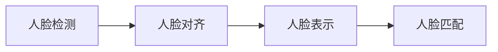

# Python机器学习实战：人脸识别技术的实现和挑战

作者：禅与计算机程序设计艺术 / Zen and the Art of Computer Programming 

## 1. 背景介绍

### 1.1 问题的由来
人脸识别是计算机视觉和模式识别领域中的一个重要研究方向。随着人工智能技术的快速发展,人脸识别在安防、支付、人机交互等诸多领域得到了广泛应用。然而,由于人脸图像的高维特性以及光照、姿态、表情等因素的影响,实现高精度、鲁棒性强的人脸识别系统仍面临诸多挑战。

### 1.2 研究现状
目前,人脸识别技术主要包括基于几何特征、基于模板匹配、基于统计学习等方法。传统方法如 PCA、LDA、Gabor 等在一定条件下取得了不错的效果,但泛化能力有限。近年来,深度学习方法如卷积神经网络(CNN)在人脸识别任务上表现出色,代表工作有 DeepFace、DeepID、FaceNet 等,大幅提升了人脸识别的性能。

### 1.3 研究意义
人脸识别技术在身份认证、人脸聚类、人脸属性分析等方面有着广阔的应用前景。研究高效、准确的人脸识别算法,对推动人工智能在相关领域的落地应用具有重要意义。同时,探索人脸识别面临的问题与挑战,也有助于深化对人脸识别本质的认识,促进人工智能基础理论研究。

### 1.4 本文结构
本文将围绕 Python 机器学习在人脸识别中的实践展开论述。第2部分介绍人脸识别的核心概念;第3部分阐述经典算法原理;第4部分建立数学模型并推导公式;第5部分给出代码实例;第6部分分析实际应用场景;第7部分推荐相关工具资源;第8部分总结全文并展望未来。

## 2. 核心概念与联系
人脸识别涉及多个关键概念:
- 人脸检测(Face Detection):在图像或视频中定位人脸区域的过程。常用方法有 Haar 特征+AdaBoost 分类器、HOG 特征+SVM 分类器、MTCNN 等。
- 人脸对齐(Face Alignment):将检测到的人脸归一化到标准姿态和尺寸,为后续特征提取做准备。常用方法有 AAM、SDM 等。
- 人脸表示(Face Representation):提取人脸的判别特征,用于刻画身份信息。可分为手工设计特征和深度学习特征,代表方法有 LBP、Gabor、DeepID 等。
- 人脸匹配(Face Matching):比较两张人脸的相似度,用于验证或识别身份。基于特征的匹配方法有欧氏距离、余弦相似度等,基于模型的方法有 SVM、Joint Bayes 等。

这些概念环环相扣,构成了人脸识别的基本框架。下图给出了各模块之间的联系:



## 3. 核心算法原理 & 具体操作步骤

### 3.1 算法原理概述
本节重点介绍经典的 PCA 特征脸算法。该算法利用主成分分析,将高维人脸图像映射到低维子空间,提取具有判别力的特征用于人脸识别。PCA 假设人脸图像可由少数几个主成分线性表示,通过特征脸(EigenFace)降维,达到数据压缩和噪声去除的效果。

### 3.2 算法步骤详解
PCA 特征脸算法主要分为训练和测试两个阶段,具体步骤如下:

1. 训练阶段
   - 数据预处理:收集 N 张人脸图像,统一尺寸为 m×n,转为 1×(mn) 的行向量形式并归一化。
   - 计算均值脸:对 N 个训练样本求均值向量 $\mu$。
   - 计算协方差矩阵:$S=\frac{1}{N}\sum_{i=1}^N(x_i-\mu)(x_i-\mu)^T$,其中 $x_i$ 为第 i 个样本向量。
   - 特征值分解:对协方差矩阵 S 进行特征值分解,得到特征值 $\lambda_i$ 和特征向量 $v_i$。
   - 选取主成分:按特征值从大到小排序,取前 K 个特征向量构成投影矩阵 $W=[v_1,v_2,...,v_K]$。
   - 投影到特征子空间:$y_i=W^T(x_i-\mu)$,得到样本在特征空间的表示 $y_i$。

2. 测试阶段 
   - 预处理待识别人脸图像 $x$,计算 $y=W^T(x-\mu)$。
   - 计算 $y$ 与各类样本 $y_i$ 的距离 $d_i$,取距离最小的类别作为识别结果。

### 3.3 算法优缺点
PCA 特征脸的优点是思想简单,计算高效,对光照变化有一定容忍度。但其缺点也较为明显:
- 采用欧氏距离度量,对姿态、表情变化敏感。
- 特征提取和分类是独立的,没有针对判别任务优化。
- 特征表示能力有限,难以刻画人脸的精细特征。

### 3.4 算法应用领域
PCA 特征脸曾被广泛应用于各类人脸识别场景,如门禁系统、刑侦破案等。但随着识别精度要求的提高,目前已逐渐被深度学习算法取代。PCA 更多被用于人脸识别的预处理阶段,如降维、噪声去除等。

## 4. 数学模型和公式 & 详细讲解 & 举例说明

### 4.1 数学模型构建
设训练集有 N 张人脸图像 ${x_1,x_2,...,x_N}$,每张图像表示为 m×n 的像素矩阵,按行展开可得 1×(mn) 的列向量 $x_i$。记 $X=[x_1,x_2,...,x_N]$ 为 mn×N 维样本矩阵。PCA 的目标是找到一个投影矩阵 W,将原始数据映射到低维空间,用少数几个主成分表示原信号。数学上可表示为优化问题:

$$
\underset{W}{max} \quad tr(W^TXDX^TW) \
s.t. \quad W^TW=I
$$

其中 D 为对角阵,对角线元素为样本权重(一般取 $\frac{1}{N}$)。约束条件 $W^TW=I$ 确保投影方向正交。

### 4.2 公式推导过程
利用拉格朗日乘子法,上述优化问题可转化为:

$$
J(W)=tr(W^TXDX^TW)+\lambda(I-W^TW)
$$

对 W 求导并令其为0,得:

$$
XDX^TW=\lambda W
$$

可见,W 的列向量 $w_i$ 是协方差矩阵 $S=XDX^T$ 的特征向量,对应特征值为 $\lambda_i$。根据拉格朗日乘子法,最优的投影矩阵 W 由 S 最大的 K 个特征值对应的特征向量构成。

### 4.3 案例分析与讲解
以 Yale 人脸数据集为例,其包含 15 个人共 165 张人脸图像,每人 11 张,在光照、表情、姿态等方面有所变化。图像大小为 100×100。

首先对图像进行预处理,转为 1×10000 的行向量形式,并进行去均值归一化。然后计算协方差矩阵 S,对其进行特征值分解。取前 K 个最大特征值对应的特征向量构成投影矩阵 W。这里取 K=50,即用 50 维特征表示原始人脸图像。

在测试阶段,对待识别人脸图像 x 进行预处理,投影到特征空间得到 $y=W^T(x-\mu)$。然后计算 y 与训练集各样本的欧氏距离,取距离最小的身份作为识别结果。实验表明,PCA 在 Yale 数据集上的识别率可达到 80% 以上。

### 4.4 常见问题解答
Q: 主成分的个数 K 如何选取?
A: K 的选取需要权衡降维效果和保留信息量。一般根据识别精度和计算复杂度来确定,常用的准则有累计方差贡献率、BIC 等。

Q: 为什么要对人脸图像进行归一化?
A: 归一化可以消除不同图像之间的亮度、对比度差异,使得 PCA 提取的特征对光照变化更加鲁棒。常见的归一化方法有去均值、标准化等。

Q: 除了欧氏距离,是否可以使用其他相似度度量方法?
A: 可以,常见的相似度度量还有马氏距离、余弦相似度等。不同的度量方法对应着不同的数据分布假设,需要根据实际情况选择。

## 5. 项目实践：代码实例和详细解释说明

### 5.1 开发环境搭建
本项目使用 Python 3.7 和相关机器学习库实现,推荐的开发环境配置如下:
- 操作系统:Windows 10 / Ubuntu 18.04 
- Python:3.7
- 深度学习框架:TensorFlow 2.x
- 机器学习库:Scikit-learn 0.22
- 数值计算库:NumPy 1.18
- 图像处理库:OpenCV 4.2

可使用 Anaconda 创建虚拟环境,安装上述依赖库。命令如下:

```bash
conda create -n face python=3.7
conda activate face
pip install tensorflow scikit-learn numpy opencv-python
```

### 5.2 源代码详细实现
下面给出了 PCA 特征脸算法的 Python 实现,主要分为训练和测试两部分:

```python
import numpy as np
from sklearn.datasets import fetch_olivetti_faces
from sklearn.model_selection import train_test_split

class EigenFace:
    def __init__(self, n_components):
        self.n_components = n_components
        self.mean = None
        self.eigenvectors = None
    
    def fit(self, X):
        # 计算均值脸
        self.mean = X.mean(axis=0)
        X_centered = X - self.mean
        
        # 计算协方差矩阵的特征值和特征向量
        covariance = np.dot(X_centered.T, X_centered) / X_centered.shape[0]
        eigenvalues, eigenvectors = np.linalg.eigh(covariance)
        
        # 取前 n_components 个最大特征值对应的特征向量
        idx = np.argsort(-eigenvalues)[:self.n_components]
        self.eigenvectors = eigenvectors[:, idx]
    
    def transform(self, X):
        X_centered = X - self.mean
        return np.dot(X_centered, self.eigenvectors)
    
    def predict(self, X):
        X_transformed = self.transform(X)
        dists = np.linalg.norm(X_transformed - self.transform(self.mean), axis=1)
        return np.argmin(dists)

# 加载 Olivetti 人脸数据集
data = fetch_olivetti_faces(shuffle=True, random_state=42)
X = data.data / 255.0
y = data.target

# 划分训练集和测试集
X_train, X_test, y_train, y_test = train_test_split(X, y, test_size=0.2, random_state=42)

# 训练 PCA 特征脸模型
model = EigenFace(n_components=50)
model.fit(X_train)

# 测试模型性能
accuracy = np.mean(y_test == [model.predict(x) for x in X_test])
print(f"Test accuracy: {accuracy:.2f}")
```

### 5.3 代码解读与分析
上述代码主要分为以下几个部分:

1. 定义 EigenFace 类,初始化时指定降维后的特征维度 n_components。
2. fit 方法对训练数据进行 PCA 拟合,具体步骤包括:
   - 计算均值脸,得到 X_centered。
   - 计算 X_centered 的协方差矩阵。
   - 对协方差矩阵进行特征值分解,取前 n_components 个最大特征值对应的特征向量构成投影矩阵。
3. transform 方法将输入数据投影到