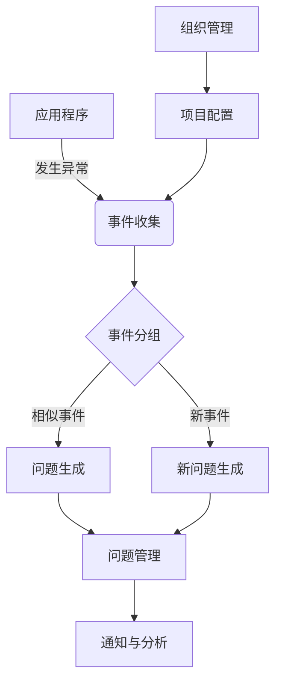

# Sentry原理与代码实例讲解

## 1. 背景介绍

### 1.1 问题的由来

在现代软件开发过程中,应用程序的异常监控和错误跟踪是确保系统稳定性和用户体验的关键环节。传统的日志记录方式往往无法有效捕获所有异常情况,且难以及时发现和定位问题根源。因此,需要一种更加高效、全面的应用程序监控解决方案,来满足日益复杂的软件系统需求。

### 1.2 研究现状  

近年来,开源的应用程序监控平台 Sentry 凭借其强大的异常捕获、报告和分析能力,在业界获得了广泛的关注和应用。Sentry 不仅支持多种编程语言和框架,还提供了完整的错误追踪工具链,可以实时监控应用程序的运行状态,快速定位和诊断问题根源。

### 1.3 研究意义

深入探讨 Sentry 的工作原理和实现细节,有助于开发人员更好地理解和运用这一强大的应用程序监控工具,提高软件系统的可靠性和用户体验。同时,研究 Sentry 的设计思路和技术实现,也可以为其他监控系统的开发提供借鉴和参考。

### 1.4 本文结构  

本文将从以下几个方面全面介绍 Sentry:

1. 核心概念与联系
2. 核心算法原理与具体操作步骤
3. 数学模型和公式详细讲解与案例分析  
4. 项目实践:代码实例和详细解释
5. 实际应用场景
6. 工具和资源推荐
7. 总结:未来发展趋势与挑战
8. 附录:常见问题与解答

## 2. 核心概念与联系

Sentry 作为一个完整的应用程序监控平台,涉及了多个核心概念,它们之间存在紧密的联系和依赖关系。

### 2.1 事件(Event)

事件是 Sentry 中最基本的概念,代表了应用程序中发生的一个异常或错误。每个事件都包含了异常的详细信息,如错误类型、堆栈跟踪、发生时间、affected user 等。Sentry 会自动收集和处理这些事件数据。

### 2.2 问题(Issue)

问题是对相似事件的逻辑分组,它们具有相同的根本原因。Sentry 会自动对收集到的事件进行分组和去重,从而生成对应的问题。这样可以避免重复报警,并集中精力解决根本问题。

### 2.3 项目(Project)

项目是 Sentry 用于组织和管理应用程序的逻辑单元。每个项目都对应一个独立的代码库或服务,拥有自己的事件流和问题管理。这种分组方式有助于更好地隔离和诊断不同应用的错误。

### 2.4 组织(Organization)

组织是 Sentry 中最高级别的概念,它包含了多个项目。组织级别提供了访问控制、计费管理等功能,方便对整个错误监控系统进行集中式管理和配置。

### 2.5 核心流程

上述核心概念之间的关系和工作流程如下所示:

## 3. 核心算法原理与具体操作步骤  

### 3.1 算法原理概述

Sentry 的核心算法主要包括以下几个部分:

1. **事件收集**: 通过 SDK 将应用程序中的异常信息实时上报到 Sentry 服务器
2. **事件分组**: 对收集到的事件进行分组,识别出相似的事件并合并成问题
3. **问题优先级评估**: 根据事件发生频率、影响用户数等因素,计算问题的优先级和严重程度
4. **通知与分析**: 将高优先级的问题通过各种渠道(如邮件、webhooks 等)通知相关人员,并提供完整的事件数据和环境上下文信息,方便问题分析和修复

### 3.2 算法步骤详解

#### 3.2.1 事件收集

Sentry 提供了多种语言和框架的 SDK,允许开发人员在应用程序代码中集成错误报告功能。当应用程序发生未捕获的异常时,SDK 会自动收集相关信息(如错误类型、堆栈跟踪、请求数据等),并将这些数据作为事件发送到 Sentry 服务器。

事件收集过程如下:

1. 应用程序集成 Sentry SDK
2. 应用程序发生未捕获异常,触发 SDK 的错误处理程序
3. SDK 收集异常信息,构建事件数据
4. SDK 通过 HTTP API 将事件数据发送到 Sentry 服务器

#### 3.2.2 事件分组

Sentry 服务器在接收到事件数据后,会根据一定的规则对事件进行分组,将相似的事件归并为同一个问题。这样可以避免重复报警,并集中精力解决根本问题。

事件分组算法主要分为以下几个步骤:

1. **特征提取**: 从事件数据中提取出用于分组的特征,如错误类型、错误消息、发生位置等
2. **指纹计算**: 根据提取的特征,计算出事件的唯一标识符(fingerprint)
3. **分组匹配**: 将新事件的指纹与已有问题进行匹配,如果匹配成功,则将事件归并到对应问题;否则创建新问题
4. **机器学习优化**: Sentry 使用机器学习算法持续优化分组策略,提高分组准确性

#### 3.2.3 问题优先级评估

对于已经生成的问题,Sentry 会根据多个因素计算其优先级和严重程度,从而确定通知策略和处理顺序。

评估考虑的主要因素包括:

1. **事件发生频率**: 发生频率越高,问题越紧迫
2. **影响用户数**: 影响用户数越多,问题影响范围越大
3. **异常级别**: 如 Fatal 异常会被赋予更高的优先级
4. **发生环境**: 生产环境问题优先级更高
5. **自定义规则**: 用户可以根据需求定制优先级评估规则

根据这些因素的综合评分,Sentry 会对问题进行优先级排序,并采取相应的通知和处理措施。

### 3.3 算法优缺点

#### 优点

1. **全自动化**: 整个异常监控流程自动化,无需人工干预
2. **高效分组**: 准确地将相似事件分组,避免重复报警
3. **高扩展性**: 支持多种语言、框架和环境的无缝集成  
4. **可定制性**: 允许用户自定义分组、通知等规则
5. **完整数据**: 提供详细的事件数据和环境上下文信息

#### 缺点  

1. **性能开销**: 异常监控功能会增加一定的性能开销
2. **隐私风险**: 事件数据可能包含敏感信息,需要注意隐私保护
3. **学习成本**: 集成和配置 Sentry 存在一定的学习曲线
4. **依赖中心化服务**: 完全依赖 Sentry 的中心化服务可用性

### 3.4 算法应用领域

Sentry 的异常监控和问题分组算法可以广泛应用于各种软件系统中,包括但不限于:

- Web 应用程序
- 移动应用程序
- 服务器端应用程序
- 分布式系统
- 物联网设备
- 游戏开发

只要是需要确保系统稳定性和用户体验的场景,都可以考虑使用 Sentry 来提高异常监控的效率和质量。

## 4. 数学模型和公式详细讲解与举例说明

### 4.1 数学模型构建

在 Sentry 的事件分组算法中,需要计算事件之间的相似度,并根据相似度将事件归并到同一个问题中。为此,我们可以构建一个基于向量空间模型(VSM)的数学模型。

假设有一个事件集合 $E = \{e_1, e_2, \ldots, e_n\}$,每个事件 $e_i$ 可以用一个特征向量 $\vec{v_i}$ 来表示,其中特征可以是错误消息、堆栈跟踪等文本信息。我们将文本特征映射到一个 $m$ 维的向量空间 $V$,那么事件 $e_i$ 对应的特征向量为:

$$\vec{v_i} = (w_{i1}, w_{i2}, \ldots, w_{im})$$

其中 $w_{ij}$ 表示第 $j$ 个特征在事件 $e_i$ 中的权重。

#### 4.1.1 特征提取

特征提取的目标是将事件中的文本信息转换为数值向量。常用的特征提取方法包括:

1. **词袋模型(Bag-of-Words)**: 将文本视为词的多重集合,每个特征对应一个词,权重为该词在文本中出现的频率
2. **TF-IDF**: 在词袋模型的基础上,使用词频-逆文档频率(TF-IDF)作为特征权重,降低常见词的影响
3. **Word Embedding**: 使用预训练的词向量模型(如 Word2Vec、GloVe 等)将词映射到低维连续向量空间

#### 4.1.2 相似度计算

有了事件的特征向量表示,我们就可以计算任意两个事件之间的相似度。常用的相似度度量方法包括:

1. **余弦相似度**:
   $$\text{sim}_{\cos}(\vec{v_i}, \vec{v_j}) = \frac{\vec{v_i} \cdot \vec{v_j}}{||\vec{v_i}|| \times ||\vec{v_j}||}$$

2. **欧几里得距离**:
   $$\text{dist}_{\text{euc}}(\vec{v_i}, \vec{v_j}) = \sqrt{\sum_{k=1}^{m}(v_{ik} - v_{jk})^2}$$

3. **杰卡德相似系数**:
   $$\text{sim}_{\text{jac}}(\vec{v_i}, \vec{v_j}) = \frac{\sum_{k=1}^{m} \min(v_{ik}, v_{jk})}{\sum_{k=1}^{m} \max(v_{ik}, v_{jk})}$$

余弦相似度和杰卡德相似系数的取值范围为 $[0, 1]$,值越大表示两个向量越相似;欧几里得距离的取值范围为 $[0, +\infty)$,值越小表示两个向量越相似。

### 4.2 公式推导过程

#### 4.2.1 基于 TF-IDF 的余弦相似度

我们以 TF-IDF 加权的余弦相似度为例,推导事件相似度的计算公式。

首先定义词 $t$ 在事件 $e_i$ 中的词频(Term Frequency)为:

$$\text{tf}_{it} = \frac{n_{it}}{\sum_{k} n_{ik}}$$

其中 $n_{it}$ 表示词 $t$ 在事件 $e_i$ 中出现的次数。

再定义词 $t$ 的逆文档频率(Inverse Document Frequency)为:

$$\text{idf}_t = \log \frac{|E|}{|\{e_i \in E: t \in e_i\}|}$$

其中分母表示包含词 $t$ 的事件数量。

将 TF 和 IDF 相乘,我们可以得到词 $t$ 在事件 $e_i$ 中的 TF-IDF 权重:

$$w_{it} = \text{tf}_{it} \times \text{idf}_t$$

假设事件 $e_i$ 和 $e_j$ 分别对应的 TF-IDF 加权特征向量为 $\vec{v_i}$ 和 $\vec{v_j}$,那么它们之间的余弦相似度为:

$$\begin{aligned}
\text{sim}_{\cos}(\vec{v_i}, \vec{v_j}) &= \frac{\vec{v_i} \cdot \vec{v_j}}{||\vec{v_i}|| \times ||\vec{v_j}||}\
&= \frac{\sum_{t} w_{it} \times w_{jt}}{\sqrt{\sum_{t} w_{it}^2} \