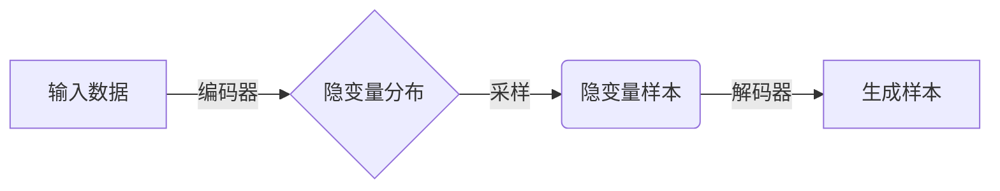

# Variational Autoencoders (VAE)原理与代码实例讲解

## 1. 背景介绍

### 1.1 问题的由来

在机器学习和深度学习领域中,自编码器(Autoencoder)是一种无监督学习算法,旨在学习高维数据的低维表示。传统的自编码器存在一些缺陷,例如编码向量的分布无法捕捉数据的真实分布,并且难以生成新的样本。为了解决这些问题,Variational Autoencoder(VAE)应运而生。

### 1.2 研究现状

VAE是一种基于变分推理(Variational Inference)的生成模型,结合了深度学习和概率模型的优点。它能够学习数据的隐含分布,并从该分布中生成新的样本。VAE在图像生成、语音合成、机器翻译等领域展现出巨大潜力。目前,VAE及其变体在学术界和工业界都受到广泛关注和研究。

### 1.3 研究意义

VAE的出现为解决高维数据的生成问题提供了新的思路。它不仅能够学习数据的低维表示,还能够从该表示中生成新的样本,为数据增强、数据去噪、半监督学习等任务提供了强有力的工具。此外,VAE的变分推理思想也为其他机器学习模型提供了新的理论基础。

### 1.4 本文结构

本文将从以下几个方面全面介绍VAE:

1. 核心概念与联系
2. 核心算法原理与具体操作步骤
3. 数学模型和公式详细讲解与案例分析
4. 项目实践:代码实例和详细解释
5. 实际应用场景
6. 工具和资源推荐
7. 总结:未来发展趋势与挑战
8. 附录:常见问题与解答

## 2. 核心概念与联系

VAE融合了自编码器(Autoencoder)、生成模型(Generative Model)和变分推理(Variational Inference)等概念。下面将介绍这些核心概念及其相互关系。

### 2.1 自编码器(Autoencoder)

自编码器是一种无监督学习算法,通过神经网络学习数据的低维表示(编码)和从低维表示重构原始数据(解码)的过程。传统自编码器的缺陷是编码向量的分布无法捕捉数据的真实分布,并且难以生成新的样本。

### 2.2 生成模型(Generative Model)

生成模型是一类通过学习数据的概率分布,从而能够生成新样本的模型。常见的生成模型包括高斯混合模型(GMM)、隐马尔可夫模型(HMM)、受限玻尔兹曼机(RBM)等。生成模型的目标是最大化数据的似然函数或后验概率。

### 2.3 变分推理(Variational Inference)

变分推理是一种近似计算复杂概率分布的有效方法。它通过优化一个可以高效计算和优化的变分分布,来近似复杂的目标分布。变分推理在贝叶斯推理、深度学习等领域有广泛应用。

### 2.4 VAE的核心思想

VAE将自编码器的框架与变分推理和生成模型的思想结合,学习数据的隐含分布,并从该分布中生成新的样本。具体来说,VAE的编码器将输入数据编码为隐变量的分布,而解码器则从该分布中采样,生成新的样本。通过最小化重构误差和最大化隐变量分布的似然函数,VAE能够学习数据的真实分布。

## 3. 核心算法原理与具体操作步骤

### 3.1 算法原理概述

VAE的核心思想是将输入数据 $\boldsymbol{x}$ 映射到一个隐变量 $\boldsymbol{z}$ 的概率分布 $q_{\phi}(\boldsymbol{z}|\boldsymbol{x})$ 上,然后从该分布中采样隐变量 $\boldsymbol{z}$,并通过解码器网络 $p_{\theta}(\boldsymbol{x}|\boldsymbol{z})$ 重构输入数据或生成新的样本。

VAE的目标是最大化输入数据 $\boldsymbol{x}$ 的边际对数似然函数:

$$
\log p_{\theta}(\boldsymbol{x}) = \mathbb{E}_{q_{\phi}(\boldsymbol{z}|\boldsymbol{x})}\left[\log \frac{p_{\theta}(\boldsymbol{x}, \boldsymbol{z})}{q_{\phi}(\boldsymbol{z}|\boldsymbol{x})}\right] + D_{\mathrm{KL}}\left(q_{\phi}(\boldsymbol{z}|\boldsymbol{x}) \| p_{\theta}(\boldsymbol{z})\right)
$$

其中 $D_{\mathrm{KL}}$ 表示KL散度。由于直接优化上式难以计算,VAE采用变分下界(Evidence Lower Bound, ELBO)作为优化目标:

$$
\mathcal{L}(\theta, \phi; \boldsymbol{x}) = \mathbb{E}_{q_{\phi}(\boldsymbol{z}|\boldsymbol{x})}\left[\log p_{\theta}(\boldsymbol{x}|\boldsymbol{z})\right] - D_{\mathrm{KL}}\left(q_{\phi}(\boldsymbol{z}|\boldsymbol{x}) \| p_{\theta}(\boldsymbol{z})\right)
$$

第一项是重构项,表示重构输入数据的精度;第二项是正则项,约束编码分布 $q_{\phi}(\boldsymbol{z}|\boldsymbol{x})$ 与先验分布 $p_{\theta}(\boldsymbol{z})$ 的距离。通过最大化 ELBO,VAE能够学习到输入数据的隐含分布。

### 3.2 算法步骤详解

1. **定义网络结构**

   VAE由编码器网络 $q_{\phi}(\boldsymbol{z}|\boldsymbol{x})$ 和解码器网络 $p_{\theta}(\boldsymbol{x}|\boldsymbol{z})$ 组成。编码器网络将输入数据 $\boldsymbol{x}$ 映射到隐变量 $\boldsymbol{z}$ 的均值 $\boldsymbol{\mu}$ 和标准差 $\boldsymbol{\sigma}$,从而定义了隐变量的概率分布 $q_{\phi}(\boldsymbol{z}|\boldsymbol{x})$。解码器网络则从隐变量 $\boldsymbol{z}$ 的分布中采样,并生成重构数据或新样本。

2. **重参数技巧(Reparameterization Trick)**

   由于隐变量 $\boldsymbol{z}$ 是从概率分布中采样得到的,为了使得网络可微,VAE采用了重参数技巧。具体来说,从标准正态分布 $\mathcal{N}(0, 1)$ 中采样一个随机向量 $\boldsymbol{\epsilon}$,然后通过变换 $\boldsymbol{z} = \boldsymbol{\mu} + \boldsymbol{\sigma} \odot \boldsymbol{\epsilon}$ 得到隐变量 $\boldsymbol{z}$,其中 $\odot$ 表示元素乘积。这种方式保证了隐变量 $\boldsymbol{z}$ 的采样过程可微,从而使得整个网络可以通过反向传播算法进行端到端的训练。

3. **损失函数与优化**

   VAE的损失函数是 ELBO 的负值:

   $$
   \mathcal{L}(\theta, \phi; \boldsymbol{x}) = -\mathbb{E}_{q_{\phi}(\boldsymbol{z}|\boldsymbol{x})}\left[\log p_{\theta}(\boldsymbol{x}|\boldsymbol{z})\right] + D_{\mathrm{KL}}\left(q_{\phi}(\boldsymbol{z}|\boldsymbol{x}) \| p_{\theta}(\boldsymbol{z})\right)
   $$

   其中第一项是重构损失,通常采用均方误差(MSE)或交叉熵损失(Cross Entropy)等;第二项是KL散度正则项,用于约束编码分布 $q_{\phi}(\boldsymbol{z}|\boldsymbol{x})$ 与先验分布 $p_{\theta}(\boldsymbol{z})$ 的距离,通常采用标准正态分布 $\mathcal{N}(0, 1)$ 作为先验分布。通过最小化损失函数,VAE可以同时优化重构精度和编码分布。

4. **生成新样本**

   在训练完成后,VAE可以从先验分布 $p_{\theta}(\boldsymbol{z})$ 中采样隐变量 $\boldsymbol{z}$,然后通过解码器网络 $p_{\theta}(\boldsymbol{x}|\boldsymbol{z})$ 生成新的样本。

### 3.3 算法优缺点

**优点:**

- 能够学习数据的隐含分布,并从该分布中生成新的样本。
- 编码向量具有很好的连续性和平滑性,适合于数据插值和数据增强等任务。
- 变分推理思想为其他生成模型提供了新的理论基础。
- 具有较强的生成能力,可以应用于图像生成、语音合成、机器翻译等领域。

**缺点:**

- 生成的样本质量可能不如GAN等其他生成模型。
- 存在后验坍缩(Posterior Collapse)问题,即编码向量倾向于忽略部分输入信息。
- KL散度项可能会导致训练不稳定,需要采取一些技巧(如KL Annealing)来缓解。
- 对于高维数据,VAE可能难以捕捉所有的细节信息。

### 3.4 算法应用领域

VAE及其变体在以下领域展现出广泛的应用前景:

- **图像生成**: VAE可以学习图像的隐含分布,并生成新的图像样本。
- **数据增强**: 通过对现有数据进行编码和解码,可以生成新的数据用于增强训练集。
- **半监督学习**: VAE可以利用少量标注数据和大量未标注数据进行半监督学习。
- **数据去噪**: VAE能够从噪声数据中学习潜在的清晰表示,从而实现数据去噪。
- **机器翻译**: VAE可以用于构建多语种到共享语义空间的映射,为机器翻译提供新的解决方案。
- **语音合成**: VAE能够学习语音的隐含分布,并生成新的语音样本。

## 4. 数学模型和公式详细讲解与举例说明

### 4.1 数学模型构建

VAE的数学模型可以表示为:

$$
p_{\theta}(\boldsymbol{x}, \boldsymbol{z}) = p_{\theta}(\boldsymbol{x}|\boldsymbol{z})p_{\theta}(\boldsymbol{z})
$$

其中 $p_{\theta}(\boldsymbol{x}|\boldsymbol{z})$ 是解码器网络,用于从隐变量 $\boldsymbol{z}$ 生成数据 $\boldsymbol{x}$;$p_{\theta}(\boldsymbol{z})$ 是隐变量的先验分布,通常采用标准正态分布 $\mathcal{N}(0, 1)$。

编码器网络 $q_{\phi}(\boldsymbol{z}|\boldsymbol{x})$ 将输入数据 $\boldsymbol{x}$ 映射到隐变量 $\boldsymbol{z}$ 的概率分布上,通常采用均值 $\boldsymbol{\mu}$ 和标准差 $\boldsymbol{\sigma}$ 来参数化一个对数高斯分布:

$$
q_{\phi}(\boldsymbol{z}|\boldsymbol{x}) = \mathcal{N}(\boldsymbol{z}; \boldsymbol{\mu}(\boldsymbol{x}), \boldsymbol{\sigma}^2(\boldsymbol{x}))
$$

### 4.2 公式推导过程

VAE的目标是最大化输入数据 $\boldsymbol{x}$ 的边际对数似然函数 $\log p_{\theta}(\boldsymbol{x})$。根据概率论,我们有:

$$
\begin{aligned}
\log p_{\theta}(\boldsymbol{x}) &= \log \int p_{\theta}(\boldsymbol{x}, \boldsymbol{z}) \mathrm{d}\boldsymbol{z} \
&= \log \int \frac{q_{\phi}(\boldsymbol{z}|\bol