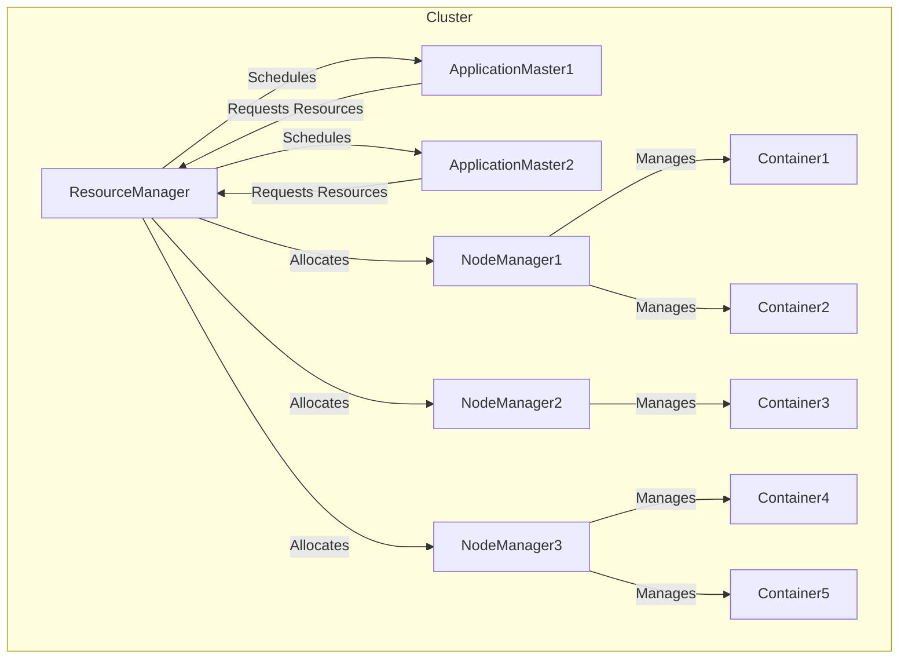

# Yarn原理与代码实例讲解

## 1. 背景介绍

### 1.1 问题的由来

在大数据时代,分布式计算框架的需求与日俱增。Apache Hadoop作为一个开源的分布式系统基础架构,已经成为大数据处理的事实标准。然而,Hadoop的资源管理和任务调度存在诸多不足,例如资源利用率低下、应用程序之间资源竞争激烈等。为了解决这些问题,Apache Yarn(Yet Another Resource Negotiator)应运而生。

### 1.2 研究现状

Yarn作为Apache Hadoop的资源管理和任务调度框架,自2012年发布以来,已经成为大数据生态系统中不可或缺的重要组件。越来越多的公司和组织采用Yarn来管理和调度他们的大数据应用程序。同时,学术界和工业界也在不断探索Yarn的新特性和优化方向,以提高其性能和可扩展性。

### 1.3 研究意义

深入理解Yarn的原理和实现细节,对于开发人员、架构师和研究人员来说都具有重要意义。它不仅有助于更好地利用Yarn的功能,还可以帮助我们发现其中的不足,并提出改进方案。此外,Yarn的设计思想和技术细节也可以为其他分布式系统的设计和实现提供借鉴。

### 1.4 本文结构

本文将从以下几个方面全面介绍Yarn:

1. 核心概念与联系
2. 核心算法原理与具体操作步骤
3. 数学模型和公式详细讲解与案例分析
4. 项目实践:代码实例和详细解释说明
5. 实际应用场景
6. 工具和资源推荐
7. 总结:未来发展趋势与挑战
8. 附录:常见问题与解答

## 2. 核心概念与联系

在深入探讨Yarn的细节之前,我们需要先了解一些核心概念及它们之间的联系。

### 2.1 ResourceManager(RM)

ResourceManager是Yarn的主要协调器,负责整个系统的资源管理和任务调度。它主要包括以下几个重要组件:

#### 2.1.1 Scheduler

Scheduler是RM中最核心的组件,负责根据特定的调度策略(如FIFO、公平调度等)为各个应用程序分配资源。

#### 2.1.2 ApplicationsManager

ApplicationsManager负责管理整个系统中所有运行的应用程序,包括接收新的应用程序提交、监控应用程序状态等。

#### 2.1.3 NodeManager监控与恢复

RM会定期与集群中的所有NodeManager进行通信,以监控它们的健康状况和资源使用情况。如果发现某个NodeManager出现故障,RM会自动在其他节点上重新启动该NodeManager上运行的容器。

### 2.2 NodeManager(NM)

NodeManager运行在每个Worker节点上,负责管理该节点上的资源使用情况。它的主要职责包括:

#### 2.2.1 容器监控与管理

NM会启动和监控该节点上的所有容器,并定期向RM汇报容器的资源使用情况。

#### 2.2.2 日志管理

NM负责收集和管理该节点上所有容器的日志文件。

#### 2.2.3 健康监测

NM会定期检查该节点的健康状态,并将信息上报给RM。如果节点出现故障,RM可以将该节点上的容器迁移到其他节点。

### 2.3 ApplicationMaster(AM)

每个应用程序在Yarn上运行时,都需要启动一个ApplicationMaster进程。AM的主要职责包括:

#### 2.3.1 资源请求与分配

AM根据应用程序的需求向RM申请资源,并将分配到的资源用于启动相应的Task。

#### 2.3.2 Task监控与容错

AM会监控所有Task的运行状态,并在Task失败时进行重新调度。

#### 2.3.4 应用程序生命周期管理

AM负责管理整个应用程序的生命周期,包括启动、运行和结束等阶段。

### 2.4 Container

Container是Yarn中表示资源的基本单位。每个Container都包含一定数量的资源(如CPU、内存等),并用于运行特定的Task。Container可以在不同的节点之间迁移,以实现资源的动态分配和利用。

### 2.5 核心概念关系图

为了更好地理解上述核心概念之间的关系,我们可以用下面的流程图进行直观展示:

## 3. 核心算法原理与具体操作步骤

### 3.1 算法原理概述

Yarn的核心算法主要包括资源管理和任务调度两个方面。

**资源管理**的主要目标是高效利用集群资源,避免资源浪费。Yarn采用了动态的、基于容器的资源分配策略。当某个应用程序需要资源时,它的AM会向RM申请一定数量的容器。RM根据当前集群的资源使用情况,以及所采用的调度策略,决定是否分配容器给该应用程序。一旦分配成功,该应用程序就可以在容器中启动相应的Task。

**任务调度**的主要目标是根据特定的策略,为各个应用程序合理分配资源,实现整体的公平性、高吞吐量等目标。Yarn提供了多种调度策略可供选择,例如先进先出(FIFO)、容量调度器(Capacity Scheduler)和公平调度器(Fair Scheduler)等。用户可以根据自己的需求选择合适的调度器。

### 3.2 算法步骤详解

Yarn的资源管理和任务调度算法可以概括为以下几个主要步骤:

#### 3.2.1 应用程序提交

用户向Yarn提交一个新的应用程序,该应用程序的AM进程会被启动。

#### 3.2.2 资源请求

AM根据应用程序的需求向RM申请一定数量的资源(容器)。

#### 3.2.3 资源分配

RM根据当前集群的资源使用情况,以及所采用的调度策略,决定是否分配容器给该应用程序。如果资源足够,RM会将容器分配给相应的NM。

#### 3.2.4 Task启动

一旦AM获得了容器资源,它就可以在容器中启动相应的Task。

#### 3.2.5 Task执行与监控

Task在容器中执行,AM会持续监控所有Task的运行状态。如果某个Task失败,AM会自动重新调度该Task。

#### 3.2.6 应用程序完成

当所有Task都成功执行完毕后,应用程序就算完成了。AM会向RM发送信号,释放所有占用的资源。

### 3.3 算法优缺点

Yarn的资源管理和任务调度算法具有以下优点:

1. **资源利用率高**:通过动态的、基于容器的资源分配策略,可以充分利用集群资源,避免资源浪费。
2. **高可扩展性**:RM和NM的架构设计使得Yarn可以很好地扩展到大规模集群。
3. **多种调度策略**:Yarn提供了多种调度策略,可以满足不同场景的需求。
4. **容错性强**:AM和NM之间的松耦合设计,使得Yarn具有较强的容错能力。

同时,Yarn的算法也存在一些缺点和局限性:

1. **资源分配开销较大**:由于需要频繁地在RM和AM之间进行资源协商,会产生一定的开销。
2. **调度策略局限性**:虽然Yarn提供了多种调度策略,但都是基于资源公平分配的思路,无法针对特定应用程序进行优化。
3. **资源浪费**:由于采用了基于容器的资源分配模式,如果Task无法完全利用容器资源,也会造成一定的资源浪费。

### 3.4 算法应用领域

Yarn的资源管理和任务调度算法主要应用于以下几个领域:

1. **大数据处理**:Yarn是Apache Hadoop生态系统中的核心组件,广泛应用于大数据处理场景,如Spark、Hive、HBase等。
2. **机器学习**:Yarn可以为机器学习任务提供可伸缩的计算资源,如TensorFlow on Yarn。
3. **流处理**:Yarn可以支持流处理框架,如Apache Storm、Apache Spark Streaming等。
4. **传统应用程序**:除了大数据和机器学习应用,Yarn也可以用于运行传统的批处理作业。

## 4. 数学模型和公式详细讲解与举例说明

在Yarn的资源管理和任务调度过程中,涉及到一些数学模型和公式,下面我们将对其进行详细讲解。

### 4.1 数学模型构建

#### 4.1.1 资源模型

在Yarn中,集群资源被抽象为一个二维向量(内存,CPU),用于表示每个容器所需的资源量。我们可以用向量$\vec{r}$来表示:

$$\vec{r} = (r_m, r_c)$$

其中$r_m$表示内存资源量,$r_c$表示CPU资源量。

对于整个集群来说,其总资源量可以表示为:

$$R = \sum_{i=1}^{n}\vec{r_i}$$

其中$n$是集群中节点的总数,$\vec{r_i}$是第$i$个节点的资源向量。

#### 4.1.2 资源请求模型

应用程序通过AM向RM发送资源请求向量$\vec{q}$,表示所需的资源量:

$$\vec{q} = (q_m, q_c)$$

其中$q_m$表示所需内存资源量,$q_c$表示所需CPU资源量。

#### 4.1.3 资源分配模型

RM根据当前集群的资源使用情况$R_{used}$和请求向量$\vec{q}$,决定是否分配资源给该应用程序。如果$R_{avail} = R - R_{used} \geq \vec{q}$,则可以分配资源,否则需要等待。

### 4.2 公式推导过程

#### 4.2.1 资源利用率

资源利用率是衡量Yarn系统效率的一个重要指标。我们定义集群的资源利用率为:

$$U = \frac{R_{used}}{R}$$

其中$R_{used}$是当前已使用的资源量,$R$是集群的总资源量。

理想情况下,我们希望$U$尽可能接近1,以充分利用集群资源。但实际情况中,由于任务的动态性和资源的离散特征,很难达到100%的资源利用率。

#### 4.2.2 公平性指标

为了评估Yarn调度器的公平性,我们可以借鉴一种常用的公平性指标——杰克温斯指数(Jain's Fairness Index)。对于一个包含$n$个应用程序的集群,每个应用程序$i$分配到的资源量为$x_i$,则杰克温斯指标$J$可以计算如下:

$$J(x_1, x_2, ..., x_n) = \frac{(\sum_{i=1}^{n}x_i)^2}{n\sum_{i=1}^{n}x_i^2}$$

$J$的取值范围为$[1/n, 1]$,当$J=1$时,表示资源分配是完全公平的;当$J=1/n$时,表示存在极端的不公平情况。

#### 4.2.3 数据局部性

在大数据场景下,数据局部性是一个非常重要的考虑因素。为了最大化数据局部性,Yarn的调度器会尽量将Task调度到存储着相应数据的节点上。我们可以定义一个数据局部性指标$L$:

$$L = \frac{n_{local}}{n_{total}}$$

其中$n_{local}$表示被调度到存储数据节点上的Task数量,$n