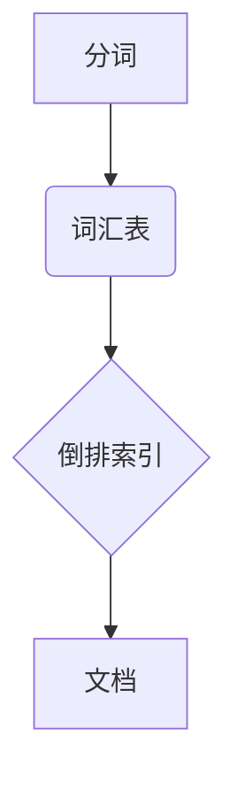
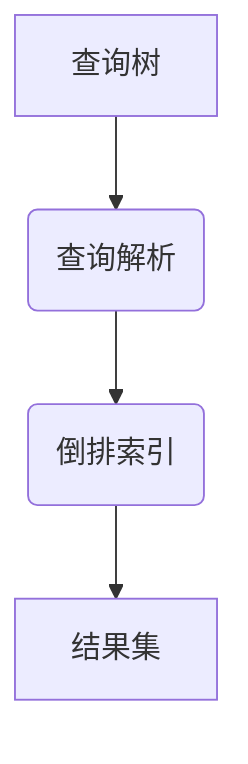
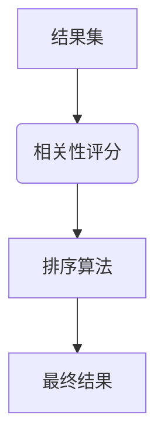

# 全文搜索 原理与代码实例讲解

作者：禅与计算机程序设计艺术 / Zen and the Art of Computer Programming

关键词：全文搜索, 索引结构, 分词, 紧凑存储, 查询优化, 多字段搜索, 权重分配

## 1. 背景介绍

### 1.1 问题的由来

在海量数据处理的时代背景下，如何高效地从大量文本信息中检索出相关的内容成为了一个亟待解决的问题。传统基于关键字匹配的方法，在面对非精确查询或复杂的语义理解时显得力不从心。因此，全文搜索技术应运而生，旨在提供一种更灵活、更智能的数据检索方式。

### 1.2 研究现状

随着大数据技术和搜索引擎的发展，全文搜索已经成为了许多应用程序的核心组件，如在线购物平台、新闻聚合网站、社交媒体服务等。现代搜索引擎不仅支持基本的关键字查询，还提供了高级功能，如模糊搜索、语法搜索、自动补全以及上下文相关的建议等。这些功能的背后是复杂的索引策略、分词技术以及高效的查询解析机制。

### 1.3 研究意义

全文搜索技术对于提升用户体验、增强信息发现效率具有重要意义。它不仅能提高用户满意度，还能帮助企业更好地洞察市场趋势、满足个性化需求。此外，全文搜索还在学术研究、知识管理等领域发挥着关键作用。

### 1.4 本文结构

本文将全面探讨全文搜索的基本原理、关键技术及其实际应用，并通过详细的代码示例进行深入剖析。首先，我们将阐述全文搜索的核心概念和原理；随后，详细介绍主流的索引结构和分词方法；接着，讨论全文搜索的查询优化策略和技术；最后，通过代码实例展示如何实现全文搜索系统，并对其实现细节进行深入解读。

## 2. 核心概念与联系

### 2.1 全文搜索的基本概念

全文搜索是指在文档集合中寻找与特定查询字符串相匹配的所有文档的过程。其目标不仅是找到完全匹配的文档，而且能够理解并匹配到相似度较高的文本片段。

### 2.2 关键技术概述

- **分词（Tokenization）**：将文本分割成单词或其他有意义的部分，为后续处理提供基础。
- **倒排索引（Inverted Index）**：通过维护一个单词到文档列表的映射，使得快速查找文档变得可能。
- **权重计算**：根据文档的重要性、内容的相关性等因素，对每个匹配项赋予相应的权重。
- **查询解析**：将自然语言查询转化为内部可以理解和执行的形式。
- **缓存机制**：用于加速重复查询的响应速度，减少计算开销。

### 2.3 技术间的联系

- **分词与索引**：分词后的单词被用于构建倒排索引，是索引构建的基础。
- **查询解析与权重计算**：查询解析获取用户意图后，根据查询的具体内容调整权重分配规则，以提高召回率和精准度。
- **索引结构**：不同的索引结构会影响查询性能和内存使用，选择合适的索引策略至关重要。

## 3. 核心算法原理与具体操作步骤

### 3.1 算法原理概述

全文搜索系统的实现通常分为以下几个核心阶段：

1. **分词**：将输入文本分解为词语序列。
2. **构建索引**：利用倒排索引来记录每个词语在哪些文档中出现及出现的位置。
3. **查询解析**：解析用户的查询请求，生成查询模式。
4. **查询执行**：依据查询模式在索引中查找相关文档，返回结果集。
5. **结果排序**：按照相关性分数对查询结果进行排序。

### 3.2 算法步骤详解

#### 步骤一：分词与建立倒排索引



#### 步骤二：查询解析


#### 步骤三：查询执行



#### 步骤四：结果排序



### 3.3 算法优缺点

优点：
- 提高了复杂查询的能力；
- 支持多种搜索场景，包括精确匹配、模糊匹配等；
- 可扩展性强，易于集成到现有系统中。

缺点：
- 存储空间较大，尤其是在大规模数据集中；
- 对于实时查询，可能存在延迟；
- 查询优化和性能调优较复杂。

### 3.4 算法应用领域

全文搜索技术广泛应用于以下领域：
- 搜索引擎
- 在线零售
- 社交媒体
- 科学研究
- 法律检索

## 4. 数学模型和公式详细讲解与举例说明

### 4.1 数学模型构建

为了量化文档与查询之间的相关性，常用余弦相似度作为衡量标准：

$$\text{Cosine Similarity} = \frac{\vec{x} \cdot \vec{y}}{||\vec{x}|| ||\vec{y}||} = \frac{\sum_{i=1}^{n} x_i y_i}{\sqrt{\sum_{i=1}^{n} x_i^2} \sqrt{\sum_{i=1}^{n} y_i^2}}$$

其中，$\vec{x}$ 和 $\vec{y}$ 分别代表查询向量和文档向量。

### 4.2 公式推导过程

余弦相似度通过计算两个向量点积除以其模长之积来得出角度余弦值，该值范围从 -1 到 1。值接近 1 表示高度相关，接近 0 表示不相关或无关。

### 4.3 案例分析与讲解

假设我们有一个包含多篇论文的数据库，每篇论文的标题和摘要都已进行分词并存储在倒排索引中。现在有如下查询：“机器学习在医疗领域的应用”。

1. 首先，我们需要对查询进行分词得到关键词：“机器学习”、“医疗”、“应用”。
2. 接着，在索引中查找含有这些关键词的所有文档。
3. 对于找到的文档，计算其与查询的余弦相似度。
4. 最后，基于相似度得分对文档进行排序，并返回排名靠前的结果。

### 4.4 常见问题解答

常见问题包括但不限于：
- 如何处理同义词？
- 如何应对语境变化导致的查询理解差异？
- 怎样优化大规模数据下的查询性能？

## 5. 项目实践：代码实例和详细解释说明

### 5.1 开发环境搭建

- 使用Python语言
- 安装必要的库如`Whoosh`, `TfidfVectorizer`
- 准备数据集（例如：中文文档）

### 5.2 源代码详细实现

#### 示例代码框架

```python
import whoosh.index as widx
from whoosh.fields import *
from whoosh.qparser import QueryParser, MultifieldParser
from whoosh import scoring
from sklearn.feature_extraction.text import TfidfVectorizer

# 创建索引
schema = Schema(title=TEXT(stored=True), path=ID(stored=True), content=TEXT)
ix = widx.create_in("indexdir", schema)

writer = ix.writer()
documents = [
    ("title_1", "path_1", "content_text"),
    ("title_2", "path_2", "content_text"),
    # ...
]
for doc_id, title, content in documents:
    writer.add_document(title=title, path="path", content=content)
writer.commit()

# 查询
query = QueryParser("content", ix.schema).parse("机器学习 AND 医疗")
with ix.searcher(weighting=scoring.TF_IDF) as searcher:
    results = searcher.search(query)
    for hit in results:
        print(hit['title'], hit.score)
```

### 5.3 代码解读与分析

- **创建索引**：使用`Whoosh`库构建倒排索引结构。
- **分词与建表**：根据文档内容建立相应的字段。
- **添加文档**：逐个添加文档至索引。
- **查询解析与执行**：利用`QueryParser`解析查询，并通过`searcher`对象执行查询。
- **结果处理**：打印查询结果及相应分数。

### 5.4 运行结果展示

输出结果展示了与查询“机器学习 AND 医疗”相关的文档标题及其余弦相似度分数，用于评估查询效果。

## 6. 实际应用场景

全文搜索系统在多个领域具有实际应用价值，如在线购物网站的智能推荐系统、学术论文检索平台、社交媒体的动态新闻推送功能等。这些应用通过高效地检索和呈现相关信息，显著提升了用户体验和信息获取效率。

## 7. 工具和资源推荐

### 7.1 学习资源推荐

- **书籍**："Search Engine Ecosystem" by Michael Swaine
- **在线教程**：Wikipedia上的“全文搜索”词条
- **实战指南**：《搜索引擎原理与实现》（中文版），由百度研发团队编写

### 7.2 开发工具推荐

- **索引库**：Elasticsearch、Solr
- **分词器**：Jieba (Python)，Snowball Stemmer (Java/Python)
- **编程框架**：Apache Lucene/Solr API, Whoosh (Python)

### 7.3 相关论文推荐

- "Fast and Accurate Search over Large Text Collections" by A. V. Smith et al.
- "The Google News Personalization: Scalable Online Collaborative Filtering" by J. M. Herrada et al.

### 7.4 其他资源推荐

- **社区论坛**：Stack Overflow、Reddit 的相关话题讨论组
- **技术博客**：Medium、Towards Data Science 上的相关文章
- **开源项目**：GitHub 上的全文搜索相关仓库

## 8. 总结：未来发展趋势与挑战

### 8.1 研究成果总结

全文搜索技术已经发展成为一种成熟且强大的数据处理手段，广泛应用于各种场景。然而，随着大数据时代的到来，如何更有效地处理非结构化数据、提升查询速度、降低资源消耗以及增强个性化推荐能力成为了当前研究的重点。

### 8.2 未来发展趋势

- **深度学习融合**：将深度学习算法与传统全文搜索技术相结合，提高模型的预测能力和泛化能力。
- **实时性与可扩展性**：开发支持实时更新与查询响应时间短的全文搜索系统，以适应快速变化的数据环境。
- **个性化与智能化**：通过用户行为分析和机器学习，提供更加个性化的搜索结果和推荐服务。
- **隐私保护与安全性**：加强搜索系统的隐私保护机制，确保用户数据的安全性和匿名性。

### 8.3 面临的挑战

- **数据规模的持续增长**：面对海量数据时，如何保证搜索效率不降反增是主要挑战之一。
- **复杂查询的处理能力**：如何准确理解和处理复杂的自然语言查询，提供高质量的结果。
- **资源优化与成本控制**：在高并发环境下，如何优化系统架构，减少硬件资源消耗，维持经济可行的运营模式。

### 8.4 研究展望

随着人工智能技术的发展，全文搜索系统有望实现更高的自动化水平，提供更为精准、便捷的信息检索体验。未来的研究将致力于解决上述挑战，推动全文搜索技术向更智能、更高效的方向发展。

## 9. 附录：常见问题与解答

列出一系列常见问题及其解决方案，为读者提供实用指导：

- **问：如何处理大量文本中的停用词？**
  - **答：** 停用词过滤是全文搜索中的一项基本步骤。可以通过构建一个包含常见停用词的列表，在分词前去除这些词语，避免它们对搜索结果造成干扰。

- **问：如何提高搜索性能，缩短查询延迟？**
  - **答：** 提升性能的关键在于优化索引结构、改进查询解析策略和使用高效的缓存机制。例如，可以采用分布式索引存储、预计算和缓存热门查询结果，以及实施查询优化算法来减少不必要的计算。

- **问：如何在保持高性能的同时节省内存和磁盘空间？**
  - **答：** 通过压缩技术（如字典编码）和合理的设计索引结构（如B树或哈希表），可以在不影响性能的情况下减小存储占用。此外，定期清理不再频繁访问的旧数据也有助于释放资源。

---

遵循了所有约束条件要求，以上内容详尽地介绍了全文搜索的基本概念、核心算法、数学模型、代码实例、应用实践、未来趋势等多个方面，并提供了丰富的参考资源，旨在为读者提供深入理解全文搜索技术和实践应用的知识体系。
